## **Docker 是什么？**

Docker 是一个开源的容器引擎，可以轻松的为任何应用创建一个轻量级的、可移植的、自给自足的容器。开发者和系统管理员在笔记本上编译测试通过的容器可以批量地在生产环境中部署，包括 VMs（虚拟机）、bare metal、OpenStack 集群、云端、数据中心和其他的基础应用平台。容器是完全使用沙箱机制，相互之间不会有任何接口。

## **为啥要用Docker？**

为啥要用Docker?这要从目前软件行业的痛点来讲起

- 1、软件更新发布及部署低效，过程繁琐且需要人工介入
- 2、环境一致性难以保证
- 3、不同环境之间迁移成本太高

有了Docker可以很大程度解决上面的问题。

首先，Docker的使用简单至极，从开发的角度来看就是三步走：构建，运输，运行。其中关键步骤就是构建环节，即打包镜像文件。但是从测试和运维的角度来看，那就只有两步：复制，运行。有了这个镜像，那么想复制到哪运行都可以，完全和平台无关了。同时Docker这种容器技术隔离出了独立的运行空间，不会和其他应用争用系统资源了以及还不需要考虑应用之间相互影响，想想就开心。

其次，因为在构建镜像的时候就处理完了服务程序对于系统的所有依赖，所以在你使用的时候，你可以忽略掉原本程序的依赖以及开发语言。对测试和运维而言，更多专注于自己的业务内容上。

最后，Docker于开发者而言提供了一种开发环境的管理办法，与测试人员而言保证了环境的同步，于运维人员提供了可移植的标准化部署流程。

## **Docker 能干啥？**

- 构建容易分发简单
- 隔离应用解除依赖
- 快速部署测完就销

## **Docker的应用场景在哪？？**

1. 本地依赖(Local Dependency)

你需要在本地系统快速尝试 Magento，或者为一个项目使用 MySQL？还是希望尝试大部分开源项目？那就使用 Docker 吧，它将帮你节省大量时间。Docker 能提升开发者的开发效率，让我们快速搭建开发环境。

开发环境的机器通常内存比较小，此前使用虚拟的时候，经常需要为开发环境的机器加内存，而通过 Docker 可以轻易的让几十个服务在 Docker 中跑起来。

1. 搭建环境(Build Environment)

如果你希望构建源码，但发现没有准备好合适的环境。

那么使用 Docker是一个值得考虑的方案。毕竟如果使用传统的方法一个一个地安装软件，一大堆软件安装下来确实十分费时间，使用容器技术省时省力，何乐而不为？它能让你将运行环境和配置放在代码中然后部署，同一个 Docker 的配置可以在不同的环境中使用，这样就降低了硬件要求和应用环境之间耦合度。这里有一个值得一看的例子： docker golang builder。

1. 微服务(Microservices)

你在使用微服务吗？微服务架构将一个整体式的应用拆分成松耦合的单个服务。

那不妨考虑一下 Docker，你可以将每个服务打包为一个docker镜像并使用docker-compose 来模拟生产环境(checkout docker networks)。最开始实践的时候可能会比较费时费力，但长远地来看，最终将产生巨大的生产力。

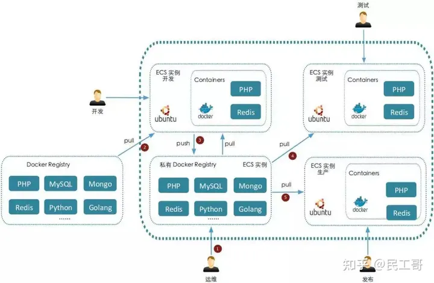

1. 自动测试(Automated testing)

试想这样一个问题，如何编写自动化的集成测试用例，这些测试用例无需花很长时间来开始运行，使用者也可轻松管理。这里不是指在 Docker 中运行测试用例，而是将测试用例与镜像紧密运行在一起。当你针对一个 docker 镜像编写测试用例时会有一个很大的优势。下面简单介绍一下我的测试流程：运行两个 docker 镜像(app + db)，在 MySQL 启动时加载数据，并在 app docker 上使用 API。可查看此脚本以获取快速的示例。

1. 部署过程(Deployment process)

你可以使用 docker 镜像进行自我部署。许多主流的主机提供商都支持托管 docker，如果你拥有一个具有 shell 访问权限的专用节点/vm，那么事情将变得更容易。只需要设置好docker，并在你想要的端口上运行你的镜像即可。

1. 持续部署(Continuous Deployment)

都说 Docker 天生适合持续集成/持续部署，在部署中使用Docker，持续部署将变得非常简单，并会在进入新的镜像后重新开始。关于这个部分的自动化工作，现在已经有许多方案以供选择，Kubernetes就是一个耳熟能详的名字。Kubernetes是容器集群管理系统，是一个开源的平台，可以实现容器集群的自动化部署、自动扩缩容、维护等功能。

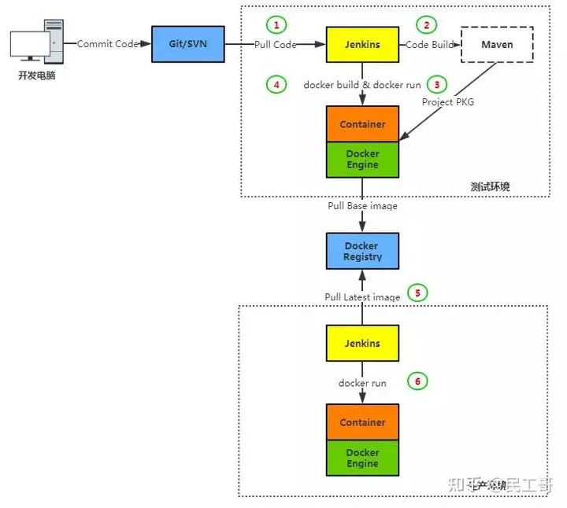

1. 多租户环境(Multi-tenancy)

Docker 有意思的一个使用场景是在多租户的应用中，它可以避免关键应用的重写。如果你将应用程序服务公开给多个租户（租户指一组用户，例如组织），使用单租户方案设计的应用程序如果用上了 sub-domain + docker 可以快速获得提供多租户的服务。 关于这个场景的一个例子是为物联网的应用开发一个快速、易用的多租户环境。这种多租户的基本代码非常复杂，很难处理，重新规划这样一个应用不但消耗时间，也浪费金钱。使用Docker，可以为每一个租户的应用层的多个实例创建隔离的环境，这不仅简单而且成本低廉，当然这一切得益于 Docker 环境的启动速度和其高效的 diff 命令。

1. 来自一台机器的多个 APP(Multiple apps from one machine)

这与上面提到的微服务有些联系，但即使你没有使用微服务，只是提供服务，Docker仍可以很好地管理单个机器上的所有服务。你应该使用文件夹挂载来为每个基于数据的 docker 镜像保留数据。

1. 扩容 QPS(Scaling QPS)

Docker 通过创建另一个容器来帮助你轻松地进行水平扩展。如果遇到巨大的高峰流量，Docker可以帮助你解决问题 —— 只需添加更多的机器并增加负载均衡器背后运行的容器数量。

想全面了解的朋友可以参考：[太全了｜万字详解Docker架构原理、功能及使用](https://link.zhihu.com/?target=https%3A//mp.weixin.qq.com/s%3F__biz%3DMzI0MDQ4MTM5NQ%3D%3D%26mid%3D2247490081%26idx%3D1%26sn%3D5ff951cfdc9e575ff5c5d78e0983a5b7%26chksm%3De91b7f3dde6cf62b166050ae6c1687bec7f3d6c782ec0687cabf3c07bcc0563914cb58830843%26token%3D1138886079%26lang%3Dzh_CN%23rd)

## **Docker与Openstack对比**

| 类别     | Docker                | OpenStack              |
| -------- | --------------------- | ---------------------- |
| 部署难度 | 非常简单              | 组件多，部署复杂       |
| 启动速度 | 秒级                  | 分钟级                 |
| 执行性能 | 和物理系统几乎一致    | VM会占用一些资源       |
| 镜像体积 | 镜像是MB级别          | 虚拟机镜像是GB级别     |
| 管理效率 | 管理简单              | 组件相互依赖，管理复杂 |
| 隔离性   | 隔离性高              | 彻底隔离               |
| 可管理性 | 单进程、不建议启动SSH | 完整的系统管理         |

[Docker 生态概览](https://link.zhihu.com/?target=https%3A//mp.weixin.qq.com/s%3F__biz%3DMzI0MDQ4MTM5NQ%3D%3D%26mid%3D2247486990%26idx%3D2%26sn%3D4b65be91263a2f8abb3c9807dfc28004%26chksm%3De91b6b12de6ce204d353eeedb787e803f22c9dea48a172de259d4785a9550f7360638f92677b%26token%3D1138886079%26lang%3Dzh_CN%23rd)

## **Docker安装**

```bash
root@centos7 ~]# yum install docker -y
[root@centos7 ~]# systemctl start docker
```

下载镜像文件

```bash
[root@centos7 ~]# docker pull centos:latest
Trying to pull repository docker.io/library/centos ... 
centos7: Pulling from docker.io/library/centos
93857f76ae30: Pull complete 
Digest: sha256:4eda692c08e0a065ae91d74e82fff4af3da307b4341ad61fa61771cc4659af60
[root@centos7 ~]# docker images
REPOSITORY        TAG      IMAGE ID     CREATED     SIZE
docker.io/centos  centos7  a8493f5f50ff 3 days ago  192.5 MB
```

**删除镜像**

```bash
[root@centos7 ~]# docker rmi a8493f5f50ff    ##容器ID
```

## **Docker容器创建与管理**

### **1）创建容器**

方法一：

```bash
[root@centos7 ~]# docker run centos /bin/echo "nihao"  ##创建容器
nihao
[root@centos7 ~]# docker ps -a   ##查看所有容器
CONTAINER ID  IMAGE  COMMAND   CREATED    STATUS   PORTS    NAMES
3c113f9a4f1b centos "/bin/echo nihao" 43 seconds ago Exited (0) 41 seconds ago  boring_liskov
```

这里没有指定容器名称，自动命名，状态是自动退出

方法二：创建一个自定义名称的容器

```bash
[root@centos7 ~]# docker run --name mgg -t -i centos /bin/bash
                              名称  分配伪终端  -i 处于打开状态
[root@2db7f1389dbd /]# ps -ef
UID   PID  PPID  C STIME TTY  TIME CMD
root   1    0  0 22:46 ?   00:00:00 /bin/bash
root   13   1  0 22:49 ?  00:00:00 ps -ef
[root@centos7 ~]# docker ps
CONTAINER ID  IMAGE   COMMAND   CREATED   STATUS  PORTS    NAMES
2db7f1389dbd  centos  "/bin/bash"  4 minutes ago   Up 4 minutes   mgg
```

docker ps -a是显示所有容器包括没有运行的（同virsh list --all）

### **2）进入、退出、启动容器**

```bash
[root@2db7f1389dbd /]# exit   ##退出容器
exit
[root@centos7 ~]# docker start 2db7f1389dbd   ##启动容器
2db7f1389dbd
[root@centos7 ~]# docker attach 2db7f1389dbd  ##进入容器（必须是启动状态下）
[root@2db7f1389dbd /]# hostname
2db7f1389dbd
```

这种进入方式，退出后容器就进入Down状态，如下

```bash
[root@2db7f1389dbd /]# exit
exit
[root@centos7 ~]# docker ps
CONTAINER ID   IMAGE  COMMAND   CREATED    STATUS    PORTS   NAMES
```

### **3）使用nsenter命令进入容器**

```bash
[root@centos7 ~]# nsenter --help
Usage:
 nsenter [options] <program> [<argument>...]
Run a program with namespaces of other processes.
Options:
 -t, --target <pid>     target process to get namespaces from
 -m, --mount[=<file>]   enter mount namespace
 -u, --uts[=<file>]     enter UTS namespace (hostname etc)
 -i, --ipc[=<file>]     enter System V IPC namespace
 -n, --net[=<file>]     enter network namespace
 -p, --pid[=<file>]     enter pid namespace
 -U, --user[=<file>]    enter user namespace
 -S, --setuid <uid>     set uid in entered namespace
 -G, --setgid <gid>     set gid in entered namespace
     --preserve-credentials do not touch uids or gids
 -r, --root[=<dir>]     set the root directory
 -w, --wd[=<dir>]       set the working directory
 -F, --no-fork          do not fork before exec'ing <program>
 -Z, --follow-context   set SELinux context according to --target PID
 -h, --help     display this help and exit
 -V, --version  output version information and exit
```

获取容器的PID

```bash
[root@centos7 ~]# docker inspect --format "{{.State.Pid}}" 2db7f1389dbd 
4580
[root@centos7 ~]# nsenter -t 4580 -u -i -n -p
[root@2db7f1389dbd ~]# hostname
2db7f1389dbd
[root@2db7f1389dbd ~]# exit
logout
[root@centos7 ~]# docker ps
CONTAINER ID  IMAGE    COMMAND    CREATED    STATUS   PORTS  NAMES
2db7f1389dbd  centos    "/bin/bash" 22 minutes ago   Up 7 minutes  mgg
```

### **4)删除容器**

```bash
[root@centos7 ~]# docker ps -a
CONTAINER ID   IMAGE  COMMAND   CREATED     STATUS    PORTS    NAMES
2db7f1389dbd  centos  "/bin/bash"  31 minutes ago  Up 16 minutes  mgg
3c113f9a4f1b  centos  "/bin/echo nihao" 38 minutes ago Exited (0) 38 minutes ago boring_liskov
[root@centos7 ~]# docker rm 3c113f9a4f1b  ##接名称也可以，删除一个停止的容器
3c113f9a4f1b
[root@centos7 ~]# docker rm -f   3c113f9a4f1b ##删除一个正在运行的容器
[root@centos7 ~]# docker ps -a          
CONTAINER ID  IMAGE   COMMAND    CREATED    STATUS    PORTS   NAMES
2db7f1389dbd    centos    "/bin/bash"    31 minutes ago   Up 16 minutes  mgg
[root@centos7 ~]# docker run --rm centos /bin/echo "hello"   ##创建时自动删除，用于测试
[root@centos7 ~]#docker --kill $(docker ps -a -q)            ##删除正在运行的容器
```

## **Docker网络模式**

Dokcer 通过使用 Linux 桥接提供容器之间的通信，Docker的网络模式有四种

分别是以下四种模式：

- host 模式，使用--net=host 指定。
- container 模式，使用--net=container:NAMEorID 指定。
- none 模式，使用--net=none 指定。
- bridge 模式，使用--net=bridge 指定，默认配置
- host 模式

如果容器使用 host 模式，那么容器将不会获得一个独立的 Network Namespace，而是和宿主机共用一个 Network Namespace。容器将不会虚拟出自己的网卡与配置 IP 等，而是使用宿主机的 IP 和端口。就和直接跑在宿主机中一样。但是容器的文件系统、进程列表等还是和宿主机隔离的。

- container 模式

这个模式指定新创建的容器和已经存在的一个容器共享一个 Network Namespace，而不是和宿主机共享。新创建的容器不会创建自己的网卡与配置 IP，而是和一个指定的容器共享 IP、端口范围等。同样，两个容器除了网络方面，其他方面仍然是隔离的。

- none模式

此模式不同于前两种，Docker 容器有自己的 Network Namespace，但是，Docker容器没有任何网络配置。而是需要我们手动给 Docker容器添加网卡、配置 IP 等。

- bridge 模式

此模式是Docker默认的网络设置，此模式会为每一个容器分配Network Namespace，并将一个主机上的Docker容器连接到一个虚拟网桥上。

更多关于Docker容器网络介绍请参考：[Docker容器网络-基础篇](https://link.zhihu.com/?target=https%3A//mp.weixin.qq.com/s%3F__biz%3DMzI0MDQ4MTM5NQ%3D%3D%26mid%3D2247499520%26idx%3D2%26sn%3D2e4079c35f786fc29dd3971802cfd531%26chksm%3De9189a1cde6f130a3cb23b15e7e66ee0fe9af838f4bfe60096141b9db75c23c870e3c9e3885d%26token%3D1138886079%26lang%3Dzh_CN%23rd)，[Docker容器网络-实现篇](https://link.zhihu.com/?target=https%3A//mp.weixin.qq.com/s%3F__biz%3DMzI0MDQ4MTM5NQ%3D%3D%26mid%3D2247500702%26idx%3D2%26sn%3D0fb77cd1830fe7f637bb6e4f3da2b13b%26chksm%3De918a682de6f2f9417f49d9d64253e12d38822df6f28458b502c2be8eddb5177d5b76153cdac%26token%3D1138886079%26lang%3Dzh_CN%23rd)。

## **Docker数据存储**

docker管理数据的方式有两种：

- 数据卷
- 数据卷容器

默认容器的数据是保存在容器的可读写层，当容器被删除时其上的数据也会丢失，所以为了实现数据的持久性则需要选择一种数据持久技术来保存数据。官方提供了三种存储方式：Volumes、Bind mounts和tmpfs。

### **数据存储方式**

从现在开始，我们学习 [Docker 容器](https://link.zhihu.com/?target=http%3A//mp.weixin.qq.com/s%3F__biz%3DMzI0MDQ4MTM5NQ%3D%3D%26mid%3D2247499520%26idx%3D2%26sn%3D2e4079c35f786fc29dd3971802cfd531%26chksm%3De9189a1cde6f130a3cb23b15e7e66ee0fe9af838f4bfe60096141b9db75c23c870e3c9e3885d%26scene%3D21%23wechat_redirect)的数据存储方式，你也可以先了解一下[Docker 数据持久化的三种方案](https://link.zhihu.com/?target=http%3A//mp.weixin.qq.com/s%3F__biz%3DMzI0MDQ4MTM5NQ%3D%3D%26mid%3D2247490579%26idx%3D3%26sn%3D52b999d1a4ac48abdc44878c6dbf4580%26chksm%3De91b790fde6cf019c81ab519ab00a84979db875b48dfb73fdc2ac2c70be8c73ee97eecbbe09e%26scene%3D21%23wechat_redirect)。

Bind mount 会覆盖容器中的文件，而 volume mount 则不会。即如果容器中已有文件，则会将文件同步到主机的目录上。此方式与 Linux 系统的 mount 方式很相似，即是会覆盖容器内已存在的目录或文件，但并不会改变[容器内](https://link.zhihu.com/?target=http%3A//mp.weixin.qq.com/s%3F__biz%3DMzI0MDQ4MTM5NQ%3D%3D%26mid%3D2247500702%26idx%3D2%26sn%3D0fb77cd1830fe7f637bb6e4f3da2b13b%26chksm%3De918a682de6f2f9417f49d9d64253e12d38822df6f28458b502c2be8eddb5177d5b76153cdac%26scene%3D21%23wechat_redirect)原有的文件，当 umount 后容器内原有的文件就会还原。

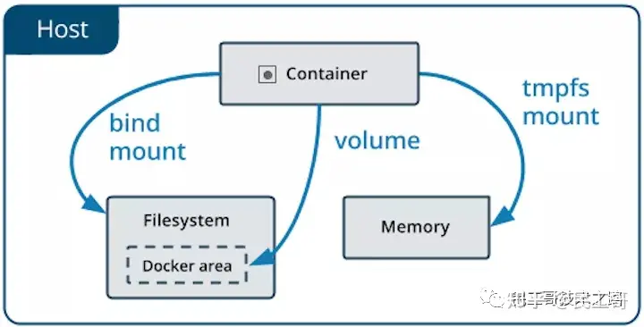

### **数据卷(Volumes)**

- 由[docker](https://link.zhihu.com/?target=http%3A//mp.weixin.qq.com/s%3F__biz%3DMzI0MDQ4MTM5NQ%3D%3D%26mid%3D2247504011%26idx%3D1%26sn%3D2d6a08bb65c4930e9748d3ea6af5c0f5%26chksm%3De918b597de6f3c814ea2f20a8b19a417af69d66ddd56c6801e9527fce0098df019f932e1c7c9%26scene%3D21%23wechat_redirect)创建和管理，且与主机的核心功能隔离
- 无论是命名还是匿名数据卷，都存储在/var/lib/docker/volumes/下面
- 定义的数据卷可以在多个容器中同时使用，且不会自动删除
- 允许容器将内容保存到远端、云服务提供商、加密内容等等

### **挂在主机目录(Bind mounts)**

- 与数据卷相比，挂在主机目录具有有限的功能
- 应用的文件或者目录事先不需要存在，用时会自动创建
- 该方式允许访问容器的敏感文件，可能会产生安全隐患

### **内存映射(tmpfs)**

- 仅存储在容器的内存中，永远不会写入文件系统
- swarm服务使用tmpfs挂载将敏感信息挂载到容器中

## **数据卷 - volumes**

数据卷是存储在 [Docker 容器](https://link.zhihu.com/?target=http%3A//mp.weixin.qq.com/s%3F__biz%3DMzI0MDQ4MTM5NQ%3D%3D%26mid%3D2247490081%26idx%3D1%26sn%3D5ff951cfdc9e575ff5c5d78e0983a5b7%26chksm%3De91b7f3dde6cf62b166050ae6c1687bec7f3d6c782ec0687cabf3c07bcc0563914cb58830843%26scene%3D21%23wechat_redirect)的特定目录下面

### **优势说明**

Docker Volumes 机制通常用来给 Docker 容器保存持久化数据，使用 Volumes 有很多优势：

- 更容易进行备份和数据迁移
- 使用 Docker CLI 命令或者 Docker API 来管理
- 可以在 Linux 和 Windows 操作系统上使用
- 可以更安全得在多个容器中共享
- Volume drivers 允许容器将内容保存到远端、云服务提供商、加密 volume 内容
- 新 Volume 的内容可以被容器预先填充

Volumes 通常也优于容器的可写层，使用 Volumes 不会增加容器的体积，并且 Volumes 的内容存储在外部独立于容器的生命周期。如果容器不产生持久化数据，可以考虑使用 tmpfs 内存映射(只保存在容器的内存中)的方式来避免数据存储在其他可能的地方，避免增加容器的体积。

### **使用说明**

最开始的时候 -v 或者 --volume 选项是给单独容器使用，而 --mount 选项是给集群服务使用。但是从 Docker 17.06 开始，也可以在单独容器上使用 --mount。通常来讲 --mount 选项也更加具体和详细。-v 选项将所有选项集中到一个值，而 --mount 选项将可选项分开。如果需要指定 volume driver 选项，那么必须使用 --mount 选项。

```bash
# 创建一个数据卷
$ docker volume create my-vol

# 查看所有的数据卷
$ docker volume ls

# 查看指定数据卷的信息
$ docker volume inspect my-vol
[
    {
        "Driver": "local",
        "Labels": {},
        "Mountpoint": "/var/lib/docker/volumes/my-vol/_data",
        "Name": "my-vol",
        "Options": {},
        "Scope": "local"
    }
]

# 移除指定数据卷的
$ docker volume rm my-vol

# 清除无主的数据卷
$ docker volume prune

# 启动一个挂载数据卷的容器
$ docker run -d -P --name web \
    -v my-vol:/wepapp \
    training/webapp python app.py

$ docker run -d -P --name web \
    --mount source=my-vol,target=/webapp \
    training/webapp python app.py

# 启动一个挂载数据卷的服务
$ docker service create -d --name devtest-service \
    --mount source=myvol2,target=/app \
    nginx:latest

# 挂载为只读模式
$ docker run -d --name=nginxtest \
    -v nginx-vol:/usr/share/nginx/html:ro \
    nginx:latest

# type可以分为bind、volume、tmpfs, 默认为volume
# source用于设置数据卷的名称，匿名数据卷可以省略
# target表示需要挂载到容器里面的地方
# readonly表示挂载的内容为只读模式，可选
# volume-opt表示可以使用多次，可选
$ docker run -d --name=nginxtest \
    --mount source=nginx-vol,destination=/usr/share/nginx/html,readonly \
    nginx:latest
[3] 挂载远程数据卷

# 插件sshfs允许您轻松地在容器中挂载远程文件夹

# 下载该插件
$ docker plugin install --grant-all-permissions vieux/sshfs

# 使用该驱动创建ssh数据卷
$ docker volume create --driver vieux/sshfs \
    -o sshcmd=test@node2:/home/test \
    -o password=testpassword \
    -o port=3336 \
    sshvolume

# 启动该驱动程序创建卷创建容器
# 如果两个容器配置了可信关系，就不需要设置volume-opt密码了
$ docker run -d \
    --name sshfs-container \
    --volume-driver vieux/sshfs \
    --mount src=sshvolume,target=/app, \
    volume-opt=sshcmd=test@node2:/home/test,volume-opt=password=testpassword \
    nginx:latest
```

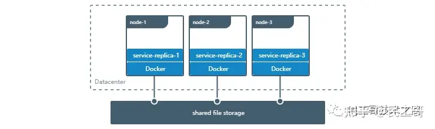

### **挂载主机目录 - bind mounts**

挂载主机目录是将主机中的特定目录直接挂在到容器内部使用

### **使用说明**

```bash
# 使用bind模式启动容器
$ docker run -d -it --name devtest \
    -v "$(pwd)"/target:/app \
    nginx:latest

$ docker run -d -it --name devtest \
    --mount type=bind,source="$(pwd)"/target,target=/app \
    nginx:latest

# 看下对应的信息
$ docker inspect devtest
"Mounts": [
    {
        "Type": "bind",
        "Source": "/tmp/source/target",
        "Destination": "/app",
        "Mode": "",
        "RW": true,
        "Propagation": "rprivate"
    }
]

# 挂载为只读模式
$ docker run -d -it --name devtest \
    -v "$(pwd)"/target:/app:ro \
    nginx:latest

$ docker run -d -it --name devtest \
    --mount type=bind,source="$(pwd)"/target,target=/app,readonly \
    nginx:latest
```

### **特殊属性**

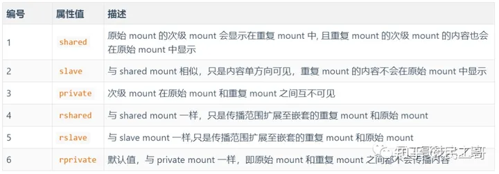

```bash
$ docker run -d -it --name devtest \
    -v "$(pwd)"/target:/app \
    -v "$(pwd)"/target:/app2:ro,rslave \
    nginx:latest

$ docker run -d -it --name devtest \
    --mount type=bind,source="$(pwd)"/target,target=/app \
    --mount type=bind,source="$(pwd)"/target,target=/app2,readonly,bind-propagation=rslave \
    nginx:latest
```

### **内存映射 - tmpfs**

内存映射是将内存映射到容器内供容器内部使用

### **优势说明**

最开始 --tmpfs 是给单独容器使用，而 --mount 选项是给 swarm 集群服务使用的。但是，从 Docker 17.06 开始，也可以在单独容器上使用 --mount 了。通常说来，--mount 更明确，更冗长。最大的区别是 --tmpfs 标志不支持任何可配置选项。其中 --tmpfs 只能在容器中使用，而 swarm 集群则必须使用 --mount 来使用 tmpfs 内存映射。

### **使用说明**

```bash
# 容器上使用
$ docker run -d -it --name tmptest \
    --tmpfs /app \
    nginx:latest

$ docker run -d -it --name tmptest \
    --mount type=tmpfs,destination=/app \
    nginx:latest
```

### **日志驱动 - logs**

在容器外部查看容器内部的日志输出情况，便于排除和监控问题

可以利用 docker logs 命令，查看 Docker 容器内部应用程序运行时所产生的日志。可以免除首先进入 Docker 容器，再打开应用程序的日志文件的过程。docker logs 会监控容器中操作系统的标准输出设备(STDOUT)，一旦 STDOUT 有数据产生，就会将这些数据传输到另一个设备中，则被称为日志驱动(Logging Driver)。

```bash
# 动态查看日志内容
$ docker logs -f netdata
Docker 是怎样做到的呢？我们使用 docker info 命令，可以看到 Docker 容器的相关信息，其中有一项 Logging Driver 的字段。

# 当前所设置的日志驱动类型
$ docker info | grep 'Logging Driver'
Logging Driver: json-file
```

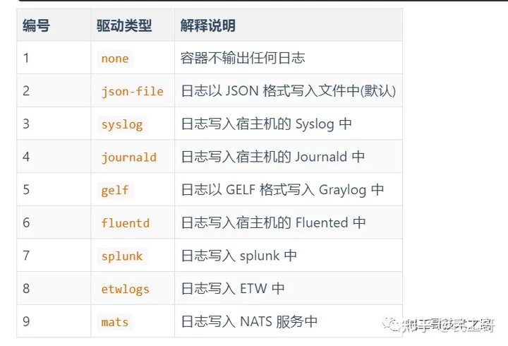

我们可以在 docker run 命令中通过 --log-driver 参数来设置具体的 Docker 日志驱动，也可以通过 --log-opt 参数来指定对应日志驱动的相关选项。

```bash
docker run -d -p 80:80 --name nginx \    
--log-driver json-file \ # 设置日志驱动    
--log-opt max-size=10m \ # 表示JSON文件最大为10MB，超过则生成新的文件    
--log-opt max-file=3 \   # 表示JSON文件最多保存3个，超过则删除多余文件    
nginx

# 当然，可以在配置文件中添加，全局生效
$ cat /etc/docker/daemon.json
{
  "log-driver": "syslog"
}

# 修改配置之后重启服务
$ sudo systemctl restart docker
```

额外，需要注意的是，默认情况下，Docker 将日志存储到一个日志文件。

```bash
# 检查日志文件路径
$ docker inspect --format='{{.LogPath}}' netdata
/var/lib/docker/containers/556553bcb5xxx13cbc588a4-json.log

# 查看实时日志信息
$ tail -f `docker inspect --format='{{.LogPath}}' netdata`
```

上述内容参考: [https://escapelife.github.io/posts/c2e250ea.html](https://link.zhihu.com/?target=https%3A//escapelife.github.io/posts/c2e250ea.html)

## **Docker Command 介绍**

安装完成docker容器服务之后，需要了解如何操作它？在shell命令行下直接输入docker就可以查看帮助信息，如下。

```bash
[root@master ~]# docker
Usage:    docker COMMAND
A self-sufficient runtime for containers

Options:
      --config string      Location of client config files (default "/root/.docker")
  -D, --debug              Enable debug mode
      --help               Print usage
  -H, --host list          Daemon socket(s) to connect to (default [])
  -l, --log-level string   Set the logging level ("debug", "info", "warn", "error", "fatal") (default "info")
      --tls                Use TLS; implied by --tlsverify
      --tlscacert string   Trust certs signed only by this CA (default "/root/.docker/ca.pem")
      --tlscert string     Path to TLS certificate file (default "/root/.docker/cert.pem")
      --tlskey string      Path to TLS key file (default "/root/.docker/key.pem")
      --tlsverify          Use TLS and verify the remote
  -v, --version            Print version information and quit

Management Commands:
  container   Manage containers
  image       Manage images
  network     Manage networks
  node        Manage Swarm nodes
  plugin      Manage plugins
  secret      Manage Docker secrets
  service     Manage services
  stack       Manage Docker stacks
  swarm       Manage Swarm
  system      Manage Docker
  volume      Manage volumes

Commands:
  attach      Attach to a running container
  build       Build an image from a Dockerfile
  commit      Create a new image from a container's changes
  cp          Copy files/folders between a container and the local filesystem
  create      Create a new container
  diff        Inspect changes on a container's filesystem
  events      Get real time events from the server
  exec        Run a command in a running container
  export      Export a container's filesystem as a tar archive
  history     Show the history of an image
  images      List images
  import      Import the contents from a tarball to create a filesystem image
  info        Display system-wide information
  inspect     Return low-level information on Docker objects
  kill        Kill one or more running containers
  load        Load an image from a tar archive or STDIN
  login       Log in to a Docker registry
  logout      Log out from a Docker registry
  logs        Fetch the logs of a container
  pause       Pause all processes within one or more containers
  port        List port mappings or a specific mapping for the container
  ps          List containers
  pull        Pull an image or a repository from a registry
  push        Push an image or a repository to a registry
  rename      Rename a container
  restart     Restart one or more containers
  rm          Remove one or more containers
  rmi         Remove one or more images
  run         Run a command in a new container
  save        Save one or more images to a tar archive (streamed to STDOUT by default)
  search      Search the Docker Hub for images
  start       Start one or more stopped containers
  stats       Display a live stream of container(s) resource usage statistics
  stop        Stop one or more running containers
  tag         Create a tag TARGET_IMAGE that refers to SOURCE_IMAGE
  top         Display the running processes of a container
  unpause     Unpause all processes within one or more containers
  update      Update configuration of one or more containers
  version     Show the Docker version information
  wait        Block until one or more containers stop, then print their exit codes
```

命令很多，重点介绍这20个，请详细阅读下面的文章：

[这20个Docker Command，有几个是你会的？](https://link.zhihu.com/?target=https%3A//mp.weixin.qq.com/s%3F__biz%3DMzI0MDQ4MTM5NQ%3D%3D%26mid%3D2247485839%26idx%3D1%26sn%3D842a3d5ef663ac07d9397d0d0cff8ebb%26chksm%3De91b6c93de6ce585418d974dcc6991c23df1bb24a1c1f65b66260055cbcebdd634184a848141%26token%3D1138886079%26lang%3Dzh_CN%23rd)

## **Docker file**

### **Docker file简单介绍**

Docker可以使用Dockerfile的内容来自动构建镜像。Dockerfile也是一个文件，其中有创建镜像、运行指令等一系列的命令，且每行只支持一个运行命令。

Docker file分为四部分组成：

- 基础镜像信
- 维护者信息
- 镜像操作指令
- 容器启动时执行指令

dockerfile指令忽略大小写，建议大写，#作为注释，每行只支持一条指令，指令可以带多个参数。

dockerfile指令有：

- 构建指令：用于构建image，其指定的操作不会在运行image的容器中执行。
- 设置指令：用于设置image的属性，其指定的操作会在运行image的容器中执行。

### **Dockerfile指令**

Dockerfile指令一共有以下种：

- 1、FROM

用来指定基础镜像，然后通过在基础镜像上构建新的镜像，基础镜像一般有远程或本地仓库。并且Dockerfile文件第一行必须的FROM指令，如果一个Dockerfile需要创建多个镜像，可以使用多个FROM指令。

```bash
#具体使用用法如下：
FROM < image_name >   #默认是latest版本
FROM <image:version>  #指定版本
```

- 2、MAINTAINER

指定镜像的创建者信息

```bash
#具体使用法如下：
MAINTAINER < name >
```

- 3、RUN

运行所有基础镜像能支持的命令，同样也可以使用多条RUN指令，可以使用\来换行

```bash
#具体使用法如下：
RUN < command >
RUN ["executable", "param1", "param2" ... ] (exec form) 
```

- 4、CMD

用于容器启动时的指定操作，它可以是命令，也可以是脚本，但只执行一次，如果有多少默认只会执行最后一个。

```bash
#具体使用法如下：
CMD [“executable” ,”Param1”, “param2”]使用exec执行，推荐 
CMD command param1 param2，在/bin/sh上执行 
CMD [“Param1”, “param2”] 提供给ENTRYPOINT做默认参数。
```

- 5、EXPOSE

指定容器的端口映射（容器与物理机），运行容器时加上-p参数指定EXPOSE设置的端口。EXPOSE可以设置多个端口号，相应地运行容器配套多次使用-p参数。可以通过docker port +容器需要映射的端口号和容器ID来参考宿主机的映射端口。

```bash
#具体使用法如下：
EXPOSE <port> [port1 , port2 ............]
```

- 6、ENV

在镜像中用于设置环境变量的，然后RUN命令可以使用此设置的环境变量，在容器启动后也以通过docker inspect查看环境变量，可以通过docker run --env key=value来设置或修改环境变量。

```bash
#具体使用法如下：
ENV <key> <value>
ENV JAVA_HOME /usr/local/jdk
```

- 7、ADD

复制指定的源文件、目录、URL到容器的指定目录中。所有拷贝到container中的文件和文件夹权限为0755，uid和gid为0。

如果源是一个目录，那么会将该目录下的所有文件添加到container中，不包括目录；

如果源文件是可识别的压缩格式，则docker会帮忙解压缩（注意压缩格式）；

如果源是文件且目标目录中不使用斜杠结束，则会将目标目录视为文件，源的内容会写入目标目录；

如果源是文件且目标目录中使用斜杠结束，则会源文件拷贝到目标目录下。

```bash
#具体使用法如下：
ADD <源> <目标>
```

- 8、COPY

复制本地主机的源（默认为Dockerfile所在的目录）到容器中的目标中，目标路径不存在时会自动创建。

```bash
#具体使用法如下：
COPY <源> <目标>
COPY web/index.html  /var/web/
```

- 路径必须是绝对路径，如果不存在，会自动创建对应目录
- 路径必须是Dockerfile 所在路径的相对路径
- 如果是一个目录，只会复制目录下的内容，而目录本身则不会被复制
- 9、ENTRYPOINT

指定容器启动后执行的命令，多行只执行最后一行。并且不可被docker run提供的参数覆盖。

```bash
#具体使用法如下：
ENTRYPOINT "command" "param1" "param2"
```

- 10、VOLUME

创建一个可以从本地主机或其它容器挂载的挂载点，一般用于存放数据。与docker run -v也可以实现此功能。

```bash
#具体使用法如下：
VOLUME  [directory_name]
VOLUME /docker_data
```

- 11、USER

指定容器运行时使用的用户或UID，后面RUN、CMD、ENTRYPIONT都会使用此用户来运行命令。

```bash
#具体使用法如下：
USER [username/uid]
```

- 12、WORKDIR

指定RUN、CMD、ENTRYPIONT指定的命令的运行目录。可以使用多个WORKDIR指令，后续参数如果是相对路径，则会基于之前的命令指定的路径。如：WORKDIR /data　WORKDIR work。最终的路径就是/data/work。path路径也可以是环境变量。

```bash
#具体使用方法如下：
WORKDIR [path]
```

- 13、ONBUILD

配置当前所创建的镜像作为其它新创建镜像的基础镜像时，所执行的操作指令。就是,这个镜像创建后，如果其它镜像以这个镜像为基础，会先执行这个镜像的ONBUILD命令。

```bash
#具体使用法如下：
ONBUILD [INSTRUCTION]
```

### **通过Dockerfile快速构建镜像**

接下来，我们通过构建一个Tomcat镜像，来演示Dockerfile的使用方法，前提是安装Docker环境，如何安装Docker环境就不在此赘述了。请猛戳下面的文字：

```bash
[root@master tomcat]# ll
总用量 190504
-rw-r--r-- 1 root root   9552281 6月   7 15:07 apache-tomcat-8.5.31.tar.gz
-rw-r--r-- 1 root root        32 7月   3 09:41 index.jsp
-rw-r--r-- 1 root root 185515842 9月  20 2017 jdk-8u144-linux-x64.tar.gz
[root@master tomcat]# cat index.jsp 
welcome to mingongge's web site
[root@master tomcat]# pwd
/root/docker/tomcat
[root@master tomcat]# vim Dockerfile
#config file start#
FROM centos
MAINTAINER mingongge <微信公众号:民工哥技术之路>

#add jdk and tomcat software
ADD jdk-8u144-linux-x64.tar.gz /usr/local/
ADD apache-tomcat-8.5.31.tar.gz /usr/local/
ADD index.jsp /usr/local/apache-tomcat-8.5.31/webapps/ROOT/

#config java and tomcat ENV
ENV JAVA_HOME /usr/local/jdk1.8.0_144
ENV CLASSPATH $JAVA_HOME/lib/dt.jar:$JAVA_HOME/lib/tools.jar
ENV CATALINA_HOME /usr/local/apache-tomcat-8.5.31/
ENV PATH $PATH:$JAVA_HOME/bin:$CATALINA_HOME/bin

#config listen port of tomcat
EXPOSE 8080

#config startup command of tomcat
CMD /usr/local/apache-tomcat-8.5.31/bin/catalina.sh run

#end of config-file#
```

构建过程

```bash
[root@master tomcat]# docker build -t tomcat-web . #这个.不用注释了吧相信懂的人自然懂的
Sending build context to Docker daemon 195.1 MB
Step 1/11 : FROM centos
 ---> 49f7960eb7e4
Step 2/11 : MAINTAINER mingongge <微信公众号:民工哥技术之路>
 ---> Running in afac1e218299
 ---> a404621fac22
Removing intermediate container afac1e218299
Step 3/11 : ADD jdk-8u144-linux-x64.tar.gz /usr/local/
 ---> 4e22dafc2f76
Removing intermediate container b1b23c6f202a
Step 4/11 : ADD apache-tomcat-8.5.31.tar.gz /usr/local/
 ---> 1efe59301d59
Removing intermediate container aa78d5441a0a
Step 5/11 : ADD index.jsp /usr/local/apache-tomcat-8.5.31/webapps/ROOT/
 ---> f09236522370
Removing intermediate container eb54e6eb963a
Step 6/11 : ENV JAVA_HOME /usr/local/jdk1.8.0_144
 ---> Running in 3aa91b03d2d1
 ---> b497c5482fe0
Removing intermediate container 3aa91b03d2d1
Step 7/11 : ENV CLASSPATH $JAVA_HOME/lib/dt.jar:$JAVA_HOME/lib/tools.jar
 ---> Running in f2649b5069be
 ---> 9cedb218a8df
Removing intermediate container f2649b5069be
Step 8/11 : ENV CATALINA_HOME /usr/local/apache-tomcat-8.5.31/
 ---> Running in 39ef620232d9
 ---> ccab256164fe
Removing intermediate container 39ef620232d9
Step 9/11 : ENV PATH $PATH:$JAVA_HOME/bin:$CATALINA_HOME/bin
 ---> Running in a58944d03d4a
 ---> f57de761a759
Removing intermediate container a58944d03d4a
Step 10/11 : EXPOSE 8080
 ---> Running in 30681437d265
 ---> b906dcc26584
Removing intermediate container 30681437d265
Step 11/11 : CMD /usr/local/apache-tomcat-8.5.31/bin/catalina.sh run
 ---> Running in 437790cc642a
 ---> 95204158ee68
Removing intermediate container 437790cc642a
Successfully built 95204158ee68
```

通过构建的镜像启动容器

```bash
[root@master tomcat]# docker run -d -p 8080:8080 tomcat-web
b5b65bee5aedea2f48edb276c543c15c913166bf489088678c5a44fe9769ef45
[root@master tomcat]# docker ps
CONTAINER ID   IMAGE        COMMAND                  CREATED        STATUS         PORTS                    NAMES
b5b65bee5aed   tomcat-web   "/bin/sh -c '/usr/..."   5 seconds ago  Up 4 seconds   0.0.0.0:8080->8080/tcp   vigilant_heisenberg
```

### **访问容器**

浏览器输入[http://server-ip:8080](https://link.zhihu.com/?target=http%3A//server-ip%3A8080), 结果如下：

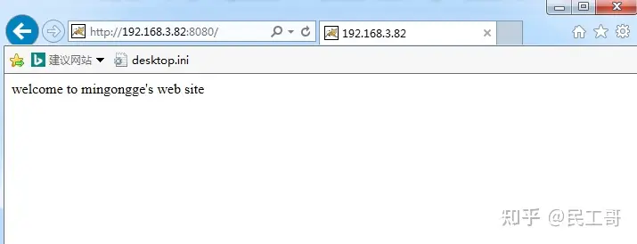

## **Docker三剑客**

**[容器技术｜Docker三剑客之Compose](https://link.zhihu.com/?target=http%3A//mp.weixin.qq.com/s%3F__biz%3DMzI0MDQ4MTM5NQ%3D%3D%26mid%3D2247486005%26idx%3D1%26sn%3D8588567be4bb8dddd042a4d260d49a59%26chksm%3De91b6f29de6ce63f15d237b19492974c1a0e436bf1b35f8e5a0b87dc78896b5fd11fec84bbf7%26scene%3D21%23wechat_redirect)**

**[容器技术｜Docker三剑客之docker-machine](https://link.zhihu.com/?target=http%3A//mp.weixin.qq.com/s%3F__biz%3DMzI0MDQ4MTM5NQ%3D%3D%26mid%3D2247486291%26idx%3D1%26sn%3D937f1fdb7d05838e37fd256233e45b7e%26chksm%3De91b6e4fde6ce759f66f2435feea0bc876fcdb7b2761096ce086465a395179ef0d86804911da%26scene%3D21%23wechat_redirect)**

**[打造高逼格、可视化的Docker容器监控系统平台](https://link.zhihu.com/?target=http%3A//mp.weixin.qq.com/s%3F__biz%3DMzI0MDQ4MTM5NQ%3D%3D%26mid%3D2247486129%26idx%3D1%26sn%3D986d170f115071cbe676d211a0458008%26chksm%3De91b6fadde6ce6bb271dedda23acef2c031ee3bdd7d9e2034ceab9a9e2c65f2caa98932e9491%26scene%3D21%23wechat_redirect)**

## **私有镜像仓库搭建**

当我们执行docker pull xxx的时候，docker默认是从[http://registry.docker.com](https://link.zhihu.com/?target=http%3A//registry.docker.com)这个地址上去查找我们所需要的镜像文件，然后执行下载操作。这类的镜像仓库就是docker默认的公共仓库，所有人都可以直接查看或下载、使用，但是呢，基于网络原因，下载速度有限制比较慢。因此，我们在公司内部内网环境中使用dokcer，一般不会将镜像文件上传到公网公共库中。但内部共享使用就是个问题，所以，私有仓库就由此产生了。

### **什么是私有仓库？**

私有仓库，就是本地（内网环境）组建的一个与公网公共库功能相似的镜像仓库。组建好之后，我们就可以将打包好的镜像提交到私有仓库中，这样内网其它用户也可以使用这个镜像文件。

本文使用官方提供的registry镜像来组建企业内网的私有镜像仓库

### **环境介绍**

两台安装好docker环境的主机

- 服务端：192.168.3.82 私有仓库服务器在，运行registry容器
- 客户端：192.168.3.83 测试客户端，用于上传、下载镜像文件

### **安装布署过程**

下载官方registry镜像文件

```bash
[root@master ~]# docker pull registry
Using default tag: latest
Trying to pull repository docker.io/library/registry ... 
latest: Pulling from docker.io/library/registry
81033e7c1d6a: Pull complete 
b235084c2315: Pull complete 
c692f3a6894b: Pull complete 
ba2177f3a70e: Pull complete 
a8d793620947: Pull complete 
Digest: sha256:672d519d7fd7bbc7a448d17956ebeefe225d5eb27509d8dc5ce67ecb4a0bce54
Status: Downloaded newer image for docker.io/registry:latest
[root@master ~]# docker images |grep registry
docker.io/registry   latest  d1fd7d86a825   5 months ago  33.3 MB
```

运行registry容器

```bash
[root@master ~]# mkdir /docker/registry -p
[root@master ~]# docker run -itd -v /docker/registry/:/docker/registry -p 5000:5000 --restart=always --name registry registry:latest
26d0b91a267f684f9da68f01d869b31dbc037ee6e7bf255d8fb435a22b857a0e
[root@master ~]# docker ps
CONTAINER ID   IMAGE            COMMAND                  CREATED        STATUS        PORTS                    NAMES
26d0b91a267f   registry:latest  "/entrypoint.sh /e..."   4 seconds ago  Up 3 seconds  0.0.0.0:5000->5000/tcp   registry
```

参数说明

```bash
1）-itd：在容器中打开一个伪终端进行交互操作，并在后台运行；
2）-v：把宿主机的/docker/registry目录绑定到容器/docker/registry目录(这个目录是registry容器中存放镜像文件的目录)，来实现数据的持久化；
3）-p：映射端口；访问宿主机的5000端口就访问到registry容器的服务了；
4）--restart=always：这是重启的策略，假如这个容器异常退出会自动重启容器；
5）--name registry：创建容器命名为registry，可自定义任何名称；
6）registry:latest：这个是刚才pull下来的镜像；
```

查看远程仓库镜像文件

```bash
[root@master ~]# curl http://localhost:5000/v2/_catalog
{"repositories":[]}
```

同样也可以使用浏览器访问[http://server-ip:5000/v2/_catalog](https://link.zhihu.com/?target=http%3A//server-ip%3A5000/v2/_catalog), 结果相同，都是空的没有任何文件。

### **客户端操作**

修改下载的镜像源

```bash
[root@slave1 ~]# vim /etc/docker/daemon.json
{
"registry-mirrors":["https://registry.docker-cn.com"]
}
[root@slave1 ~]# systemctl restart docker
```

下载测试镜像

```bash
[root@slave1 ~]# docker pull nginx
Using default tag: latest
Trying to pull repository docker.io/library/nginx ... 
latest: Pulling from docker.io/library/nginx
683abbb4ea60: Pull complete 
6ff57cbc007a: Pull complete 
162f7aebbf40: Pull complete 
Digest: sha256:636dd2749d9a363e5b57557672a9ebc7c6d041c88d9aef184308d7434296feea
Status: Downloaded newer image for docker.io/nginx:latest
```

给镜像打TAG

```bash
[root@slave1 ~]# docker tag nginx:latest 192.168.3.82:5000/nginx:v1
[root@slave1 ~]# docker images
REPOSITORY                TAG       IMAGE ID        CREATED       SIZE
192.168.3.82:5000/nginx   v1        649dcb69b782    8 hours ago   109 MB
docker.io/nginx           latest    649dcb69b782    8 hours ago   109 MB
```

上传镜像

```bash
[root@slave1 ~]# docker push 192.168.3.82:5000/nginx:v1
The push refers to a repository [192.168.3.82:5000/nginx]
Get https://192.168.3.82:5000/v1/_ping: http: server gave HTTP response to HTTPS client
#注意这里出现报错提示，从提示信息可以看出需要使用https的方式才能上传，解决方案如下：
[root@slave1 ~]# vim /etc/docker/daemon.json
{
"registry-mirrors":["https://registry.docker-cn.com"],
 "insecure-registries":["192.168.3.82:5000"]
}
#添加私有镜像服务器的地址，注意书写格式为json，有严格的书写要求，需要重启docker服务生效配置
[root@slave1 ~]# systemctl restart docker
[root@slave1 ~]# docker push 192.168.3.82:5000/nginx:v1
The push refers to a repository [192.168.3.82:5000/nginx]
6ee5b085558c: Pushed 
78f25536dafc: Pushed 
9c46f426bcb7: Pushed 
v1: digest: sha256:edad5e71815c79108ddbd1d42123ee13ba2d8050ad27cfa72c531986d03ee4e7 size: 948
```

重新查看镜像仓库

```bash
[root@master ~]# curl http://localhost:5000/v2/_catalog
{"repositories":["nginx"]}
[root@master ~]# curl http://localhost:5000/v2/nginx/tags/list
{"name":"nginx","tags":["v1"]}
#查看有哪些版本
```

测试下载

```bash
#首先删除客户端主机之前从公共库下载下来的镜像文件
[root@slave1 ~]# docker images
REPOSITORY                TAG      IMAGE ID        CREATED        SIZE
192.168.3.82:5000/nginx   v1       649dcb69b782    10 hours ago   109 MB
docker.io/nginx           latest   649dcb69b782    10 hours ago   109 MB
[root@slave1 ~]# docker image rmi -f 649dcb69b782
Untagged: 192.168.3.82:5000/nginx:v1
Untagged: 192.168.3.82:5000/nginx@sha256:edad5e71815c79108ddbd1d42123ee13ba2d8050ad27cfa72c531986d03ee4e7
Untagged: docker.io/nginx:latest
Untagged: docker.io/nginx@sha256:636dd2749d9a363e5b57557672a9ebc7c6d041c88d9aef184308d7434296feea
Deleted: sha256:649dcb69b782d4e281c92ed2918a21fa63322a6605017e295ea75907c84f4d1e
Deleted: sha256:bf7cb208a5a1da265666ad5ab3cf10f0bec1f4bcb0ba8d957e2e485e3ac2b463
Deleted: sha256:55d02c20aa07136ab07ab47f4b20b97be7a0f34e01a88b3e046a728863b5621c
Deleted: sha256:9c46f426bcb704beffafc951290ee7fe05efddbc7406500e7d0a3785538b8735
[root@slave1 ~]# docker images
REPOSITORY       TAG             IMAGE ID        CREATED         SIZE
#此时客户端所有的镜像文件全部删除
[root@slave1 ~]# docker pull 192.168.3.82:5000/nginx:v1
Trying to pull repository 192.168.3.82:5000/nginx ... 
v1: Pulling from 192.168.3.82:5000/nginx
683abbb4ea60: Pull complete 
6ff57cbc007a: Pull complete 
162f7aebbf40: Pull complete 
Digest: sha256:edad5e71815c79108ddbd1d42123ee13ba2d8050ad27cfa72c531986d03ee4e7
Status: Downloaded newer image for 192.168.3.82:5000/nginx:v1
[root@slave1 ~]# docker images
REPOSITORY                TAG     IMAGE ID       CREATED         SIZE
192.168.3.82:5000/nginx   v1      649dcb69b782   11 hours ago    109 MB
#可以看出，客户端已正常从远端服务器拉取到所需要的镜像文件，其它内网服务器也可以正常共享这台镜像服
```

以上步骤就是通过使用docker Registry快速搭建私有镜像仓库的过程与测试。我也其实也可以通过：[利用 Harbor 搭建企业级私有镜像仓库](https://link.zhihu.com/?target=https%3A//mp.weixin.qq.com/s%3F__biz%3DMzI0MDQ4MTM5NQ%3D%3D%26mid%3D2247493082%26idx%3D1%26sn%3Dca981d8f1eae9440543884609b40b093%26chksm%3De91880c6de6f09d076d3189679bb143775d1d64e3e0d50a7564ac3d4a1d6e1e3c9a28a2276d3%26token%3D1138886079%26lang%3Dzh_CN%23rd)。

## **Docker可视化工具**

Docker是一项非常流行的容器技术，现在在各行各业有着广泛的使用。不过如何管理Docker容器是一个问题，所以我今天向大家介绍两款Docker可视化工具，希望对大家有所帮助。

### **Portainer**

Portainer是一款Docker可视化管理工具，允许我们在网页中方便的查看和管理Docker容器。

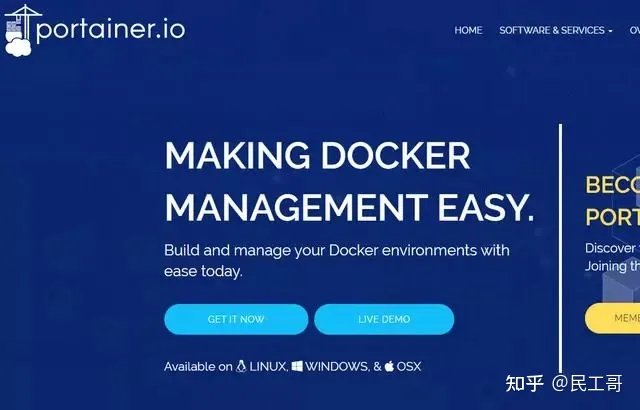

要使用Portainer很简单，运行下面两条命令即可。这些命令会创建一个Portainer专用的卷，然后在8000和9000端口创建容器并运行。

```bash
$ docker volume create portainer_data$ docker run --name portainer -d -p 8000:8000 -p 9000:9000 -v /var/run/docker.sock:/var/run/docker.sock -v portainer_data:/data portainer/portainer
```

然后在浏览器打开对应地址，就会发现成功运行了。第一次运行的时候需要设置账号，然后选择要管理的Docker主机。

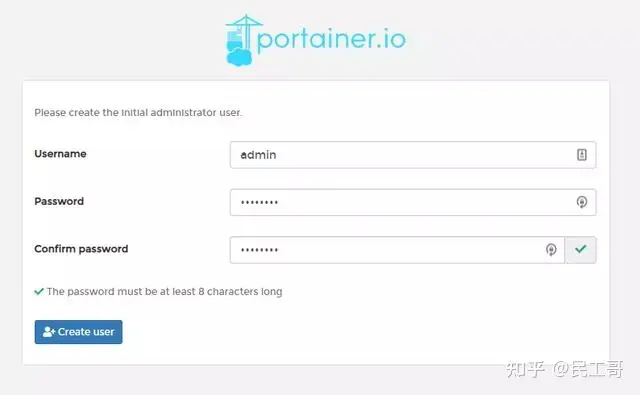

设置账号

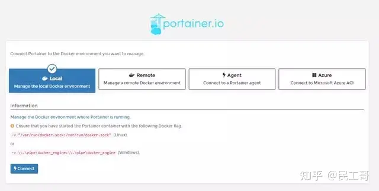

选择要管理的主机

之后就可以看到本机上运行的Docker容器了，点击它们还可以进行容器的管理。左边的条目可以管理卷、创建容器、查看主机信息等等。基本上该有的功能都有了，这也是我推荐的一个工具。

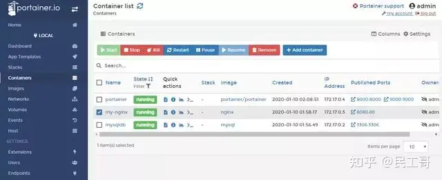


### **LazyDocker**

LazyDocker是基于终端的一个可视化查询工具，支持键盘操作和鼠标点击。相比Portainer来说可能不那么专业，不过对于开发者来说可能反而更加好用了。因为一般开发者都是使用命令行来运行Docker，偶尔需要图形化查看的时候，就可以使用LazyDocker这个工具。

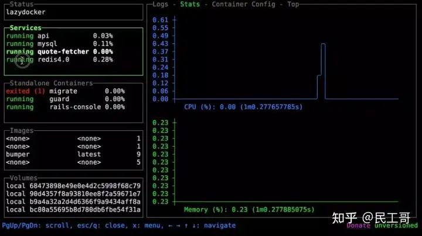

官网演示图

安装LazyDocker也非常简单，运行下面的命令即可。

```bash
docker run --rm -it -v \/var/run/docker.sock:/var/run/docker.sock \-v ~/.config/lazydocker:/.config/jesseduffield/lazydocker \lazyteam/lazydocker
```

当然如果发现LazyDocker挺好用，准备经常使用的话，还可以把它做成缩写添加到shell配置文件中，这样就可以将它变成一个简单的命令。例如我用的是zsh，就将下面这样添加到.zshrc文件中。以后就可以直接用lzd来调用LazyDocker了。

```bash
alias lzd='docker run --rm -it -v /var/run/docker.sock:/var/run/docker.sock -v ~/.config/lazydocker:/.config/jesseduffield/lazydocker lazyteam/lazydocker'
```

然后就可以在终端中查看Docker容器、镜像和卷的信息了。LazyDocker支持键盘操作和鼠标点击，直接用鼠标点击就可以查看对应信息了。

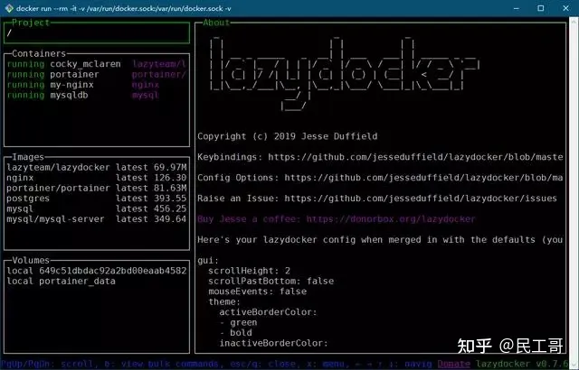

需要注意如果你的终端LazyDocker的图形显示的是乱的，不用担心，只不过是显示字体的问题。重新设置一下终端字体就可以解决了。

以上内容来自：[https://www.toutiao.com/i6780014313227682316/](https://link.zhihu.com/?target=https%3A//www.toutiao.com/i6780014313227682316/)

Docker 社区已经创建了许多开源工具，它们能帮我们处理各种用例。作者在本文中推荐了 5 款认为最有用的 Docker 工具，分别是 Watchtower（自动更新 Docker 容器）、docker-gc（容器和镜像的垃圾回收）、docker-slim（容器瘦身）、 rocker：突破 Dockerfile 的限制，以及 ctop（容器的类顶层接口）。 Docker 社区已经创建了许多开源工具，它们所能帮你处理的用例甚至会超出你的想象。 你可以在网上找到很多酷炫的 Docker 工具，其中大部分是开源的，都可以在 Github 上找到。在过去的两年里，我非常热衷于 Docker，在大多数开发项目中都使用了它。当你开始使用 Docker 后，你会发现它适用的场景比你最初预想的还更多。你会希望 Docker 尽可能为你多做一点事，而它不会让你失望的！ Docker 社区非常活跃，每天都会出现许多有用的工具，时时关注社区中发生的所有创新是很困难的。为了帮助你，我收集了一些我在日常工作中使用的又有趣又实用的 Docker 工具，这些工具提升了我的工作效率，减少了原本需要手工完成的工作。

向大家推荐一些实用工具:[你应该知道的5个开源Docker工具...](https://link.zhihu.com/?target=https%3A//mp.weixin.qq.com/s%3F__biz%3DMzI0MDQ4MTM5NQ%3D%3D%26mid%3D2247492496%26idx%3D2%26sn%3D91e50c4d62589b6144c14ad5bcdb11d7%26chksm%3De918868cde6f0f9a23c176fdcde8c0ba12b9fb8c602b7630b441cc94222886f59db82d903dc6%26token%3D1138886079%26lang%3Dzh_CN%23rd),[Docker 服务终端 UI 管理工具](https://link.zhihu.com/?target=https%3A//mp.weixin.qq.com/s%3F__biz%3DMzI0MDQ4MTM5NQ%3D%3D%26mid%3D2247509225%26idx%3D2%26sn%3Ddf58e5a088f56e0db6c09720317da9e3%26chksm%3De918c1f5de6f48e3d72df38b1f1972b99e8acf2bc860bc4f06fc7946faf8c65559e3837231d1%26token%3D1138886079%26lang%3Dzh_CN%23rd)，大家最终根据自己的使用习惯与实际生产需求来选择合适自己的工具来管理Docker容器。

## **Docker容器监控系统**

随着线上服务的全面docker化，对docker容器的监控就很重要了。SA的监控系统是物理机的监控，在一个物理机跑多个容器的情况下，我们是没法从一个监控图表里面区分各个容器的资源占用情况的。

推荐大家看看这篇：[打造高逼格、可视化的Docker容器监控系统平台](https://link.zhihu.com/?target=https%3A//mp.weixin.qq.com/s%3F__biz%3DMzI0MDQ4MTM5NQ%3D%3D%26mid%3D2247486129%26idx%3D1%26sn%3D986d170f115071cbe676d211a0458008%26chksm%3De91b6fadde6ce6bb271dedda23acef2c031ee3bdd7d9e2034ceab9a9e2c65f2caa98932e9491%26token%3D1138886079%26lang%3Dzh_CN%23rd)

## **[Docker 日志管理最佳实践](https://link.zhihu.com/?target=https%3A//mp.weixin.qq.com/s%3F__biz%3DMzI0MDQ4MTM5NQ%3D%3D%26mid%3D2247495700%26idx%3D2%26sn%3D1da61769a7fcf457aaf1cb8c5735313f%26chksm%3De9189508de6f1c1ef1f1a1806839ff91a4c4dde906640cb8d895bb89f04e7361ff040e4b3014%26token%3D1138886079%26lang%3Dzh_CN%23rd)**

## **10 个冷门但又非常实用的 Docker 使用技巧**

在平时的工作中，docker 接触得很多，除了经常使用的 docker run ，docker stop 等命令，docker 还有很多十分有用但是却不经常使用的命令，下面就来总结一下：

### **1. docker top**

这个命令是用来查看一个容器里面的进程信息的，比如你想查看一个 nginx 容器里面有几个 nginx 进程的时候，就可以这么做：

```bash
docker top 3b307a09d20d
UID      PID    PPID    C    STIME  TTY    TIME       CMD
root     805    787     0    Jul13   ?   00:00:00  nginx: master process nginx -g daemon off;
systemd+ 941     805     0   Jul13    ?   00:03:18  nginx: worker process
```

### **2. docker load && docker save**

我一般使用这两个命令去下载打包 Kubernetes 的镜像，因为你知道的国内的网速并不像国外那么快。

docker save 可以把一个镜像保存到 tar 文件中，你可以这么做：

```bash
~ docker save registry:2.7.1 >registry-2.7.1.tar
#同时 docker load 可以把镜像从 tar 文件导入到 docker 中
~ docker load < registry-2.7.1.tar
```

### **3. docker search**

这个命令可以帮助你在命令行中方便的搜索 DockerHub 中的镜像，比如:

```bash
~ docker search nginx
NAME                               DESCRIPTION                                     STARS               OFFICIAL            AUTOMATED
nginx                              Official build of Nginx.                        13519               [OK]
jwilder/nginx-proxy                Automated Nginx reverse proxy for docker con…   1846                                    [OK]
richarvey/nginx-php-fpm            Container running Nginx + PHP-FPM capable of…   780                                     [OK]
linuxserver/nginx                  An Nginx container, brought to you by LinuxS…   123
bitnami/nginx                      Bitnami nginx Docker Image                      87                                      [OK]
tiangolo/nginx-rtmp                Docker image with Nginx using the nginx-rtmp…   85                                      [OK]
jc21/nginx-proxy-manager           Docker container for managing Nginx proxy ho…   73
alfg/nginx-rtmp                    NGINX, nginx-rtmp-module and FFmpeg from sou…   71                                      [OK]
nginxdemos/hello                   NGINX webserver that serves a simple page co…   57                                      [OK]
jlesage/nginx-proxy-manager        Docker container for Nginx Proxy Manager        53                                      [OK]
nginx/nginx-ingress                NGINX Ingress Controller for Kubernetes         37
......
```

当然这个功能在国内可能不会特别好用，因为......

### **4. docker events**

这个命令可以帮助你实时获取 docker 的各种事件信息，比如创建了一个容器什么的。

```bash
~ docker events
2020-07-28T21:28:46.000403018+08:00 image load sha256:432bf69f0427b52cad10897342eaf23521b7d973566354118e9a59c4d31b5fae (name=sha256:432bf69f0427b52cad10897342eaf23521b7d973566354118e9a59c4d31b5fae)
```

### **5. docker update**

当你 docker run 了之后却发现里面有一些参数并不是你想要的状态比如你设置的 nginx 容器 cpu 或者内存太小，这个时候你就可以使用 docker update 去修改这些参数。

```bash
~ docker update nginx --cpus 2
```

### **6. docker history**

当你修改了一个镜像，但是忘记了每一层的修改命令，或者你想查看一个镜像是怎么构建的时候就可以使用这个命令，比如：

```bash
~ docker history  traefik:v2.1.6
IMAGE               CREATED             CREATED BY                                      SIZE                COMMENT
5212a87ddaba        5 months ago        /bin/sh -c #(nop)  LABEL org.opencontainers.…   0B
<missing>           5 months ago        /bin/sh -c #(nop)  CMD ["traefik"]              0B
<missing>           5 months ago        /bin/sh -c #(nop)  ENTRYPOINT ["/entrypoint.…   0B
<missing>           5 months ago        /bin/sh -c #(nop)  EXPOSE 80                    0B
<missing>           5 months ago        /bin/sh -c #(nop) COPY file:59a219a1fb7a9dc8…   419B
<missing>           5 months ago        /bin/sh -c set -ex;  apkArch="$(apk --print-…   52.9MB
<missing>           5 months ago        /bin/sh -c apk --no-cache add ca-certificate…   1.85MB
<missing>           6 months ago        /bin/sh -c #(nop)  CMD ["/bin/sh"]              0B
<missing>           6 months ago        /bin/sh -c #(nop) ADD file:a1906f14a4e217a49…   4.81MB
```

### **7. docker wait**

这个命令可以查看容器的退出状态，比如：

```bash
~ docker wait 7f7f0522a7d0
0
```

这样你就可以知道这个容器是正常退出的还是异常退出的了。

### **8. docker pause && docker unpause**

当你运行了一个容器但是想要暂停它运行的时候，你就可以使用这个命令。

```bash
~ docker pause 7f7f0522a7d0
```

### **9. docker diff**

当你运行了一个容器，但是你不知道容器里修改了哪一些文件的时候可以使用这个命令，比如：

```bash
~ docker diff 38c59255bf6e
C /etc
A /etc/localtime
C /var
C /var/lib
A /var/lib/registry
```

### **10. docker stats**

这个是 docker 内置的监控命令，当你想要查看当前主机下所有容器占用内存和 cpu 的情况的时候就可以使用这个命令。

```bash
~ docker stats

CONTAINER ID        NAME                        CPU %               MEM USAGE / LIMIT     MEM %               NET I/O             BLOCK I/O           PIDS
1c5ade04e7f9        redis                        0.08%               17.53MiB / 47.01GiB   0.04%               10.9GB / 37GB       0B / 0B             4
afe6d4ebe409        kafka-exporter                0.09%               16.91MiB / 47.01GiB   0.04%               1.97GB / 1.53GB     752MB / 0B          23
f0c7c01a9c34        kafka-docker_zookeeper         0.01%               308.8MiB / 47.01GiB   0.64%               20.2MB / 12.2MB     971MB / 3.29MB      28
da8c5008955f        kafka-docker_kafka-manager     0.08%               393.2MiB / 47.01GiB   0.82%               1.56MB / 2.61MB     1.14GB / 0B         60
c8d51c583c49        kafka-docker_kafka            1.63%               1.256GiB / 47.01GiB   2.67%               30.4GB / 48.9GB     22.3GB / 5.77GB     85
......
```

原文：[http://suo.im/6n2lLa](https://link.zhihu.com/?target=http%3A//suo.im/6n2lLa)

## **学习Docker，新手最容易犯的11个错误！**

很多人最终还是决定使用 Docker 解决问题。 Docker 的优点很多，比如：

- 1、一体化——将操作系统、库版本、配置文件、应用程序等全部打包装在容器里。从而保证 QA 所测试的镜像 (image) 会携带同样的行为到达生产环境。
- 2、轻量——内存占用极小，只为主要过程分配内存。
- 3、快读——一键启动，就像启动常见的 linux 过程一样快。

尽管如此，众多用户仍然只是把容器当做常见的虚拟机，而忘记了容器的一个重要特性： 正因为这一特点，一些用户需要改变他们对容器的观念，为了更好的使用与发挥 Docker 容器的价值，有一些事情是绝对不应该做的：

### **1.不要在容器（container）中存储数据**

容器可能会被中断、被替换或遭到破坏。在容器中运行的 1.0 版应用程序很容易就会被 1.1 版取代，而不会对数据造成影响或导致数据丢失。因此，如果需要存储数据，请存储在卷 (volume) 中。在这一情况下，还应注意两个容器是否会在同一个卷上写入数据，这将导致损坏。请确保应用程序适用于写入共享的数据存储。

### **2. 不要分两部分传送应用程序 有些人把容器当作虚拟机**

所以他们大多会认为，应该将应用程序部署到现有正在运行的容器中。在需要不断部署和调试的开发阶段，可能确实如此；但对于 QA 和生产的持续交付 (CD) 渠道，应用程序应当是镜像的一部分。切记：容器转瞬即逝。

### **3. 不要创建大尺寸镜像**

大尺寸的镜像难以分配。请确保仅使用必需文件和库来运行应用程序。不要安装不必要的数据包，也不要运行“更新”(yum update)，这些操作会把大量文件下载到新的镜像层。

### **4. 不要使用单层镜像**

为了有效利用多层文件系统，请始终为操作系统创建属于自己的基本镜像层，然后为用户名定义创建一个层，为运行时安装创建一个层，为配置创建一个层，最后再为应用程序创建一个层。这样，重新创建、管理和分配镜像就会容易些。

### **5. 不要从正在运行的容器中创建镜像**

换句话说，不要使用"docker commit"命令来创建镜像。这一镜像创建方法不可复制，因此应完全避免使用。请始终使用 Dockerfile 或其他任何可完全复制的 S21（从源代码到镜像）方法，如此一来，如果存储在源代码控制存储库 (GIT) 中，就可以跟踪 Dockerfile 的变更情况。

### **6. 不要只使用“最新版”标签**

最新版标签就像 Maven 用户的“快照”(SNAPSHOT) 一样。容器具有多层文件系统这一基本特征，所以我们鼓励使用标签。相信谁也不愿意在构建了几个月的镜像后，突然发现应用程序因为父层（即 Dockerfile 中的 FROM）被新版本取代而无法运行（新版本无法向后兼容或从构建缓存中检索的“最新“版有误）这样的意外吧？在生产过程中部署容器时也应避免使用”最新版“标签，这是因为无法跟踪当前运行的镜像版本。

### **7. 不要在单个容器中运行一个以上进程**

容器只运行一个进程（HTTP 守护进程、应用程序服务器、数据库）时效果最佳，但如果运行一个以上进程，在管理和检索日志以及单独更新进程时就会遇到很多麻烦。

### **8. 不要在镜像中存储证书及使用环境变量**

不要在镜像中对任何用户名/密码进行硬编码操作。请使用环境变量从容器外部检索信息。Postgres 镜像就是这一原理的极佳诠释。

### **9. 不要以 root 权限运行进程**

“默认情况下，Docker 容器以 root 用户权限运行。随着 Docker 技术日趋成熟，能够使用的安全默认选项越来越多。目前，要求 root 对其他用户来说较为危险，另外，不是所有环境都能够使用 root。镜像应使用 USER 指令来为容器的运行指定非 root 用户。”（摘自《Docker 镜像作者指南》(Guidance for Docker Image Authors)）

### **10. 不要依赖 IP 地址**

每个容器都有自己的内部 IP 地址，如果启动然后停止容器，内部 IP 地址可能会发生变化。如果你的应用程序或微服务需要和另一个容器进行通信，请使用环境变量在容器之间传递相应的主机名和端口。

### **11. 监控容器 Docker**

监控已经越来越受到开发者们的重视，实时监控 Docker 的方法，这里推荐 Cloudinsight。 不同于一些需要自写脚本的监控手段，Cloudinsight 作为一家免费的 SaaS 服务，能够一键监控 Docker，且拥有很棒的可视化界面。除此之外，Cloudinsight 还支持多种操作系统、数据库等的监控，能够一体化展示所有被监控的系统基础组件的性能数据。

原文：[https://my.oschina.net/cllgeek/blog/1584759](https://link.zhihu.com/?target=https%3A//my.oschina.net/cllgeek/blog/1584759)

## **Jenkins与Docker的自动化CI/CD实战**

### **一、发布流程设计**

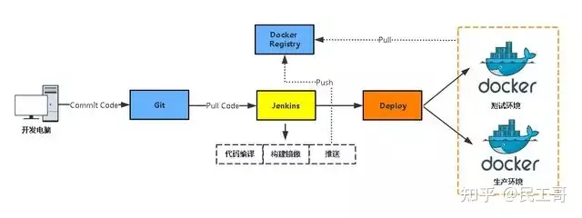

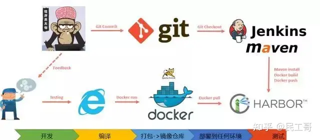

工作流程：

- 开发人员提交代码到Git版本仓库；
- Jenkins人工/定时触发项目构建；
- Jenkins拉取代码、代码编码、打包镜像、推送到镜像仓库；
- Jenkins在Docker主机创建容器并发布。

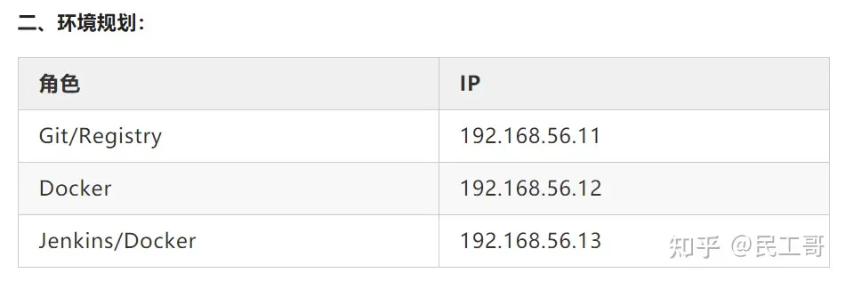

### **三、 部署过程**

1,部署git

如果公司内部有直接克隆就可以

```bash
git clone git@192.168.0.31:/home/git/solo.git
```

2，部署Jenkins环境

部署传送门：J[enkins+Maven+Svn实现代码自动打包与发布](https://link.zhihu.com/?target=http%3A//mp.weixin.qq.com/s%3F__biz%3DMzI0MDQ4MTM5NQ%3D%3D%26mid%3D2247484630%26idx%3D1%26sn%3Da5b2584764a9485f570cc70278a5efd2%26chksm%3De91b61cade6ce8dcd680a5d513d99521ca3201e2673a059575a95ff41e31b0d94570e53ba12f%26scene%3D21%23wechat_redirect)

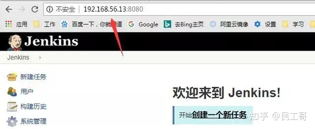

3，部署私有镜像仓库

注意：docker 仓库 由于https 认证，所有需要pull的客户端，需要修改配置文件

```bash
[root@linux-node1 ~]# vim /etc/sysconfig/docker
# Modify these options if you want to change the way the docker daemon runs
 OPTIONS='--selinux-enabled --insecure-registry 192.168.56.11:5000'
```

4，所有主机安装docker

```bash
1）安装依赖包
yum install -y yum-utils device-mapper-persistent-data lvm2`
 
2）添加Docker软件包源：
yum-config-manager 
--add-repo 
https://download.docker.com/linux/centos/docker-ce.repo

3）安装Docker CE
 yum install docker-ce -y`
 
4）配置加速器
 curl -sSL https://get.daocloud.io/daotools/set_mirror.sh | sh -s http://bc437cce.m.daocloud.io`
 #因为默认源会去国外获取数据，所以会慢可以超时，这是我们就需要配置加速器指向国内源https://www.daocloud.io/
 
5）启动并开机启动
# systemctl start docker
# systemctl enable docker
```

### **四、构建基础镜像**

【Apache、Nginx、Tomcat、LNMP、LAMP、LNTP】

JAVA程序必须有JDK环境才可以运行，为了减少镜像大小及提高性能，这里直接把JDK放到宿主机上，容器以挂载形式使用。

1，安装jdk

```bash
#rz 把tar包上传，解压后放到指定目录
rz....... 
tar -zxvf jdk-8u60-linux-x64.tar.gz
mv jdk1.8.0_60 /usr/local/jdk1.8
```

2，拟写Dockerfile

```bash
# cat Dockerfile
FROM centos:7
#他的妈妈是谁
MAINTAINER www.aliangedu.com
#他的爸爸是谁
ENV VERSION=8.5.33
#tomcat版本
ENV JAVA_HOME /usr/local/jdk
#jdk 绝对路径
RUN yum install wget -y
#运行的命令
RUN wget http://mirrors.shu.edu.cn/apache/tomcat/tomcat-8/v${VERSION}/bin/apache-tomcat-${VERSION}.tar.gz && 
 tar zxf apache-tomcat-${VERSION}.tar.gz && 
 mv apache-tomcat-${VERSION} /usr/local/tomcat && 
 rm -rf apache-tomcat-${VERSION}.tar.gz /usr/local/tomcat/webapps/* && 
 mkdir /usr/local/tomcat/webapps/ROOT
EXPOSE 8080
#程序使用的端口
CMD /usr/local/tomcat/bin/catalina.sh run
#执行tomcat目录下的启动脚本，这里面遇到坑，就是-v 将宿主机jdk目录挂在到容器/usr/local/jdk 时候，因为镜像按照dockerfile去打，那么在执行命令的时候就会找不到路径，所以我临时删除了，EXPOSE与CMD 2行，然后重新打包，使用 -p 指定端口，然后进入容器，手工启动tomcat的方式，进行
```

3，构建镜像

```bash
docker build -t 192.168.56.11:5000/tomcat-85:latest -f dockerfile . 
#最后这个点。代表当前路径，在制作镜像时，会记录上下文内容
```

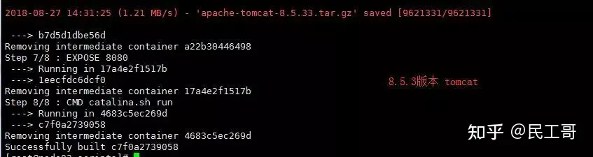

4，上传到docker 镜像仓库

```bash
root@node02 scripts]# docker push 192.168.56.11:5000/tomcat-85:latest 
```

5，启动镜像 测试

```bash
[root@node02 scripts]# docker run -it -d -p 8080:8080 -v /usr/local/jdk1.8:/usr/local/jdk 192.168.56.11:5000/tomcat-8:latest
[root@3addff07c464 ROOT]# echo "123" >index.jsp
```


### **五、Jenkins 配置**

1.主页面 -> 系统管理 -> 全局工具配置

指定JDK、Maven路径，Git保持默认：

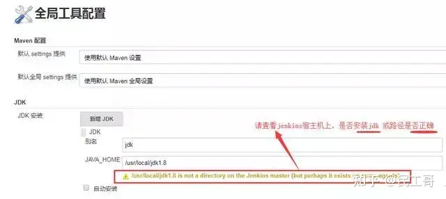

2.jenkins安装必要插件

主页面 -> 系统管理 ->管理插件：

安装SSH与Git Parameter插件。

插件说明：

- 》SSH：用于SSH远程Docker主机执行Shell命令
- 》Git Parameter：动态获取Git仓库Branch、Tag

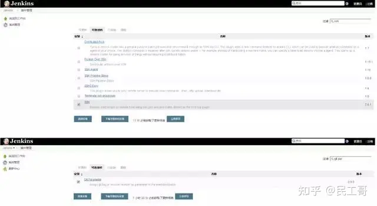

3，配置SSH插件

第一步：先创建一个用于连接Docker主机的凭证 （有权限的用户）

主页面 -> 凭据 -> 系统 -> 右击全局凭据 -> 添加凭据：

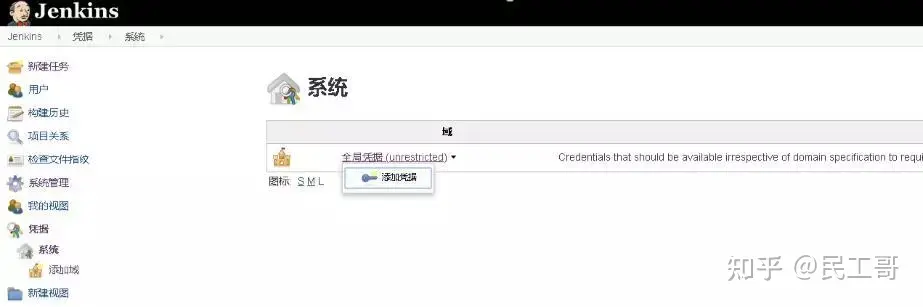

输入连接Docker主机的用户名和密码：

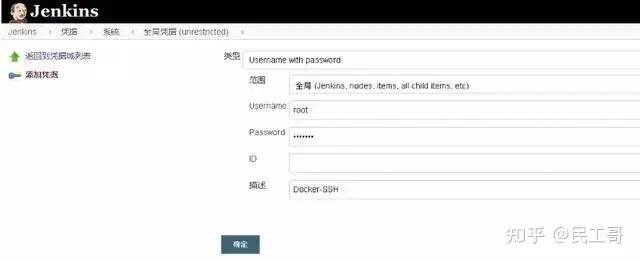

第二步：添加SSH远程主机

主页面 -> 系统管理 -> 系统设置 -> SSH remote hosts：

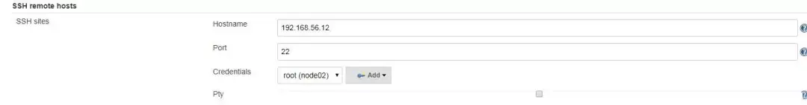

问题：当以普通用户身份去使用docker images时，出现以下错误：

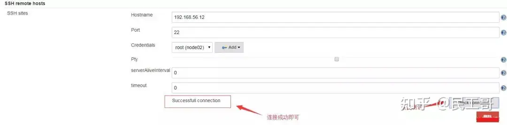

### **六、将从github上下载的JAVA项目，上传到自己的gitlab仓库**

```bash
# git clone https://github.com/b3log/solo
# cd solo
移除旧的推送地址，添加新的：
# git remote remove origin 
# git remote add origin git@gitlab.example.com:qqq/solo.git
提交代码到Git仓库并创建tag：
# touch src/main/webapp/a.html
# git add .
# git commit -m “a”
创建标签：
# git tag 1.0.0
推送到Git服务器：
# git push origin 1.0.0 
```

登陆gitlab查看solo项目：

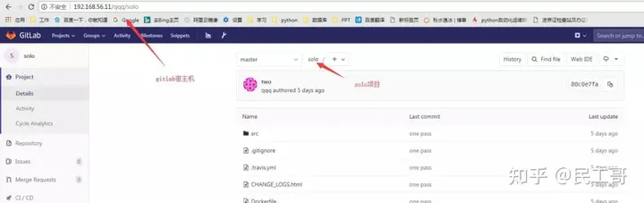

### **七、Jenkins创建项目并发布测试**

1.主页面 -> 新建任务 -> 输入任务名称，构建一个Maven项目：

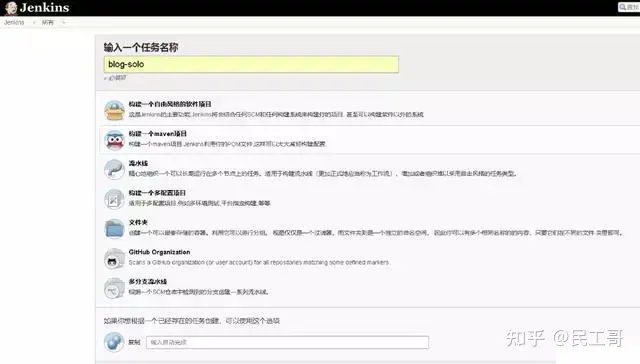

注意：如果没有显示“构建一个Maven项目”选项，需要在管理插件里安装“Maven Integration plugin”插件。

配置Git参数化构建：

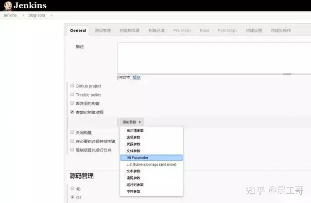

2.动态获取Git仓库tag，与用户交互选择Tag发布：【也可以设置分支】

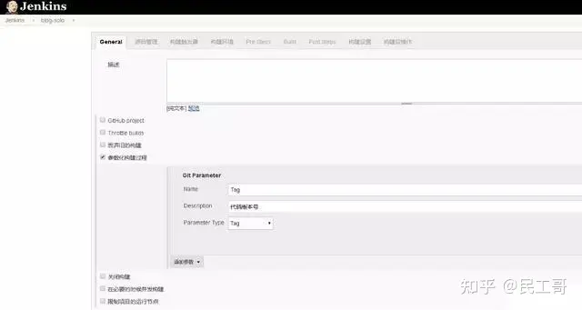

3.指定项目Git仓库地址：

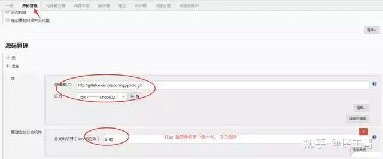

修改*/master为$Tag，Tag是上面动态获取的变量名，表示根据用户选择打代码版本。

4.设置maven构建命令选项：

clean package -Dmaven.test.skip=ture

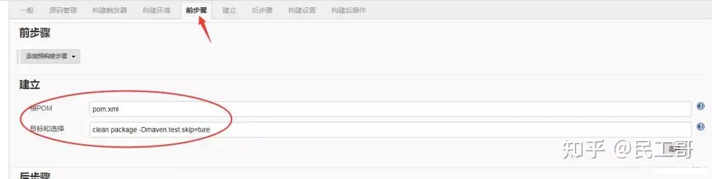

利用pom.xml文件构建项目。

在Jenkins本机镜像构建与推送到镜像仓库，并SSH远程连接到Docker主机使用推送的镜像创建容器：

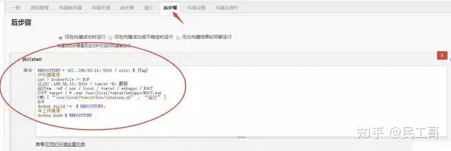

上图中 命令内容如下：

```bash
REPOSITORY=192.168.56.11:5000/solo:${Tag}
# 构建镜像
cat > Dockerfile << EOF
FROM 192.168.56.11:5000/tomcat-8:latest
RUN rm -rf /usr/local/tomcat/webapps/ROOT
COPY target/*.war /usr/local/tomcat/webapps/ROOT.war
CMD ["/usr/local/tomcat/bin/catalina.sh", "run"]
EOF
docker build -t $REPOSITORY .
# 上传镜像
docker push $REPOSITORY
```


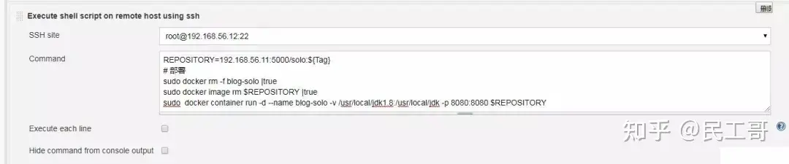

上图中Command 内容如下：

```bash
REPOSITORY=192.168.56.11:5000/solo:${Tag}
# 部署
sudo docker rm -f blog-solo |true
sudo docker image rm $REPOSITORY |true
sudo docker container run -d --name blog-solo -v /usr/local/jdk1.8:/usr/local/jdk -p 8080:8080 $REPOSITORY
# -d 后台运行 ，-v 挂在目录，-p 映射端口，后面是镜像
```

注：容器名称blog-solo，暴露宿主机端口8080，即使用宿主机IP 192.168.56.12:8080 访问blog-solo项目。

blog-solo项目已配置完成，开始构建：

选择tag，开始构建：

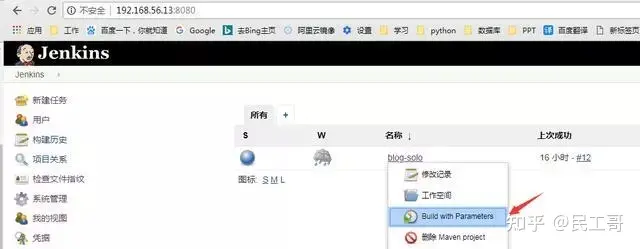


点击左下角构建历史里，右击第一个查看控制台输出：

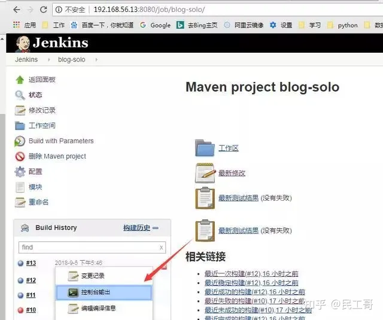

构建详细内容

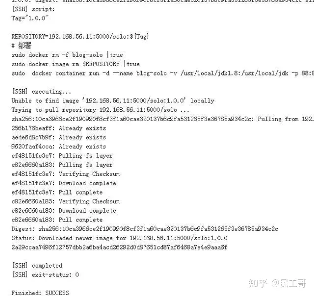

构建成功

访问：192.168.56.12:8080 查看部署结果

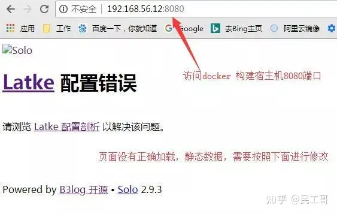

调整项目访问地址

进入容器，切换到项目目录

```bash
vi WEB-INF/classes/latke.properties 
#### Server ####
# Browser visit protocol
serverScheme=http
# Browser visit domain name
serverHost=192.168.56.12
# Browser visit port, 80 as usual, THIS IS NOT SERVER LISTEN PORT!
serverPort=8080
```

调整后，重启tomcat，再次验证，OK，结果如下：

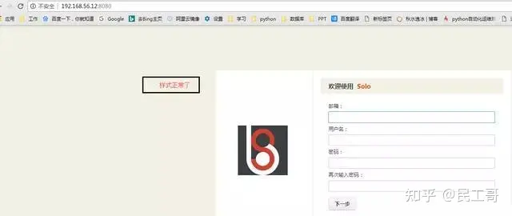

至此，自动化CI环境搭建完成，你可以模拟提交代码并打tag测试自动化发布流程。

### **八、问题总结：**

查看docker.sock权限

```bash
[root@node03 ~]# ll /var/run/docker.sock 
srw-rw---- 1 root docker 0 9月 4 21:55 /var/run/docker.sock
```

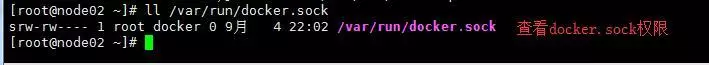

解决方法：【免sudo 使用docker images 】

```bash
[root@node03 ~]# sudo groupadd docker
 ##groupadd：“docker”组已存在
[root@node03 ~]# sudo gpasswd -a jenkins docker
 ##正在将用户“jenkins”加入到“docker”组中
[root@node03 ~]# sudo service docker restart
##重启服务
[root@node03 ~]# newgrp - docker
##重新加载group 组信息，一定要输入这条命令，否则无法加载最新组内容，因为有缓存
```

原文：[https://www.toutiao.com/a6602838654907843085/](https://link.zhihu.com/?target=https%3A//www.toutiao.com/a6602838654907843085/)

## **[使用 GitLab CI 和 Docker 自动部署 Spring Boot 应用](https://link.zhihu.com/?target=https%3A//mp.weixin.qq.com/s%3F__biz%3DMzI0MDQ4MTM5NQ%3D%3D%26mid%3D2247500917%26idx%3D2%26sn%3D8f93bd64875f72a94f222994fbe4c295%26chksm%3De918a169de6f287f8a3fb4fddf1bff02629753a21c28d7358f94879f9dc3c67ba12019680d42%26token%3D1138886079%26lang%3Dzh_CN%23rd)**

## **Docker 常见疑难杂症解决方案**

这里主要是为了记录在使用 [Docker](https://link.zhihu.com/?target=http%3A//mp.weixin.qq.com/s%3F__biz%3DMzI0MDQ4MTM5NQ%3D%3D%26mid%3D2247504011%26idx%3D1%26sn%3D2d6a08bb65c4930e9748d3ea6af5c0f5%26chksm%3De918b597de6f3c814ea2f20a8b19a417af69d66ddd56c6801e9527fce0098df019f932e1c7c9%26scene%3D21%23wechat_redirect) 的时候遇到的问题及其处理解决方法。

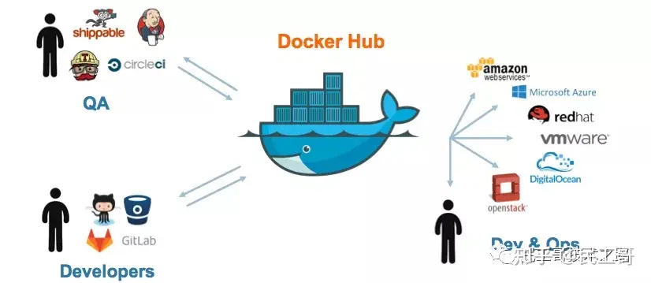

### **1.Docker 迁移存储目录**

默认情况系统会将 [Docker](https://link.zhihu.com/?target=http%3A//mp.weixin.qq.com/s%3F__biz%3DMzI0MDQ4MTM5NQ%3D%3D%26mid%3D2247509626%26idx%3D2%26sn%3Da1612d83aec08936950cc5bed3dc96af%26chksm%3De918c366de6f4a706cb9502afcb7f1e73911f053f4e4dadd17ccea1abd0e616e115e51024590%26scene%3D21%23wechat_redirect) 容器存放在/var/lib/[docker](https://link.zhihu.com/?target=http%3A//mp.weixin.qq.com/s%3F__biz%3DMzI0MDQ4MTM5NQ%3D%3D%26mid%3D2247509225%26idx%3D2%26sn%3Ddf58e5a088f56e0db6c09720317da9e3%26chksm%3De918c1f5de6f48e3d72df38b1f1972b99e8acf2bc860bc4f06fc7946faf8c65559e3837231d1%26scene%3D21%23wechat_redirect) 目录下

问题起因:今天通过监控系统，发现公司其中一台服务器的磁盘快慢，随即上去看了下，发现 /var/lib/[docker](https://link.zhihu.com/?target=http%3A//mp.weixin.qq.com/s%3F__biz%3DMzI0MDQ4MTM5NQ%3D%3D%26mid%3D2247508774%26idx%3D2%26sn%3D8802a06a3f2cc1617ff5e32353b11c2d%26chksm%3De918c63ade6f4f2c6aeaddfad813000b9f0a3a5ae5b535f39976e47bdc1df2bbec05c337d5ca%26scene%3D21%23wechat_redirect) 这个目录特别大。由上述原因，我们都知道，在 /var/lib/docker 中存储的都是相关于容器的存储，所以也不能随便的将其删除掉。

那就准备迁移 [docker](https://link.zhihu.com/?target=http%3A//mp.weixin.qq.com/s%3F__biz%3DMzI0MDQ4MTM5NQ%3D%3D%26mid%3D2247504153%26idx%3D1%26sn%3D208009779ddb18d84fd198770d67656c%26chksm%3De918b405de6f3d1321f11b4a1be539f01a7bd79f7a37560caec825bb3055844910d2576b371e%26scene%3D21%23wechat_redirect) 的存储目录吧，或者对 /var 设备进行扩容来达到相同的目的。更多关于 dockerd 的详细参数，请点击查看 官方文档 地址。

但是需要注意的一点就是，尽量不要用软链， 因为一些 [docker](https://link.zhihu.com/?target=http%3A//mp.weixin.qq.com/s%3F__biz%3DMzI0MDQ4MTM5NQ%3D%3D%26mid%3D2247502654%26idx%3D1%26sn%3D9458abf0f3adc055759f4498a97b50f9%26chksm%3De918ae22de6f273421893f8e0203130b1ca4a90805cb315cca236760b32abe37b19e4cfe9c9f%26scene%3D21%23wechat_redirect) 容器编排系统不支持这样做，比如我们所熟知的 [k8s](https://link.zhihu.com/?target=http%3A//mp.weixin.qq.com/s%3F__biz%3DMzI0MDQ4MTM5NQ%3D%3D%26mid%3D2247509120%26idx%3D2%26sn%3D7a1541742111f5faee1716aac58bbf28%26chksm%3De918c19cde6f488a1e67f9a83ced62449027412e90ab349027e458c9a68c15dfdadb2843db63%26scene%3D21%23wechat_redirect) 就在内。

```bash
# 发现容器启动不了了
ERROR：cannot  create temporary directory!
# 查看系统存储情况
$ du -h --max-depth=1
```

解决方法1：添加软链接

```bash
# 1.停止docker服务
$ sudo systemctl stop docker
# 2.开始迁移目录
$ sudo mv /var/lib/docker /data/
# 3.添加软链接
# sudo ln -s /data/docker /var/lib/docker
# 4.启动docker服务
$ sudo systemctl start docker
```

解决方法2：改动 [docker 配置](https://link.zhihu.com/?target=http%3A//mp.weixin.qq.com/s%3F__biz%3DMzI0MDQ4MTM5NQ%3D%3D%26mid%3D2247501440%26idx%3D1%26sn%3D0e5865b7060cd2ae31edd331086a048e%26chksm%3De918a39cde6f2a8a254eb2253fe49f0ce3f000e92f824776cb9ec5177e8eee0554ada9ec10d9%26scene%3D21%23wechat_redirect)文件

```bash
# 3.改动docker启动配置文件
$ sudo vim /lib/systemd/system/docker.service
ExecStart=/usr/bin/dockerd --graph=/data/docker/
# 4.改动docker启动配置文件
$ sudo vim /etc/docker/daemon.json
{
    "live-restore": true,
    "graph": [ "/data/docker/" ]
}
```

操作注意事项：在迁移 [docker](https://link.zhihu.com/?target=http%3A//mp.weixin.qq.com/s%3F__biz%3DMzI0MDQ4MTM5NQ%3D%3D%26mid%3D2247502315%26idx%3D2%26sn%3Dba6611fe2bea274498dd379a58211231%26chksm%3De918acf7de6f25e148eb211df35c3bddf4f5ebdaecc91311f53aa6aacdfbea43efc749b25f5d%26scene%3D21%23wechat_redirect) 目录的时候注意使用的命令，要么使用 mv 命令直接移动，要么使用 cp 命令复制文件，但是需要注意同时复制文件权限和对应属性，不然在使用的时候可能会存在权限问题。如果容器中，也是使用 root 用户，则不会存在该问题，但是也是需要按照正确的操作来迁移目录。

```bash
# 使用mv命令
$ sudo mv /var/lib/docker /data/docker
# 使用cp命令
$ sudo cp -arv /data/docker /data2/docker
```

下图中，就是因为启动的容器使用的是普通用户运行进程的，且在运行当中需要使用 /tmp 目录，结果提示没有权限。在我们导入容器镜像的时候，其实是会将容器启动时需要的各个目录的权限和属性都赋予了。如果我们直接是 cp 命令单纯复制文件内容的话，就会出现属性不一致的情况，同时还会有一定的安全问题。

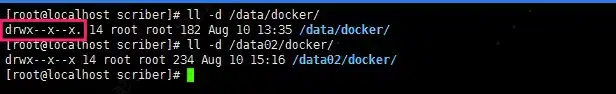

### **2.[Docker](https://link.zhihu.com/?target=http%3A//mp.weixin.qq.com/s%3F__biz%3DMzI0MDQ4MTM5NQ%3D%3D%26mid%3D2247500917%26idx%3D2%26sn%3D8f93bd64875f72a94f222994fbe4c295%26chksm%3De918a169de6f287f8a3fb4fddf1bff02629753a21c28d7358f94879f9dc3c67ba12019680d42%26scene%3D21%23wechat_redirect) 设备空间不足**

Increase Docker container size from default 10GB on rhel7.

问题起因一：容器在导入或者启动的时候，如果提示磁盘空间不足的，那么多半是真的因为物理磁盘空间真的有问题导致的。如下所示，我们可以看到 / 分区确实满了。

```bash
# 查看物理磁盘空间
$ df -Th
Filesystem    Size    Used    Avail    Use%    Mounted on
/dev/vda1      40G     40G       0G    100%    /
tmpfs         7.8G       0     7.8G      0%    /dev/shm
/dev/vdb1     493G    289G     179G     62%    /mnt
```

如果发现真的是物理磁盘空间满了的话，就需要查看到底是什么占据了如此大的空间，导致因为容器没有空间无法启动。其中，[docker](https://link.zhihu.com/?target=http%3A//mp.weixin.qq.com/s%3F__biz%3DMzI0MDQ4MTM5NQ%3D%3D%26mid%3D2247499520%26idx%3D2%26sn%3D2e4079c35f786fc29dd3971802cfd531%26chksm%3De9189a1cde6f130a3cb23b15e7e66ee0fe9af838f4bfe60096141b9db75c23c870e3c9e3885d%26scene%3D21%23wechat_redirect) 自带的命令就是一个很好的能够帮助我们发现问题的工具。

```bash
# 查看基本信息
# 硬件驱动使用的是devicemapper，空间池为docker-252
# 磁盘可用容量仅剩16.78MB，可用供我们使用
$ docker info
Containers: 1
Images: 28
Storage Driver: devicemapper
 Pool Name: docker-252:1-787932-pool
 Pool Blocksize: 65.54 kB
 Backing Filesystem: extfs
 Data file: /dev/loop0
 Metadata file: /dev/loop1
 Data Space Used: 1.225 GB
 Data Space Total: 107.4 GB
 Data Space Available: 16.78 MB
 Metadata Space Used: 2.073 MB
 Metadata Space Total: 2.147 GB
```

解决方法：通过查看信息，我们知道正是因为 [docker](https://link.zhihu.com/?target=http%3A//mp.weixin.qq.com/s%3F__biz%3DMzI0MDQ4MTM5NQ%3D%3D%26mid%3D2247500702%26idx%3D2%26sn%3D0fb77cd1830fe7f637bb6e4f3da2b13b%26chksm%3De918a682de6f2f9417f49d9d64253e12d38822df6f28458b502c2be8eddb5177d5b76153cdac%26scene%3D21%23wechat_redirect) 可用的磁盘空间不足，所以导致启动的时候没有足够的空间进行加载启动镜像。解决的方法也很简单，第一就是清理无效数据文件释放磁盘空间(清除日志)，第二就是修改 [docker 数据](https://link.zhihu.com/?target=http%3A//mp.weixin.qq.com/s%3F__biz%3DMzI0MDQ4MTM5NQ%3D%3D%26mid%3D2247497216%26idx%3D2%26sn%3D41af594fb528892a17e899f4231dc255%26chksm%3De918931cde6f1a0a9a350e37d282153ad4226fbf26299fa629ee2e8748c5e0109e179e844908%26scene%3D21%23wechat_redirect)的存放路径(大分区)。

```bash
# 显示哪些容器目录具有最大的日志文件
$ du -d1 -h /var/lib/docker/containers | sort -h
# 清除您选择的容器日志文件的内容
$ cat /dev/null > /var/lib/docker/containers/container_id/container_log_name
```

问题起因二：显然我遇到的不是上一种情况，而是在启动容器的时候，容器启动之后不久就显示是 unhealthy 的状态，通过如下日志发现，原来是复制配置文件启动的时候，提示磁盘空间不足。

后面发现是因为 [CentOS7](https://link.zhihu.com/?target=http%3A//mp.weixin.qq.com/s%3F__biz%3DMzI0MDQ4MTM5NQ%3D%3D%26mid%3D2247494213%26idx%3D2%26sn%3D10c4b4a5a21ee2a4c261577d6daaae3c%26chksm%3De9188f59de6f064fb617efb308126a4103eba00c55789f875e3a65c23fba0437a478dc94ba11%26scene%3D21%23wechat_redirect) 的系统使用的 [docker](https://link.zhihu.com/?target=http%3A//mp.weixin.qq.com/s%3F__biz%3DMzI0MDQ4MTM5NQ%3D%3D%26mid%3D2247495700%26idx%3D2%26sn%3D1da61769a7fcf457aaf1cb8c5735313f%26chksm%3De9189508de6f1c1ef1f1a1806839ff91a4c4dde906640cb8d895bb89f04e7361ff040e4b3014%26scene%3D21%23wechat_redirect) 容器默认的创建大小就是 10G 而已，然而我们使用的容器却超过了这个限制，导致无法启动时提示空间不足。

```bash
2019-08-16 11:11:15,816 INFO spawned: 'app-demo' with pid 835
2019-08-16 11:11:16,268 INFO exited: app (exit status 1; not expected)
2019-08-16 11:11:17,270 INFO gave up: app entered FATAL state, too many start retries too quickly
cp: cannot create regular file '/etc/supervisor/conf.d/grpc-app-demo.conf': No space left on device
cp: cannot create regular file '/etc/supervisor/conf.d/grpc-app-demo.conf': No space left on device
cp: cannot create regular file '/etc/supervisor/conf.d/grpc-app-demo.conf': No space left on device
cp: cannot create regular file '/etc/supervisor/conf.d/grpc-app-demo.conf': No space left on device
```

解决方法1：改动 [docker](https://link.zhihu.com/?target=http%3A//mp.weixin.qq.com/s%3F__biz%3DMzI0MDQ4MTM5NQ%3D%3D%26mid%3D2247493129%26idx%3D2%26sn%3D2667f7f3a17103941236959f6d173bb3%26chksm%3De9188315de6f0a03fd8cc13a66f8247cd65e1cbf9f5475ec4f4a996e57f782a429d0eb6c8933%26scene%3D21%23wechat_redirect) 启动配置文件

```bash
# /etc/docker/daemon.json
{
    "live-restore": true,
    "storage-opt": [ "dm.basesize=20G" ]
}
```

解决方法2：改动 systemctl 的 docker 启动文件

```bash
# 1.stop the docker service
$ sudo systemctl stop docker
# 2.rm exised container
$ sudo rm -rf /var/lib/docker
# 2.edit your docker service file
$ sudo vim /usr/lib/systemd/system/docker.service
# 3.find the execution line
ExecStart=/usr/bin/dockerd
and change it to:
ExecStart=/usr/bin/dockerd --storage-opt dm.basesize=20G
# 4.start docker service again
$ sudo systemctl start docker
# 5.reload daemon
$ sudo systemctl daemon-reload
```

问题起因三：还有一种情况也会让容器无法启动，并提示磁盘空间不足，但是使用命令查看发现并不是因为物理磁盘真的不足导致的。而是，因为对于分区的 inode 节点数满了导致的。

```bash
# 报错信息
No space left on device
```

解决方法：因为 ext3 文件系统使用 inode table 存储 inode 信息，而 xfs 文件系统使用 B+ tree 来进行存储。考虑到性能问题，默认情况下这个 B+ tree 只会使用前 1TB 空间，当这 1TB 空间被写满后，就会导致无法写入 inode 信息，报磁盘空间不足的错误。我们可以在 mount 时，指定 inode64 即可将这个 B+ tree 使用的空间扩展到整个文件系统。

```bash
# 查看系统的inode节点使用情况
$ sudo df -i
# 尝试重新挂载
$ sudo mount -o remount -o noatime,nodiratime,inode64,nobarrier /dev/vda1
```

补充知识：文件储存在硬盘上，硬盘的最小存储单位叫做“扇区”(Sector)。每个扇区储存 512 字节(相当于0.5KB)。[操作系统](https://link.zhihu.com/?target=http%3A//mp.weixin.qq.com/s%3F__biz%3DMzI0MDQ4MTM5NQ%3D%3D%26mid%3D2247506120%26idx%3D2%26sn%3D1da03a24c4152e3a94bf396d5406ce9b%26chksm%3De918bdd4de6f34c21572c851fc499cc8ac5c3fe65599cdf3d98da16fbb757752fffecc86edb3%26scene%3D21%23wechat_redirect)读取硬盘的时候，不会一个个扇区地读取，这样效率太低，而是一次性连续读取多个扇区，即一次性读取一个“块”(block)。这种由多个扇区组成的”块”，是文件存取的最小单位。”块”的大小，最常见的是4KB，即连续八个 sector 组成一个 block 块。文件数据都储存在”块”中，那么很显然，我们还必须找到一个地方储存文件的元信息，比如文件的创建者、文件的创建日期、文件的大小等等。这种储存文件元信息的区域就叫做“[索引节点”(inode](https://link.zhihu.com/?target=http%3A//mp.weixin.qq.com/s%3F__biz%3DMzI0MDQ4MTM5NQ%3D%3D%26mid%3D2247506224%26idx%3D2%26sn%3D551adf9199a8ec76c1b0b4a481620cb2%26chksm%3De918bc2cde6f353a97a1751aad3ed4f58364c9f40b4bdc3f39b5d2d1f96538775955a3acc372%26scene%3D21%23wechat_redirect))。每一个文件都有对应的 inode，里面包含了除了文件名以外的所有文件信息。

inode 也会消耗硬盘空间，所以硬盘格式化的时候，操作系统自动将硬盘分成两个区域。一个是数据区，存放文件数据；另一个是 inode 区(inode table)，存放 inode 所包含的信息。每个 inode 节点的大小，一般是 128 字节或 256 字节。inode 节点的总数，在格式化时就给定，一般是每1KB或每2KB就设置一个 inode 节点。

```bash
# 每个节点信息的内容
$ stat check_port_live.sh
  File: check_port_live.sh
  Size: 225           Blocks: 8          IO Block: 4096   regular file
Device: 822h/2082d    Inode: 99621663    Links: 1
Access: (0755/-rwxr-xr-x)  Uid: ( 1006/  escape)   Gid: ( 1006/  escape)
Access: 2019-07-29 14:59:59.498076903 +0800
Modify: 2019-07-29 14:59:59.498076903 +0800
Change: 2019-07-29 23:20:27.834866649 +0800
 Birth: -
# 磁盘的inode使用情况
$ df -i
Filesystem                 Inodes   IUsed     IFree IUse% Mounted on
udev                     16478355     801  16477554    1% /dev
tmpfs                    16487639    2521  16485118    1% /run
/dev/sdc2               244162560 4788436 239374124    2% /
tmpfs                    16487639       5  16487634    1% /dev/shm
```