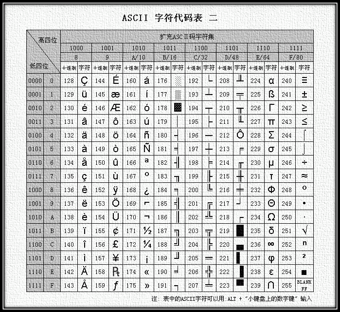

# 一、python基础语法

## 行与缩进

Python 与 C/C++、Java 这些 C 类语言不同，Python 使用缩进来表示代码块，缩进的空格数量可以由个人习惯决定，但同一个代码块的缩进空格数必须相同。

```python
if True:    
    print("true")    
    print("true")
else: 
    print("false") 
    print("false");
```

上面程序的 if 部分和 else 部分缩进不相同，但是在各自的代码块内缩进是相同的，所以是正确的程序。

## 多行语句

Python 的代码一般是一行一条语句，语句之后的分号 `;` 可加可不加。但如果要在一行中写多条语句，则需要用分号 `;` 隔开每条语句。

```bash
print("hello")
print("world");

print("hello");print("world")
```

以上三行(四条语句)都是正确的。

`def`是Python中定义函数的关键字。**在Python中，使用`def`关键字定义函数，后面跟着函数名和括号，括号中可以包含参数**。函数体通常包含一些语句，这些语句是在调用函数时执行的。

一个带有参数和返回值的函数示例。以下是一个简单的Python函数，它接受两个参数并返回它们的和：

```python
def add_numbers(x, y):
    return x + y
```

在这个例子中，`add_numbers`是函数名，`x`和`y`是参数，`return x + y`是函数体。

**在Python中，函数的返回值类型不需要显式声明**。Python是一种动态类型语言，这意味着变量的类型是在运行时确定的，而不是在编译时确定的。因此，在Python中，函数的返回值类型是根据实际返回值的类型来确定的。

在Python中，`__name__`是一个特殊的内置变量，它存储着模块的名称。当一个模块被直接运行时，`__name__`变量的值为`'__main__'`，否则为模块的名称。这个特性通常用于测试模块。

`if __name__ == '__main__':`是Python中的一个常见用法，它用于检查模块是否被直接运行，还是被导入到另一个模块中。如果模块被直接运行，则`__name__`变量将被设置为`'__main__'`，并且代码块将被执行。如果模块被导入到另一个模块中，则代码块不会被执行。这个用法通常用于测试模块。

```python
# 有错误的函数1
def wrong1():
    print("wrong1")
    	print("这里有一个错误缩进")
    
# 有错误的函数2
def wrong2():
    print("wrong2")
    if False:
        print("这个不应该输出")
    print("这个也不应该输出")

# 有错误的函数3
def wrong3():
    print("wrong3") print("hello world")


# 这里是调用三个函数的代码
# 不要修改
if __name__ == '__main__':
    wrong1()
    wrong2()
    wrong3()
```

改正后：

```python
# 有错误的函数1
def wrong1():
    print("wrong1")
    print("这里有一个错误缩进")
    
# 有错误的函数2
def wrong2():
    print("wrong2")
    if False:
        print("这个不应该输出")
    	print("这个也不应该输出")

# 有错误的函数3
def wrong3():
    print("wrong3");print("hello world")

# 这里是调用三个函数的代码
# 不要修改
if __name__ == '__main__':
    wrong1()
    wrong2()
    wrong3()
```

## 标识符与保留字

### 标识符

标识符就是程序中，使用的各种名称，例如：变量名、常量名、类名等等。 在 Python 中，对标识符格式的要求与 C/C++、Java 等差不多：

- 第一个字符必须是字母表中的字母或下划线 `_` ；
- 标识符的其他的部分，由字母、数字和下划线组成；
- 标识符对大小写敏感；
- 标识符不能与保留字相同。

比如：

```python
num1 = 1
float1 = 0.5
true = True #这个 true 虽然字面上的意思与值“True”相同，但 python 对大小写敏感，所以也是正确的str1 = "hello"
```

这些都是正确的标识符。

### 保留字

保留字即关键字，是 Python 语言中内部使用的单词，代表一定语义。例如：and、class、if、else 等。保留字不能作为标识符，用在变量名、常量名、类名等地方。 Python 的标准库提供了一个 keyword 模块，可以输出当前版本的所有关键字：

```python
import keyword
print(keyword.kwlist)
```

输出结果为：

['False', 'None', 'True', 'and', 'as', 'assert', 'async', 'await', 'break', 'class', 'continue', 'def', 'del', 'elif', 'else', 'except', 'finally', 'for', 'from', 'global', 'if', 'import', 'in', 'is', 'lambda', 'nonlocal', 'not', 'or', 'pass', 'raise', 'return', 'try', 'while', 'with', 'yield']

## 注释

Python 中单行注释以 `#` 开头：

```python
#这是一个注释 
#这是一个注释2
#print("python2")
```

多行注释可以使用多个`#`，也可以用一对`'''`(三个单引号)或者`"""`(三个双引号)包裹要注释的内容:

```python
#使用多个
##作注释
'''用三个单引号作注释
多行注释
'''
"""用三个双引号作注释
多行注释
"""
```

## 输入与输出

`print`函数可以同时输出多个内容，只需要将它一起放在`print`的括号内，并用逗号隔开：

```py
print("hello","world")
```

得到的结果：`hello world`

值得注意的是，同时输出的多个内容之间，会有**空格**隔开。

类似于 C/C++ 的`printf`，Python 的`print`也能实现格式化输出，方法是使用`%`操作符，它会将左边的字符串当做**格式字符串**，将右边的参数代入格式字符串：

```python
print("100 + 200 = %d" % 300) #左边的%d被替换成右边的300
print("A的小写是%s" % "a") #左边的%s被替换成右边的a
```

得到的结果是：

```undefined
100 + 200 = 300
A的小写是a
```

如果要带入多个参数，则需要用`()`包裹代入的多个参数，参数与参数之间用逗号隔开，**参数的顺序应该对应格式字符串中的顺序**：

```py
print("%d + %d = %d" % (100,200,300))
print("%s %s" % ("world","hello"))
```

得到的结果是：

```undefined
100 + 200 = 300
world hello
```

格式字符串中，不同**占位符**的含义：

%s： 作为字符串

%d： 作为有符号十进制整数

%u： 作为无符号十进制整数

%o： 作为无符号八进制整数

%x： 作为无符号十六进制整数，a～f采用小写形式

%X： 作为无符号十六进制整数，A～F采用大写形式

%f： 作为浮点数

%e，%E： 作为浮点数，使用科学计数法

%g，%G： 作为浮点数，使用最低有效数位

**注意: `print`函数输出数据后会换行，如果不想换行，需要指定`end=""`：**

```python
print("hello" , end="")
print("world" , end="")
```

得到的结果：`helloworld`

### 输入

使用`input`函数可以获得用户输入，在控制台窗口上，输入的**一行**的字符串，使用`变量 = input()`的形式将其赋值给一个变量：

```python
str1 = input()
print("输入的是%s" % str1)
```

如果输入`hello`然后回车，则输出：`输入的是hello`。

还可以在`input()`的括号内，加入一些提示信息：

```python
str1=input("请输入:")
print("输入的是%s" % str1)
```

运行之后，会先显示`请输入:`，输入数据`hello`之后回车，则会得到输出：`输入的是hello`，控制台上显示的全部内容为：

```makefile
请输入:hello
输入的是hello
```

### 字符串转换

`input`函数接收的是用户输入的字符串，此时还不能作为整数或者小数进行数学运算，需要使用函数将字符串转换成想要的类型。

- 转换成整数，使用`int()`函数：`num1 = int(str)`
- 转换成小数，使用`float()`函数：`f1 = float(str)`

```python
str = input()
num1 = int(str)
f1 = float(str)
print("整数%d,小数%f" % (num1,f1))
```

如果输入10，得到的输出是：`整数10,小数10.000000`。

## 运算符

### 基本运算符

Python中有许多运算符，包括算术运算符、比较运算符、赋值运算符、逻辑运算符、位运算符、成员运算符和身份运算符等。以下是一些常见的Python运算符：

- 算术运算符：`+`（加）、`-`（减）、`*`（乘）、`/`（除）、`%`（取余）、`//`（整除）和`**`（幂）。

- 比较运算符：`==`（等于）、`!=`（不等于）、`>`（大于）、`<`（小于）、`>=`（大于等于）和`<=`（小于等于）。

- 赋值运算符：`=` `+=` `-=` `*=` `/=` `%=` `//=` `**=`

- 逻辑运算符：and, or, not

  ```py
  # python里面的and和or就是java或c语言中的短路与（&&）和短路或（||）
  1 == 2 and print('hello1')  # This line is not executed
  
  1 == 1 and print('hello2')  # This line is executed
  
  1 == 2 or print('hello3')   # This line is executed
  
  1 == 1 or print('hello4')   # This line is not executed
  
  # 输出结果：
  # hello2
  # hello3
  ```

- 位运算符：& |`^`~ << >>

- 成员运算符：`in , not in`

  in, not in python中查找的常用方法为： in（存在）,如果存在那么结果为true，否则为false not in（不存在），如果不存在那么结果为true，否则false

  ```py
  待查找的列表
  nameList = ['xiaoWang','xiaoZhang','xiaoHua']
  #获取用户要查找的名字
  findName = input('请输入要查找的姓名:')
  #查找是否存在
  if findName in nameList:
  	print('在列表中找到了相同的名字')
  else:
  	print('没有找到')
  ```

- 身份运算符：`is , is not`

  is 和==的区别：

  当你使用 == 比较两个字符串时，它会比较两个字符串的值是否相等。但是，如果你使用 is 比较两个字符串时，它会比较两个字符串的标识符是否相等，也就是比较两个字符串在内存中的地址是否一样 。

  例如，当你创建两个字符串变量 a 和 b 时，它们的值都是 "hello"。但是，这两个变量在内存中的地址不同。因此，当你使用 == 比较这两个变量时，它会返回 True，因为它们的值相等。但是，当你使用 is 比较这两个变量时，它会返回 False，因为它们在内存中的地址不同 。

  例如：

  ```py
  #	is 用于判断两个变量引用对象是否为同一个，也就是比较内存中的地址是否相同 
  #	== 用于判断变量的值是否相等
  a = '20'
  b = str(20)
  
  # id()函数：返回对象的标识，每个对象都只有一个标识，用于区分不同对象
  print(a == b)   # True
  print(id(a) == id(b))   # False
  print(a is b)   # False
  ```

- ##### 三元操作符

  三元操作符的基本格式为：

  ```py
  result = x if x < y else y
  ```

  其中，`x < y`为判断语句。若`x < y`为真，则`result = x`，否则`result = y`。

### 多重赋值

你可以使用多重赋值语句同时为多个变量赋值，如下所示：

```py
a, b = 1, 2
```

a和b的值将交换：

```py
a, b = b, a
```

你还可以使用多重赋值语句将多个变量附上相同的值，如下所示：

```py
a = b = c = 1
```

这条语句用于将1装入a、b、c三个变量中。

下面这个内容看不懂没关系，可以先跳过，等把函数学了再来看。

### *和**运算符分别有哪些特殊使用

在 Python 中，`*` 和 `**` 运算符具有多种用途：

- 算术运算符：`*` 运算符用于乘法，例如 `2 * 3` 将返回 `6`。

  `**` 运算符用于指数运算，例如 `2 ** 3` 将返回 `8`。

- 序列操作符：`*` 运算符用于重复序列中的元素，例如 `'hello' * 3` 将返回 `'hellohellohello'`。

  `**` 运算符用于将字典中的键值对作为关键字参数传递给函数，例如 dict=`{'x': 1, 'y': 2}` 可以传递为

  `f(**dict)`。

- 函数形参：在函数定义中，`*args` 和 `**kwargs` 可以用于接受**任意数量**的位置参数和关键字参数。例如：

  ```py
  def f(*args, **kwargs):
      print(args)
      print(kwargs)
  
  f(1, 2, x=3, y=4)
  ```

  这将输出 `(1, 2)` 和 `{'x': 3, 'y': 4}`。

- 解包序列：在函数调用中，可以使用 `*` 运算符将序列解包为单独的参数。例如：

  ```py
  def f(x, y):
      print(x + y)
  
  lst = [1, 2]
  f(*lst)
  ```

  这将输出 `3`。

## 独一无二的变量id

首先，我们要明白一点：在程序运行时，python解释器会为每一个变量分配一块的内存作为变量值的存储空间，并且给这个存储空间取了一个独一无二的编号，称为“id”。这个id可以帮助我们判断两个变量是不是同一个变量，这样说可能比较抽象，我们来看看下面这个例子：

```py
a = 1;b = 2

print(id(a), id(b)) # 140707009131304 140707009131336
# 这是两个不同的id，说明这是两个不同的变量
```

# 二、python基本数据类型

## 整型

Python3中的整型可以表示正数、负数或0。在Python中，整型是用来存储整数的，或者说是用来描述整数的。在Python中存储整数的数据类型只有一种，那就是整数数据类型（int）。**在Python中整型的取值范围是无限的（整数具有无限的精度）**。

**Python3中的整型可以用十进制、二进制、八进制和十六进制表示**。其中，**十进制表示法是默认的表示法，二进制表示法以0b或0B开头，八进制表示法以0o或0O开头，十六进制表示法以0x或0X开头**。

不同进制整数在 Python 中的使用：

```py
# 十六进制
hex1 = 0x45
print("hex1Value: ", hex1)
hex2 = 0x4Af
print("hex2Value: ", hex2)

# 二进制
bin1 = 0b101
print('bin1Value: ', bin1)
bin2 = 0B110
print('bin2Value: ', bin2)

# 八进制
oct1 = 0o26
print('oct1Value: ', oct1)
oct2 = 0O41
print('oct2Value: ', oct2)

# 十进制
dec1 = 45
print('dec1Value: ', dec1)
dec2 = 100
print('dec2Value: ', dec2)
```

python3的print函数默认以十进制的形式输出数值类型

运行结果：

```py
hex1Value:  69
hex2Value:  1199
bin1Value:  5
bin2Value:  6
oct1Value:  22
oct2Value:  33
dec1Value:  45
dec2Value:  100
```

如果想要以其它进制来输出数值类型，需要使用hex(), bin(), oct()等函数，如下：

```py
# 二进制转十进制
print('bin2dec: ', int('0b101', 2))
# 八进制转十进制
print('oct2dec: ', int('0o26', 8))
# 十六进制转十进制
print('hex2dec: ', int('0x45', 16))

# 十进制转二进制
print('dec2bin: ', bin(45))
# 十进制转八进制
print('dec2oct: ', oct(45))
# 十进制转十六进制
print('dec2hex: ', hex(45))

# 二进制转十六进制
print('bin2hex: ', hex(int('0b101', 2)))
# 八进制转十六进制
print('oct2hex: ', hex(int('0o26', 8)))
# 十六进制转二进制
print('hex2bin: ', bin(int('0x45', 16)))
```

输出如下：

```py
bin2dec:  5
oct2dec:  22
hex2dec:  69
dec2bin:  0b101101
dec2oct:  0o55
dec2hex:  0x2d
bin2hex:  0x5
oct2hex:  0x16
hex2bin:  0b1000101
```

**数字分隔符**

为了提高数字的的可读性，Python 3.x 允许使用下划线`_`作为数字（包括整数和小数）的分隔符。通常每隔三个数字添加一个下划线，类似于英文数字中的逗号。下划线不会影响数字本身的值。

【实例】使用下划线书写数字：

```py
click = 1_301_547distance = 384_000_000
print("Python教程阅读量：", click)
print("地球和月球的距离：", distance)
```

运行结果：

```py
Python教程阅读量：1301547
地球和月球的距离：384000000
```

> 整型常量池
>
> Python内部做了一些优化，把常用的整数对象都预先缓存起来。对于int类型的数据，Python中的常量池范围是[-5, 257)。只要定义的整数变量在范围[-5, 256]内，会被全局解释器重复使用。它是一种内部优化机制，旨在提高程序运行效率，节省内存。但是，由于常量池的范围有限，因此它只能对一定范围内的整数起到优化作用。

## 浮点型

Python只有一种小数类型，就是float。

float类型是一种浮点数，它可以表示小数点前后的数字，而且可以表示科学计数法。**如果你想将一个字符串转换为浮点数，可以使用float()函数**。如果你想将一个浮点数转换为分数，可以使用as_integer_ratio()方法。如果你想将一个浮点数转换为十六进制字符串，可以使用hex()方法。

### 字符串转浮点数

当你想将一个字符串转换为浮点数时，可以使用float()函数。例如，如果你想将字符串“3.14”转换为浮点数，可以使用以下代码：

```py
x = float("3.14")
```

### 浮点数转分数

**as_integer_ratio()方法是Python float类型的一个方法，它可以将一个浮点数转换为分数的形式，返回一个元组，元组中包含两个整数，分别是分子和分母**。这个方法可以用于精确地表示浮点数，避免浮点数运算时出现精度误差。

例如，如果你想将浮点数3.14159转换为分数，可以使用以下代码：

```py
x = 0.125
print(x.as_integer_ratio())  # 将浮点数转换为分数
```

输出的结果为：

```py
(1, 8)
```

如果你想将一个浮点数转换为十六进制字符串，可以使用hex()方法。例如，如果你想将浮点数3.14转换为十六进制字符串，可以使用以下代码：

```py
x = 3.14
print(x.hex())
```

输出如下：

```py
0x1.0000000000000p-3
```

0x1.0000000000000p-3是一个十六进制浮点数，它等于十进制的0.125。其中，p表示指数，它的值为-3，意味着这个数是2的-3次方。因此，这个数可以写成`2^-3=(1/2)^3=1/8=0.125`的形式。

### 浮点数取整

在Python中，可以使用`int()`函数将浮点数转化为整数。**如果浮点数是正数，则向下取整；如果浮点数是负数，则向上取整**。例如，`int(3.14)`的结果是`3`，而`int(-3.14)`的结果是`-3`。

### 浮点数的四舍五入

浮点数的四舍五入一般是指将一个浮点数保留到指定的小数位数，其中小数点后第一位小于5时，直接舍去；小于等于5时，直接进位，但是，这种舍入方案误差会比较大，于是就有人提出了新方案，叫银行家算法。

**这种舍入法是一种四舍六入五考虑的舍入方法，也称为“四舍六入五凑偶”**。

如果保留位数后面的数字小于5，则直接舍去；如果保留位数后面的数字大于5，则进位；

如果保留位数后面的数字等于5，则分两种情况，如果5后面还有其他非零数字，则进位，否则，如果5前面的数字是奇数，则进位，否则舍去。这种方法可以减少累积误差，因此在金融领域中被广泛使用。

现在大部分编程软件的默认设置都是银行家舍入法，比如C/C++、JavaScript、PHP、Go，英特尔处理器用的也是银行家舍入。Python的round函数也采用了银行家舍入法。

round()函数是Python内置的一个函数，用于对浮点数进行四舍五入。round()函数有两个参数，第一个参数是要进行四舍五入的数字，第二个参数是保留的小数位数。

例如，round(3.14159, 2)会将3.14159保留到小数点后两位，即3.14。如果第二个参数省略，则默认保留到整数。

需要注意的是，round()函数在处理浮点数时可能会出现精度问题，因此在需要高精度计算时应该使用decimal模块。

`decimal`模块是Python的一个内置模块，它提供了一种精确的十进制算术运算方式。在Python中，浮点数的运算可能会出现精度问题，而`decimal`模块可以解决这个问题。它支持任意精度的十进制数，可以控制数字的位数和四舍五入方式。使用`decimal`模块可以避免浮点数运算时出现的精度问题，特别是在涉及到金融计算等需要高精度计算的场合下，使用`decimal`模块可以保证计算结果的准确性。

你可以通过以下代码导入`decimal`模块：

```python
import decimal
```

接下来，你就可以使用`decimal`模块提供的函数和类来进行高精度计算了。例如，你可以使用`Decimal()`函数来创建一个十进制数：

```python
from decimal import Decimal

x = Decimal('0.1')
y = Decimal('0.2')
z = x + y

print(z)  # 输出 0.3
```

在上面的代码中，我们使用了`Decimal()`函数来创建了两个十进制数，并对它们进行了加法运算。由于使用了`decimal`模块，所以我们得到了正确的结果。

除了支持基本的算术运算外，`decimal`模块还提供了很多其他有用的功能，例如对数字进行舍入、取整、比较等操作。

如果你想深入了解`decimal`模块的更多功能和用法，可以查看Python官方文档中关于该模块的介绍：https://docs.python.org/3/library/decimal.html。

## 布尔型

布尔型是Python中的一种基本数据类型，它只有两个值：True和False。

True和False都是Python中的对象。在Python中，一切都是对象，包括数字、字符串、函数等等。True和False都是bool类的对象，它们都有自己的类型和方法。

在Python中，True和False都是int类型的子类，其中True的值为1，False的值为0。因此，可以将True和False视为整数1和0。例如，可以将True和False用于算术运算，如加法、减法、乘法和除法等。但是，在使用时需要注意，因为True和False是布尔类型，它们的值只能是True或False。如果将True或False与其他类型的值进行运算，则会引发TypeError异常。

例如，True + 1的结果是2，False + 1的结果是1。

在Python中，以下值被视为False：

- False
- None
- 0
- 0.0
- 空字符串（''）
- 空列表（[]）
- 空元组（()）
- 空字典（{}）
- 空集合（set()）

其他所有值都被视为True。

## 字符串

Python 语言中，字符串是用两个双引号""或者单引号''括起来的零个或多个字符。Python中的字符串是不可变类型，采用了定长的方式存储字符串，在内存中编码为unicode码位序列。

`input（）`函数将用户输入的内容当做一个字符串类型，这是获得用户输入的常用方式，可以将提示用户输入的内容当作参数，这段内容将被输出。`print（）`函数可以直接打印字符串，这是输出字符串的常用方式

字符串是字符的序列，可以按照单个字符或字符片段进行索引，字符串包括两种序号体系：正向递增序号和反向递减序号。


如上图中字符串`Hello world`长度为`11`（注意，空格也是一个字符)，正向递增以最左侧字符`H`序号为`0`，向右侧依次递增，最右侧字符`d`序号为`11-1=10`；反向递减序号以最右侧字符`d`序号为`-1`，向左依次递减，最左侧字符`H`序号为`-11`。这两种索引字符的方法可以同时使用。

> 注意：python3的所有序列类型（包括后面要讲的列表，元组等）都支持正负索引

Python 字符串也提供区间访问方式，采用`[N:M]`格式，表示字符串中从`N`到`M`（不包含`M`）的子字符串，其中，`N`和`M`为字符串的索引序号，可以混合使用正向递增序号和反向递减序号。如果表示中`N`或者`M`索引缺失，则表示字符串把开始或结束索引值设为默认值。

**注意：字符串中的英文字符和中文字符都算作1个字符。**

```python
name = input("输入姓名：")
print("{}同学，学好Python，前途无量！".format(name))  # 请将命令行补充完整
print("{}大侠，学好Python，大展拳脚！".format(name[0]))  # 请将命令行补充完整
print("{}哥哥，学好Python，人见人爱！".format(name[1:]))  # 请将命令行补充完整
输入姓名：刘华强
刘华强同学，学好Python，前途无量！
刘大侠，学好Python，大展拳脚！
华强哥哥，学好Python，人见人爱！
```

在Python3中，转义字符是以反斜杠（\）开头的字符，用于表示一些特殊字符。例如，要在字符串中插入一个单引号，可以使用'。以下是一些常见的转义字符：

- \\ 表示反斜杠
- \' 表示单引号
- \" 表示双引号
- \n 表示换行符
- \t 表示制表符
- \u 表示unicode字符，比如'\u4e2d\u6587'就是一段unicode字符串

```py
s = '\u4e2d\u6587'

print(s) # 输出“中文”
```

**字符串前缀**

**在Python中，字符串前缀是一种特殊的标记，用于指示字符串的类型。**以下是Python中常用的字符串前缀及其含义：

- r/R：表示raw string（原始字符串），即不会对反斜杠进行转义。

  ```py
  str1 = r'\n中文'
  print(str1)
  ```

  输出：\n中文

- u/U：表示unicode string（Unicode编码字符串）。python默认字符串就是unicode编码

  ```py
  str1 = u'中文' # 等价于 str1 = '中文'
  print(str1)
  ```

  输出：中文

- b/B：表示byte string（字节串），即将字符串转换为bytes类型。

  ```py
  str1 = b'中文'
  print(str1)
  ```

  输出如下：

  ```py
  File "E:\PyProject\test.py", line 8
      str1 = b'你好'
                      ^
  SyntaxError: bytes can only contain ASCII literal characters
  ```

  显示语法错误：bytes类型（字节序列）的串只能包含ASCII码字面量字符

  在Python 3版本中，所有的字符串都是使用Unicode编码的码位序列。 Python 3最重要的新特性之一是对字符串和二进制数据流做了明确的区分。 文本总是 Unicode，由 str 类型表示，二进制数据则由 bytes 类型表示。因此，Python3中的字符串不需要编码，因为它们默认使用Unicode字符集。如果需要将字符串转换为字节序列，则可以使用`encode()`方法。例如，要将字符串转换为UTF-8编码的字节序列，请使用以下代码：`mystring.encode('utf-8')`。

  这里看不懂的话，请直接看后面爬虫那一章的“编码与解码”一节，看完以后，你会对字符集编码尤其是python3编码有一个深入的理解

- f/F：表示format string（格式化字符串），即可以使用花括号{}来代替%进行格式化。

  在字符串的拼接一节会介绍

### 字符串的拼接

在Python中，有多种方法可以拼接字符串。以下是一些常见的方法：

1. 使用加号 (+) 号进行拼接，这种拼接方式只能用于字符串变量之间的拼接，不能用于字符串与其它数据类型之间的拼接，有局限性

```python
str1 = 'hello'
str2 = 'world'
result = str1 + str2
print(result)
# helloworld
```

其实，还有一种写法，如下：

```py
a = '20''23'
b = '2023'
print(a is b)
# True
```

在Python中，当两个字符串字面量被放在一起时，它们会自动连接。因此，`a = '20''23'`等同于`a = '2023'`。这种写法可以让你在不使用加号连接符的情况下将多个字符串字面量连接在一起。

1. 使用%进行拼接

```python
str1 = 'hello'
str2 = 'world'
result = '%s %s' % (str1, str2)
# 如果格式化字符串中有两个及以上的占位符，则必须用元组作为占位符的填充
print(result)
```

输出结果：`hello world`

1. 使用f+单引号 (' ')或者双引号 (" ")的方式

```python
str1 = 'hello'
str2 = 'world'
result = f'{str1} {str2}'
print(result)
```

输出结果：`hello world`

1. 使用join()函数进行拼接

```python
list1 = ['hello', 'world']
result = ' '.join(list1)
print(result)
```

输出结果：`hello world`

join()函数是Python中的一个字符串方法，用于将序列中的元素以指定的字符连接生成一个新的字符串。语法：str.join(sequence)，其中sequence是要连接的元素序列，返回值是通过指定字符连接序列中元素后生成的新字符串。例如，'.'.join(['a', 'b', 'c'])会返回'a.b.c'。

### 字符串的基本函数

 在字符串处理中，经常需要统计字符串的长度、进行大小写转换以及去除字符串前后空格等操作。例如，在基于关键词的搜索引擎中，要查询关键词是否在文档或者网页中出现，搜索引擎并不需要区分关键词中字符的大小写以及关键词前后的空格等。这时就需要对字符串进行处理，将其中的大写字符都转换为小写，并剔除字符串开头和结尾处的空格，然后再统一进行字符串匹配。

#### len()函数

Python 提供了`len()`函数来计算，并返回字符串的长度，即字符串中单个元素的个数。

#### upper()，lower()和title()函数

Python 提供了`upper()`和`lower()`方法，来对字符串进行大小写转换。其中，`upper()`会将字符串中的所有字符都转换为大写，`lower()`则将所有字符转换为小写。除此之外，Python 还贴心的提供了`title()`方法，将字符串所有单词的首字母变成大写，而其他字母依然小写。

#### casefold()函数

casefold()函数是Python3.3版本之后引入的，其效果和lower()方法非常相似，都可以转换字符串中所有大写字符为小写。但是，casefold()方法更强大，更具攻击性，这意味着它将更多字符转换为小写字母，并且在比较两个用casefold()方法转换的字符串时会找到更多匹配项。

当我们使用casefold()函数时，所有有大小写对应关系的字符都会被转换为小写。下面是一个例子：

```python
a = 'love, 大头怪》JBB——dqwkn'
print(a.casefold())
```

输出结果为：

```mipsasm
love, 大头怪》jbb——dqwkn
```

`casefold()` 和 `lower()` 都是将字符串中的元素变成小写，但是最重要的区别就是 `lower()` 函数只支持ascill表中的字符，而 `casefold()` 则支持很多不同种类的语言。例如，对于德语字符 "ß"，`lower()` 函数不会将其转换为 "ss"，而是保留原样；而 `casefold()` 函数则会将其转换为 "ss"。

#### strip()函数

在Python中，`strip()`函数的参数是可选的。如果指定了参数，则该参数指定要从字符串中删除的字符序列。如果未指定参数，则默认删除空格和换行符。例如，`'hello world'.strip('helo')`将返回`' world'`，因为它删除了字符串中的’h’、‘e’、‘l’和’o’。

**`strip()`函数只删除字符串的前导和后缀字符，而不删除中间部分的字符**

**注意：在指定参数时，如果参数是多个字符，则该方法会将多个字符逐个去比对，进行删除（区分大小写），直到首尾两侧没有匹配的字符为止。但是，该方法对字符串中间的字符没有影响。**

上面这句话的具体解释如下：

如果参数是’helod’，则输出结果将是与未指定参数相同的结果，即删除字符串的前导和后缀空格。例如，如果我们有一个字符串`string = ' hello world '`，那么`string.strip('helod')`将返回`'hello world'`。

strip函数的工作原理：

`strip()`函数会从字符串的首尾分别逐个遍历每一个字符，并让每一个字符与`strip()`中的参数进行对比，如果相同，则将该字符从字符串中删除，然后继续遍历，直到出现一个字符与参数中的所有字符都不匹配，则停止。

#### ljust()，rjust()和center()函数

ljust()函数是一个字符串方法，用于将字符串左对齐，并用指定的字符（默认为空格）填充至指定的长度。如果指定的长度小于或等于字符串的长度，那么返回原字符串。例如，如果s = 'hello'，那么s.ljust(10, '*')会返回`'hello*****'`，s.ljust(4)会返回'hello'。

ljust()函数和rjust()函数的区别是，ljust()函数是将字符串左对齐，而rjust()函数是将字符串右对齐。两个函数都可以接受一个填充字符和一个指定长度作为参数，如果指定长度小于或等于字符串长度，那么返回原字符串。例如，如果s = 'hello'，那么s.ljust(10, '*')会返回'hello*****'，s.rjust(10, '*')会返回`'*****hello'`。

要将字符串居中对齐，可以使用center()函数。center()函数接受一个指定长度和一个填充字符作为参数，然后返回一个新的字符串，使原字符串在指定长度的范围内居中，两边用填充字符补齐。如果指定长度小于或等于字符串长度，那么返回原字符串。例如，如果s = 'hello'，那么s.center(10, '*')会返回`'**hello***'`，s.center(4)会返回'hello'。

### 字符串查找与替换

给定一个字符串，要利用 Python 提供的字符串处理方法，从该字符串中，查找特定的词汇，并将其替换为另外一个更合适的词。例如，给定一个字符串`Where there are a will, there are a way`，我们发现这句话中存在语法错误，其中`are`应该为`is`，需要通过字符串替换将其转换为`Where there is a will, there is a way`。

在大家日常工作使用 Word 编写文档的过程中，经常会遇到一个问题，发现前面写的文档中某个词用错了，需要换为另外一个词来表达。Word 提供了全文查找与替换的功能，可以帮助用户很方便的处理这一问题。那么，这一功能最基础和核心的就是字符替换，如果我们要自己基于 Python 来实现，该怎么做呢？

#### find()函数

Python 提供了内置的字符串查找方法`find()`，利用该方法可以在一个较长的字符串中查找子字符串。如果该字符串中，有一个或者多个子字符串，则该方法返回第一个子串所在位置的最左端索引，若没有找到符合条件的子串，则返回`-1`。

find()函数的语法如下：

```python
str.find(str, beg=0, end=len(string))
```

参数说明：

- str：指定检索的字符串。
- beg：开始索引，默认为0。
- end：结束索引，默认为字符串的长度。

以下是一个使用find()函数的例子：

```python
str1 = 'hello world'
result = str1.find('world')
print(result)
```

输出结果：`6`

#### replace()函数

在Python中，replace()函数用于将字符串中的旧字符串替换为新字符串。replace()函数的语法如下：

```python
str.replace(old, new, max)
```

参数说明：

- old：将被替换的子字符串。
- new：新字符串，用于替换old子字符串。
- max：可选字符串，替换不超过max次。

假设我们有一个字符串：

```python
str1 = 'hello world'
```

我们想要将字符串中的所有'l'替换为'p'，我们可以使用以下代码：

```python
result = str1.replace('l', 'p')
print(result)
```

输出结果：`heppo worpd`

现在，我们想要将字符串中的前两个'l'替换为'p'，我们可以使用以下代码：

```python
result = str1.replace('l', 'p', 2)
print(result)
```

输出结果：`heppo world`

在上面的例子中，我们将字符串中的前两个'l'替换为'p'，说明是从左往右遍历来替换的

#### split()函数

Python 提供了`split()`方法实现字符串分割。该方法根据提供的分隔符，将一个字符串分割为字符列表，如果不提供分隔符，则程序会默认把空格（制表、换行等）作为分隔符。

在Python中，split()函数用于将字符串分割成一个列表。split()函数的语法如下：

```python
str.split(str="", num=string.count(str))
```

参数说明：

- str：分隔符，默认为所有的空字符，包括空格、换行(\n)、制表符(\t)等。
- num：分割次数。num参数是用来指定分割次数的。如果指定了num参数，则分割num+1个子字符串。如果没有指定num参数，则分割所有子字符串。

以下是一个使用split()函数的例子：

```python
str1 = 'hello world'
result = str1.split()
print(result)
```

输出结果：`['hello', 'world']`

在上面的例子中，我们将字符串分割成了一个列表。

#### str.maketrans()函数和str.translate()函数

`str.maketrans()` 是Python3中的一个字符串方法，用于创建字符映射的转换表，可供 `str.translate()` 使用。

`str.maketrans()` 函数有三个参数，分别是：

- `x`：必需，如果只有一个参数，则必须是描述如何执行替换的字典。如果指定了两个或多个参数，则此参数必须是指定要替换的字符的字符串。
- `y`：可选，表示转换的目标。
- `z`：可选，包含字符，表示要删除的字符。

`str.translate()` 方法是 Python 中的一个字符串方法，用于将字符串中的某些字符替换为其他字符或删除这些字符。**该方法需要一个转换表作为参数，该表指定了要替换的字符和它们对应的新字符**。转换表可以使用 `str.maketrans()` 方法创建。如果在转换表中没有指定某个字符，则该字符不会被替换或删除。

`str.maketrans()` 方法用于创建字符映射的转换表，当 `str.maketrans()` 函数只有两个参数时，这两个参数的长度必须相同。这是因为第一个参数表示需要转换的字符，第二个参数表示转换的目标，两个字符串的长度必须相同，才能建立一一对应的关系。

`str.maketrans()` 函数的底层原理是将两个字符串中的每个字符按照其 Unicode 码点进行映射，然后将这些映射关系存储在一个字典中。这个字典可以用于后续的字符串转换操作。

`str.translate()` 方法则是根据参数 table 给出的表（包含 256 个字符）转换字符串的字符，该方法返回翻译后的字符串。

当需要将字符串中的某些字符替换为其他字符时，可以使用 `str.maketrans()` 方法。下面是一个例子，将字符串中的所有小写字母替换为大写字母：

```python
# 定义一个转换表
table = str.maketrans('abcdefghijklmnopqrstuvwxyz', 'ABCDEFGHIJKLMNOPQRSTUVWXYZ')

# 定义一个字符串
string = 'Hello World!'

# 使用 translate() 方法进行转换
print(string.translate(table))
```

输出：

```undefined
HELLO WORLD!
```

上面的代码中，我们首先定义了一个转换表，然后使用 `translate()` 方法将字符串中的所有小写字母替换为大写字母。

当需要从字符串中删除某些字符时，可以使用 `str.maketrans()` 方法。下面是一个例子，将字符串中的所有元音字母删除：

```python
# 定义一个转换表
table = str.maketrans('', '', 'aeiouAEIOU')

# 定义一个字符串
string = 'Hello World!'

# 使用 translate() 方法进行转换
print(string.translate(table))
```

输出：

```undefined
Hll Wrld!
```

在上面的例子中，这三个参数分别是：

- `x`：空字符串，表示不需要替换任何字符。
- `y`：空字符串，表示不需要转换任何字符。
- `z`：包含元音字母的字符串，表示要删除的字符。

在上面的代码中，我们定义了一个转换表，将元音字母映射到空字符。然后，我们使用 `translate()` 方法将字符串中的所有元音字母删除。

如果想删除字符串中的空格和标点字符，可以使用以下代码：

```python
import string

# 定义一个转换表
table = str.maketrans('', '', string.punctuation + ' ')

# 定义一个字符串
string = 'Hello, World!'

# 使用 translate() 方法进行转换
print(string.translate(table))
```

输出：

```undefined
HelloWorld
```

在上面的代码中，我们首先导入了 `string` 模块，然后定义了一个转换表，将所有标点字符和空格映射到空字符。然后，我们使用 `translate()` 方法将字符串中的所有标点字符和空格删除。

### 字符串的比较

你可以使用Python内置函数`==`来比较两个字符串的值是否相等。例如，如果你有两个字符串`s1`和`s2`，你可以使用以下代码来比较它们是否相等：

```py
if s1 == s2:
    print("s1和s2相等")
else:
    print("s1和s2不相等")
```

如果你想进行不区分大小写的比较，可以使用Python内置函数`casefold()`。例如，如果你有两个字符串`s1`和`s2`，你可以使用以下代码来比较它们是否相等：

```py
if s1.casefold() == s2.casefold():
    print("s1和s2相等（不区分大小写）")
else:
    print("s1和s2不相等（不区分大小写）")
```

Python中的字符串比较是通过比较字符串的Unicode编码值来实现的。当两个字符串进行比较时，Python会逐个比较它们的Unicode编码值，直到找到第一个不同的字符为止。如果所有字符都相同，则认为两个字符串相等。例如，字符串"abc"和"abd"进行比较时，Python会先比较它们的第一个字符"a"，发现相同，然后继续比较第二个字符"b"，发现相同，最后比较第三个字符"c"和"d"，发现不同，因此判断这两个字符串不相等。

### 字符串驻留

**字符串驻留是一种在内存中仅保存一份相同且不可变字符串的技术。**Python的驻留机制对相同的字符串只保留一份拷贝，后续创建相同字符串时，不会开辟新空间，而是把该字符串的地址赋给新创建的变量。**在Python中，字符串长度为0或1时，默认采用驻留机制**；字符串长度大于1时，符合以下条件的，也采取驻留机制：

- 字符串中只包含大小写字母、数字、下划线_
- 字符串只在编译时进行驻留，而非运行时
- [-5,256]之间的整数数字

注意：**pycharm**等平台对字符串做了优化，本来不符合条件的字符串也会被驻留，因此，我们用dos系统来运行程序

例如：

```py
#	以下是在dos命令行执行的结果，is可判断两个变量是否引用同一个对象
#	1.当字符串长度为0或1时
a = ''
b = ''
print(a is b)
#	True

a = "1"
b = "1"
print(a is b)
#	True

a = '@'
b = '@'
print(a is b)
#	True

#	字符串长度大于1时
a = '1_3aA'
b = '1_3aA'
print(a is b)
#	True

a = '1@'
b = '1@'
print(a is b)
#	False

a = -6
b = -6
print(a is b)
#	False

a = "10"
b = "10"
print(a is b)
#	True

#	下面这个例子演示字符串只在编译时进行驻留，而非运行时
#	如果不太理解这个例子，请先看完第六节：字符串的编译时拼接
a = '20' + '23'
b = str(2023)	#	b是程序运行时得到了一个新的字符串对象
c = '2023'
print(a is b);print(a is c)
#	False
#	True
```

字符串驻留机制的优点是能够提高一些字符串处理任务在时间和空间上的性能。当需要相同值的字符串时，直接从驻留池拿出来直接用，避免频繁创建销毁，提升效率，节约内存。非驻留比较效率为o(n)，驻留时比较效率为o(1)。

### 字符串的编译时拼接

**当两个或多个字符串字面量被放在一起时，它们会在编译时被自动拼接**。例如：

```py
a = '20''23' 
b = '2023'
print(a is b)
# True

a = f'20''23' 
b = '2023'
print(a is b)
# True

a = '20' + '23' 
b = '2023'
print(a is b)
# True

# 注意：只有字符串字面量之间的拼接才可以在编译时被自动拼接，如果有变量参与，则拼接无效
a = '20'
b = '23'
c = a + b
d = '2023'
print(c is d)
# False
```

## 列表

### 列表的创建

```py
alist = [1, 2, 3] # 这样就完成了列表的创建
```

列表推导式是一种快速创建列表的方法，它的语法为 `[expression for item in iterable if condition]`，其中 expression 是一个表达式，item 是可迭代对象中的元素，condition 是一个可选的条件表达式。下面是一些例子：

```python
# 创建一个列表，包含 1 到 5 的平方
squares = [x**2 for x in range(1, 6)]
print(squares)  # [1, 4, 9, 16, 25]

# 创建一个列表，包含字符串的长度大于等于 3 的元素
words = ['apple', 'banana', 'cherry', 'date', 'elderberry']
long_words = [word for word in words if len(word) >= 3]
print(long_words)  # ['apple', 'banana', 'cherry', 'date', 'elderberry']
```

列表推导式有很多应用，例如：

- 根据一个或多个现有的列表创建一个新的列表，例如：

 fruits = ['apple', 'banana', 'cherry', 'orange']
​ new_list = [fruit.upper() for fruit in fruits]

 这样，new_list就会变成['APPLE', 'BANANA', 'CHERRY', 'ORANGE']。

- 根据一个字符串创建一个新的列表，例如：

 word = 'human'
​ h_letters = [letter for letter in word]

 这样，h_letters就会变成['h', 'u', 'm', 'a', 'n']。

- 根据一个数列创建一个新的列表，例如：

 num_list = [4, 11, 2, 19, 7, 6, 25, 12]
​ even_list = [num for num in num_list if num % 2 == 0]

 这样，even_list就会变成[4, 2, 6, 12]。

------

除了列表推导式，Python还支持以下三种推导式：

- 字典推导式，用于根据一个或多个现有的字典创建一个新的字典。语法是：

 new_dict = {key: value for (key, value) in iterable if condition}

- 集合推导式，用于根据一个或多个现有的集合创建一个新的集合。语法是：

 new_set = {expression for item in iterable if condition}

- 生成器推导式，用于创建一个生成器对象，可以用于惰性计算。语法是：

 new_generator = (expression for item in iterable if condition)

### 列表元素的增删改查

#### 增加元素

下面以一则请客的故事来说明列表元素操作的应用场景： 有个人邀请几个朋友吃饭，初步拟定了一个客人名单列表`guests=['Zhang san','Li si','Wang wu','Zhao liu']`。后面因为一些临时情况，这个客人名单不断变化：

- `Zhao liu`说要带他的朋友`Hu qi`一起来；
- `Zhang san`因临时有事不能来了；
- `Wang wu`说由他的弟弟`Wang shi`代他赴宴。

最终的客人名单列表如下：

```python
['Li si','Wang shi','Zhao liu','Hu qi']
```

Python 为列表类型提供了一系列内置操作，包括`append()`、`insert()`、`pop()`、`remove()`等函数，能够很方便的处理上述列表元素变化的情况。

##### append()函数

在Python中，`append()`函数常指内置类`list`（列表）的`append()`函数，它将一个元素添加到列表的尾部。例如，如果你有一个列表`aList`，你可以使用以下代码将元素添加到列表的末尾：

```py
aList = [123, 'xyz', 'zara', 'abc']
aList.append(2009)
```

这将在列表的末尾添加一个整数2009。`append()`函数返回`None`，因此不能将其赋值给变量。

##### insert()函数

在Python中，`insert()`函数用于将指定对象插入列表的指定位置。例如，如果你有一个列表`aList`，你可以使用以下代码将元素插入到列表的指定位置：

其基本语法为：

```py
source_list.insert(index,obj)
```

其中：

- `source_list`：待修改的列表；
- `index`：待插入的位置索引；
- `obj`：待插入的元素。

> 注意：在 Python 中，列表起始元素的位置索引为0。

```py
aList = [123, 'xyz', 'zara', 'abc']
aList.insert(3, 2009)
```

这将在列表的第4个位置（索引为3）插入一个整数2009。`insert()`函数返回`None`，因此不能将其赋值给变量 。

##### extend()函数

通过extend()函数可以将另一个列表中的元素逐一添加到列表中，例如：

```py
a = ['a','b','c']
b = ['d','e','f']
a.extend(b)
print(a) # ['a', 'b', 'c', 'd', 'e', 'f'] 将 b 添加到 a 里
print(b) # ['d','e','f'] b的内容不变
```

------

#### 修改元素

Python 中修改列表元素的方法为：直接将列表中要修改的元素索引指出，然后为其指定新值。其基本语法如下：

```py
source_list[index] = obj
```

其中：

- `source_list`：待修改的列表；
- `index`：待修改元素的位置索引；
- `obj`：待元素的新值。

#### 删除元素

##### pop()函数

Python 还提供了`pop()`方法来删除元素，该方法将从源列表删除对应元素，同时返回被删除的元素。其基本语法如下：

```py
deleted_obj = source_list.pop(index)
```

其中：

- `deleted_obj`：保存被删除元素的变量，可根据需要自由命名；
- `source_list`：待修改的列表；
- `index`：待删除元素的位置索引。

**注意:`index`参数为可选项，不填则默认删除列表末尾的元素。**

##### del关键字

在 Python 中，使用`del`关键字能够删除指定索引位置的元素，其基本语法如下：

```py
del source_list[index]
```

其中：

- `source_list`：待修改的列表；
- `index`：待删除元素的位置索引。

当你使用`del`时，你可以删除变量、列表或列表片段等。例如，如果你有一个列表`aList`，你可以使用以下代码删除列表的第4个元素：

```py
aList = [123, 'xyz', 'zara', 'abc']
del aList[3]
```

这将从列表中删除字符串'abc'。`del`函数返回`None`，因此不能将其赋值给变量。

如果你想删除整个列表，你可以使用以下代码：

```py
aList = [123, 'xyz', 'zara', 'abc']
del aList[:]
```

这将从列表中删除所有元素。

del还可以直接删除变量：

```py
info = {'name':'monitor', 'id':100}
print('删除前,%s'%info)
del info # del 也可以直接删除变量
print('删除后,%s'%info)
 # 结果
删除前,{'name': 'monitor', 'id': 100}
Traceback (most recent call last):
File "<stdin>", line 1, in <module>
NameError: name 'info' is not defined
```

del对其他类型的对象也是有效的，只要对象是可变的（mutable）。可变的对象是指可以修改其内容或属性的对象，比如列表、字典、集合等。不可变的对象是指不能修改其内容或属性的对象，比如数字、字符串、元组等。比如，`s = 'hello'`，执行`del s[0]`会报错，因为字符串是不可变的；执行`del s`会删除s这个对象，释放内存空间。

##### remove()函数

有些时候我们并不知道要删除元素的位置索引，怎么办呢？别着急，Python 还提供了`remove()`方法，可以直接通过元素值来删除对应的元素。其基本语法如下：

```py
source_list.remove(obj)
```

其中：

- `source_list`：待修改的列表；
- `obj`：待删除元素的值。

> 注意：如果列表中有多个值为`obj`的元素，`remove`仅删除位置索引最靠前的那个元素。

当你使用`remove()`函数时，你可以从列表中删除指定的值的第一个匹配项。例如，如果你有一个列表`aList`，你可以使用以下代码删除列表中的字符串'xyz'：

```py
aList = [123, 'xyz', 'zara', 'abc', 'xyz']
aList.remove('xyz')
```

这将从列表中删除第一个字符串'xyz'。`remove()`函数没有返回值，但会修改原始列表。如果列表中没有要删除的元素，则会引发`ValueError`异常。

##### clear()函数

clear()是Python的一个列表方法，用来删除列表中的所有元素。clear()方法会修改原来的列表，不会创建新的列表。clear()方法不需要任何参数，也不会抛出异常，即使列表本身是空的。比如，`a = [1, 2, 3]`，执行`a.clear()`后，a变成了`[]`。

##### clear()函数和del的区别

clear()和del在Python中都可以用来删除列表中的元素，但是有一些区别：

- clear()是一个列表方法，只能用于列表对象，而del是一个关键字，可以用于任何对象。
- clear()只能删除列表中的所有元素，而del可以删除列表中的某个元素或者某个切片。
- clear()会修改原来的列表，不会创建新的列表，也不会返回任何值，而del会删除整个列表对象，释放内存空间。
- 比如，`a = [1, 2, 3]`，执行`a.clear()`后，a变成了`[]`，但是a这个对象还存在；执行`del a[0]`后，a变成了`[2, 3]`，但是a这个对象还存在；执行`del a`后，a这个对象被删除了，再访问a会报错。

------

### 列表元素的排序

#### sort()函数

Python 针对列表数据结构内置提供了`sort()`方法，实现对列表元素的排序功能。其基本语法如下：

```lua
source_list.sort(reverse=True)
```

其中：

- `source_list`：待排序的列表；
- `sort`：列表排序函数的语法关键词；
- `reverse`：`sort`函数的可选参数。如果设置其值为`True`，则进行反向从大到小排序，如果设置为`False`或者不填写该参数，则默认进行正向从小到大排序。

例如，给定一个客人列表`guests`，我们对其按照字母排序如下：

```py
guests = ['zhang san','li si','wang wu','sun qi','qian ba']
guests.sort()
print(guests)
guests.sort(reverse=True)
print(guests)
```

程序输出结果：

```py
['li si','qian ba','sun qi','wang wu','zhang san']
['zhang san','wang wu','sun qi','qian ba','li si']
```

**注意：`sort`函数会直接作用于待排序的列表并修改其排序。**

当你使用`key`参数时，你可以使用任何函数来指定排序规则。例如，如果你有一个列表`aList`，其中包含字符串，你可以使用以下代码按字符串长度对其进行排序：

```py
def getLength(item):
    return len(item)

aList.sort(key=getLength)
```

这将按字符串长度对列表进行排序。如果你想按照某个字符在字符串中出现的次数进行排序，你可以使用以下代码：

```py
def getCount(item):
    return item.count('a')

aList.sort(key=getCount)
```

这将按照字符串中'a'字符出现的次数对列表进行排序。

### 数值列表

#### range()函数

`range()`函数是Python中的一个内置函数，**用于创建一个`range`类型的可迭代对象，不是列表类型。如果需要将其转换为列表，可以使用`list()`函数将其转换为列表类型。**`range`类型的可迭代对象常用于循环结构中

```scss
range(lower_limit,upper_limit,step)
```

其中：

- `lower_limit`: 生成系列整数的下限整数，不填该参数则默认为从`0`开始，生成的整数从此数开始，包括该数；
- `upper_limit`：生成系列整数的上限整数，必填参数，生成的整数要小于该上限；
- `step`：在下限和上限之间生成系列整数之间的间隔步长，不填该参数则默认步长为`1`。

> **注意：`range()`函数的三个参数都只能为整数。如果`range()`函数中仅一个参数，则该参数表示`upper_limit`，如果仅两个参数，则分别表示`lower_limit`和`upper_limit`。**

例如，要生成`1~6`之间步长为`2`的系列整数：

```py
for i in range(1,6,2):
	print(i)
```

输出结果：

```undefined
1
3
5
```

#### 数值列表的统计函数

Python 中有一些专门处理数字列表简单的统计运算的函数，利用这些函数可以轻松找到数字列表的最小值、最大值及总和等一系列统计运算。其基本语法如下：

```py
min_value = min(data_list)
max_value = max(data_list)
sum_value = sum(data_list)
```

其中：

- `min`：数字列表求最小值的语法关键字；
- `max`：数字列表求最大值的语法关键字；
- `sum`：数字列表求和的语法关键字。

具体使用示例如下：

```py
numbers = [2,4,11,1,21,32,5,8]
print('The min number is',min(numbers))
print('The max number is',max(numbers))
print('The sum is',sum(numbers))
```

输出结果：

```python
The min number is 1
The max number is 32
The sum is 84
```

### 切片

我们学习了如何处理单个列表元素和所有列表元素，在这一节中我们还将学习如何处理部分列表元素（Python 中称为切片）。例如，当我们去餐馆吃饭点菜时，你的菜单和我的菜单有些时候是一模一样，也有些时候是部分菜名一样。那么如何根据我已经点好的菜单生成你的菜单呢？

**可以使用下标来访问的类型包括list、tuple、str等。这些类型都是序列类型，支持切片操作和下标访问**。需要注意的是，dict类型不支持下标访问，但可以通过key来访问对应的value。

还记得字符串那一节我们说的字符串有正负两中索引序列吗？其实列表，元组等可支持索引访问的序列都有正负方向的索引。

Python 切片就是对一个列表取其部分元素**获得一个子序列视图的操作**。要创建一个已有列表的切片，通过指定切片的第一个列表元素和最后一个列表元素的索引号即可，**字符串、列表、元组都支持切片操作**。

> 当我们切片一个列表时，我们会得到一个新的列表，这个新的列表是原列表的一个视图。这个视图包含了原列表中指定的元素，但是不会改变原列表。如果修改了视图，原列表也会被修改。

Python中的切片语法如下：

```python
a[start:end:step]
```

其中：

- start：切片开始的位置。如果没有指定，默认为列表最左端的元素。
- end：切片结束的位置。如果没有指定，默认为列表最右端的元素。
- step：切片的步长。如果没有指定，默认为1。

> **注意：切片和`range()`函数一样，Python 会自动到达所指定切片结束索引位置的前面一个元素停止。左闭右开区间**
>
> 总结一下：start 表示开始读取的第一个元素，end表示最后读取的元素，读取的方向由step的正负决定，如果step的值为正，则从左往右读取，如果step为负，则从右往左读取，如果step的值没有指定，则默认为1，即从左往右读取

例如，下面是我已经点好的菜名列表，现在朋友点的菜单中包含我的前三个菜名，输出朋友的菜单：

```py
my_menu = ['fish','pork','pizza','carrot']
# 下面这三个例子都是从左往右读取
print(my_menu[1:4:2]) # 从索引1开始，到索引4结束，步长为2
print(my_menu[:3]) # 从索引0开始，到索引3结束
print(my_menu[2:]) # 从索引2开始，到最后结束
```

输出结果：

```css
['pork','carrot']
['fish','pork','pizza']
['pizza','carrot']
```

让我们再试一下负数索引的。例如，朋友的菜单是包含我的菜单最后3个菜名：

```py
my_menu=['fish','pork','pizza','carrot']
print(my_menu[-3:]) # 从左往右读取，此时第一个被读取的元素的索引是-3，也就是"pork"
```

输出结果：

```css
['pork','pizza','carrot']
```

让我们加大理解难度，利用负数索引，从右往左切片。例如：

```py
my_menu = ['fish', 'pork', 'pizza', 'carrot']
print(my_menu[-2:-4:-1]) # 从右往左数，从-1开始，-2是倒数第二个，-3是倒数第三个
print(my_menu[-2::-1]) # 从倒数第二个元素开始，每次向前取一个元素，直到取到第一个元素
print(my_menu[:-4:-1]) # 从后往前取，取到倒数第二个
print(my_menu[1:-5:-1]) # 正负数索引一起来，看你晕不晕哈哈哈
```

输出结果：

```py
['pizza', 'pork']
['pizza', 'pork', 'fish']
['carrot', 'pizza', 'pork']
['pork', 'fish']
```

不过，切片是不是能随意切呢？看下面的例子：

```py
my_menu = ['fish', 'pork', 'pizza', 'carrot']
print(my_menu[3:0:])
print(my_menu[1:1:])
```

输出如下：

```py
[]
[]
```

所以，必须按照一定顺序来切片，不然得到的切片是空的

切片表达式中可以有两个冒号，也可以有一个冒号（此时默认省略掉步长参数），那么，是不是也可以有0个冒号？

当然不可以，当切片只有一个数字且没有冒号时，不就是列表的下标嘛，数组用下标访问得到的是元素值，切片表达式得到的一定是与原序列相同类型的序列

有两个切片是比较特殊的，如下：

```py
my_menu = ['fish', 'pork', 'pizza', 'carrot']
print(my_menu[::]) # 浅拷贝
print(my_menu[::-1]) # 序列翻转
```

输出结果如下：

```py
['fish', 'pork', 'pizza', 'carrot']
['carrot', 'pizza', 'pork', 'fish']
```

如果对列表切片还是不太理解，请移至这篇文章（本笔记部分概念摘录于此）：https://www.jianshu.com/p/15715d6f4dad

### 拷贝

还记得为什么我们上一节开头强调切片的子序列是原序列的一个视图吗？请先看下面这个例子：

```py
a = [[1, 2], [3, 4]]
b = a[:]
b[0][0] = 5
print(a)
```

输出如下：

```py
[[5, 2], [3, 4]]
```

在这个例子中，我们使用切片[:]对列表a进行了拷贝，并将结果赋值给b。然后我们修改b中的第一个元素为5。最后我们打印a，发现a中的第一个元素居然也被修改了。这是什么原因呢？

下面我们一步一步地去分析。

我先说原因，上面例子中采用的这种切片方式的拷贝叫**浅拷贝**

因为a和b共享了子列表[1, 2]的引用，所以修改b中的子列表也会影响到a。

这里需要面向对象基础，不懂的话可以先跳过。

什么叫拷贝呢？

下面是拷贝的相关概念：

python3中有三种常见的拷贝方式：浅拷贝，深拷贝，赋值拷贝

浅拷贝是指创建一个新的对象，该对象与原始对象具有相同的值，但是它们共享相同的子对象。这意味着如果你修改了原始对象中的子对象，浅拷贝对象也会受到影响。

深拷贝是指重新分配一块内存，创建一个新的对象，并且将原对象中的元素，以递归的方式，通过创建新的子对象拷贝到新对象中。修改新对象的子对象不会影响原对象。

> copy模块是Python标准库中的一个模块，它提供了浅拷贝和深拷贝两种对象拷贝方式。使用copy模块可以方便地复制对象，而不必手动编写复制代码。

copy模块中的copy()函数可以用于创建一个对象的浅拷贝。

copy模块中的deepcopy()函数可以用于创建一个对象的深拷贝。

在Python中，浅拷贝可以使用切片[:]或copy()方法实现。而深拷贝则可以使用deepcopy()方法实现。

#### 浅拷贝

当使用切片[:]进行浅拷贝时，新对象中的元素是原对象中各个子对象的引用。**因此，如果原对象中的元素是可变类型，那么在新对象中修改这些元素时，原对象中的对应元素也会被修改**。

注意当我们序列中的元素是不可变类型时，如下：

```py
a = [1, 2, 3]
b = a[:]
b[0] = 5
print(a)
```

输出如下：

```py
[1, 2, 3]
```

我们打印a，发现a中的元素没有被修改。这是因为a和b没有共享任何引用，所以修改b不会影响到a。

使用copy()函数看看

例如：

```python
import copy
a = [[1, 2], [3, 4]]
b = copy.copy(a)
b[0][0] = 5
print(a) # [[5, 2], [3, 4]]
```

在这个例子中，我们使用copy()方法对列表a进行浅拷贝，并将结果赋值给b。然后我们修改b中的第一个元素为5。最后我们打印a，发现a中的第一个元素也被修改了。这是因为a和b共享了子列表[1,2]的引用，所以修改b也会影响到a。

#### 深拷贝

当使用deepcopy()函数时，新对象中的元素是原对象中各个子对象的副本。因此，如果原对象中的元素是可变类型，那么在新对象中修改这些元素时，原对象中的对应元素不会被修改。

例如：

```python
import copy
a = [[1, 2], [3, 4]]
b = copy.deepcopy(a)
b[0][0] = 5
print(a) # [[1, 2], [3, 4]]
```

在这个例子中，我们使用deepcopy()方法对列表a进行深拷贝，并将结果赋值给b。然后我们修改b中的第一个元素为5。最后我们打印a，发现a中的第一个元素没有被修改。这是因为a和b没有共享任何引用，所以修改b不会影响到a。

#### 赋值拷贝

赋值拷贝：使用赋值运算符“=”可以将一个对象的引用赋值给另一个变量，从而创建一个新的引用。这种方式不会创建新的对象，而是创建了一个新的引用，指向原始对象。因此，如果修改新对象中的元素，原始对象中的对应元素也会被修改。

例如：

```python
a = [[1, 2], [3, 4]]
b = a
b[0][0] = 5
print(a) # [[5, 2], [3, 4]]
```

在这个例子中，我们将列表a赋值给b。然后我们修改b中的第一个元素为5。最后我们打印a，发现a中的第一个元素也被修改了。这是因为a和b共享了子列表[1,2]的引用，所以修改b也会影响到a。

#### 工厂函数拷贝

使用工厂函数（如list()、dict()、set()等）可以创建一个新的对象，并将原始对象中的所有元素复制到新对象中。这种方式可以用于创建原始对象的浅拷贝。

例如：

```python
a = [[1, 2], [3, 4]]
b = list(a)
b[0][0] = 5
print(a) # [[5, 2], [3, 4]]
```

在这个例子中，我们使用list()函数对列表a进行浅拷贝，并将结果赋值给b。然后我们修改b中的第一个元素为5。最后我们打印a，发现a中的第一个元素也被修改了。这是因为a和b共享了子列表[1,2]的引用，所以修改b也会影响到a。

------

### 反转

在Python中，你可以使用内置函数`reversed()`或者列表的`reverse()`方法来反转一个序列。如果你想要创建一个新的反转序列，你可以使用切片操作。

下面是使用`reversed()`函数反转序列的例子：

方法1：

```py
a = [1, 2, 3, 4]
b = list(reversed(a))
print(b)
```

输出结果为：

```csharp
[4, 3, 2, 1]
```

方法2：

```py
a = [1, 2, 3, 4]
a.reverse()
print(a)
```

输出结果为：

```csharp
[4, 3, 2, 1]
```

方法3：

```makefile
a = [1, 2, 3, 4]
b = a[::-1]
print(b)
```

输出结果为：

```csharp
[4, 3, 2, 1]
```

第一个方法使用了内置函数`reversed()`来反转序列，它返回一个反转序列的迭代器。你需要将迭代器转换为列表才能得到反转序列。

第二个方法使用了列表的`reverse()`方法来反转序列。它直接修改了原始列表的顺序，而不是创建一个新的反转序列。

第三个方法采用了列表切片的方法，实现了反转序列。

## 元组

### 元组与列表

元组与列表很相似，两者之间的差别在于：

- 列表在初始化后其中的元素还可以进行增删改等操作，但是元组在初始化后其中的元素不能进行更改；
- 列表在赋值时使用方括号`[]`，而元组在赋值时使用小括号`()`。

因为元组具有不可变的特性，所以在能用元组替代列表的地方最好都使用元组，这样代码更安全。

### 创建元组

元组创建很简单，只需要在括号`()`中添加元素，元素之间用逗号隔开。**元组中只包含单个元素时，需要在该元素后面添加逗号。**例如：

```py
menu1 = ('meat','fish','chicken')
menu2 = ('meat',)
```

元组还有一种特殊的创建方式。例如：

```py
nums = 1, 2, 3, 4, 5
if isinstance(nums, tuple):
    print("nums是元组")
```

输出结果是：nums是元组

### 访问元组

元组和列表一样，可以使用下标索引来访问元组中的值。例如:

```python
menu = ('meat','fish','chicken','carrot')
print(menu[0])
print(menu[1:3])
```

输出结果：

```lisp
meat
('fish', 'chicken')
```

### 修改元组

元组中的元素值是不可以修改的，如果强行修改会报错。例如我们想修改元组`menu`中的某个值：

```py
menu = ('meat','fish','chicken','carrot')
menu[0] = 'pizza'print(menu[0])
```

输出结果：

```php
TypeError: 'tuple' object does not support item assignment
```

系统会自动报错，元组中的元素值不支持修改。

### 元组内置函数

元组和列表一样，都有一些内置函数方便编程。例如：

- `len(tuple)`：计算元组中元素个数；
- `max(tuple)`：返回元组中元素的最大值；
- `min(tuple)`：返回元组中元素的最小值；
- `tuple(seq)`：将列表转换为元组。

元组中的元素是不能改变的，它也没有`append()`、`insert()`这样的方法，但其他获取元素的方法和列表是一样的。

## 字典

字典是 Python 最强大的数据类型之一，通过键-值对的方式建立数据对象之间的映射关系。字典的每个键-值对用冒号`:`分割，每个键-值对间用逗号`,`分隔开，字典则包含在`{}`中。列表格式如下：

```py
d = {key1 : value1, key2 : value2}
```

每个键都与一个值相关联，我们可以使用键来访问与之相关联的值。与键相关联的值可以是数字、字符串、列表乃至字典。事实上，可将任何 Python 对象用作字典中的值。

Python中的字典是一种无序的键值对集合，每个键值对都是一个元素，由键和值两部分组成。在Python中，字典的键和值可以是任何类型的对象，但是键必须是不可变的对象（如字符串、数字或元组），而值可以是任何类型的对象。字典中的键值对并不是以元组的形式存储的，而是以一种特殊的方式进行存储和管理。你可以通过d.items()方法获取字典中所有的键值对，它返回一个包含所有(key, value)元组的列表。

### 初始化方式创建字典

可以使用列表、元组、字符串等作为参数初始化字典。下面是一些例子：

```python
# 用列表初始化字典
keys = ['a', 'b', 'c']
values = [1, 2, 3]
d = dict(zip(keys, values))
print(d)  # {'a': 1, 'b': 2, 'c': 3}

# 用元组列表初始化字典
tuples = [('a', 1), ('b', 2), ('c', 3)]
d = dict(tuples)
print(d)  # {'a': 1, 'b': 2, 'c': 3}

# 用元组元组初始化字典
a = (('a', 1), ('b', 2), ('c', 3))
b = dict(a)
print(b) # {'a': 1, 'b': 2, 'c': 3}

# 用字符串初始化字典
s = "{'a': 1, 'b': 2, 'c': 3}"
d = eval(s)
print(d)  # {'a': 1, 'b': 2, 'c': 3}
```

------

可以使用字典推导式、fromkeys() 方法等其他方法初始化字典。下面是一些例子：

```python
# 用字典推导式初始化字典
keys = ['a', 'b', 'c']
values = [1, 2, 3]
d = {k: v for k, v in zip(keys, values)}
print(d)  # {'a': 1, 'b': 2, 'c': 3}

# 用 fromkeys() 方法初始化字典
keys = ['a', 'b', 'c']
value = 0
d = dict.fromkeys(keys, value)
print(d)  # {'a': 0, 'b': 0, 'c': 0}
```

字典推导式是一种快速创建字典的方法，语法为 `{key:value for key,value in iterable}`，其中 iterable 可以是列表、元组、集合等可迭代对象。它的语法类似于列表推导式。下面是一个例子：

```python
# 创建一个字典，键为 1 到 5，值为键的平方
d = {x: x**2 for x in range(1, 6)}
print(d)  # {1: 1, 2: 4, 3: 9, 4: 16, 5: 25}
```

fromkeys() 方法是字典类的一个方法，用于创建一个新字典，其中包含指定的键和相应的值。下面是一个例子：

```python
# 创建一个新字典，包含键 'a'、'b'、'c'，值都为 0
d = dict.fromkeys(['a', 'b', 'c'], 0)
print(d)  # {'a': 0, 'b': 0, 'c': 0}
```

fromkeys() 方法的语法为 `dict.fromkeys(iterable[, value])`，其中 iterable 是一个可迭代对象，value 是可选的默认值。如果不指定 value，则默认为 None。

你也可以传入一个函数，根据键来计算值。例如：

```python
dict.fromkeys(['a', 'b', 'c'], lambda x: x*2)
{'a': <function <lambda> at 0x7f8d6c3d3d08>, 'b': <function <lambda> at 0x7f8d6c3d3d90>, 'c': <function <lambda> at 0x7f8d6c3d3e18>}
```

这里的函数是一个lambda表达式，它将每个键乘以2作为值。你也可以传入其他函数来计算值。

### 访问字典中的值

要获取与键相关联的值，可依次指定字典名和放在方括号内的键，如下所示：

```py
# 创建并初始化menu字典
menu = {'fish':40, 'pork':30, 'potato':15, 'noodles':10}
# 获取并返回menu字典中键'fish'键对应的值
print(menu['fish'])
```

输出结果：

```undefined
40
```

### 添加键-值对

字典是一种动态数据结构，可随时在字典中添加键-值对。要添加键-值对时，可依次指定字典名、键和键对应的值。下面在字典`menu`中添加两道菜的菜名和价格：

```py
# 创建并初始化menu字典
menu = {'fish':40, 'pork':30, 'potato':15, 'noodles':10}
# 向menu字典中添加菜名和价格
menu['juice'] = 12
menu['egg'] = 5
# 输出新的menu
print(menu)
```

输出结果：

```bash
{'fish': 40,'pork': 30,'potato': 15,'noodles': 10, 'juice': 12,'egg': 5}
```

新的`menu`字典包含6个键-值对，新增加的两个键-值对（菜名和对应价格）添加在了原有键-值对的后面。

> 注意：字典中键-值对的排列顺序和添加顺序没有必然联系。Python 不关心字典中键-值对的排列顺序，而只关心键与值的对应关系。 同理，字典和列表一样，可以先创建一个空字典，然后可以不断向里面添加新的键-值对。

### 修改字典中的值

字典和列表一样，里面的值都是可以修改的。要修改字典中的值，可直接指定字典中的键所对应的新值。例如，将`menu`中的`fish`价格改为`50`：

```py
# 创建并初始化menu字典
menu = {'fish':40, 'pork':30, 'potato':15, 'noodles':10}
# 修改menu字典中菜fish的价格
menu['fish'] = 50
# 打印输出新的menu
print(menu)
```

输出结果：

```py
{'fish': 50, 'pork': 30, 'potato': 15, 'noodles': 10}
```

### 删除键-值对

我们可以通过`del`方法删除字典中不需要的键-值对。使用`del`方法时，要指定字典名和要删除的键。例如，在`menu`菜单中删除键`noodles`和它的值：

```py
# 创建并初始化menu字典
menu = {'fish':40, 'pork':30, 'potato':15, 'noodles':10}
# 删除noodles键值对
del menu['noodles']
# 打印输出新的menu
print(menu)
```

输出结果：

```bash
{'fish': 40, 'pork': 30, 'potato': 15}
```

del也可以直接删除整个字典，例如：

```py
info = {'name':'monitor', 'id':100}
print('删除前,%s'%info)
del info # del 也可以直接删除变量
print('删除后,%s'%info)
删除前,{'name': 'monitor', 'id': 100}
Traceback (most recent call last):
File "<stdin>", line 1, in <module>
NameError: name 'info' is not defined
```

clear()方法可以直接清空字典中的键值对

### 字典的遍历

Python 字典中包含大量数据，它和列表一样，支持遍历操作。Python有多种遍历字典的方式，可以遍历字典的所有键-值对、键或值。例如，餐馆的菜单包含了菜名和价格等信息，餐馆需要将菜名和价格都展示给顾客，但也有些时候只需要将菜名都展示给厨师，还有些时候只需要将价格展示给收银员，这三种情况就用到了字典不同的遍历方式。

#### 遍历字典中的键-值对

Python 为字典类型提供了`items()`方法，`items()`方法会将字典里的所有的键与值合成一个元组列表。例如，如果有一个字典dict = {'a': 1, 'b': 2, 'c': 3}，那么`dict.items()`会返回[('a', 1), ('b', 2), ('c', 3)]。这个列表中的每个元素都是一个元组，包含一个键和一个值。

假设餐馆有一个菜单包含了菜名和价格信息，菜名和价格顾客都需要知道，可以通过遍历输出`menu`字典的键和值来实现：

```py
# coding = utf-8
# 创建并初始化menu菜单字典
menu={'fish':'40','pork':'30','potato':'20','lamb':'50'}
# 利用items()方法遍历输出键和值
for key,value in menu.items():    
    print('\nkey:'+key)    
    print('value:'+value)
```

输出结果：

```makefile
key:fish
value:40
key:pork
value:30
key:potato
value:20
key:lamb
value:50
```

输出结果表示，`items()`方法每次都将对应的键和值指定到`key`和`value`变量中，然后用`for`循环输出。

#### 遍历字典中的键

对于餐馆中的厨师来说，他们并不想要知道菜的价格，只需要知道菜名然后将其做出来就行。所以对于厨师来说，我们需要遍历`menu`字典中的所有菜名。Python 为字典类型内置了`keys()`方法，该方法会将字典里的键遍历出来。例如：

```py
# 创建并初始化menu菜单字典
menu={'fish':'40','pork':'30','potato':'20','lamb':'50'}
# 利用keys()方法遍历输出键
for key in menu.keys(): 
	print('food_name:'+key)
```

输出结果：

```makefile
food_name:fish
food_name:pork
food_name:potato
food_name:lamb
```

输出结果表示，`keys()`方法每次都是将`menu`菜单中的键输出，显示菜名。

#### 遍历字典中的值

对于餐馆中的收银员来说，他们可能并不想知道菜单的菜名，只需要知道菜的价格，然后收账即可。所以对于收银员来说，我们需要遍历`menu`字典中的所有菜的价格。Python 为字典类型内置了`values()`方法，该方法会将字典里的值遍历出来。例如：

```py
# 创建并初始化menu菜单字典
menu={'fish':'40','pork':'30','potato':'20','lamb':'50'}
# 利用values()方法遍历输出值
for value in menu.values():    
	print('food_price:'+value)
```

输出结果：

```makefile
food_price:40
food_price:30
food_price:20
food_price:50
```

输出结果表示，`values()`方法每次都是将`menu`菜单中的值输出，显示菜的价格。

#### 字典与列表的嵌套

Python 的列表和字典可以存储任意类型的元素，所以我们可以将字典存储在列表中，也可以将列表存储在字典中，这种操作称为嵌套。例如，餐馆中的菜单不仅仅包含菜名和价格，可能还会包含很多其他信息，这时候我们可能就需要采取嵌套的存储方式。

### 字典的排序

可以使用 sorted() 函数对普通字典进行排序。下面是一个例子：

```py
sorted_dict = dict(sorted(d.items(), key=lambda x: x[1]))
```

这个例子将字典 d 按照值排序，并将排序结果存储在 sorted_dict 中。

d.items()是Python字典类型的内置方法，它返回一个包含字典所有(key, value)元组的列表。例如，如果有一个字典d={‘a’: 1, ‘b’: 2, ‘c’: 3}，那么d.items()将返回一个列表[(‘a’, 1), (‘b’, 2), (‘c’, 3)]。在这条语句中，sorted()函数对d.items()返回的列表进行排序。

整条语句的作用是将字典d按照value值从小到大排序，然后将排序后的结果转换为字典类型并赋值给sorted_dict。其中，sorted()函数是Python内置的排序函数，它可以对列表、元组等可迭代对象进行排序。sorted()函数的key参数指定了一个函数，用来从每个元素中提取一个用于比较的关键字。在这里，key=lambda x: x[1]表示按照每个元素的第二个值（即value）进行排序。dict()函数则将排序后的结果转换为字典类型。

## 集合

Python中有四种集合数据类型：列表（list）、元组（tuple）、集合（set）和字典（dict）。其中，**集合是一种无序、不重复的数据类型，因此不能通过下标来访问其中的元素。可以使用大括号 `{}` 或者 `set()` 函数创建集合。**集合中的元素类型只能是固定数据类型，如整数、浮点数、字符串、元组等。集合是可变的，其内容可以使用 `add()` 和 `remove()` 这样的方法来改变。

字典和集合的区别在于，字典是一种键值对的映射，而集合是一组无序的、不重复的元素。字典中的每个键都对应一个值，而集合中的每个元素都是唯一的。另外，字典是可变的，而集合也是可变的。

当你需要存储一些键值对的时候，可以使用字典。例如，你可以使用字典来存储一个人的姓名和年龄，如下所示：

```py
person = {"name": "张三", "age": 18}
```

当你需要存储一组无序、不重复的元素时，可以使用集合。例如，你可以使用集合来存储一组学生的名字，如下所示：

```py
students = {"张三", "李四", "王五"}
```

集合推导式，用于根据一个或多个现有的集合创建一个新的集合。语法是：

new_set = {expression for item in iterable if condition}

------

## collections模块

Python的collections模块是Python内建的一个集合模块，提供了许多有用的集合类，可以替代Python中常用的内置数据类型如dict, list, set, tuple，简单说就是对基本数据类型做了更上一层的处理。

例如，collections模块提供了一个deque类，它是一个双端队列，头部和尾部都能以O(1)时间复杂度插入和删除元素。

还有namedtuple类，它是一个工厂函数，用来创建一个带字段名的元组类。

### 命名元组 (namedtuple)

Python 中提供了基础的不可变数据结构**元组**`tuple`，对元组元素的访问需通过索引来完成，对此需要熟记每个下标对应的具体含义。如果元素数量一多，要记清楚这些东西就会比较麻烦了，于是就出现了**命名元组**`namedtuple`。

在Python中，命名元组（namedtuple）是一种特殊的元组。可以使用_replace方法修改命名元组的元素值，生成新命名元组。¹³

namedtuple类是一个工厂类，它返回一个新的类，该类是元组的子类，同时具有字段名称和类名称。namedtuple类的_replace()方法返回一个新的命名元组，其中指定的字段被替换为新值。

------

#### 创建命名元组

命名元组的构造函数接受两个参数`typename`，`field_names`：

- `typename`：元组的名字；
- `field_names`：元组各个元素的名称，也就是属性名称。

比如：

```bash
collections.namedtuple("Point",["x","y"])
```

这样就创建了一个叫做`Point`的命名元组**类**，它拥有两个属性`x`，`y`。

第二个参数`["x","y"]`也可以写成`"x y"`或者`"x,y"`，即用**空格**或者**逗号**隔开属性名，即：

```py
collections.namedtuple("Point","x y")
collections.namedtuple("Point","x,y")
```

我们可以将其赋值给一个变量：

```py
Point = collections.namedtuple("Point","x,y")
p = collections.namedtuple("Point","x,y") 
#变量名不一定要和第一个参数相同
```

以上得到的变量`Point`或者`p`并不直接是一个元组对象，它只是一个**类**，如果要创建它的**实例**，则需要像创建类实例一样调用它：

```py
p1 = Point(x = 0, y = 0)
p2 = p(x = 1, y = 1)
```

这样就创建了两个实例`p1`，`p2`，他们的内容分别是`x = 0,y = 0`，`x = 1,y = 1`。

#### 访问命名元组的元素

通过`collections.namedtuple`创建的命名元组类，实际上是元组类的**子类**，因此命名元组也可以通过索引访问元素：

```py
print(p1[0])
print(p1[1])
```

得到的结果： `0` `0`

当然，命名元组也可以通过属性访问：

```py
print(p2.x)
print(p2.y)
```

得到的结果： `1` `1`

#### 修改元素

如果需要修改元组的元素，则不能简单的使用`p1.x = 1`，需要调用成员函数`_replace()`，它会返回一个包含新值的**新实例**，比如：

```py
p1 = p1._replace(x = 1)
#将p1的x值从0换到1
```

在Python中，命名元组的元素值是不可变的，因此不能使用p.x=1来修改x的值。

可以使用`_replace`()函数修改命名元组的元素值，**生成新命名元组。**例如，p = p._replace(x=1)。

这里是你的代码示例：

```py
import collections

point = collections.namedtuple("Point", "x y")
p = point(y=2, x=1)
```

### 计数器(Counter)

计数器是一个无序容器，用于记录各种值出现的次数。它采用**键值对**的形式存储，要记录的值作为`key`，这个值出现的次数作为`value`，`value`值可正可负。

#### 创建计数器

要创建一个计数器实例，可以调用它的无参构造函数：

```py
c = collections.Counter()
```

这样就创建了一个空的计数器实例`c`。

也可以从`list`，`tuple`，`dict`，字符串等**可迭代对象(iterable)**创建：

```py
c = collections.Counter(['a','a','b','b','c']) #从list创建
c = collections.Counter(('a','a','b','b','c')) #从tuple创建
c = collections.Counter({'a':2,'b':2,'c':1})#从dict创建
c = collections.Counter("aabbc") #从字符串创建
```

上面四条语句创建出来的计数器`c`都是相同的： `{'a': 2, 'b': 2, 'c': 1}`

最后，你也可以直接指定键值对，来创建计数器：

```py
c = collections.Counter(a=2,b=2,c=1)
```

创建出来的计数器`c`，与上面四条语句创建的计数器`c`是相同的。 #####访问元素 计数器是`dict`的**子类**，因此可以像使用`dict`那样访问计数器元素：

```py
print(c['a'])
print(c['b'])
print(c.c)
```

得到的结果是： `2` `2` `1`

不过与`dict`不同的是，当访问计数器中不存在的元素的时候，不会产生**异常**，而是返回`0`，比如：

```py
print(c['d']) #c中没有d元素，但不会发生异常
```

上面的代码能够正常运行，并且结果是：`0`

#### 增加计数与减少计数

要改变计数器中某一元素的值，除了可以使用操作`dict`的方式：`c.a = XXX`外，计数器还提供了两个成员函数`update`和`subt\fract`。

`update`函数接受一个可迭代对象，然后将这个对象中各种值出现的次数**加**到计数器中，比如：

```py
c.update("aabbcd") #字符串也是可迭代对象
```

上面这行语句执行后，`c`的值从原来的： `{'a': 2, 'b': 2, 'c': 1}` 增加到了： `{'a': 4, 'b': 4, 'c': 2, 'd': 1}`

`subtract`函数与`update`函数类似，不过它是从计数器中**减去**可迭代对象中各种值出现的次数，比如：

```py
c.subtract("aabbcd")
```

上面这行语句执行后，`c`的值从原来的： `{'a': 4, 'b': 4, 'c': 2, 'd': 1}` 减少到了： `{'a': 2, 'b': 2, 'c': 1, 'd': 0}`

#### 删除元素

从上面的例子可以发现，当计数器中一个元素的值减少到`0`时，它并不会自动从计数器中删除，如果要删除元素，可以使用`del`函数：

```py
del(c['d'])
```

上面这行语句执行后，`c`的值从原来的： `{'a': 2, 'b': 2, 'c': 1, 'd': 0}` 变成了： `{'a': 2, 'b': 2, 'c': 1}` 即元素`d`被删除了。

#### TopN操作

计数器还提供了一个获取出现次数最多的`n`个元素的成员函数`most_common`，它返回包含这些元素的`list`，比如：

```py
top1 = c.most_common(1) #出现次数最多的元素
print(top1)top2 = c.most_common(2) #出现次数最多的两个元素
print(top2)all = c.most_common() #不提供参数则返回所有元素
print(all)
```

得到的结果是： `[('a', 2)]`

 `[('a', 2), ('b', 2)]`

 `[('a', 2), ('b', 2), ('c', 1)]`

> 注意：如果有多个元素的值相同，那么它们之间的顺序是不可确定的，不要在它们的顺序上作任何假设。

### 双向队列 (deque)

双向队列是一种能在队列两端都进行入队、出队操作的数据结构，比普通的队列更加灵活也更加复杂。

#### 创建双向队列

就像计数器`Counter`，双向队列可以调用无参构造函数创建一个空队列，也可以使用可迭代对象创建，并初始化一个队列，比如：

```py
d = collections.deque() #创建一个空队列
d = collections.deque(['a','b','c']) #从list创建
d = collections.deque(('a','b','c')) #从tuple创建
d = collections.deque({'a':0,'b':1,'c':2}) #从dict创建
d = collections.deque("abc") #从字符串创建
```

第一行语句创建一个空队列，下面四行语句创建了含有元素`a`，`b`，`c`的队列，要注意当从`dict`创建时，使用的是它的键`key`，而不是值`value`。

#### 队列操作

双向队列与`list`类似，也有`append`和`pop`这两个成员函数，他们的作用分别是向队列的**右边增加元素**和从队列的**右边删除并返回一个元素**，比如：

```py
d.append('d') #向右边增加一个元素'd'
print(d)
d.pop() #从右边删除一个元素
print(d)
```

得到的结果： `deque(['a', 'b', 'c', 'd'])`

 `deque(['a', 'b', 'c'])`

与`append`，`pop`相对应的，还有一组对队列左边进行操作的函数：`appendleft`，`popleft`，用法也与前面的一组类似：

```py
d.appendleft('+') #向左边增加一个元素'+'
print(d)
d.popleft() #从左边删除一个元素
print(d)
```

得到的结果： `deque(['+', 'a', 'b', 'c'])`

 `deque(['a', 'b', 'c'])`

双向队列还提供了一对操作：`extend`和`extendleft`，用于将一个可迭代对象的所有迭代值，依次加入到队列的右边或者左边：

```py
d1 = collections.deque()
d1.extend("123")
print(d1)
d1 = collections.deque()
d1.extendleft("123")
print(d1)
```

得到的结果是： `deque(['1', '2', '3'])`

 `deque(['3', '2', '1'])`

可以注意到，上下两个结果的值的顺序是**相反的**。

*Python中的可迭代对象有：列表、元组、字典、字符串等。常结合for循环使用。可以使用`from collections import Iterable`和`isinstance(list(range(100)), Iterable)`来判断一个对象是不是可迭代对象*

### 有序字典 (OrderedDict)

有序字典和普通的`dict`基本上是相似的，只有一点不同，那就是有序字典中键值对的顺序会保留**插入时的顺序**。

#### 创建有序字典

有序字典的创建方法和普通的`dict`类似，不过由于多了保留顺序的功能，因此在使用可迭代对象创建有序字典时，可以对它先排个序，让创建出来的字典元素也是有序的：

```py
data = [('a',1),('b',3),('c',2)]
od = collections.OrderedDict(sorted(data,key=lambda s:s[0]))#按数据中key值的大小排序
print(od)
od = collections.OrderedDict(sorted(data,key=lambda s:s[1]))#按数据中value值的大小排序
print(od)
```

得到的结果： `OrderedDict([('a', 1), ('b', 3), ('c', 2)])`

 `OrderedDict([('a', 1), ('c', 2), ('b', 3)])`

这里使用的`sorted`函数，它返回对一个可迭代对象排序后的结果，如果可迭代对象的元素不能直接进行比较（比如元素是一个`list`或`tuple`等），则需要指定`key`函数。

这里使用**lambda表达式**`lambda s:s[0]`和`lambda s:s[1]`，分别指定`key`为`data`中每个元素**（tuple类型）**的第一个元素和第二个元素。

#### 修改顺序

有序字典提供了一个`move_to_end`函数，这个函数可以将指定的键值对移动到最前面或者最后面，即最左边或最右边：

```py
dt = collections.OrderedDict()
dt['a'] = 0
dt['b'] = 1
dt['c'] = 2
dt.move_to_end('b',last = False) # 将`b`键值对移动到最前方
print(dt)
dt.move_to_end('b',last = True) # 将`b`键值对移动到最后方
print(dt)
```

得到的结果： `OrderedDict([('b', 1), ('a', 0), ('c', 2)])`

 `OrderedDict([('a', 0), ('c', 2), ('b', 1)])`

**如果没有指定排序标准，那么有序字典默认按照插入顺序排序。**

虽然在创建有序字典时使用 sorted() 函数指定了排序标准，但是后续插入的元素不会按照这个标准进行排序。因为有序字典是根据插入顺序排序的。如果你想在插入元素后重新排序，可以使用 sorted() 函数和 lambda 表达式，下面是一个例子：

```py
sorted_dict = dict(sorted(d.items(), key=lambda x: x[1]))
```

有序字典是根据插入顺序来进行排序的，如果需要自定标准排序，就需要手动调用sorted()来对字典重新进行排序。

### 默认字典 (defaultdict)

**默认字典的功能与`dict`基本相同，但在访问一个不存在的`key`时，默认字典会提供一个默认值，而不是引发异常。**

#### 创建默认字典

在Python中，工厂函数是一种用于生成对象的函数。在defaultdict中，工厂函数用于生成默认值。当你访问一个不存在的键时，defaultdict会调用工厂函数来生成默认值。例如，如果你定义了一个defaultdict(list)，那么当你访问一个不存在的键时，defaultdict会调用list()函数来生成一个空列表作为默认值。你也可以自定义工厂函数来生成其他类型的默认值，例如int()、set()等。

默认字典的构造函数接受一个**工厂函数**`default_factory`作为参数，可以将一个**类型名**看做是一个工厂函数，比如`list`，`tuple`，`str`等。 这个函数会在要生成默认值的时候**无参调用**，如果使用类型名作为工厂函数，则这个类型必须要有**无参构造函数**，比如：

```py
dd = collections.defaultdict(int) #使用int作为工厂函数
print(dd['a']) #访问不存在的key:'a'
dd = collections.defaultdict(tuple) #使用tuple作为工厂函数
print(dd['a']) #访问不存在的key:'a'
dd = collections.defaultdict(str) #使用str作为工厂函数
print(dd['a']) #访问不存在的key:'a'
class Test:    
	def __init__(self,name): #只有一个构造函数，而且它有一个参数        
		print("init")
dd = collections.defaultdict(Test) #使用自定义类型Test作为工厂函数
print(dd['a']) #运行到这里就会出现异常，原因是Test类没有无参的构造函数
```

直到最后一行语句之前，上面的结果是：

```scss
0
()
 
```

第三行是字符串的默认值：空字符串。

如果不提供工厂函数，那么默认值的功能就失效了，此时默认字典与普通`dict`表现的功能一致：

```py
dd = collections.defaultdict()
print(dd['a']) #虽然dd是一个默认字典，但由于没有指定工厂函数，没办法产生一个默认值，因此还是会发生异常
```

#### 利用默认字典创建计数器

可以使用defaultdict来实现计数器。例如，如果你想要统计一个字符串中每个字符出现的次数，可以这样做：

```python
from collections import defaultdict

s = 'hello world'
d = defaultdict(int)
for c in s:
    d[c] += 1
print(d)
```

这段代码中，我们首先定义了一个字符串s，然后定义了一个defaultdict(int)。接着，我们遍历字符串s中的每个字符，并将其作为键存储在defaultdict中。由于defaultdict的默认值为0，所以当我们第一次访问某个键时，它会自动初始化为0。然后，我们将该键对应的值加1，最终得到了一个字典，其中每个键表示一个字符，对应的值表示该字符在字符串s中出现的次数。

这里使用了+=运算符，它是Python中的一个复合赋值运算符，等价于d[c] = d[c] + 1。这个运算符的作用是将d[c]的值加1，并将结果赋值给d[c]。如果你不使用+=运算符，而是使用简单的赋值语句d[c] = d[c] + 1，那么每次执行这条语句时，都会创建一个新的int对象，并将其赋值给d[c]。这样做会导致额外的内存开销和性能损失，而使用+=运算符则可以避免这个问题。

------

# 三、python函数

## 函数的参数

我们在使用函数前，得先定义一个满足自己使用要求的函数。定义函数的基本结构是：

```py
def functionname( parameters ):   
    "函数_文档字符串"   
    function_suite   
    return [expression]
```

- 定义函数以`def`关键词开头，后面跟着函数名、圆括号`()`、括号中的参数、冒号；
- 接着，在缩进块中编写函数体，函数的第一行语句一般是写文档字符串，用于存放函数说明，也可以选择不写；
- `Return[expression]`表示结束函数，并返回值。而不带表达式的`return`相当于返回空值。

本关的重点就是研究函数的参数`parameters`。定义函数的时候，参数的名字和位置定下来了，函数的接口定义也就完成了。我们在调用函数时，只用知道该传递什么样的参数，函数内部的运行情况已经被封装，使用者不必了解。

Python 的函数参数主要包含以下几种：

- 必选参数
- 默认参数
- 可变参数
- 关键字参数

在 Python 中，函数参数的捕获顺序如下：

1. 必选参数：这些参数是按照定义的顺序进行捕获的。
2. 默认参数：这些参数是在定义时进行捕获的，如果没有传递值，则使用默认值。
3. 可变参数：这些参数是按照定义的顺序进行捕获的，但是可以使用 `*` 运算符将多个位置参数捕获为一个元组。
4. 关键字参数：这些参数是按照定义的顺序进行捕获的，但是可以使用 `**` 运算符将多个关键字参数捕获为一个字典。

### 必选参数

必选参数也叫**位置参数**，是函数中最常用的参数。必选参数就是在调用函数的时候必须指定参数值。例如：

```py
# 定义加法函数plus，参数a,b就是必选参数
def plus(a,b):   
    c=a+b   
    return(c)
# 调用函数plus时，必须给参数a,b传递值
d=plus(1,2)
# 输出结果d
print(d)
```

输出结果：

```undefined
3
```

如果调用`plus`函数时，传入的参数不符合要求，则会出现错误。例如：

```py
>>d = plus()TypeError: plus() missing 2 required positional arguments: 'a' and 'b'

>>d = plus(1)TypeError: plus() missing 1 required positional argument: 'b'
```

如果函数定义中的参数列表只有关键参数，那么函数调用时就不能传入任何非键值对的参数 ：

```py
def fun(**arg):
    print(arg)
    
fun(1)
```

输出：

```py
Traceback (most recent call last):
  File "E:\PyProject\test.py", line 5, in <module>
    fun(1)
TypeError: fun() takes 0 positional arguments but 1 was given
```

### 默认参数

默认参数是指给函数参数提供默认值，如果在调用函数的时候没有给该参数传递值，则该参数使用默认值。例如：

```py
# 定义加法函数plus，参数a是必选参数，参数b是默认值2的参数
def plus(a,b=2):   
	c=a+b   
	return(c)
	
# 调用函数plus时，必须给参数a传递值，若不给b传递值，则b默认为2
d=plus(1)
# 输出结果d
print(d)
```

从上面的例子可以看出，在函数调用过程中可以不用给默认参数传递参数值。但在使用默认参数时，有两点需要注意：

- 默认参数要放在所有必选参数的后面；
- 默认参数必须指向不变对象。

### 可变参数

可变参数允许我们在调用函数时传入任意个参数，这些可变参数在函数调用时自动组装为一个`tuple`。

在有些情况下，我们在定义函数的时候，还不能确定函数应该包含多少个参数，这时我们可以使用可变参数，可变参数就是传入的参数数量是可变的。例如：

```py
# 定义plus函数，完成的功能是返回输入的整数之和。
# 参数numbers是可变参数，表示输入的参数个数可以为任意值
def plus(*numbers):   
    add = 0   
    for i in numbers:      
    add += i  
    return(add)
# 调用3次plus函数，每次的参数个数都不相同
d1 = plus(1,2,3)
d2 = plus(1,2,3,4)
d3 = plus(1,3,5,7,9)
# 向函数中可以传递任意参数，包括0个参数
d4 = plus()
# 输出结果
print(d1)
print(d2)
print(d3)
print(d4)
```

输出结果：

```undefined
6
10
25
0
```

在上面的例子中，`numbers`就是一个可变参数，**可变参数前面加一个标识符`\*`。**在函数内部，可变参数`numbers`接收到的值是一个`tuple`。我们在调用参数是可变参数的函数时，可以给该函数传递任意个数的参数，包括`0`个参数。

### 关键字参数

关键字参数对于函数定义和函数调用来说是两个概念：

#### 函数定义的角度

关键字参数允许我们传入任意个含参数名的参数，这些关键字参数在函数调用时自动组装为一个`dict`。也就是说，关键字参数将长度任意的键-值对，作为参数传递给函数。例如：

```py
# 定义一个包含关键字参数的函数，返回值为参数值
def plus(**kw):   
	return kw
# 调用plus函数，参数值为空
d1 = plus()
# 调用plus函数，参数值为x=1
d2 = plus(x=1)
# 调用plus函数，参数值为x=1,y=2
d3 = plus(x=1, y=2)
# 输出d1,d2,d3
print(d1)
print(d2)
print(d3)
```

输出结果：

```bash
{}
{'x': 1}
{'x': 1, 'y': 2}
```

在 Python 中，`**kw` 是一种特殊的语法，用于函数定义时传递一个关键字参数的字典。这个字典包含了所有未被其他参数捕获的关键字参数。例如，下面的函数定义包含一个位置参数和两个关键字参数：

```py
def function(positional_arg, **keyword_args):
    pass
```

其中，`positional_arg` 是一个位置参数，而 `keyword_args` 是一个包含所有未被其他参数捕获的关键字参数的字典。如果调用该函数时只传入了一个位置参数，则该参数会被赋值给 `positional_arg`，而 `keyword_args` 将为空字典。如果调用该函数时传入了一个或多个关键字参数，则这些参数将被组装成一个字典，并赋值给 `keyword_args`。

#### 函数调用的角度

关键字参数是指在调用函数时，使用形式参数的名字来指定输入的参数值。这样可以不用按照函数声明里的参数顺序来传递实参，只要参数名写对就行。

例如，如果有一个函数 foo(a, b)，你可以用 foo(b=2, a=1) 来调用它，而不一定要用 foo(1, 2)。关键字参数可以和位置参数混合使用，但是位置参数必须在关键字参数之前。

下面是没有使用关键字参数的例子：

```py
# 定义一个plus函数，有3个参数，返回值是3个参数之和
def plus(x,y,z):   
    return x+y+z
# 有一个dict列表，当中3个键的值分别为1,2,3
dict = {'x':1, 'y':2, 'z':3}
# 将dict列表中的3个值传入plus函数中，得到返回值
dd = plus(dict['x'],dict['y'],dict['z'])
# 输出d
print(d)
```

输出结果：

```undefined
6
```

在上述例子中，将字典中的值向`plus`函数中传递参数的方法过于累赘，可以采取关键字参数的方法。例如：

```py
# 定义一个plus函数，有3个参数，返回值是3个参数之和
def plus(x,y,z):   
	return x+y+z
# 有一个dict列表，当中3个键的值分别为1,2,3
dict = {'x':1, 'y':2, 'z':3}
# 用关键字参数的方法将dict列表中的3个值传入plus函数中，得到返回值
dd = plus(**dict)
# 输出d
print(d)
```

输出结果：

```undefined
6
```

在上面的例子中，`kw`就是一个关键字参数，参数前面加`**`表示这是一个关键字参数。

当你在调用函数时，如果你想将一个字典中的所有键值对作为关键字参数传递给函数，可以使用 `**` 运算符，这相当于调用了函数 `plus(x=1, y=2, z=3)`。例如，如果你有一个字典 `d`，并且你想将它的所有键值对作为关键字参数传递给函数 `f()`，你可以这样调用函数：

```py
f(**d)
```

这将把字典中的所有键值对作为关键字参数传递给函数 `f()`。这种语法只能用于关键字参数。

补充：

`*` 运算符可以用于列表和元组。在 Python 中，`*` 运算符除了算术运算，还可以用于两种情况：

- 将序列解包为单独的参数。例如，如果你有一个列表 `lst`，并且你想将它的所有元素作为参数传递给函数 `f()`，你可以这样调用函数：

  ```py
  f(*lst)
  ```

  这将把列表中的所有元素作为单独的参数传递给函数 `f()`。

- 重复序列中的元素。例如，如果你有一个字符串 `s`，并且你想将它重复 3 次，你可以这样做：

  ```undefined
  s * 3
  ```

  这将返回一个新字符串，其中包含原始字符串 `s` 的三个副本。

  例如：

  ```py
  s = 'hello'
  result = s * 3
  print(result) # 输出 'hellohellohello'
  ```

#### 关键字参数和可变参数的区别

- 关键字参数允许你传入0个或任意个含参数名的参数，这些关键字参数在函数内部自动组装为一个字典。可变参数允许你传入0个或任意个参数，这些可变参数在函数调用时自动组装为一个元组。
- 关键字参数在函数定义时使用两个星号（`**`）来表示，如 def foo(`**`kw)。可变参数在函数定义时使用一个星号（`*`）来表示，如 def foo(*args)。
- 关键字参数在函数调用时使用参数名=参数值的形式，如 foo(a=1, b=2)。可变参数在函数调用时直接传入参数值，如 foo(1, 2)。
- 关键字参数可以和位置参数混合使用，但是位置参数必须在关键字参数之前。可变参数可以和位置参数、默认参数、关键字参数混合使用，但是可变参数必须在位置参数和默认参数之后，而关键字参数必须在可变参数之后。

### 参数组合

我们在函数定义过程中，可以同时用到必选参数、默认参数、可变参数、关键字参数中的一种或几种。但是需要特别注意的是，这四种参数在使用的过程中是有顺序的，顺序依次应该是必选参数、默认参数、可变参数和关键字参数。例如：

```py
# 定义一个包含必选参数、默认参数、可变参数和关键字参数的函数plus
def plus(x, y, z=0, *args, **kw):
    print('x=',x)   
    print('y=',y)   
    print('z=',z)   
    print('args=',args)   
    print('kw=',kw)
    
# 调用函数plus，输入两个参数1,2
plus(1,2)
```

输出结果：

```ini
x= 1
y= 2
z= 0
args= ()
kw= {}
```

上面这个例子中，向`plus`函数中传入了两个必选参数`1`和`2`。必选参数必须得提供值，但是默认参数、可变参数和关键字参数可以不用提供值，我们还可以给默认参数、可变参数和关键字参数传递值。例如：

```py
# 定义一个包含必选参数、默认参数、可变参数和关键字参数的函数plus
def plus(x, y, z=0, *args, **kw):
	print('x=',x)   
	print('y=',y)   
	print('z=',z)   
	print('args=',args)   
	print('kw=',kw)
	
# 调用函数plus，输入参数x=1,y=2,z=3,args=(4,5,6),kw={}
plus(1,2,3,4,5,6)
print('\n')
# 调用函数plus，输入参数x=1,y=2,z=3,args=(4,5,6),kw={'k':7, 'm':8}
plus(1,2,3,4,5,6,k=7,m=8)
```

输出结果：

```ini
x= 1
y= 2
z= 3
args= (4, 5, 6)
kw= {}

x= 1
y= 2
z= 3
args= (4, 5, 6)
kw= {'k': 7, 'm': 8}
```

### 小结（重要）

- **不同类型的参数是有顺序的，依次是必选参数、默认参数、可变参数和关键字参数**；
- **默认参数一定要用不可变对象，用可变对象容易产生逻辑错误；**
- 函数调用时参数列表中的`*args`表示的是解包序列，`*args`接收的是一个元组；
- `**kw`表示的是关键字参数，`**kw`接收的是一个字典。

对于第二点：在定义函数时，如果给参数设置了默认值，那么最好使用不可变对象，比如数字、字符串、元组等，而不要使用可变对象，比如列表、字典、集合等。因为如果使用可变对象，那么每次调用函数时，都会修改默认值，导致结果不符合预期。¹²

举个例子，假设我们定义了一个函数，用来向列表中添加元素：

```python
def add_item(item, lst=[]):
    lst.append(item)
    return lst
```

这里，我们给lst参数设置了一个默认值，就是一个空列表。我们可能期望每次调用这个函数时，都会返回一个只包含一个元素的列表。比如：

```python
add_item(1) # 返回 [1]
add_item(2) # 返回 [2]
add_item(3) # 返回 [3]
```

但实际上，由于lst是一个可变对象，每次调用函数时，都会修改它的值。所以结果是这样的：

```python
add_item(1) # 返回 [1]
add_item(2) # 返回 [1, 2]
add_item(3) # 返回 [1, 2, 3]
```

可以看到，这样就产生了逻辑错误。为了避免这种情况，我们可以把lst的默认值改成None，然后在函数内部判断是否为空：

```python
def add_item(item, lst=None):
    if lst is None:
        lst = []
    lst.append(item)
    return lst
```

这样就可以保证每次调用函数时，都会得到正确的结果。

**Python会为可选参数存储默认值**。如果你修改了它们的值，它们在后续的调用中仍然会被修改。所以，当你使用列表作为默认参数时，每次调用完该函数后，lst的值会更新。这可能不是你想要的效果。你可以使用None作为默认参数，然后在函数内部创建一个新的列表。

使用关键字参数或可变参数的原因有：

- 使用关键字参数可以实现可变参数，即调用端可以传递任意个含参数名的参数，不再需要与形参的位置完全一致，只要将参数名写正确即可。
- 使用可变参数可以实现任意个参数的传递，不需要事先定义形参的个数，可以简化函数的定义和调用。
- 使用关键字参数或可变参数可以提高函数的灵活性和通用性，可以适应不同的场景和需求。

## 函数的返回值

`return`语句将值返回到调用函数的出口，函数中一定要有`return`返回值才是完整的函数。如果我们没有在函数中定义函数返回值，那么程序会自动让函数返回一个结果，该结果是`None`对象，而`None`对象表示没有任何值。

### 将值作为返回值

函数的返回值只有一个，但有时我们会发现有的函数好像有多个返回值，其实这里的“多个”并不是指多个返回值。比如函数返回一元组，里面包含很多个元素值。这就类似于，只能从超市带走一个箱子，但是允许我们把一些东西都装到箱子里面看做一个东西带走。例如：

```py
def f():    
	return 1,'abc','1234'
print(f())
```

输出结果：

```bash
(1, 'abc', '1234')
```

调用`f()`函数，程序输出为一个元组，所以函数返回值表面上是3个值，其实是返回一个元组，元组里面有三个不同元素（元组语法上不需要一定带上圆括号）。

### 将函数作为返回值

我们除了可以将各种类型的值作为返回值外，也可以将函数作为返回值。例如，我们要定义一个函数来求列表中数值元素的和，一般情况下我们是这样定义的：

```py
def plus(*args):
	s = 0    
    for n in args:        
        s = s + n    
    return s
```

但是，如果我们不需要立刻求和，而是在后面的程序中，根据需求再计算，这种情况怎么办呢？这时我们定义的函数可以不返回求和的结果，而是返回计算求和的函数。所以我们还可以用如下方法定义函数：

```py
def lazy_plus(*args):
	def plus():        
		s = 0        
		for n in args:            
			s = s + n        
		return s    
	return plus
```

当我们调用`lazy_plus()`时，返回的并不是求和结果，而是计算求和的函数：

```py
# 定义求和函数，返回的并不是求和结果，而是计算求和的函数
def lazy_plus(*args):    
	def plus():        
		s = 0        
		for n in args:            
			s = s + n        
		return s    
	return plus
# 调用lazy_plus()时，返回的并不是求和结果，而是求和函数
f = lazy_plus(1,2,3,4,5)
print(f)
```

输出结果：

```py
<function lazy_plus.<locals>.plus at 0x000001DAC97F9950>
```

调用函数`f`时，才真正计算求和的结果：

```py
# 定义求和函数，返回的并不是求和结果，而是计算求和的函数
def lazy_plus(*args):    
	def plus():        
		s = 0        
		for n in args:            
			s = s + n        
		return s    
	return plus
# 调用函数f时，得到真正求和的结果
f = lazy_plus(1,2,3,4,5)
print(f())
```

输出结果：

```undefined
15
```

在上述例子中，我们在函数`lazy_plus`中又定义了函数`plus`，而且内部函数`plus`是可以引用外部函数`lazy_plus`的参数和局部变量的。当函数`lazy_plus`返回函数`plus`时，相关参数和变量也将会保存在返回的函数中，这种方式也称为**“闭包”（Closure）。**

闭包是指一个函数和与其相关的引用环境组合的整体。在Python中，闭包也被称为闭包函数或者闭合函数，与局部函数类似，不同之处在于，闭包中外部函数返回的不是一个具体的值，而是一个函数。

在Python中，如果在一个内部函数里，对在外部作用域（但不是在全局作用域）的变量进行引用，那么内部函数就被认为是闭包。²

举个例子，下面的代码定义了一个外部函数outer()和一个内部函数inner()。inner()引用了外部函数outer()的变量x。outer()返回了inner()这个函数对象。这样，outer()就构成了一个闭包。

```python
def outer(x):
    def inner():
        print(x)
    return inner
```

这样，我们就可以通过调用outer(5)来得到一个闭包对象inner()。

## python的作用域

函数是有使用范围的，在一个模块中，我们可以定义很多函数和变量。但我们希望有的函数和变量别人可以使用，有的函数和变量仅仅可以在模块内部使用，这就是 Python 作用域的相关问题。

在 Python 中，正常的函数和变量名是公开的（`public`），是可以被直接引用的。比如`abs()`、`abc`、`dir()`等。

- 类似`__xxx__`这种格式的变量是特殊变量，允许被直接引用，但是会被用作特殊用途。比如`__author__`、`__name__`就是属于特殊变量。`hello`模块定义的文档注释也可以用特殊变量`__doc__`访问，我们自己编程定义的变量一般不会用这种变量名。
- 类似`_xxx`和`__xxx`这种格式的函数和变量就是非公开的（`private`），不应该被直接引用。
- 补充：`_xxx`的函数和变量是`protected`，我们直接从外部访问不会产生异常。`__xxx`的函数和变量是`private`，我们直接从外部访问会报异常，我们要注意前缀符号的区别。

是的，Python中的双下划线前缀的变量和方法是私有的，只能在类内部访问。如果你尝试从类的外部访问这些变量或方法，会引发一个AttributeError异常。

如果你想从类的外部访问这些私有变量或方法，可以通过定义一个函数进行访问，或者对私有变量或方法的名称进行转换，例如：一个下划线“_”+类名+私有变量或方法的名称

我们要注意用词的区别，我们说的`private`函数和变量是“不应该”被直接引用，而不是“不能”被直接引用。这是因为在 Python 中并没有一种方法可以真正完全限制访问`private`函数或变量。但是我们为了养成良好的编程习惯，是不应该引用`private`函数或变量的。`private`函数的作用是隐藏函数的内部逻辑，让函数有更好的封装性。例如：

```py
def _private_1(name):    
	return 'Hello, %s' % name

def _private_2(name):    
	return 'Hi, %s' % name

def greeting(name):  
	if len(name) > 3:        
		return _private_1(name)    
	else:        
		return _private_2(name)
```

我们在上述程序块里公开了`greeting()`函数，`greeting()`函数需要使用`_private_1()`和`_private_2()`函数。学习者并不需要知道`greeting()`函数中的内部实现细节，所以我们可以将内部逻辑用`private`函数隐藏起来，这是一种十分常用的代码封装的方法。

**小结**

为了让程序的封装性更好，我们一般都限定函数的使用范围。一般我们把外部需要使用的函数定义为`public`函数，而把只在内部使用而外部不需要引用的函数定义成`private`函数。

## python的循环

### 迭代器

#### 迭代器的优点

- 迭代器访问与`for`循环访问非常相似，但是也有不同之处。对于支持随机访问的数据结构如元组和列表，迭代器并无优势。因为迭代器在访问的时候会丢失数据索引值，但是如果遇到无法随机访问的数据结构如集合时，迭代器是唯一访问元素的方式；
- 迭代器仅仅在访问到某个元素时才使用该元素。在这之前，元素可以不存在，所以迭代器很适用于迭代一些无法预先知道元素总数的巨大的集合；
- 迭代器提供了一个统一的访问集合的接口，定义`iter()`方法对象，就可以使用迭代器访问。

#### 理解迭代器

##### next()函数

**next()函数**是Python内置函数之一，用于从迭代器中读取数据。next()函数的第一个参数是迭代器对象，第二个参数是默认值，如果没有下一个元素，则返回默认值。

例如，下面的代码演示了如何使用next()函数来获取迭代器对象的下一个元素：

```py
my_list = [1, 2, 3, 4, 5]
my_iterator = iter(my_list)

print(next(my_iterator))
print(next(my_iterator))
print(next(my_iterator))
```

输出结果为：

```undefined
1
2
3
```

##### isinstance()函数

可直接作用于`for`循环的数据类型如`list`、`tuple`、`dict`等统称为可迭代对象:`Iterable`。使用`isinstance()`可以判断一个对象是否是可迭代对象。例如：

```py
from collections import Iterable

result = isinstance([],Iterable)
print(result)
result = isinstance((),Iterable)
print(result)result = isinstance('python',Iterable)
print(result)result = isinstance(213,Iterable)
print(result)
```

结果为：

```python
True
True
True
False
```

可以被`next()`函数调用并不断返回下一个值的对象称为迭代器:`Iterator`。`next()`函数访问每一个对象，直到对象访问完毕，返回一个`StopIteration`异常。使用`isinstance()`可以判断一个对象是否是`Iterator`对象。例如：

```py
from collections import Iterator

result = isinstance([],Iterator)
print(result)
result = isinstance((),Iterator)
print(result)
result = isinstance((x for x in range(10)),Iterator)
print(result)
```

结果为：

```python
False
False
True
```

**isinstance()函数的功能是判断传入的两个参数的类型是否一致**。如果一致，则返回True；否则返回False。

如果传入的两个参数是父子类的关系，isinstance()函数会认为子类是一种父类类型，考虑继承关系。因此，如果第一个参数是子类的实例，第二个参数是父类，则isinstance()函数会返回True。反之，如果第一个参数是父类的实例，第二个参数是子类，则isinstance()函数会返回False。

例如，假设有一个名为Animal的父类和一个名为Dog的子类。如果我们创建了一个Dog的实例，并将其作为第一个参数传递给isinstance()函数，将Animal作为第二个参数传递给isinstance()函数，则isinstance()函数将返回True。

当你使用(x for x in range(10))这样的语句时，你实际上创建了一个**生成器**。**生成器是一种特殊的迭代器**，它可以用来生成一系列值，而不是一次性生成所有值。这样可以节省内存，并且可以在需要时动态生成值。

在这个例子中，(x for x in range(10))将生成一个包含0到9的整数的序列。你可以使用for循环来遍历这个序列，或者使用next()函数来逐个获取序列中的值。例如，下面的代码将打印出0到9之间的所有整数：

```python
for i in (x for x in range(10)):
    print(i)
```

**所有的`Iterable`都可以通过`iter()`函数转化为`Iterator`**。

##### iter()函数

iter()函数是Python内置函数之一，用来生成迭代器对象。iter()函数有两个参数，object和sentinel。如果没有sentinel实参，那么object必须是可迭代对象即必须实现__iter__()方法。

当你需要遍历一个列表或者元组时，你可以使用iter()函数来生成一个迭代器对象，然后使用for循环或者next()函数来遍历这个迭代器对象。

例如，下面的代码演示了如何使用iter()函数和for循环来遍历一个列表：

```py
my_list = [1, 2, 3, 4, 5]
my_iterator = iter(my_list)

for i in my_iterator:
    print(i)
```

输出结果为：

```undefined
1
2
3
4
5
```

##### 可迭代对象与迭代器

**思考：既然可迭代对象可以直接用for循环迭代，为什么还要将它们转换成迭代器对象？**

好问题！虽然可迭代对象可以直接用for循环迭代，但是有些情况下，你可能需要使用迭代器对象来实现更复杂的操作。

例如，当你需要遍历一个非常大的列表或者元组时，将其转换为迭代器对象可以节省内存空间。**因为迭代器对象只在需要时才生成下一个元素，而不是一次性生成所有元素。**

此外，使用迭代器对象还可以实现更复杂的遍历操作，例如在遍历过程中修改元素或者跳过某些元素等。

迭代器适合处理大型数据集

#### 自定义迭代器

可以自己定义迭代器。在Python中，迭代器是一种对象，它可以用来遍历容器中的元素。要定义一个迭代器，你需要实现两个方法：**iter**()和__next__()。

**iter**()方法返回迭代器对象本身。这个方法在每次迭代开始时被调用。

**next**()方法返回容器中的下一个元素。这个方法在每次迭代时被调用。

下面是一个简单的例子，展示了如何定义一个迭代器：

```python
class MyIterator:
    def __init__(self):
        self.index = 0
        self.data = [1, 2, 3, 4, 5]

    def __iter__(self):
        return self

    def __next__(self):
        if self.index >= len(self.data):
            raise StopIteration
        value = self.data[self.index]
        self.index += 1
        return value
```

在这个例子中，我们定义了一个名为MyIterator的类，它实现了__iter__()和__next__()方法。**init**()方法初始化了一个包含5个整数的列表。**iter**()方法返回迭代器对象本身。**next**()方法返回列表中的下一个元素，并将索引值加1。

你可以使用for循环来遍历这个迭代器，或者使用next()函数来逐个获取序列中的值。例如，下面的代码将打印出1到5之间的所有整数：

```python
my_iterator = MyIterator()
for i in my_iterator:
    print(i)
```

输出结果为：

```undefined
1
2
3
4
5
```

#### 复制迭代器

迭代器当一次迭代完毕后就结束了，在此调用便会引发`StopIteration`异常。如果想要将迭代器保存起来，可以使用复制的方法:`x = copy.deepcopy(y)`，不可使用赋值的方法，这样是不起作用的。

------

## 函数调用

### 内置函数

#### 数学运算

`abs()`：返回数值的绝对值，例如：

```py
abs(-4)
# 输出4
```

`divmod()`：返回两个数值的商和余数，例如：

```py
divmod(7,2)
# 输出(3,1)
```

`max()`：返回元素中的最大值，例如：

```py
max(2,6,1,7)
# 7
```

`min()`：返回元素中的最小值，例如：

```py
min(2,6,1,7)
# 1
```

`sum()`：返回传入元素之和，例如：

```py
sum((1,2,3,4))
# 10

sum([1,2,3,4])
# 10

sum((1,2,3,4),-10)
# 0
```

`round()`：用于数字的四舍五入

它的语法如下：round(x[, n])，其中x表示数值表达式，n表示数值表达式，表示精确到小数点位数，默认保留到整数位。

```python
round(3.1415926)	# 将返回3

round(3.1415926, 2)	# 将返回3.14
```

#### 类型转换

`bool()`：根据传入的参数的逻辑值创建一个新的布尔值，例如：

```py
bool()
# False

bool(1)
# True

bool(0)
# False

bool('str')
# True
```

`int()`：根据传入的参数创建一个新的整数，例如：

```py
int('3')
# 3

int('3.6')
# 3
```

`float()`：根据传入的参数创建一个新的浮点数，例如：

```py
float()     # 不提供参数的时候，返回0.0
# 0.0

float(3)
3.0

float('3')
3.0
```

`complex()`：根据传入的参数创建一个新的复数，例如：

```py
complex()     # 当两个参数都不提供时，返回复数
# 0j0j

complex('2+4j') 
# (2+4j)

complex(1,2)
# (1+2j)
```

#### 序列操作

`all()`：判断可迭代对象的每个元素是否都为`True`值，例如：

```py
all([1,2,3])     
# 列表中每个元素逻辑值均为True，返回True
True

all([0,1,2])     # 列表中0的逻辑值为False，返回False
False

all(())     # 空元组
True
```

`any()`：判断可迭代对象的元素是否有为`True`值的元素，例如：

```py
any([0,1,2])     # 列表元素有一个为True，则返回True
# True

any([0,0])     # 列表元素全部为False，则返回False
# False

any([])     # 空列表
# False
```

`sorted()`：对可迭代对象进行排序，返回一个新的列表。例如：

```py
a = ['a','b','d','c','B','A']
sorted(a)     
# 默认按字符ascii码排序['A', 'B', 'a', 'b', 'c', 'd']
```

#### 对象操作

`help()`：返回对象的帮助信息；

`dir()`：返回对象或者当前作用域内的属性列表。

#### 交互操作

`print()`：向标准输出对象打印输出；

`input()`：读取用户输入值。

#### 文件操作

##### 文件的打开与关闭

在python，使用open函数，可以打开一个已经存在的文件，或者创建一个新文件 open(文件路径，访问模式)

例如：

```py
# t为文本读写，b为二进制读写
a = open('test.txt','rt')
a.read()
# some text
a.close()
```

**文件路径**

绝对路径：指的是绝对位置，完整地描述了目标的所在地，所有目录层级关系是一目了然的。 例如： E:\python ，从电脑的盘符开始，表示的就是一个绝对路径。

相对路径：是从当前文件所在的文件夹开始的路径。

- test.txt ，是在当前文件夹查找 test.txt 文件
- ./test.txt ，也是在当前文件夹里查找 test.txt 文件， ./ 表示的是当前文件夹。
- ../test.txt ，从当前文件夹的上一级文件夹里查找 test.txt 文件。
- ../ 表示的是上一级文件夹 demo/test.txt ，在当前文件夹里查找 demo 这个文件夹，并在这个文件夹里查找 test.txt 文件。

| 访问 模式 | 说明                                                         |
| :-------: | ------------------------------------------------------------ |
|     r     | 以只读方式打开文件。文件的指针将会放在文件的开头。如果文件不存在，则报错。这是**默认模式**。 |
|     w     | 打开一个文件只用于写入。如果该文件已存在则将其覆盖。如果该文件不存在，创建新文件。 |
|     a     | 打开一个文件用于追加。如果该文件已存在，文件指针将会放在文件的结尾。也就是说，新的内容将 会被写入到已有内容之后。如果该文件不存在，创建新文件进行写入。 |
|    r+     | 打开一个文件用于读写。文件指针将会放在文件的开头。           |
|    w+     | 打开一个文件用于读写。如果该文件已存在则将其覆盖。如果该文件不存在，创建新文件。 |
|    a+     | 打开一个文件用于读写。如果该文件已存在，文件指针将会放在文件的结尾。文件打开时会是追加模 式。如果该文件不存在，创建新文件用于读写。 |
|    rb     | 以二进制格式打开一个文件用于只读。文件指针将会放在文件的开头。 |
|    wb     | 以二进制格式打开一个文件只用于写入。如果该文件已存在则将其覆盖。如果该文件不存在，创建新 文件。 |
|    ab     | 以二进制格式打开一个文件用于追加。如果该文件已存在，文件指针将会放在文件的结尾。也就是 说，新的内容将会被写入到已有内容之后。如果该文件不存在，创建新文件进行写入。 |
|    rb+    | 以二进制格式打开一个文件用于读写。文件指针将会放在文件的开头。 |
|    wb+    | 以二进制格式打开一个文件用于读写。如果该文件已存在则将其覆盖。如果该文件不存在，创建新文 件。 |
|    ab+    | 以二进制格式打开一个文件用于读写。如果该文件已存在，文件指针将会放在文件的结尾。如果该文 件不存在，创建新文件用于读写。 |

**关闭文件**

示例如下：

```py
# 新建一个文件，文件名为:test.txt
f = open('test.txt', 'w')
# 关闭这个文件
f.close()
```

##### 文件的读写

**写数据(write)**

使用write()可以完成向文件写入数据

demo: 新建一个文件 file_write_test.py ,向其中写入如下代码:

```py
f = open('test.txt', 'w')
f.write('hello world, i am here!\n' * 5)
f.close()
```

注意： 如果文件不存在，那么会创建文件；如果存在那么就先清空，然后写入数据

**读数据(read)**

使用read(num)可以从文件中读取数据，num表示要从文件中读取的数据的长度（单位是字节），如果没有传入 num，那么就表示读取文件中所有的数据 demo: 新建一个文件 file_read_test.py ，向其中写入如下代码:

```py
f = open('test.txt', 'r')
content = f.read(5) # 最多读取5个数据
print(content)
print("‐"*30) # 分割线，用来测试
content = f.read() # 从上次读取的位置继续读取剩下的所有的数据
print(content)
f.close() # 关闭文件，这个可是个好习惯哦
```

结果：

```css
hello
‐‐‐‐‐‐‐‐‐‐‐‐‐‐‐‐‐‐‐‐‐‐‐‐‐‐‐‐‐‐
world, i am here!
```

**读数据（readline）**

readline只用来读取一行数据。

```py
f = open('test.txt', 'r')
content = f.readline()
print("1:%s" % content)
content = f.readline()
print("2:%s" % content)
f.close()
```

**读数据（readlines）**

readlines可以按照行的方式把整个文件中的内容进行一次性读取，并且返回的是一个列表，其中每一行为列表的 一个元素。

```py
f = open('test.txt', 'r')
content = f.readlines()
print(type(content))
for temp in content:
	print(temp)
f.close()
```

##### with 语句

with 语句用来简化资源管理的操作，例如打开和关闭文件、数据库连接等。with 语句的格式是：

```python
with expression as target:
    # do something with target
```

其中，expression 是一个表达式，它会返回一个上下文管理器（context manager）对象，这个对象有两个特殊方法：**enter** 和 **exit**，分别在 with 语句的开始和结束时被调用。target 是一个变量名，它会接收 expression 的 **enter** 方法的返回值，通常是一个资源对象，例如文件对象、数据库连接对象等。冒号后面是一个缩进的代码块，这里可以对 target 进行一些操作，例如读写文件、执行数据库查询等。当 with 语句结束时，expression 的 **exit** 方法会被调用，它会负责释放资源，例如关闭文件、断开数据库连接等。

```py
# 读取文件
with open("test.txt", "r") as f: # 打开一个名为 test.txt 的文件，以只读模式（"r"）打开，并赋值给变量 f
    content = f.read() # 调用 f 的 read 方法，读取文件中的所有内容，并赋值给变量 content
    print(content) # 打印变量 content 的值
# with 语句结束时，文件会自动关闭
```

**enter** 方法的作用是获取资源，并返回一个资源对象，这个对象会被赋值给 with 语句中的 target_var（如果有的话）。例如，在我的例子中，open 函数返回的文件对象就是一个 context manager，它的 **enter** 方法会打开文件，并返回一个文件对象，这个对象会被赋值给变量 f。

**exit** 方法的作用是释放资源，并处理异常（如果有的话）。它接收三个参数：exc_type, exc_value, exc_traceback，分别表示异常的类型、值和追踪信息。如果 with 语句中没有发生异常，这三个参数都是 None。**exit** 方法可以根据这些参数来决定是否处理异常或者抛出异常。如果 **exit** 方法返回 True，则表示异常已经被处理，不会再向外抛出；如果返回 False 或者 None，则表示异常没有被处理，会继续向外抛出。例如，在我的例子中，文件对象的 **exit** 方法会关闭文件，并返回 None。如果 with 语句中发生了异常，它不会处理异常，而是让异常继续向外抛出。

**如果你想使用已经存在的 context manager，例如文件对象、数据库连接对象等，那么你不需要自己写 enter 和 exit 方法，因为它们已经实现了这两个方法。你只需要使用 with 语句和相应的表达式就可以了。**

如果你想创建自己的 context manager，例如管理自定义的资源或者执行特定的操作，那么你需要自己写 enter 和 exit 方法，或者使用 contextlib 模块提供的一些工具来简化这个过程。例如，你可以使用 @contextmanager 装饰器来把一个生成器函数转换为一个 context manager，这样你就不需要显式地定义 enter 和 exit 方法了。

##### JSON

JSON是一种轻量级的、基于文本的、开放的数据交换格式，全称为“JavaScript Object Notation”，译为“JavaScript 对象简谱”或“**JavaScript 对象表示法**”。JSON在Web开发领域有着举足轻重的地位，如果您想在Web开发领域大展身手的话，就必须了解JSON。**JSON是一种纯字符串形式的数据，它本身不提供任何方法（函数），非常适合在网络中进行传输。**JavaScript、PHP、Java、Python、C++等编程语言中都内置了处理JSON数据的方法。

JSON转换为JavaScript对象时，JSON文本格式在语法上与创建JavaScript对象的代码相同。由于这种相似性，无需解析器，JavaScript程序能够使用内建的eval()函数，用JSON数据来生成原生的JavaScript对象。

**标记数组**是指JSON对象中的数组。例如，以下JSON包含一个名为“books”的数组：

```smalltalk
{
  "books": [
    {
      "title": "The Lord of the Rings",
      "author": "J.R.R. Tolkien",
      "tags": [
        {
          "name": "fantasy"
        },
        {
          "name": "trilogy"
        }
      ]
    },
    {
      "title": "The Hitchhiker's Guide to the Galaxy",
      "author": "Douglas Adams",
      "tags": [
        {
          "name": "science fiction"
        }
      ]
    }
  ]
}
```

在这个JSON对象中，`books`是一个标记数组，其中包含两个元素。每个元素都是一个包含书籍信息的JSON对象。每个书籍对象都有一个名为`tags`的属性，该属性是一个标记数组。在这个例子中，第一本书有两个标记：`fantasy`和`trilogy`。第二本书只有一个标记：`science fiction`。

##### 序列化和反序列化

通过文件操作，我们可以将字符串写入到一个本地文件。但是，如果是一个对象(例如列表、字典、元组等)，就无法直接写入到一个文件里，需要对这个对象进行序列化，然后才能写入到文件里。

设计一套协议，按照某种规则，把内存中的数据转换为字节序列，保存到文件，这就是序列化，反之，从文件的字节序列恢复到内存中，就是反序列化。

对象->字节序列 === 序列化

字节序列->对象 === 反序列化

Python中提供了JSON这个模块用来实现数据的序列化和反序列化。

**JSON模块**

JSON(JavaScriptObjectNotation, JS对象简谱)是一种轻量级的数据交换标准。JSON的本质是字符串。

**使用JSON实现序列化**

JSON提供了dump和dumps方法，将一个对象进行序列化。 dumps方法的作用是把对象转换成为字符串，它本身不具备将数据写入到文件的功能。

```py
import json
file = open('names.txt', 'w')
names = ['zhangsan', 'lisi', 'wangwu', 'jerry', 'henry', 'merry', 'chris']
# file.write(names) 出错，不能直接将列表写入到文件里

# 可以调用 json的dumps方法，传入一个对象参数
result = json.dumps(names)

# dumps 方法得到的结果是一个字符串
print(type(result)) # <class 'str'>

# 可以将字符串写入到文件里
file.write(result)
file.close()
```

dump方法可以在将对象转换成为字符串的同时，指定一个文件对象，把转换后的字符串写入到这个文件里。

```py
import json

file = open('names.txt', 'w')
names = ['zhangsan', 'lisi', 'wangwu', 'jerry', 'henry', 'merry', 'chris']

# dump方法可以接收一个文件参数，在将对象转换成为字符串的同时写入到文件里
json.dump(names, file)
file.close()
```

**使用JSON实现反序列化**

要将一个 json 数据反序列化成一个 python 对象，你可以使用 python 的 json 模块，它提供了一些函数来处理 json 数据，例如：

- json.loads()：将一个 json 格式的字符串转换为一个 python 对象，例如字典、列表、数字、布尔值等。
- json.load()：将一个包含 json 数据的文件对象转换为一个 python 对象。

使用loads和load方法，可以将一个JSON字符串反序列化成为一个Python对象。 loads方法需要一个字符串参数，用来将一个字符串加载成为Python对象。

```py
import json

# 调用loads方法，传入一个字符串，可以将这个字符串加载成为Python对象
result = json.loads('["zhangsan", "lisi", "wangwu", "jerry", "henry", "merry", "chris"]')
print(type(result)) # <class 'list'>
```

load方法可以传入一个文件对象，用来将一个文件对象里的数据加载成为Python对象。

```py
# 从文件反序列化
with open("data.json", "r") as f: 
    obj = json.load(f)
    print(obj)
# {'name': 'Tom', 'age': 20, 'hobbies': ['reading', 'coding']}
```

如果你想反序列化成一个自定义的类对象，你可以使用 object_hook 参数来指定一个函数，该函数负责把反序列化后的基本类型对象转换成自定义的类对象。例如：

```python
import json

class Person:
    def __init__(self, name, age, hobbies):
        self.name = name
        self.age = age
        self.hobbies = hobbies

    def __repr__(self):
        return f"Person(name={self.name}, age={self.age}, hobbies={self.hobbies})"

def person_decoder(obj):
    if "name" in obj and "age" in obj and "hobbies" in obj:
        return Person(obj["name"], obj["age"], obj["hobbies"])
    return obj

json_str = '{"name": "Tom", "age": 20, "hobbies": ["reading", "coding"]}'
obj = json.loads(json_str, object_hook=person_decoder)
print(obj)
# Person(name=Tom, age=20, hobbies=['reading', 'coding'])
```

##### 异常

程序在运行过程中，由于我们的编码不规范，或者其他原因一些客观原因，导致我们的程序无法继续运行，此时， 程序就会出现异常。如果我们不对异常进行处理，程序可能会由于异常直接中断掉。为了保证程序的健壮性，我们 在程序设计里提出了异常处理这个概念。

**读取文件异常**

在读取一个文件时，如果这个文件不存在，则会报出 FileNotFoundError 错误。

**try...except语句**

try...except语句可以对代码运行过程中可能出现的异常进行处理。 语法结构:

```py
try:
可能会出现异常的代码块
except 异常的类型:
出现异常以后的处理语句
```

示例：

```py
try:
	f = open('test.txt', 'r')
	print(f.read())
except FileNotFoundError:
	print('文件没有找到,请检查文件名称是否正确')
```

------

#### 一些特殊的内置函数

##### globals()函数

`globals()` 是 Python 内置的函数，其中包含了当前环境中所有可以全局访问的对象。它会以**字典类型**返回当前位置的全部全局变量。

例如，如果你在一个函数中调用 `globals()` 函数，**它将返回该函数所在模块的全局变量字典，而不是调用该函数的模块的全局变量字典。**

如果你想要访问一个全局变量，但是不知道它的名称，你可以使用 `globals()` 函数来获取所有全局变量的名称和值，并通过名称来访问它们

当你使用 `globals()` 函数时，它会返回一个字典，其中包含了当前位置的全部全局变量。你可以通过名称来访问这些变量。

例如，下面的代码定义了一个全局变量 `x` 和一个函数 `foo()`。在函数内部，我们使用了 `globals()` 函数来获取所有全局变量的名称和值，并通过名称来访问它们：

```py
x = 10

def foo():
    globals_dict = globals()
    for name in globals_dict:
        value = globals_dict[name]
        print(f"{name}: {value}")

foo() # 输出 x: 10
```

在上面的代码中，我们首先定义了一个全局变量 `x`。然后，我们定义了一个函数 `foo()`。在函数内部，我们使用了 `globals()` 函数来获取所有全局变量的名称和值，并通过名称来访问它们。最后，我们遍历了这个字典，并打印出每个变量的名称和值。

##### locals()函数

在 Python 中，`locals()` 是一个内置函数，用于返回当前作用域中的所有局部变量的字典。在函数内部，`locals()` 返回该函数的局部变量。在模块级别上，`locals()` 返回全局变量。³

例如，下面的代码定义了一个全局变量 `x` 和一个函数 `foo()`。在函数内部，我们使用了 `locals()` 函数来获取所有局部变量的名称和值，并通过名称来访问它们：

```py
x = 10

def foo():
    y = 20
    print(locals())

foo() # 输出 {'y': 20}
```

在上面的代码中，我们首先定义了一个全局变量 `x`。然后，我们定义了一个函数 `foo()`。在函数内部，我们定义了一个局部变量 `y`。最后，我们使用了 `locals()` 函数来获取所有局部变量的名称和值，并通过名称来访问它们。

##### eval()函数

当你需要在Python中动态地执行代码时，eval()函数是一个非常有用的工具。eval()函数可以**将字符串作为Python代码执行，并返回结果**。这个函数的语法如下：

```python
eval(expression[, globals[, locals]])
```

expression参数是要执行的字符串表达式。globals和locals参数是可选的，它们分别指定全局和局部命名空间。如果没有提供globals参数，则使用当前全局命名空间。如果没有提供locals参数，则使用当前局部命名空间。

eval()函数的返回值是表达式的结果，可以是任何类型，例如int、float、string、list等。

在使用`eval()`函数时，**如果同时提供了`globals`和`locals`参数，则会优先使用`locals`参数中的变量值**。如果没有提供`locals`参数，则会使用`globals`参数中的变量值。如果两个参数都没有提供，则会使用当前的全局和局部命名空间。

例如，以下代码将计算字符串 `"1 + 2"` 的值并将其存储在变量 `result` 中：

```python
result = eval("1 + 2")
print(result) # 输出 3
```

当你使用 `eval()` 函数时，你可以传递一个字典作为 `globals` 或 `locals` 参数。这些字典将用于解析表达式中的名称。下面是一个例子，演示了如何使用`eval()`函数来执行一个字符串表达式，并指定全局和局部命名空间：

```python
x = 1
y = 2

def add(a, b):
    return a + b

result = eval('add(x, y)', globals(), {'x': 3, 'y': 4})
print(result) # 输出7
```

这里定义了两个变量x和y，以及一个函数add()。然后调用了`eval()`函数，传入了字符串’add(x, y)'，它会将这个字符串当成有效的表达式来求值，并返回计算结果3。在调用`eval()`函数时，我们指定了全局命名空间为当前的全局命名空间，局部命名空间为{‘x’: 3, ‘y’: 4}。

类似地，你可以使用 `locals` 参数来传递一个字典，该字典将用于解析表达式中的局部变量。例如，以下代码将使用 `locals` 参数计算字符串 `"a + b"` 的值：

```python
def add(a, b):
    result = eval("a + b", locals())
    return result

print(add(1, 2)) # 输出 3
```

在这个例子中，我们定义了一个函数 `add()`，它接受两个参数 `a` 和 `b`。在函数内部，我们调用了 `eval()` 函数来计算字符串 `"a + b"` 的值，并将局部命名空间传递给了 `eval()` 函数的第二个参数。这意味着在计算表达式时，`eval()` 将使用该命名空间来查找变量 `a` 和 `b` 的值。

在使用eval()函数时，请注意以下几点：

- 请确保你信任要执行的代码，因为它可以执行任何Python代码。
- 请勿在生产环境中使用eval()函数，因为它可能会导致安全漏洞。
- 请勿在用户输入中使用eval()函数，因为它可能会导致代码注入攻击。

------

##### 未完待续

Python 中有很多常见的函数，以下是一些常见的内置函数：

- `print()`：用于将对象打印到标准输出流中。
- `input()`：用于从用户处获取输入。
- `len()`：用于返回对象的长度或项目数。
- `range()`：用于生成一个数字序列。
- `enumerate()`：用于将一个可迭代对象转换为枚举对象，其中每个元素都是一个包含索引和值的元组。
- `zip()`：用于将多个可迭代对象组合成一个元组列表。
- `map()`：用于将一个函数应用于一个可迭代对象的每个元素，并返回一个新的可迭代对象。
- `filter()`：用于过滤可迭代对象中的元素，只保留满足特定条件的元素。
- `reduce()`：用于将一个函数应用于可迭代对象中的所有元素，以生成单个结果。

### 定义函数与调用函数的顺序

#### 正确定义函数

函数被定义后，本身是不会自动执行的，只有在被调用后，函数才会被执行，得到相应的结果。

在定义了函数之后，就可以调用该函数了。但是在 Python 中我们要注意一个关键点，就是**`Python`不允许前向引用，即在函数定义之前，不允许调用该函数。**例如：

```py
print(plus(1,2)) 

def plus(a,b):    
    return a+b
```

运行结果为：

```py
NameError: name 'plus' is not defined
```

从报错结果可以看出，名字为`plus`的函数还没进行定义（虽然我们是在后面进行了定义）。所以当我们在调用函数时，一定要确定在调用之前进行了函数定义。

#### 正确使用参数

我们要在调用函数时，需要正确调用函数的名称和参数，例如我们定义了一个加法函数：

```py
def plus(a,b):    
	return a+b
```

我们在调用`plus()`函数时，如果传入的参数类型不对，会报`TypeError`错误。但是有时我们传入的参数类型不是规定类型，调用函数运行也不会报错，这种情况有可能会产生逻辑错误。例如：

```py
# 定义plus函数，作用是求两个正整数之和
def plus(a,b):    
	return a+b
# 调用plus函数，参数类型为'1','2'
print(plus('1','2'))
```

输出结果：

```undefined
12
```

虽然上述例子的程序运行结果没有报错，但是结果却与我们的预期不符，因为我们的本意是调用`plus()`函数实现两个整数的加法。但是如果我们传入的是字符串类型的数值时，结果就是两个字符串的拼接。所以这个例子告诉我们**一定要注意传入参数的类型**。 python作为一门自由的语言，要格外注意规范，容易导致逻辑错误

当我们传入正常类型的参数时，传入的参数个数不一致时，也会报`TypeError`错误。例如：

```py
# 定义plus函数，作用是求两个正整数之和
def plus(a,b):    
	return a+b
# 调用plus函数，参数为1,2,3
print(plus(1,2,3))
```

报错：

```javascript
TypeError: plus() takes 2 positional arguments but 3 were given
```

报错原因显示，因为`plus()`函数允许有且仅有2个参数，但是却在调用时传入了3个参数，所以程序报错。

------

## 6.模块

在 Python 程序的开发过程中，为了代码维护的方便，我们可以把函数进行分组，分别放到不同的`.py`文件里。这样，每个文件包含的代码就相对较少，这个`.py`文件就称之为一个模块（`Module`）。

模块能够让我们有逻辑地组织 Python 代码段，模块中能够定义函数、类和变量，模块里也可以包含可执行的代码。

### pip使用指南

#### 常用指令

以下是pip的一些常用指令：

- `pip install 库名`：安装库。
- `pip uninstall 库名`：卸载库。
- `pip freeze`：列出所有已安装的库及其版本号。
- `pip list`：列出所有已安装的库。
- `pip show 库名`：显示库的详细信息。
- `pip search 库名`：搜索库。

如果您想要了解更多关于pip的指令，可以使用以下命令获取详细教程：

```python
pip help
```

这将会显示所有可用的pip指令及其详细信息。

#### 修改pip下载源

可以使用以下命令来修改pip的下载源：

- 临时修改：在使用pip安装包时，加上一个`-i`参数后接源的url即可。例如，如果您想要使用豆瓣源下载numpy库，可以使用以下命令：

```python
pip install numpy -i http://pypi.douban.com/simple
```

- 永久修改：在配置文件中修改pip的下载源。例如，如果您想要将下载源修改为清华大学的镜像源，可以按照以下步骤进行操作：

  1. 打开配置文件`~/.pip/pip.conf`。

  2. 修改如下内容：

     ```ini
     [global]
     index-url = https://pypi.tuna.tsinghua.edu.cn/simple
     [install]
     trusted-host = https://pypi.tuna.tsinghua.edu.cn
     ```

  3. 保存并关闭文件。

#### 更新库的版本

可以通过以下步骤更新Python库的版本：

1. 打开命令提示符或PowerShell。
2. 输入以下命令：`python -m pip install --upgrade pip`。
3. 等待更新完成。

这将会更新pip，它是Python的包管理器，用于安装和升级Python库。

如果您想要更新特定的库，可以使用以下命令：`pip install --upgrade 库名`。例如，如果您想要更新numpy库，可以使用以下命令：`pip install --upgrade numpy`。

可以使用以下命令升级pip、setuptools和wheel的版本：

```css
python -m pip install --upgrade pip setuptools wheel
```

### 模块的引入

Python 中要用关键字`import`来引入某个模块。比如要引用模块`math`，就要在文件的开头用`import math`来引入。在调用`math`模块中的函数时，引用格式为：

```undefined
模块名.函数名
```

因为这种调用方式可以避免特殊情况的发生。比如在多个模块中可能含有相同名称的函数，这时如果只是通过函数名来调用，程序无法知道是要调用哪个函数。所以如果用上述方法引入模块的时候，调用函数必须加上模块名。例如：

```py
import math

print(fabs(-2))
```

输出结果：

```delphi
NameError: name 'fabs' is not defined
```

`fabs()`必须加上`math`前缀，例如：

```py
import math

print(math.fabs(-2))
```

输出结果：

```undefined
2
```

有些时候我们只需要用到模块中的某个函数，这时不需要导入整个模块，只需要导入该函数即可。语句格式如下：

```javascript
from 模块名 import 函数名1,函数名2....
```

**通过这种方式导入函数的时候，调用函数时就只能给出函数名，而不能给出模块名。这种导入函数的方式会有一种缺陷，就是当两个模块中含有相同名称函数的时候，后面一次导入的函数会覆盖前一次导入的函数。**

例如，假如模块`A`中有函数`function()`，模块`B`中也有函数`function()`。如果先导入模块`A`中的`function()`，后导入模块`B`中的`function()`，那么当我们在后面调用`function()`函数的时候，程序会去执行模块`B`中的`function()`函数。

如果想一次性引入模块`math`中所有的函数，可以通过如下方式导入：

```javascript
from math import *
```

### 自己定义模块

每个 Python 文件都可以看作一个模块，模块的名字就是 Python 文件的名字。所以我们完全可以自己写一个 Python 文件，作为自己定义的模块。例如，我们编写了`my_module.py`文件，里面定义了`plus()`函数：

```py
# my_module.py
def plus(a,b):    
	return a+b
```

之后我们就可以在其他 Python 文件中先引入`my_module`，然后通过`my_module.plus(a,b)`来调用`my_module.py`文件中的`plus()`函数。我们也可以直接通过`from my_module import plus`来导入`plus()`函数。

### 内置模块

Python 中常见的内置模块如下：

1. `os`模块：文件和目录，用于提供系统级别的操作；
2. `sys`模块：用于提供对解释器相关的操作；
3. `json`模块：处理`JSON`字符串；
4. `logging`: 用于便捷记录日志且线程安全的模块；
5. `time&datetime`模块：时间相关的操作，时间有三种表示方式；
6. `hashlib`模块：用于加密相关操作，代替了`md5`模块，主要是提供`SHA1`、`SHA224`、`SHA256`、`SHA384`、`SHA512`和`MD5`算法；
7. `random`模块：提供随机数。

#### 内置模块中的内置函数

Python 的内置模块中也有很多使用十分方便的内置函数。

##### dir()函数

`dir()`函数是一个排好序的字符串列表，其内容是一个模块里定义过的名字，包含在一个模块里定义的所有模块、变量和函数。例如：

```py
# 导入内置math模块
import math
# 调用math模块中的dir()函数
content = dir(math)
# 输出math模块中所有模块、函数和变量的名字
print(content)
```

输出结果：

```css
['__doc__', '__loader__', '__name__', '__package__', '__spec__', 'acos', 'acosh', 'asin', 'asinh', 'atan', 'atan2', 'atanh', 'ceil', 'copysign', 'cos', 'cosh', 'degrees', 'e', 'erf', 'erfc', 'exp', 'expm1', 'fabs','factorial', 'floor', 'fmod', 'frexp', 'fsum', 'gamma', 'gcd', 'hypot', 'inf', 'isclose', 'isfinite', 'isinf', 'isnan', 'ldexp', 'lgamma', 'log', 'log10', 'log1p', 'log2', 'modf', 'nan', 'pi', 'pow', 'radians', 'sin','sinh', 'sqrt', 'tan', 'tanh', 'tau', 'trunc']
```

程序输出了`math`模块中所有模块、函数和变量的名字。特殊字符串变量`__name__`是指向模块的名字，变量`__file__`是指向该模块的导入文件名。

##### globals()和locals()函数

`globals()`和`locals()`函数可被用来返回全局和局部命名空间里的名字。如果在函数内部调用的是`globals()`函数，那么返回的是所有在该函数里能够访问的全局名字。如果在函数内部调用的`locals()`函数，返回的是能够在该函数里访问的局部命名。`globals()`函数和`locals()`函数的返回类型都是字典，所以名字们能用`keys()`函数摘取。

##### reload()函数

当一个模块被导入到一个脚本中后，程序只会将模块顶层部分的代码执行一次。因此，如果我们想再次执行模块顶层部分的代码，可以用`reload()`函数。该函数便会重新将之前导入过的模块导入。格式如下：

```py
reload(module_name)
```

在这里，`module_name`要直接放模块名，而不能是一个字符串形式。例如，我们想重载`hello`模块：

```scss
reload(hello)
```

##### 小结

使用模块可以大大提高代码的可维护性，而且也增加了代码的利用率。当一个模块编写完毕之后，在其他 Python 文件中导入该模块，模块中的函数就可以被其他 Python 文件使用了。


------

## 递归函数

### 汉诺塔问题

汉诺塔问题源于印度一个古老传说。相传大梵天创造世界的时候做了三根金刚石柱子，在一根柱子上从下往上按照大小顺序摞着64片黄金圆盘。大梵天命令婆罗门把**圆盘从下面开始按大小顺序重新摆放在另一根柱子上并规定，任何时候，在小圆盘上都不能放大圆盘，且在三根柱子之间一次只能移动一个圆盘。**

在编程语言中，如果一种计算过程的其中每一步都会用到前一步或前几步的结果，这个计算过程就可以称为递归的。而用递归计算过程定义的函数，则被称为递归函数。递归函数的应用很广泛，例如连加、连乘及阶乘等问题都可以利用递归思想来解决。而汉诺塔问题也是递归函数的经典应用。

汉诺塔问题的解决思路是：如果我们要思考每一步怎么移可能会非常复杂，但是可以将问题简化。我们可以先假设除`a`柱最下面的盘子之外，已经成功地将`a`柱上面的`63`个盘子移到了`b`柱，这时我们只要再将最下面的盘子由`a`柱移动到`c`柱即可。

在汉诺塔问题中，我们需要将n个盘子从A柱移动到C柱，其中n>0。我们可以将这个问题分解为以下三个子问题：

1. 将前n-1个盘子从A柱移动到B柱。
2. 将第n个盘子从A柱移动到C柱。
3. 将B柱上的n-1个盘子移动到C柱。

这些子问题与原始问题具有相同的结构，但规模更小。我们可以使用递归来解决这些子问题，直到它们变得足够简单，可以直接解决。

在测试代码中，我们使用`hanoi(3, 'A', 'B', 'C')`来测试函数。这意味着我们要将3个盘子从A柱移动到C柱。

以下是Python代码，它实现了汉诺塔问题的递归解决方案：

```python
def hanoi(n, x, y, z):
    if n == 1:
        print(x, '-->', z)
    else:
        hanoi(n-1, x, z, y) # 将前n-1个盘子从x移动到y上
        print(x, '-->', z) # 将第n个盘子从x移动到z上
        hanoi(n-1, y, x, z) # 将y上的n-1个盘子移动到z上

hanoi(3, 'A', 'B', 'C')
```

在这个代码中，`hanoi`函数接受四个参数：`n`表示要移动的盘子数量，`x`表示起始柱子的名称，`y`表示过渡柱子的名称，`z`表示目标柱子的名称。如果`n==1`，则我们只需要将最后一个盘子从起始柱子移动到目标柱子。否则，我们需要先将前n-1个盘子从起始柱子移动到过渡柱子上，然后将最后一个盘子从起始柱子移动到目标柱子上，最后将前n-1个盘子从过渡柱子移动到目标柱子上。

## 匿名函数（lambda函数）

在 Python 编程中我们除了可以用`def`语句来定义函数之外，还可以使用`lambda`来定义。我们用`def`语句来定义函数时需要指定函数名字，而使用`lambda`来定义函数时则不需要。`lambda`函数是 Python 中一个非常独特的函数类型。

lambda函数是Python中的一种匿名函数，它可以接收任意多个参数（包括可选参数）并且返回单个表达式的值。lambda函数主要用来写一些小体量的一次性函数，避免污染环境，同时也能简化代码。

匿名函数不需要`return`来返回值，**`lambda`函数表达式本身的计算结果就是返回值。**

lambda函数的语法如下：

```python
lambda arguments : expression
```

其中，`arguments`是参数列表，用逗号分隔，`expression`是只有一个表达式的函数体。lambda函数的返回值就是这个表达式的值。例如：

```python
f = lambda x : x + 1
print(f(1)) # 输出2
```

这里定义了一个lambda函数，它接收一个参数x，返回x+1。我们将这个函数赋值给变量f，并调用它，传入参数1，得到返回值2。

尽管 Python 算不上是一门纯函数式编程语言，但它本身提供了很多函数式编程的特性。像`map`、`reduce`、`filter`、`sorted`这些函数都支持函数作为参数，`lambda`函数也可以应用在函数式编程中。例如，现在有一个整数列表，要求按照列表中元素的绝对值从小到大排列。我们可以先采取普通`def`函数解决这个问题：

```py
# 给出一个包含正数和负数的列表
list1 = [2,3,-5,0,-4,-8,-1]
# 定义一个函数，返回输入值的绝对值
def f(x):    
	return abs(x)
# 利用sorted函数对列表中的元素根据绝对值的大小升序排序
list2=sorted(list1, key=f)
# 输出新列表
print(list2)
```

我们也可以采取`lambda`函数更加简便地实现这个目标：

```py
# 给出一个包含正数和负数的列表
list1 = [2,3,-5,0,-4,-8,-1]
# 利用sorted函数对列表中的元素根据绝对值的大小升序排序
list2=sorted(list1, key=lambda x: abs(x))
# 输出新列表
print(list2)
```

由这个例子可以看出，`lambda`函数会使部分函数式编程更加简便与快捷。`lambda`函数能起到速写函数的作用，允许在使用的代码内嵌入一个函数的定义。在仅需要嵌入一小段可执行代码的情况下，就可以带来更简洁的代码结构。

再举一个例子：

```py
# 使用lambda来创建匿名函数，能够判断输入的两个数值的大小
MAXIMUM = lambda a, b: a if a >= b else b # 这是条件表达式
MINIMUM = lambda a, b: a if a <= b else b

# 输入两个正整数
a = int(input())
b = int(input())

# 输出较大的值和较小的值
print('较大的值是：%d' % MAXIMUM(a,b))
print('较小的值是：%d' % MINIMUM(a,b))
```

## Python内置的高阶函数

### map()函数

`map()`函数会根据传入的函数对指定的序列做**映射**。`map()`函数接收两个参数，一个是`function`函数，另一个参数是一个或多个序列。`map()`函数会将传入的函数依次作用到传入序列的每个元素，并把结果作为新的序列返回。`map()`函数的定义为：

```vhdl
map(function, sequence[, sequence, ...]) -> list
```

例如，我们要对一个列表序列中的每个数值元素进行平方运算，结合上一关提到的`lambda`函数的例子，程序代码如下：

```py
r = map(lambda x: x ** 2, [1, 2, 3, 4,])
print(list(r))
```

输出结果：

```csharp
[1, 4, 9, 16]
```

当`map()`函数的第二个参数中存在多个序列时，会依次将每个序列中相同位置的元素一起做参数并调用`function`函数。例如，要对`map()`函数传入的两个序列中的元素依次求和，程序代码如下：

```py
r = map(lambda x, y: x + y, [1, 2, 3, 4, 5], [6, 7, 8, 9, 10])
print(list(r))
```

输出结果：

```csharp
[7, 9, 11, 13, 15]
```

当`map()`函数传入的序列有多个时，我们要注意`function`函数的参数数量，应和`map()`函数传入的序列数量相匹配。

`map()`函数还有很多用法，例如：

- 将多个列表中的元素一一对应，传入一个函数进行处理，返回一个新的列表。例如：

```python
list(map(lambda x, y: x + y, [1, 2, 3], [4, 5, 6]))
[5, 7, 9]
```

- 将多个列表中的元素一一对应，传入一个函数进行处理，返回一个新的元组。例如：

```python
list(map(lambda x, y: (x, y), [1, 2, 3], [4, 5, 6]))
[(1, 4), (2, 5), (3, 6)]
```

- 将多个列表中的元素一一对应，传入一个函数进行处理，返回一个新的字典。例如：

```python
dict(map(lambda x: (x, x**2), [1, 2, 3]))
{1: 1, 2: 4, 3: 9}
```

### reduce()函数

`reduce()`函数是Python内置的一个高阶函数，它接收一个函数和一个序列作为参数，然后把这个函数作用在这个序列上，得到一个结果。具体来说，`reduce()`函数会对参数序列中元素进行累积。函数将一个数据集合（链表，元组等）中的所有数据进行下列操作：用传给 `reduce()` 中的函数 `function`（有两个参数）先对集合中的第 1、2 个元素进行操作，得到的结果再与第三个数据用 `function` 函数运算，最后得到一个结果。例如：

```python
from functools import reduce
reduce(lambda x, y: x + y, [1, 2, 3, 4, 5])

# 输出15
```

这里的`lambda`表达式是一个匿名函数，它接收两个参数`x`和`y`，并返回它们的和。在这个例子中，`reduce()`函数把序列`[1, 2, 3, 4, 5]`中的所有元素累加起来，得到了15。

`reduce()`函数的名字来自于函数式编程中的“折叠”（fold）操作，它可以把一个序列“折叠”成一个单独的值。在这个过程中，`reduce()`函数会对序列中的元素进行累积，最终得到一个结果。因此，这个函数被称为“reduce”。

------

# 四、面向对象

Python 是一门面向对象的语言。面向对象编程 - Object Oriented Programming（简称 OOP）是一种编程思想，在面向对象编程中，把对象作为程序的基本单元，把程序视为一系列对象的集合。一个对象包括了数据和操作数据的方法，消息传递成为联系对象的方法。

对象可按其性质划分为类，对象也就是类的实例。类是用来描述具有相同的属性和方法的对象的集合，即抽象的集合。例如书这个类，它代表着所有书，它具有书所共有的属性：书名、版本、作者和出版日期，它也具有所有书都共有的方法：销售

**Python虽然语法上支持多继承，但是不推荐使用多继承，而是推荐使用单继承，这样可以保证编程思路更清晰，也可以避免不必要的麻烦。**

## 类的声明

在 Python 中，类的声明是通过`class`关键字表示的：

```py
class ClassName(bases_classes):    
	'类文档字符串'    
	class_suite     # 类体
```

`class`后面接着是类名`ClassName`，类名的开头通常是大写。类名后面的`(bases_classes)`表示这个类是由哪个类继承来的，如果没有合适的继承类，就使用`object`类，`object`类是所有类都会继承的基类。类文档字符串是对类所进行的说明，可以通过`ClassName.__doc__`查看。类体由类成员、方法、数据属性组成。例如：

```py
class Book(object):    
	'书籍类'    
	bookList = ['python','java','c++','ruby']    
	for book in bookList:        
		print(book)
```

## 类的定义

在 Python 中，类的定义与声明是同时进行的，在用`class`关键字声明一个类之后，此类就被定义了。同时，类中的各种方法在用`def`关键字声明后也被定义。例如：

```py
class Book(object):    
    '书籍类'    
	def _init_(self,name,author,data,version):        
		self.name = name        
		self.author = author        
		self.data = data        
		self.version = version    
	def sell(bookName,price):        
		print("%s的销售价格为%d" % (bookName,price))
```

### 类的变量（类的属性）

类变量是指在类中定义的变量，它是所有实例共享的变量，也就是说，当一个实例修改了类变量的值，其他实例也会受到影响。而实例变量是指在类的init()方法中定义的变量，它是每个实例独有的变量，也就是说，每个实例都有自己的一份实例变量。

当我们在类中定义变量时，如果这个变量是所有实例共享的，那么就是类变量，否则就是实例变量。下面是一个例子：

```py
class MyClass:
    class_variable = 0

    def __init__(self, instance_variable):
        self.instance_variable = instance_variable
```

在这个例子中，`class_variable`是类变量，而`instance_variable`是实例变量。当我们创建一个实例时，它会有自己的一份`instance_variable`，但是所有实例都共享同一份`class_variable`。

实例变量可以在类的任何方法中定义，但是通常在`__init__`方法中定义，因为这是创建实例时会被调用的方法。如果你在其他方法中定义实例变量，那么这个变量只有在这个方法被调用时才会被创建。

实例变量和局部变量确实有一些相似之处，但是它们也有一些重要的区别。实例变量是在类的任何方法中都可以访问的，而局部变量只能在定义它的方法中访问。此外，实例变量是在创建实例时被创建的，而局部变量只有在定义它们的方法被调用时才会被创建。

总结：

当我们在类中定义变量时，如果这个变量是所有实例共享的，那么就是类变量，否则就是实例变量。实例变量可以在类的任何方法中定义，但是通常在`__init__`方法中定义，因为这是创建实例时会被调用的方法。**如果你在其他方法中定义实例变量，那么这个变量只有在这个方法被调用时才会被创建。**实例变量和局部变量有一些相似之处，但是它们也有一些重要的区别。实例变量是在类的任何方法中都可以访问的，而局部变量只能在定义它的方法中访问。此外，实例变量是在创建实例时被创建的，而局部变量只有在定义它们的方法被调用时才会被创建。

类中还有很多特殊属性，具体如下:

- `ClassName.__name__`：类`ClassName`的名字；
- `ClassName.__doc__`：类`ClassName`的文档字符串；
- `ClassName.__bases__`：类`ClassName`的所有父类构成的元组；
- `ClassName.__dict__`：类`ClassName`的属性；
- `ClassName.__module__`：类`ClassName`定义所在的模块；
- `Instance.__class__`：实例`Instance`所对应的类。

### 类的方法

类中的方法也称为函数。Python中用关键字`def`定义一个方法，后面接方法名，最后接参数。例如:

```py
class  MethodExample:    
	def theMethod(self):        
		print("这是方法实例")
```

类中的方法一定要通过实例的句点方法去调用。例如:

```py
class  MethodExample:    
	def theMethod(self):        
		print("这是方法实例")
		
me = MethodExample()
me.theMethod()
```

#### 关于self

`self`是一个约定俗成的名称，它表示当前对象的引用。在Python中，类的方法第一个参数是`self`，它代表实例对象本身。当你调用实例方法时，Python会自动将实例对象传递给方法的第一个参数。这样，方法就可以访问实例对象的属性和方法了。如果你不想使用`self`作为参数名称，可以使用其他名称，但是建议使用`self`，因为它是一种约定俗成的做法。

#### 绑定方法与非绑定方法

当你在 Python 中定义一个类时，你可以定义两种类型的方法：绑定方法和非绑定方法。绑定方法是类内部定义的函数，只有在其所属的类拥有实例时，才能被调用。而非绑定方法则可以直接调用，不需要实例化对象。

绑定方法又分为两种：对象的绑定方法和类的绑定方法。对象的绑定方法是指将方法绑定到对象上，这样在调用该方法时，该对象会自动作为第一个参数传入。而类的绑定方法是指将方法绑定到类上，这样在调用该方法时，该类会自动作为第一个参数传入。

下面是一个例子：

```python
class Example:
    def class_bound_method(cls):
        print("这是一个类的绑定方法")
    def object_bound_method(self):
        print("这是一个对象的绑定方法")
    @staticmethod
    def unbound_method():
        print("这是一个非绑定方法")

ex = Example()
ex.object_bound_method() # 这是一个对象的绑定方法
Example.class_bound_method() # 这是一个类的绑定方法
Example.unbound_method() # 这是一个非绑定方法
```

### 类的实例化

Python 使用函数操作符来创建实例对象。例如:

```py
class  MethodExample:    
	def theMethod(self):        
		print("创建类的实例")
		
me = MethodExample()
```

在实例化一个对象后，Python 会检查是否实现了`__init__()`方法。如果没有实现`__init__()`方法，则不会做其它的操作，直接返回对象，实例化过程完毕。而`__init__()`方法是用来给类本身初始化的，支持带参数的初始化。例如：

```py
class Book:    
	def __init__(self,bookname,price,author):        
		self.bookname = bookname        
		self.price = price        
		self.author = author    
	def sell(self):        
		print("%s书本的价格为%d" %(self.bookname,int(self.price)))
	
book = Book("python","45","aas")	
book.sell()
```

在上面的例子中，`__init__()`是解释器在创建一个实例后调用的第一个方法。

### @staticmethod和@classmethod

在 Python 中，`@staticmethod` 是一个装饰器，用于在类中定义静态方法。静态方法类似于 Java 或 C++ 中的静态方法。它们是属于类而不是类的实例的方法。可以在类本身上调用它们，而不是在类的实例上调用它们。静态方法不需要访问类的任何实例变量或方法。它们通常用作不依赖于任何实例特定状态的实用函数。

以下是如何在 Python 中使用 `@staticmethod` 的示例：

```python
class MyClass:
    @staticmethod
    def my_static_method():
        print("Hello, world!")

MyClass.my_static_method()  # 输出："Hello, world!"
```

在 Python 中，类方法使用 `@classmethod` 装饰器定义，并将 `cls` 作为第一个参数。这意味着类方法可以访问类的任何实例变量或方法。这是因为 `cls` 参数是指向类本身的引用，而不是指向类的实例的引用。因此，类方法可以使用这个引用来访问类的任何属性或方法。

例如，假设我们有一个名为 `MyClass` 的类，其中包含一个名为 `my_class_variable` 的类变量和一个名为 `my_class_method` 的类方法。以下是如何在 Python 中定义和使用这些内容的示例：

```python
class MyClass:
    my_class_variable = "Hello, world!"

    @classmethod
    def my_class_method(cls):
        print(cls.my_class_variable)

MyClass.my_class_method()  # 输出："Hello, world!"
```

在这个例子中，我们定义了一个名为 `MyClass` 的类，并在其中定义了一个名为 `my_class_variable` 的类变量和一个名为 `my_class_method` 的类方法。在 `my_class_method` 中，我们使用了 `cls.my_class_variable` 来访问类变量。

### 类方法与静态方法的区别

在 Python 中，类方法和静态方法之间的区别在于：

- 类方法可以访问类的任何实例变量或方法。它们通常用于创建工厂函数。类方法使用 `@classmethod` 装饰器定义，并将 `cls` 作为第一个参数。
- 静态方法不能访问类的任何实例变量或方法。它们通常用作不依赖于任何实例特定状态的实用函数。静态方法使用 `@staticmethod` 装饰器定义。

以下是如何在 Python 中使用类方法和静态方法的示例：

```python
class MyClass:
    @classmethod
    def my_class_method(cls):
        print("Hello, world!")

    @staticmethod
    def my_static_method():
        print("Goodbye, world!")

MyClass.my_class_method()  # 输出："Hello, world!"
MyClass.my_static_method()  # 输出："Goodbye, world!"
```

虽然静态方法可以通过类名来访问类变量，但是它们不能访问或修改类的状态。相比之下，类方法可以访问或修改类的状态。因此，如果您需要访问或修改类的状态，则应使用类方法而不是静态方法。

当您需要修改类的状态时，可以使用类方法。以下是一个示例：

```python
class MyClass:
    my_class_variable = "Hello, world!"

    @classmethod
    def set_my_class_variable(cls, new_value):
        cls.my_class_variable = new_value

print(MyClass.my_class_variable)  # 输出："Hello, world!"
MyClass.set_my_class_variable("Goodbye, world!")
print(MyClass.my_class_variable)  # 输出："Goodbye, world!"
```

在这个例子中，我们定义了一个名为 `MyClass` 的类，并在其中定义了一个名为 `my_class_variable` 的类变量和一个名为 `set_my_class_variable` 的类方法。在 `set_my_class_variable` 中，我们使用了 `cls.my_class_variable` 来访问和修改类变量。静态方法不能访问或修改类的状态，因此不能修改类变量的值。

## 类的继承

在面向对象编程中，有一种机制叫做继承。通过继承，子类可以继承其父类所有的属性和方法，这在很大程度上增强了代码的重用。以下场景便模拟了继承的现实场景：在自然界中存在着许多的动物，动物间有许多的共性。比如：呼吸、奔跑、觅食等，但是它们之间也存在着不同之处，比如鱼会游泳、豹子会爬树……

### 父类

父类也称基类，其声明方法与一般的类的声明方法一样。父类中存在着一些公共的属性和方法，子类继承于父类。

### 子类

子类继承于父类，拥有父类中的属性和方法，它自己也可根据实际情况声明一些属于自己的属性和方法。子类声明方法：

```py
class subClass(parentClass1,parentClass2,parentClass3,……):    #py支持多继承
	class_suite
```

类名后的括号里填的就是所继承的父类的名称。例如：

```py
class ParentClass:    
	static_var = 100    
	def parentMethod(self):        
		print("这是父类")
class SubClass(ParentClass):    
	def subMethod(self):        
		print("这是子类")

sc = SubClass()
print(sc.static_var)
sc.parentMethod()
sc.subMethod()
print("%s所属的父类为%s" %(sc.__class__,SubClass.__bases__))
```

输出结果为:

```objectivec
100
这是父类
这是子类
<class '__main__.SubClass'>所属的父类为(<class '__main__.ParentClass'>,)
```

对于任何子类来说，`__bases__`类是一个包含其父类的集合的元组，对于没有父类的类来说，其`__bases__`属性值为空。

### 继承

python支持多继承机制，但推荐使用单继承。

在Python中，子类可以重写父类的方法。当子类重写父类的方法时，子类中的方法会覆盖父类中的方法。如果在子类中重写了父类中的方法，那么就构成了方法重写，即子类方法重写了父类方法。

在Python中，**子类可以通过调用super()函数来调用父类的方法。**super()函数返回一个临时对象，该对象是子类和父类之间的一个代理，可以访问父类的属性和方法。

你可以通过以下代码来实现子类重写父类的方法并调用父类的方法：

```python
class Parent:
    def myMethod(self):
        print('调用父类方法')

class Child(Parent):
    def myMethod(self):
        super().myMethod()
        print('调用子类方法')

c = Child()
c.myMethod()
```

这将输出：

```undefined
调用父类方法
调用子类方法
```

也可以在子类对象绑定函数中使用`Parent.myMethod(self)`来调用父类的方法，但是这种方式不如使用`super()`函数来得优雅。使用`super()`函数可以自动找到父类，而不需要显式地指定父类的名称。此外，如果你在继承链中添加或删除了一个类，你不需要修改所有的调用代码，只需要修改继承链中的类即可。

#### super()函数

你可以通过super()函数来调用父类的方法。super()函数是用来解决多重继承问题的。

`super()`函数是Python中用于调用父类(超类)的一个方法。它主要用于多重继承，可以让子类调用父类的方法，而不需要明确地指定父类的名称。在子类中调用父类的方法时，需要使用`super()`函数，并将子类作为第一个参数传递给它。这样，Python就能找到正确的方法。

super()函数有两个参数：类名和self对象。在Python 3中，你可以直接使用super()函数而不传递任何参数，它会自动获取当前方法所在的类和self对象。

如果多个父类中含有同名方法，子类想要调用指定父类的方法，可以使用`super()`函数。`super()`函数的作用是调用指定父类的方法。在多重继承中，如果一个子类有多个父类，而这些父类又有相同的方法名，那么子类调用该方法时，会按照从左到右的顺序搜索父类，直到找到为止。这种搜索方式称为“方法解析顺序”（MRO）。

例如，在以下代码中：

```py
class Parent1:
    def myMethod(self):
        print('调用了Parent1的方法')

class Parent2:
    def myMethod(self):
        print('调用了Parent2的方法')

class Child(Parent1, Parent2):
    def myMethod(self):
        super().myMethod()
```

当我们在子类`Child`中调用`super().myMethod()`时，Python将使用MRO来确定下一个要调用的父类。在这种情况下，MRO是`[Child, Parent1, Parent2, object]`，因此Python将调用`Parent1`的方法。

MRO的顺序是根据C3算法来确定的。C3算法是一种用于确定多重继承中方法解析顺序的算法。它使用广度优先搜索和拓扑排序来生成一个有序列表，该列表定义了Python在多重继承中查找方法的顺序。当您调用`super()`函数时，Python将使用MRO来确定下一个要调用的父类，并调用该父类的方法。

```py
# 写一个A类，包含foo方法，返回字符串'A'
class A:    
    def foo(self):
        return 'A'


# 写一个B类，包含foo方法，返回字符串'B'
class B:    
    def foo(self):
        return 'B'


# 写一个C类，包含foo方法，返回字符串'C'
class C:
    def foo(self):
        return 'C'


# 写一个D类，继承A类，B类，C类，重写foo方法，在foo方法中利用super()调用B类的foo方法
class D(A, B, C):
    def foo(self):
        return super(A, self).foo()


if __name__ == '__main__':
    d = D()
    print(d.foo())
```

对于D类来说，它有一份继承表[D, A, B, C]，也就是MRO。当多个父类含有同名方法时，如果想要调用指定父类的同名方法，则要在super中填入相关参数，以便于py解释器去寻找到对应的父类方法。解释器会将super()的第一个参数（也就是类名）在MRO中位置的下一个类作为目标，并调用这个类中的方法。

在上面的例子中，super()第一个参数是A，A在MRO中的下一个类是B，所以解释器调用了B的foo()方法

## 对象的创建

在Python中，当你创建一个对象时，Python会自动调用该对象所属类的__new__()方法来创建该对象，并返回该对象的引用。然后，Python会调用该对象所属类的__init__()方法来初始化该对象。如果该对象所属类没有定义__new__()方法，则Python会直接调用__init__()方法来创建和初始化该对象。

如果你没有在类中显式定义__new__()方法，Python解释器会自动调用该类的父类的__new__()方法来创建该对象。如果该类没有父类，则Python解释器会调用object类的__new__()方法来创建该对象。然后，Python解释器会调用该对象所属类的__init__()方法来初始化该对象。

### new()函数

**new**()方法是一个静态方法，用于创建类的实例。它在`__init__()`方法之前调用，可以决定是否使用该`__init__()`方法(也就是可以决定该对象是否能创建成功)。因此，您可以在__new__()方法中编写业务逻辑。

下面是一个例子，其中我们使用__new__()方法来决定是否调用__init__()方法：

```python
class Person:
    def __new__(cls, name):
        if name == 'Tom':
            return super().__new__(cls)
        return None

    def __init__(self, name):
        self.name = name
        
p1 = Person('Tom')
if p1:
    print(p1.name)
else:
    print('Person对象未创建')
```

在这个例子中，如果传递给Person类的构造函数的参数是’Tom’，则__new__()方法将返回一个新的Person实例，并且Python解释器将调用`__init__()`方法来初始化该实例。否则，**new**()方法将返回None，Python解释器将不会调用`__init__()`方法，(也就是将None返回给p1，对象创建失败)。

### init()方法

`__init__()`方法是Python中的一个特殊方法，也称为构造函数。当创建一个新的对象时，Python会自动调用`__init__`()方法来初始化对象。`__init__`()方法的第一个参数是self，它代表了类的实例。你可以在`__init__`()方法中定义对象的属性和方法，或者执行其他初始化操作。

## 面向对象相关的内建函数

### issubclass()

`issubclass()`是一个布尔函数，这个函数用来判断一个类是否是另外一个类的子类或者子孙类。如果给出的子类确实是给出的父类的子类，则返回`True`，否则返回`False`。它的语法如下：

```py
issubclass(subclass, parentclass)
```

`parentclass`也可以是一个包含若干个父类的元组，只要子类属于元组中某一个父类，则返回`True`，否则返回`False`。

### isinstance()

`isinstance()`是一个布尔函数，这个函数用来判断一个对象是否是给定类的实例。若是给定类的实例或是给定类的子类的实例，则返回`True`，否则返回`False`。它的语法如下：

```py
isinstance(object,class)
```

### hasattr()、getattr()、setattr()、delattr()

这几个函数可以在各种对象下工作，不限于类和实例。

（1）`hasattr()`

hasattr()是布尔型的，它用于判断一个对象是否有一个特定的属性，一般用于在调用某个属性前检查属性是否存在。例如：

```py
class testClass(object):  
	foo = 100  
	def __init__(self,name):      
		self.name = name
	
test = testClass('theName')
print(hasattr(test,'name'))
print(hasattr(testClass,'foo'))
```

结果为：

```python
True
True
```

（2）`getattr()`和`setattr()`

`getattr()`是用来获取对象的属性或者方法。若返回的是对象，则返回对象的值，若返回的是对象的方法，则返回方法的内存地址。

`setattr()`是用来给对象的属性赋值。若属性不存在，就先创建属性然后再赋值。例如：

```py
class testClass(object):  
	foo = 100  
	def __init__(self,name):      
		self.name = name
	
test=testClass('theName')
setattr(test,'fool','200')
setattr(test,'foo','50')
print(getattr(test,'fool'))
print(getattr(test,'foo'))
```

结果为：

```undefined
200
50
```

（3） `delattr()`和 `delattr()`是用来从一个对象中删除属性。

### dir()

- 作用在实例上时，显示实例变量、实例所在的类、基类中定义的方法和属性；
- 作用在类上时，显示类与它的基类的`__dict__`内容；
- 作用在模块上时，显示此模块的`__dict__`内容；
- `dir()`不带参数时，显示调用者的局部变量。

例如：

```py
class testClass(object):    
	foo = 100    
	def __init__(self,name):        
		self.name = name
		
test = testClass('theName')
print(dir(test))
```

结果为：

```css
['__class__', '__delattr__', '__dict__', '__dir__', '__doc__', '__eq__', '__format__', '__ge__', '__getattribute__', '__gt__', '__hash__', '__init__', '__init_subclass__', '__le__', '__lt__', '__module__', '__ne__', '__new__', '__reduce__', '__reduce_ex__', '__repr__', '__setattr__', '__sizeof__', '__str__', '__subclasshook__', '__weakref__', 'foo', 'fool', 'name']
```

### super()

`super()`函数的作用就是找出相应的类的父类，然后调用父类的方法与属性。例如：

```py
class parentClass:    
	def __init__(self):        
		self.name = "parent"    
	def tell(self):        
		print("this is parentClass")

class subClass(parentClass):    
	def tell(self):        
		print("this is subClass")        
		parentClass.tell(self)

sc = subClass()sc.tell()
```

结果为：

```kotlin
this is subClass
this is parentClass
```

在这个示例中，我们在调用父类的方法时是通过非绑定的方式调用，这样的调用方式增大了代码的耦合性。如果我们要修改`subClass`的父类，则在子类的调用中也要修改相应代码。如果代码量庞大的话，这个工作几乎很难完成，所以我们采用`super`方法。例如：

```py
class parentClass:    
	def __init__(self):        
		self.name = "parent"    
	def tell(self):        
	print("this is parentClass")
	
class subClass(parentClass):    
	def tell(self):        
		print("this is subClass")       
         super(subClass,self).tell()
         
sc = subClass()sc.tell()
```

结果为：

```kotlin
this is subClass
this is parentClass
```

上面的例子中，我们将寻找父类的任务交给子类，这样既可保证代码的安全，修改起来也很方便。

### vars()

`vars()`是用来返回对象的属性及其值的一个字典。如果没有给出对象，则返回当前调用位置的属性和属性值。

# 五、爬虫

## 爬虫的简介

如果我们把互联网比作一张大的蜘蛛网，那一台计算机上的数据便是蜘蛛网上的一个猎物，而爬虫程序就是一只小蜘蛛，沿着蜘蛛网抓取自己想要的数据

严谨一点的说法：爬虫是一种按照一定的规则，自动地抓取互联网信息的程序或者脚本。它可以模拟浏览器发送网络请求，接收请求响应，提取出有价值的数据。Python是一种常用的爬虫编程语言。

**爬虫的用途**

- 为搜索引擎或其他网站提供数据源。
- 采集各种信息，如新闻、商品、评论、价格、图片等。
- 监测网站的变化，如内容更新、链接失效、安全漏洞等。
- 分析网站的结构和内容，提取有价值的数据。

**爬虫核心**

- 爬取网页：爬取整个网页 包含了网页中所有得内容
- 解析数据：将网页中你得到的数据进行解析
- 难点：爬虫和反爬虫之间的博弈

**爬虫的分类**

这里简单了解一下即可

根据爬虫的目标和范围，可以分为以下四种类型：

- 通用爬虫：也就是全网爬虫，它的目标是尽可能地爬取互联网上的所有网页，例如百度、谷歌等搜索引擎的爬虫。
- 聚焦爬虫：也就是主题爬虫，它的目标是根据一定的主题或关键词，只爬取与之相关的网页，例如新闻、电商、论坛等领域的爬虫。
- 增量式爬虫：它的目标是定时在原有网页数据的基础上更新一批数据，以保持数据的最新性，例如股票、房价等实时变化的数据。
- 深层爬虫：它的目标是爬取那些隐藏在搜索表单后、需要用户提交关键词才能获得的网页，例如数据库、文库等深层网页。

不同类型的爬虫都有各自的难点和挑战：

- 通用爬虫的难点是如何处理海量的网页数据，如何高效地分布式爬取和存储，如何避免重复爬取和陷阱网页，如何尊重网站的robots协议等。
- 聚焦爬虫的难点是如何准确地判断网页的相关性，如何设计合理的爬取策略和优先级，如何处理动态网页和反爬虫机制，如何提取有用的信息等。
- 增量式爬虫的难点是如何检测网页的变化，如何更新已有的数据，如何保证数据的一致性和完整性，如何处理断点续爬等。
- 深层爬虫的难点是如何发现深层网页的入口，如何自动填写表单和模拟用户行为，如何处理验证码和登录验证，如何解析复杂的网页结构等。

不同类型的爬虫都有各自的价值和应用场景：

- 通用爬虫的价值是为搜索引擎提供全面的网页数据，为用户提供便捷的信息检索服务，为其他类型的爬虫提供基础的数据源等。
- 聚焦爬虫的价值是为特定领域或主题提供专业的网页数据，为用户提供深入的信息分析服务，为数据挖掘和机器学习提供高质量的数据集等。
- 增量式爬虫的价值是为实时变化的网页数据提供及时的更新服务，为用户提供准确的信息监测服务，为数据分析和预测提供动态的数据流等。
- 深层爬虫的价值是为隐藏在表单后的网页数据提供有效的访问服务，为用户提供丰富的信息探索服务，为数据挖掘和知识发现提供更多的数据维度等。

**反爬手段**

反爬虫是指网站采取的一些措施，来阻止或者限制爬虫程序对网站内容的抓取，保护网站的数据和版权。我们常说的重定向就是一种反爬手段

常用的反爬手段有以下几种：

- 通过headers字段来反爬，比如检查User-Agent，Referer，Cookie等是否合法或者随机变化。
- 通过动态渲染来反爬，比如使用JavaScript，Ajax，WebSocket等技术来动态生成或更新网页内容。
- 通过文本混淆来反爬，比如使用图片，字体，CSS，JS等技术来隐藏或变形网页文本。
- 通过特征识别来反爬，比如检测IP地址，请求频率，请求顺序，请求内容等是否符合正常用户的行为模式。
- 通过信息校验来反爬，比如使用验证码，登录验证，表单验证等技术来要求用户输入额外的信息或进行交互操作。

也有对应的反‘反爬’手段：

- 通过headers字段来反爬的对策是使用随机或合法的headers，或者使用真实的浏览器来模拟用户请求。
- 通过动态渲染来反爬的对策是使用支持JavaScript的库或工具，如Selenium，PhantomJS等，或者分析网页源码中的JS代码，找到数据的请求地址和参数。
- 通过文本混淆来反爬的对策是使用图像识别，字体解析，CSS解析，JS解析等技术，或者利用人工智能和机器学习等技术来还原网页文本。
- 通过特征识别来反爬的对策是使用代理IP，设置合理的请求间隔和顺序，模拟正常用户的请求内容和行为等。
- 通过信息校验来反爬的对策是使用图像识别，文本识别，自动填表，自动点击等技术，或者利用人工干预和协作等方式来通过验证。

## urllib库的使用

Python urllib 库是一个用于操作网页 URL，并对网页的内容进行抓取处理的库。这个库是python自带的，所以可以直接使用。它包含以下几个模块：

- urllib.request - 打开和读取 URL。
- urllib.error - 包含 urllib.request 抛出的异常。
- urllib.parse - 解析 URL。
- urllib.robotparser - 解析 robots.txt 文件。

### urllib.request模块

urllib.request 模块定义了一些函数和类，用于在复杂的网络环境中打开和读取 URL（主要是 HTTP）。它可以处理基本和摘要认证、重定向、cookies 等情况。它提供了一个非常简单的接口，就是 **urlopen 函数**。这个函数可以使用不同的协议来获取 URL 的内容。

#### urlopen()函数

urlopen()函数是用来模仿浏览器给服务器发送请求的

用法很简单，只需要传入一个 URL 字符串或者一个 Request 对象，就可以返回一个**类文件对象**（也就是服务端返回的响应，被封装成了一个对象，这个类的名称叫**HttpResponse**），用于读取 URL 的内容。例如，下面的代码可以打开一个网页，并打印出它的 HTML 源码：

```python
# 导入 urllib.request 模块
import urllib.request

# 定义一个 URL
url = "https://www.python.org/"

# 打开 URL 并返回一个类文件对象
response = urllib.request.urlopen(url)

# 读取并打印出 URL 的内容
html = response.read()
print(html)
# 下面是程序运行的结果
b'<!doctype html>\n<!--[if lt IE 7]>   <html class="no-js ie6 lt-ie7 lt-ie8 lt-ie9">   <![endif]-->\n<!--[if IE 7]>      <html class="no-js ie7 lt-ie8 lt-ie9">          <![endif]-->\n<!--[if IE 8]>...
# 这是整个页面的html文件的内容
```

显而易见，这是一个乱码的html内容，打印结果是以b开头的，说明这是**以字节方式读取**的。因为 **read() 方法返回的是一个 bytes 对象，而不是一个字符串对象**。如果你想打印出字符串，**你可以使用 decode() 方法将 bytes 对象转换为字符串对象，指定编码方式为 utf-8**。例如，你可以修改代码如下：

```py
# 读取并转换 URL 的内容
html = response.read().decode("utf-8")
print(html)
```

字节‐>字符串 叫解码decode

字符串‐>字节 叫编码encode

#### HttpResponse类的函数

- read() 字节形式读取二进制 扩展：rede(5)返回前几个字节

- readline() 读取一行

- readlines() 一行一行读取 直至结束

  readlines 是一个常用的函数，用于读取文件或 URL 的所有行，并返回一个字符串列表，其中每个元素为一行内容。例如，下面的代码可以打开一个文件，并打印出它的所有行：

  ```python
  # 导入 urllib.request 模块
  import urllib.request
  
  # 定义一个 URL
  url = "https://www.python.org/"
  
  # 打开 URL 并返回一个类文件对象
  response = urllib.request.urlopen(url)
  
  # 读取 URL 的所有行
  lines = response.readlines()
  ```

  lines是一个字符串列表，如果你想把 readlines 读取的字符串列表转换成一段完整的 html，你可以使用 join 方法将列表中的元素连接起来，指定连接符为空字符串：

  ```py
  html = "".join(lines)
  print(html)
  ```

- getcode() 用于获取Http响应的状态码，例如：200表示成功，404表示未找到

- geturl() 获取url

- getheaders() 获取headers

#### urlretrieve()函数

retrieve的汉语翻译是“检索”

urlretrieve 是 urllib.request 模块中的一个函数，用于从网上下载一个文件并保存到本地。urlretrieve 的语法是：

```python
urllib.request.urlretrieve(url, filename=None, reporthook=None, data=None)
```

其中，url 是要下载的文件的 URL，filename 是要保存的本地文件名，reporthook 是一个回调函数，用于显示下载进度，data 是要发送给服务器的额外数据。例如，你可以使用 urlretrieve 来下载一个图片文件：

```python
# 导入 urllib.request 模块
import urllib.request

# 定义一个图片文件的 URL
url = "https://upload.wikimedia.org/wikipedia/commons/thumb/0/0a/Python.svg/1200px-Python.svg.png"

# 使用 urlretrieve 函数下载图片并保存为 python.png
urllib.request.urlretrieve(url, "python.png")
```

#### 请求对象定制

请求对象定制是指使用 urllib.request.Request 类来创建一个自定义的请求对象，然后用 urllib.request.urlopen 方法来发送这个请求。这样可以在请求对象中添加一些额外的信息，例如请求头、请求方法、请求数据等，以便更好地与服务器交互或绕过一些反爬机制。例如：

```python
from urllib import request, parse

url = "https://www.baidu.com/s"
headers = {"User-Agent": "Mozilla/5.0"}
params = {"wd": "python"}
data = parse.urlencode(params).encode("utf-8")
req = request.Request(url=url, headers=headers, data=data, method="POST")
resp = request.urlopen(req)
print(resp.read().decode("utf-8"))
```

这段代码创建了一个请求对象 req，并在其中设置了请求头、请求数据和请求方法，然后用 urlopen 方法发送了一个 POST 请求到百度搜索页面，并打印了响应内容。

这里看不懂没关系，继续往下看，把后面的看懂了，再回过头来看这里，会醍醐灌顶。

##### 问题引入

之前我们使用http协议的url成功爬取了百度的网页前端源代码，现在，我们采用安全性更高的https协议来爬取一下（把url改成https开头），爬取结果如下：

```py
<html>
<head>
	<script>
		location.replace(location.href.replace("https://","http://"));
	</script>
</head>
<body>
	<noscript><meta http-equiv="refresh" content="0;url=http://www.baidu.com/"></noscript>
</body>
</html>
```

很明显，我们爬取到的源码是“假”的（这是百度让浏览器进行重定向的代码，这段代码的作用是让你的浏览器自动跳转到 http 协议下的百度页面，也就是 http://www.baidu.com/）

这说明我们遭到了服务器端的反爬技术的干扰，服务器端判定我们不是真人在操作。因此，我们要伪装一下，以浏览器的身份去发送请求，即要用一个模拟的请求头，下面要介绍的UA就是伪装的关键。

想要模拟一个浏览器的请求头，就需要设置一些请求头信息，比如 user-agent（UA），referer，cookie 等，来告诉服务器你是使用什么浏览器，从哪个网页跳转过来，有没有登录等信息。不同的网站可能需要不同的请求头信息，可以通过打开网页的开发者工具（F12），查看 network 或者网络 标签下的 request headers 来获取浏览器的请求头信息。也可以在网上搜索各种类型的浏览器的请求头信息。

如果你使用 python 的 requests 模块来发送请求，你可以通过 headers 参数来设置请求头信息。例如：

```python
import requests

url = "https://www.baidu.com"
headers = {
    "User-Agent": "Mozilla/5.0 (Windows NT 10.0; Win64; x64) AppleWebKit/537.36 (KHTML, like Gecko) Chrome/96.0.4664.110 Safari/537.36",
    "Referer": "https://www.google.com"
}
response = requests.get(url, headers=headers)
print(response.text)
```

上面的看不懂没关系，在学完UA后，我们将用urllib.request.Request类来创建一个请求对象，实现请求头的定制

**UA**

浏览器的 UA 是 User Agent 的缩写，是一个字符串，用于标识浏览器的类型、版本、操作系统等信息，使得服务器能够识别客户使用的操作系统 及版本、CPU 类型、浏览器及版本。浏览器内核、浏览器渲染引擎、浏览器语言、浏览器插件等。有时候，你可能需要更改浏览器的 UA 来测试不同的网站或功能。不同的浏览器有不同的方法来更改 UA。例如：

- Chrome 浏览器可以使用扩展程序 User Agent Switcher 或者开发者工具的 Network conditions 工具来更改 UA。
- Edge 浏览器可以使用扩展程序 User-Agent Switcher 或者开发者工具的 Network conditions 工具来更改 UA。
- Safari 浏览器可以在偏好设置的高级选项中勾选“在菜单栏中显示开发菜单”，然后在开发菜单中选择“用户代理”来更改 UA。
- Firefox 浏览器可以使用附件组件 User-Agent Switcher and Manager 或者在地址栏输入 about:config，然后搜索 general.useragent.override，然后双击并输入想要的 UA 字符串来更改 UA。
- Huawei 浏览器可以在设置的浏览设置中选择浏览器 UA 来更改 UA。

现在，我以我的浏览器的UA为例，演示如何使用urllib.request.Request类定制一个请求对象：

```py
# 导入 urllib.request 模块
import urllib.request

# 定义一个 URL
url = "https://www.baidu.com/"

# 写一个请求头，用一个字典表示，格式如下：
headers = {
    "User-Agent": "Mozilla/5.0 (Windows NT 10.0; Win64; x64) AppleWebKit/537.36 (KHTML, like Gecko) Chrome/111.0.0.0 "
                  "Safari/537.36 Edg/111.0.1661.62"
}

# 创建一个请求对象，注意这里的headers一定要用关键字参数
request = urllib.request.Request(url, headers=headers)

# 打开 URL 并返回一个类文件对象
response = urllib.request.urlopen(request)

# 读取并打印出 URL 的内容
html = response.read().decode('utf-8')
print(html)
```

注意：headers一定要用关键字参数，Request()的源码如下：

```py
class Request:

    def __init__(self, url, data=None, headers={},
                 origin_req_host=None, unverifiable=False,
                 method=None):
```

如果不用关键字参数的话，第二个参数会默认传递给data

如果用以上方法还是被百度重定向，那就在headers中添加一个"Cookie"的键值对即可，获取Cookie的方法和获取UA的一样

##### http和https

HTTP（Hypertext Transfer Protocol）和 HTTPS（Hypertext Transfer Protocol Secure）都是用于在网络上传输数据的协议，**但是 HTTPS 比 HTTP 更安全，因为它使用了 SSL（Secure Sockets Layer）来加密数据，防止数据被第三方窃听或篡改。**

HTTP 和 HTTPS 的区别主要有以下几点：

- HTTP 使用 80 端口，而 HTTPS 使用 443 端口。
- HTTP 的 URL 以 http:// 开头，而 HTTPS 的 URL 以 https:// 开头。
- HTTP 不需要 SSL 证书，而 HTTPS 需要 SSL 证书来验证服务器的身份和公钥。
- HTTP 的数据传输是明文的，容易被拦截和修改，而 HTTPS 的数据传输是加密的，更难被破解和篡改。
- HTTP 的性能和速度比 HTTPS 更高，因为 HTTPS 需要额外的时间和资源来进行 SSL 握手和加密解密。

**关于SSL**

SSL（Secure Sockets Layer）是一种标准的安全技术，用于在服务器和客户端之间建立加密的连接，通常是网站和浏览器，或者邮件服务器和邮件客户端（如 Outlook）之间的连接。它比 TLS（Transport Layer Security），SSL 的后继技术，更为人所知。

SSL 的作用是保护服务器和客户端之间的通信内容不被第三方窃听或篡改，从而提高数据的安全性和完整性。SSL 通过使用公钥加密和私钥解密的方式，实现了数据的加密传输。公钥和私钥是一对非对称的密钥，公钥可以公开，用于加密数据，私钥必须保密，用于解密数据。只有持有私钥的一方才能解密由公钥加密的数据。

为了使用 SSL，服务器需要申请一个 SSL 服务器证书，这是一种由认证机构（CA）颁发的数字证书，用于证明服务器的身份和公钥。当客户端访问一个使用 SSL 的网站时，网站会向客户端发送自己的 SSL 服务器证书，客户端会验证该证书的有效性和真实性，如果验证通过，就会使用该证书中的公钥来加密要发送给服务器的数据。

**选择哪个协议？**

用爬虫对网页进行爬取时，采用哪个协议比较好，取决于你的目标网站和你的需求。一般来说，如果目标网站支持 HTTPS，那么采用 HTTPS 协议比较好，因为它可以保护你的隐私和安全，避免被中间人攻击或者被目标网站识别出你是爬虫。但是，如果目标网站只支持 HTTP，或者你不太在乎你的隐私和安全，或者你想提高爬虫的效率和速度，那么采用 HTTP 协议也可以。

### urllib.parse模块

urllib.parse 是 Python 中的一个模块，它提供了很多解析和组建 URL 的函数。你可以用它来分割 URL 的各个部分，或者把不同的 URL 组件合成一个 URL 字符串。

#### URL和URI

URL 是统一资源定位符的缩写，它是一种用于在互联网上标识和定位资源的字符串。一个完整的 URL 由以下六部分组成：

- 协议（scheme）：指定了访问资源所使用的协议类型，如 http、https、ftp 等。
- 主机（host）：指定了存放资源的服务器的域名或 IP 地址，如 baidu.com、192.168.1.1 等。
- 端口号（port）：指定了服务器上提供服务的端口号，如 80、443 等。如果省略，则使用默认的端口号。
- 路径（path）：指定了资源在服务器上的具体位置，如 /index.html、/images/logo.png 等。
- 查询（query）：指定了对资源的额外参数，通常以键值对的形式出现，如 ?name=Tom&age=18 等。
- 片段（fragment）：指定了资源中的某个部分，通常以 # 开头，如 #section1、#top 等。

一个 URL 的例子是：

https://www.baidu.com/s?wd=python&rsv_spt=1#page2

这个 URL 的各部分分别是：

- 协议：https
- 主机：www.baidu.com
- 端口号：省略（默认为 443）
- 路径：/s
- 查询：wd=python&rsv_spt=1
- 片段：page2

片段标识符用于标识文档中的特定部分。例如，如果你想要链接到一个网页的特定部分，你可以在URL中包含片段标识符。例如，假设你想要链接到Wikipedia上的“Python编程语言”条目的“历史”部分，你可以使用以下URL：https://zh.wikipedia.org/wiki/Python编程语言#历史。

在这个URL中，“#”后面的内容就是片段标识符，它指向页面中的特定部分

举个例子，当你访问一个长内容博客页面的时候，你不可能从前慢慢往下面滑动页面来找你需要的内容，这样做太慢了，正常做法是不是应该点击博客页面的目录链接啊。

例如，我们想要访问博客页面上的“字符串查找与替换”的内容，点击目录链接即可。注意看地址栏发生了什么变化：


是不是多了#字符串查找与替换，现在你应该能理解#的部分是干什么用的了吧

URL还可以以其他形式开头。下面是一些常见的URL格式：

1. http：用于访问Web服务器上的资源。
2. https：用于访问通过SSL / TLS加密的Web服务器上的资源。
3. ftp：用于访问FTP服务器上的资源。
4. mailto：用于发送电子邮件。
5. tel：用于拨打电话号码。
6. file：用于访问本地计算机上的文件。
7. data：用于包含数据的URL。
8. javascript：用于执行JavaScript代码。

以“file”或“data”开头的路径也可以被视为URL。下面是两个例子：

1. 以“file”开头的路径：file:///C:/Users/UserName/Documents/example.html。这个URL指向本地计算机上的一个HTML文件，可以在浏览器中打开。

2. 以“data”开头的路径：data:text/plain;base64,SGVsbG8sIFdvcmxkIQ%3D%3D。这个URL包含一个Base64编码的文本字符串，可以在浏览器中直接显示。

   可以使用Selenium的`get()`函数将HTML文档作为字符串传递给浏览器。例如，以下代码将HTML文档作为字符串传递给浏览器，并以utf-8编码格式打开：

   ```python
   from selenium import webdriver
   
   browser = webdriver.Firefox()
   browser.get("data:text/html;charset=utf-8,<html><head></head><body><p>Hello World!</p></body></html>")
   ```

   这将在浏览器中打开一个新的标签页，页面上将会显示“Hello World!”。

3. 当你在浏览器中输入一个以“ftp”开头的URL时，浏览器会尝试连接到FTP服务器并下载文件。例如，ftp://ftp.example.com/file.txt是一个指向FTP服务器上的文件的URL。

4. 当你在浏览器中输入一个以“data”开头的URL时，浏览器会直接显示URL中包含的数据。例如，data:text/plain;base64,SGVsbG8sIFdvcmxkIQ%3D%3D是一个包含Base64编码的文本字符串的URL，可以在浏览器中直接显示。

5. 当你在浏览器中输入一个以“javascript”开头的URL时，浏览器会执行URL中包含的JavaScript代码。例如，javascript:alert('Hello, world!')是一个弹出消息框的JavaScript代码片段。

*需要注意的是如果是通过copy paste代码到浏览器地址栏的话，IE及Chrome会自动去掉代码开头的javascript:，所以需要手动添加起来才能正确执行，而Firefox中虽然不会自动去掉，但它根本就不支持在地址栏运行JS代码，sigh~*

具体方法可以参考这篇文章：
[浏览器地址栏运行JavaScript代码 - maxlove - 博客园 (cnblogs.com)](https://www.cnblogs.com/hanguidong/p/9276404.html)

URL 和 URI 的共同点是，它们都是一种用于在互联网上标识和定位资源的字符串。它们的区别是，URL 是 URI 的一个子集，它不仅唯一标识资源，而且还提供了访问资源所使用的协议类型、服务器域名或 IP 地址、端口号、路径等信息。而 URI 可以是绝对的，也可以是相对的，它只需要能够唯一标识资源即可。例如：

- https://www.baidu.com/s?wd=python&rsv_spt=1#page2 是一个 URL，也是一个 URI。
- /s?wd=python&rsv_spt=1#page2 是一个相对 URI，它需要和一个基本 URL 组合才能定位资源。
- mailto:xxxxx@qq.com 是一个 URI，但不是一个 URL，它是一个 URN（统一资源名称），它只是命名了一个资源，但没有指定如何访问它。

#### unicode与URL

**\u开头的编码表示的是Unicode编码**，是一种通用的字符编码标准，可以用来表示世界上大多数语言的字符。Unicode编码通常用16进制数来表示，\u后面跟着四位16进制数，就是一个字符的Unicode编码。比如，\u7231就是爱字的Unicode编码。

URL编码方案是一种将URL中不允许的字符转换为字符实体等效项的方法。URL编码使用%后跟两个十六进制数字表示字符的单个字节值。例如，空格字符的编码是%20，如果使用UTF-16方式对URL进行编码，那么“你好”是%4F%60%59%7D**。但是浏览器一般使用UTF-8方式对URL进行编码**，所以“你好”是%E4%BD%A0%E5%A5%BD。

**URL编码方案和Unicode编码有一定的关系，因为URL编码方案可以用来表示Unicode编码的字符。但是，URL编码方案并不是一种字符编码标准，而是一种传输数据的方式。Unicode编码则是一种通用的字符编码标准，可以用多种方式实现，比如UTF-8、UTF-16等。**

url编码可以用来表示Unicode编码的字符，这句话怎么理解？

这句话的意思是，URL编码可以用%后跟两个十六进制数字来表示一个字节的值，而Unicode编码的字符也可以用一个或多个字节来表示。因此，URL编码可以把Unicode编码的字符转换成%后跟十六进制数字的形式。

举个例子，中文字符“爱”的Unicode编码是\u7231，它用两个字节来表示，分别是72和31。如果要用URL编码来表示这个字符，就要把每个字节转换成%后跟十六进制数字的形式，即%72和%31。然后，再在前面加上一个%u，表示这是一个Unicode编码的字符。所以，“爱”的URL编码就是%u7231。

如果要把URL编码转换成Unicode编码，就要把URL编码中的%后跟十六进制数字的形式转换成对应的字节值。然后，再根据Unicode编码的规则，把字节值组合成字符。

UTF-16和UTF-8都是Unicode实现方式，但是它们的区别在于每个字符所占用的字节数不同。UTF-16通常使用两个字节来表示一个字符，而UTF-8可以使用不同长度的字节来表示不同的字符。

因此，汉字“你好”在UTF-16中的编码是4F60和597D，对应十六进制数4F60和597D。在URL编码中，每个字节前面加上百分号（%），所以“你好”是%4F%60%59%7D。

但是，在UTF-8中，汉字“你好”的编码是E4 BD A0和E5 A5 BD，对应十六进制数E4 BD A0和E5 A5 BD。在URL编码中，每个字节前面加上百分号（%），所以“你好”是%E4%BD%A0%E5%A5%BD，这也是浏览器地址栏url中“你好”编码后的值。

#### quote()函数

urllib.parse.quote() 是一个函数，它可以把任意的字符串转换成 URL 编码的形式。URL 编码就是把不符合 URL 标准的字符（如汉字）用 %xx 的形式表示。例如，quote('A B C') 会返回 'A%20B%20C。

urllib.parse.quote 可以帮助你在爬虫中处理 URL 中的特殊字符。你还可以用 urllib.parse.urlparse 来把 URL 解析成六个部分，或者用 urllib.parse.urlencode 来把字典或列表转换成 URL 参数。

下面是一个使用quote()函数的例子：

```py
import urllib.request
import urllib.parse

url = 'https://www.baidu.com/s?wd='

headers = {
'User‐Agent': 'Mozilla/5.0 (Windows NT 10.0; Win64; x64) AppleWebKit/537.36 (KHTML, like
Gecko) Chrome/74.0.3729.169 Safari/537.36'
}

url = url + urllib.parse.quote('周杰伦')

request = urllib.request.Request(url=url,headers=headers)
response = urllib.request.urlopen(request)
print(response.read().decode('utf‐8'))
```

quote()函数会将“周杰伦”转化成url编码的格式

#### urlencode()函数

这个函数的功能就是将多个参数值转成url编码然后再用'&'拼接起来。

它可以将一个字典或序列类型的对象转换为一个 URL 查询字符串，也就是 URL 中问号后面的部分。例如：

```python
from urllib.parse import urlencode

params = {"name": "张三", "age": 18, "gender": "male"}
query = urlencode(params)
print(query)
# name=%E5%BC%A0%E4%B8%89&age=18&gender=male
```

urlencode() 方法会自动对参数的键和值进行编码，以便安全地传输到服务器。

#### HTTP请求

**HTTP请求是一种网络通信的方式，它是指客户端（如浏览器）向服务器（如网站）发送一个请求，要求服务器执行某种操作或返回某种资源。**
HTTP请求包含以下几个部分：

- 请求方法：指定要对资源执行的操作，如GET、POST、PUT、DELETE等。
- 请求网址：指定要请求的资源的位置，如https://www.baidu.com/s?wd=http%E8%AF%B7%E6%B1%82。
- 请求头：提供一些额外的信息，如请求的内容类型、用户代理、缓存控制等。
- 请求体：包含要发送给服务器的数据，如表单数据、文件数据等。

HTTP请求的格式如下：

| 请求方法 | 请求网址 | HTTP版本 |
| -------- | -------- | -------- |
| 请求头   |          |          |
| 空行     |          |          |
| 请求体   |          |          |

get请求和post请求是两种常用的HTTP请求方法。它们的区别有以下几点：

- get请求是从服务器上获取数据，post请求是向服务器传送数据。
- get请求把参数数据队列加到URL中，post请求把数据放在请求体中。
- get请求的数据量较小，不能大于2KB，post请求没有长度限制。
- get请求的安全性较低，因为参数直接暴露在URL上，post请求的安全性较高。
- get请求可以被浏览器缓存和收藏，post请求不可以。
- get请求只能进行URI编码，而post请求支持多种编码方式。

（了解即可）除了get和post请求，还有其他六种请求方法：

- HEAD请求只获取报文首部，不返回实体主体，用于检查资源的状态。

- PUT请求用来向服务器上传文件，如果服务器上已有同名文件，会被覆盖。

- DELETE请求用于删除服务器上的文件，但不一定会被执行。

- PATCH请求对资源进行部分修改，比如修改某个字段的值。

- OPTIONS请求用来查询服务器支持的请求方法和其他选项。

- TRACE请求用来查看一个请求经过网关、代理到达服务器的变换情况。

- CONNECT请求用来建立一个特殊的隧道，通常用于SSL加密。

  ------

  下面是get请求和post请求应用场景和区别：

- get请求是向服务器请求某个资源，比如网页或图片，它会把请求参数附加在URL后面，用一个问号分隔。get请求的参数长度有限制，一般不超过2KB，而且参数会暴露在地址栏中，不安全。

- post请求是向服务器提交数据，比如表单或文件，它会把请求参数放在请求体中，不会显示在URL中。post请求的参数长度没有限制，而且相对于get请求更安全，因为参数不会被缓存或保存在历史记录中。

- get请求和post请求还有一些其他的区别，比如get请求可以被缓存或收藏，而post请求不能；get请求只能发送ASCII字符，而post请求可以发送任意类型的数据；**get请求是幂等的，即多次发送同一个请求不会改变服务器的状态，而post请求是非幂等的，即多次发送同一个请求可能会产生不同的结果。**

> **幂等性**是一个数学上的概念，它指的是一个函数或操作，无论执行多少次，都会得到相同的结果。
> 比如，加法和乘法都是幂等的，因为无论你对一个数加0或乘1多少次，都不会改变它的值。但是减法和除法就不是幂等的，因为每次执行后，数值都会发生变化。
> **在网络编程中，幂等性也是一个重要的概念，它指的是一个请求或操作，无论发送多少次，都会得到相同的结果。**
> 比如，查询和删除都是幂等的，因为无论你查询或删除一个资源多少次，都不会改变服务器的状态。但是插入和更新就不是幂等的，因为每次执行后，服务器的状态都会发生变化。

什么时候用get请求？什么时候用post请求？

一般来说，如果你只是想从服务器获取某个资源，而不需要提交或修改数据，那么你可以使用get请求。比如，你想看一篇文章或一张图片，就可以用get请求。 如果你需要向服务器提交或修改数据，那么你可以使用post请求。比如，你想注册一个账号或上传一个文件，就可以用post请求。 当然，这只是一个简单的规则，并不是绝对的。有时候，你也可以用get请求来提交数据，或者用post请求来获取数据。具体要根据你的需求和场景来选择合适的请求方式。

举两个例子：

- 如果你想在百度上搜索“get请求 post请求 详解”，你可以在浏览器的地址栏中输入这个URL：https://www.baidu.com/s?wd=get请求 post请求 详解 这就是一个get请求，你可以看到请求参数wd就是你的搜索关键词，它被编码后附加在URL后面，用一个问号分隔。这样，服务器就会返回给你相关的搜索结果页面。
- 如果你想在微博上发一条微博，你可以在微博的网页上填写你的内容和图片，然后点击发布按钮。 这就是一个post请求，你的内容和图片就是请求参数，它们被放在请求体中，不会显示在URL中。这样，服务器就会接收到你的数据，并把它保存到数据库中，然后返回给你一个成功的提示。

------

**请求头和请求体**

请求头和请求体是HTTP请求的两个部分，它们都是由一些键值对组成的，用来提供一些额外的信息或数据给服务器。
请求头是在请求的第一行和空行之间的部分，它可以包含一些通用的信息，如请求的内容类型、用户代理、缓存控制等。
比如，一个请求头可能是这样的：

```yaml
Content-Type: application/json
User-Agent: Mozilla/5.0
Cache-Control: no-cache
```

请求体是在空行之后的部分，它可以包含要发送给服务器的数据，如表单数据、文件数据等。
比如，一个请求体可能是这样的：

```json
{"name":"Alice","age":18}
```

不是所有的HTTP请求都需要有请求头和请求体，一般来说，只有POST、PUT、PATCH等需要提交或修改数据的请求才需要有请求体，而GET、HEAD、DELETE等只需要获取或删除资源的请求就不需要有请求体。

**HTTP版本**

HTTP版本是指HTTP协议的不同发展阶段，它反映了HTTP协议的功能和性能的变化。
目前，HTTP协议有三个主要的版本，分别是HTTP 0.9、HTTP 1.0、HTTP 1.1和HTTP 2.0。

- HTTP 0.9是最早的版本，它只支持GET请求，不支持请求头和请求体，也不支持多种内容类型，只能传输纯文本。
- HTTP 1.0是第一个指定版本号的版本，它增加了POST和HEAD请求，支持请求头和请求体，也支持多种内容类型，如图片、音频等。
- HTTP 1.1是目前使用最广泛的版本，它引入了许多性能优化的特性，如持久连接、分块传输、字节范围请求、请求流水线等。
- HTTP 2.0是最新的版本，它基于SPDY协议，采用二进制格式传输数据，支持多路复用、服务器推送、头部压缩等特性。

------

### 实战一：爬取百度翻译

我以edge浏览器为例，进行演示：

#### 1.找到百度翻译api

当我们在百度翻译的翻译框中填写“spider”时，发现浏览器给服务器发送了许多请求，我们在其中一个叫“v2transapi?from=en&to=zh”的请求“负载”的“表单数据”中，发现了“query”字段，它的值刚好是我们输入的spider，因此，我们猜测“v2transapi?from=en&to=zh”可能就是百度翻译的api


#### 2.伪装

现在我们要让python程序模拟浏览器去请求百度翻译api，并获取翻译的结果，为了应对百度翻译的反爬，我们需要像浏览器那样，在发送数据时带上请求头。

首先，我们写一下请求头，请求头中有两个关键的键值需要写入，分别是ua和cookie。

```py
headers = {
    'user-agent': '你的ua',
    'cookie': '你的cookie'
}
```

这两个键值可以在上面的“v2transapi?from=en&to=zh”的请求头中去找，复制粘贴即可

#### 3.成功爬取

如果我们采用post请求方式，那就需要将data数据编码成字节

##### get请求方式

例如：

```py
import urllib.request
import urllib.parse
import json

url = 'http://www.baidu.com/v2transapi?from=en&to=zh?'
keyword = input('请输入您要查询的单词')

# 这里的data是我浏览器上的，要用你自己的表单数据来填，找表单数据的方法上面已经写过了
data = {
    'from': 'en',
    'to': 'zh',
    'query': keyword,
    'transtype': 'realtime',
    'simple_means_flag': '3',
    'sign': '63766.268839',
    'token': 'a7e3ffc10673738961631bc32b623f57',
    'domain': 'common'
}

data = urllib.parse.urlencode(data)
url = url + data

headers = {
    'user-agent': '你的ua',
    'cookie': '你的cookie'
}

request = urllib.request.Request(url=url,headers=headers)
response = urllib.request.urlopen(request)
print(response.read().decode('utf‐8'))
```

##### post请求方式

例如：

```py
import urllib.request
import urllib.parse
import json

url = 'https://fanyi.baidu.com/v2transapi?from=en&to=zh' # 百度翻译api的url
headers = {
    'user-agent': '你的ua',
    'cookie': '你的cookie'
}

keyword = input('请输入您要查询的单词')

# 这里的data是我浏览器上的，要用你自己的表单数据来填，找表单数据的方法上面已经写过了
data = {
    'from': 'en',
    'to': 'zh',
    'query': keyword,
    'transtype': 'realtime',
    'simple_means_flag': '3',
    'sign': '63766.268839',
    'token': 'a7e3ffc10673738961631bc32b623f57',
    'domain': 'common'
}

data = urllib.parse.urlencode(data).encode('utf‐8')
request = urllib.request.Request(url=url, headers=headers, data=data, method='POST')
response = urllib.request.urlopen(request)
print(response.read().decode('utf‐8'))
```

百度翻译接收到我们发送的请求后，会返回一个json格式的响应字符串，然而服务器发送过来的json字符串是用unicode编码的，我们用utf-8进行解码，打印结果如下：

```py
{"trans_result":{"data":[{"dst":"\u8718\u86db","src":"spider"}],"...
```

发现\u8718\u86db（蜘蛛）并没有解析成中文，这是由于我们采用的解码格式不对，应该用unicode-escape来解码：

```py
{"trans_result":{"data":[{"dst":"蜘蛛","src":"spider"}]...
```

完美解决！

我们也可以通过json库的loads()函数解决这个问题，例如：

```py
print(json.loads(response.read()))
```

输出结果也能正常显示“蜘蛛

这是因为使用`json.loads()`函数将JSON字符串转换为Python对象时，Python会将字节流中的Unicode码位序列转换为Python字符串，这样就可以在控制台上正常显示中文了。

为了更好更深入地理解python中的编码规则，我们需要了解一下什么是编码和解码

### 编码与解码

#### ASCII字符集&编码

ASCII（American Standard Code for Information Interchange，美国信息交换标准代码）是基于拉丁字母的一套电脑编码系统。它主要用于显示现代英语，而其扩展版本EASCII则可以勉强显示其他西欧语言。它是现今最通用的单字节编码系统（但是有被Unicode追上的迹象），并等同于国际标准ISO/IEC 646。

**ASCII字符集**：主要包括控制字符（回车键、退格、换行键等）；可显示字符（英文大小写字符、阿拉伯数字和西文符号）。

**ASCII编码**：将ASCII字符集转换为计算机可以接受的数字系统的数的规则。使用7位（bits）表示一个字符，共128字符；但是7位编码的字符集只能支持128个字符，为了表示更多的欧洲常用字符对ASCII进行了扩展，ASCII扩展字符集使用8位（bits）表示一个字符，共256字符。ASCII字符集映射到数字编码规则如下图所示：


 图1 ASCII编码表



 图2 扩展ASCII编码表

ASCII的最大缺点是只能显示26个基本拉丁字母、阿拉伯数目字和英式标点符号，因此只能用于显示现代美国英语（而且在处理英语当中的外来词如naïve、café、élite等等时，所有重音符号都不得不去掉，即使这样做会违反拼写规则）。而EASCII虽然解决了部份西欧语言的显示问题，但对更多其他语言依然无能为力。因此现在的苹果电脑已经抛弃ASCII而转用Unicode。

#### unicode字符集

计算机是不认识我们的自然语言文字的，它只认识0和1，因此我们需要将我们的文字映射成0101代码，这个过程就叫做编码。为了让计算机能够准确唯一地识别出字符，我们需要设计一个字符集，字符集规定了字符对应的码位是多少，每个字符与码位之间的关系是一一映射的（一一映射是指两个集合之间的唯一对应关系，即每个元素在另一个集合中都有唯一的对应元素，而且每个元素都有对应的元素。通俗来讲，就是一个对一个）。unicode，ASCII，gbk都是字符集（其中，ASCII和gbk既是字符集又是编码）。

**总的来说，字符集是一组字符的集合，而编码格式是将字符集中的字符编码成计算机可以识别的二进制数的规则。字符集是一种抽象的概念，而编码格式是具体的实现方式。例如，ASCII是一个字符集，而UTF-8是一种编码格式**。

以下unicpde相关内容摘自python官方文档：

如今的程序需要能够处理各种各样的字符。应用程序通常做了国际化处理，用户可以选择不同的语言显示信息和输出数据。同一个程序可能需要以英语、法语、日语、希伯来语或俄语输出错误信息。网页内容可能由这些语言书写，并且可能包含不同的表情符号。Python 的字符串类型采用 Unicode 标准来表示字符，使得 Python 程序能够正常处理所有这些不同的字符。

**Unicode 规范（https://www.unicode.org/）旨在罗列人类语言所用到的所有字符，并赋予每个字符唯一的编码**。该规范一直在进行修订和更新，不断加入新的语种和符号。

一个 **字符** 是文本的最小组件。‘A’、‘B’、‘C’ 等都是不同的字符。‘È’ 和 ‘Í’ 也一样。字符会随着语言或者上下文的变化而变化。比如，‘Ⅰ’ 是一个表示 “罗马数字 1” 的字符，它与大写字母 ‘I’ 不同。他们往往看起来相同，但这是两个有着不同含义的字符。

**Unicode 标准描述了字符是如何用 码位（code point） 表示的**。码位的取值范围是 0 到 0x10FFFF 的整数（大约 110 万个值，[实际分配的数字](https://www.unicode.org/versions/latest/#Summary) 没有那么多）。在 Unicode 标准和本文中，码位采用 `U+265E` 的形式，表示值为 `0x265e` 的字符（十进制为 9822）。

Unicode 标准中包含了许多表格，列出了很多字符及其对应的码位。

```vbnet
0061    'a'; LATIN SMALL LETTER A
0062    'b'; LATIN SMALL LETTER B
0063    'c'; LATIN SMALL LETTER C
...
007B    '{'; LEFT CURLY BRACKET
...
2167    'Ⅷ'; ROMAN NUMERAL EIGHT
2168    'Ⅸ'; ROMAN NUMERAL NINE
...
265E    '♞'; BLACK CHESS KNIGHT
265F    '♟'; BLACK CHESS PAWN
...
1F600   '😀'; GRINNING FACE
1F609   '😉'; WINKING FACE
...
```

严格地说，上述定义暗示了以下说法是没有意义的：“这是字符 `U+265E`”。`U+265E` 只是一个码位，代表某个特定的字符；这里它代表了字符 “国际象棋黑骑士” '♞'。在非正式的上下文中，有时会忽略码位和字符的区别。

一个字符在屏幕或纸上被表示为一组图形元素，被称为 **字形（glyph）** 。比如，大写字母 A 的字形，是两笔斜线和一笔横线，而具体的细节取决于所使用的字体。大部分 Python 代码不必担心字形，找到正确的显示字形通常是交给 GUI 工具包或终端的字体渲染程序来完成。

**总之，一个 Unicode 字符串是一系列码位（从 0 到 `0x10FFFF` 或者说十进制的 1,114,111 的数字）组成的序列**。这一序列在内存中需被表示为一组 **码元（code unit）** ， **码元** 会映射成包含八个二进制位的字节。将 Unicode 字符串翻译成字节序列的规则称为 **字符编码** ，或者 **编码** 。

#### 编码与解码

**字符集仅仅规定了每个符号的码点，然而并没有规定字符如何在计算机中存储，因此，编码诞生了，制订了字符在计算机中存储的规范**。

**UTF-8是针对unicode的可变长度编码。它可以使用1 ~ 4个字节去存储不同的字符，根据不同的字符选择最合适的字节长度去进行存储。这样就起到了合理利用存储空间的作用**。

下面我们以最常用的utf-8编码为例进行讲解

##### UTF-8编码规则：

1、对于单字节的符号，字节的第一位设为 0，后面 7 位为这个符号的 Unicode 码。因此对于英语宇母， UTF-8编码和ASCII码是相同的
2、对于 n 字节的符号 (n>1)，第 一个字节的前 n 位都设为 1，第 n+1位设为 0，后面字节的前两位一律设为 10（注意这里说的是二进制10）。**剩下的没有提及的二进制位，全部为这个符号的 Unicode码**
可以看看下图，字母 x 表示可用编码的位 ：


对编码细节感兴趣的同学请移步下面的文章，相信看完后你会对编码有一个更深入的理解：

[(17条消息) 带你正确认识Unicode和UTF-8_unicode utf8_Invisible_He的博客-CSDN博客](https://blog.csdn.net/qq_20255275/article/details/119901156?spm=1001.2014.3001.5502)

[字符集和字符编码（Charset & Encoding） | 菜鸟教程 (runoob.com)](https://www.runoob.com/w3cnote/charset-encoding.html)

------

##### python3中关于字符编码的默认规则

**python3中的所有字符（包括源代码）默认采用utf-8编码，字符串str默认采用unicode码位序列存储在内存中**

字符串是由Unicode码位构成的序列，这些码位以Unicode格式进行存储。当你创建一个字符串时，Python会将这些码位存储在内存中。因此，你可以将字符串视为由Unicode码位组成的序列。

看到这里，你也就可以理解为什么下面这个if的结果是True了：

```py
if '中文' == '\u4e2d\u6587':
	print('True') # True
```

\u是转义字符，表示后面4位16进制数组成一个码位，存入内存后，'中文'和'\u4e2d\u6587'都被存储为对应的码点序列，所以它们的值是一样的

##### encode()函数和decode()函数

在Python中，`encode()`和`decode()`函数都有两个可选参数：`encoding`和`errors`。**其中，`encoding`参数指定要使用的编码格式，例如UTF-8或ASCII。如果没有指定编码格式，则默认使用UTF-8**。而`errors`参数指定如何处理编码错误。默认情况下，它的值是'strict'，表示编码错误会引发UnicodeError。其他可能的值包括'ignore'、'replace'、'xmlcharrefreplace'、'backslashreplace'以及通过codecs.register_error()注册的任何值。

（1）encode转化后的字节流bytes是不是字符串？

 答：bytes不是字符串str。在python中，bytes是字节流bytes对象，字符串是字符串str对象。

（2）bytes不是字符串，那b'abc'怎么跟'abc'那么像？

 答：在运行界面输出bytes时候，它是采取这样的原则：**每读一个字节就和ascii码比对一下，如果字节对应编号落在ascii码的可显示字符的范围内（特殊字符，字母和数字，控制字符除外），那这个字节就按照ascii码来表示，否则就按十六进制\x某某来表示**。

例如：

```py
a = b'abc$()'
print(a)	
```

输出结果为 b'abc$()'

bytes对象的显示原则是这样，所以bytes对象不能包含超过0到127内ascii码范围的unicode字符串，而不能接受超过这个范围的unicode字符串，否则，就会报错：

```py
a = b'蜘蛛'
print(a)
```

输出：

```py
  File "E:\PyProject\test2.py", line 11
    a = b'蜘蛛'
                 ^
SyntaxError: bytes can only contain ASCII literal characters
```

Python只要出现各种编码问题，无非是哪里的编码设置出错了
常见编码错误的原因有：

- Python解释器的默认编码
- Python源文件文件编码
- Terminal使用的编码
- 操作系统的语言设置

##### chr()函数和ord()函数

当我们需要将一个码位值转换为对应的字符时，可以使用chr()函数。例如，chr(97)返回'a'。而当我们需要将一个ASCII字符转换为对应的整数时，可以使用ord()函数。例如，ord('a')返回97。

```py
print(chr(65))	
# 输出结果：A
print(chr(0x8718)) # 0x开头的数字表示十六进制
# 输出结果：蜘

print(ord('A'))
# 输出结果：65
print(hex(ord('蜘'))) # hex()返回整数的十六进制表示形式。
# 输出结果：0x8718
```

------

### 实战二：爬取豆瓣电影排行榜

#### 1.找到豆瓣电影排行榜的api


方法和之前百度翻译的一样，就不多赘述了。

#### 2.伪装

```py
from urllib import request, parse

url = 'https://movie.douban.com/j/chart/top_list?type=5&interval_id=100%3A90&action=&start=0&limit=20'
headers = {
    'user-agent': '你的ua',
    'cookie': '你的cookie'
}

data = {
    'type': '5',
    'interval_id': '100:90',
    'action': '',
    'start': '0',
    'limit': '20',
}

req = request.Request(url=url, headers=headers, data=parse.urlencode(data).encode('utf-8'), method='POST')

response = request.urlopen(req)

result = response.read().decode('utf-8')
print(result)
[{"rating":["9.4","50"],"rank":1,"cover_url":"https://img2.doubanio.com\/view\/photo\/s_ratio_poster\/public\/p511118051.jpg","is_playable":true,"id":"1295644","types":["剧情","动作","犯罪"],"regions":["法国","美国"],"title":"这个杀手不太冷","url":"https:\/\/movie.douban.com\/subject\/1295644\/","release_date":"1994-09-14","actor_count":22,"vote_count":2249004,"score":"9.4","actors":["让·雷诺","娜塔莉·波特曼","加里·奥德曼","丹尼·爱罗","彼得·阿佩尔","迈克尔·巴达鲁科","艾伦·格里尼","伊丽莎白·瑞根","卡尔·马图斯维奇","弗兰克·赛...
```

#### 3.文件编码问题总结

爬取成功！很明显，这是一段json。现在，让我们把它保存到文件当中：

```py
with open('豆瓣电影.json', 'w') as f:
    f.write(result)
```

不过，程序报错了：

```py
Traceback (most recent call last):
  File "E:\PyProject\豆瓣电影.py", line 30, in <module>
    f.write(result)
UnicodeEncodeError: 'gbk' codec can't encode character '\xf8' in position 1506: illegal multibyte sequence
```

显示gbk编码器不能编码字符\xf8，这是怎么回事呢？我们没有让程序按照gbk编码保存文件啊

其实很简单，windows默认文件的默认编码格式为gbk，open()函数在没有指定encoding参数时，会按照你系统的默认编码来编码你的文件内容。

那么为什么会报错呢？我们已经将豆瓣传过来的json解码成unicode码位序列了啊，难道unicode和gbk之间不能相互转换吗？

首先要明确一点，它们可以相互转换。Unicode码位序列和GBK编码可以互相转换的，**但是并不是所有的Unicode码位序列都能被转换成GBK编码。**因为Unicode码位序列的范围比GBK编码大，所以有些Unicode码位序列在GBK编码中没有对应的字符。

解决这个bug的方法很简单，就是在open函数中添加关键字参数encoding='utf-8'

```py
with open('豆瓣电影.json', 'w', encoding='utf-8') as f:
    f.write(result)
```

程序运行结束，json被成功保存在文件中

### AJAX介绍

AJAX（Asynchronous JavaScript and XML）即**异步的 JavaScript 和 XML**，是一种创建交互式网页应用的网页开发技术。**它可以在不重新加载整个网页的情况下，与服务器交换数据，并且更新部分网页。**

**AJAX 的核心是 XMLHttpRequest 对象**，它可以在不刷新页面的情况下向服务器发送请求和接收响应。通过使用 AJAX，可以使网页应用更加快速、动态和用户友好。

**DOM 是文档对象模型（Document Object Model）的缩写**，是 W3C（万维网联盟）的标准，定义了访问 HTML 和 XML 文档的标准。 DOM 提供了对文档的结构化的表述，并定义了一种方式可以使从程序中对该结构进行访问，从而改变文档的结构、样式和内容。

简单来说，DOM 就是将 HTML 或 XML 文档中的每个元素都看作一个对象，通过 JavaScript 对象模型来操作这些对象，实现对文档的动态操作。例如，可以通过 DOM 来获取 HTML 元素、添加或删除 HTML 元素、修改 HTML 元素的内容或属性等。

**AJAX 的实现原理是通过 JavaScript 对 DOM 进行操作，实现异步请求和响应。AJAX 可以将数据从服务器异步地加载到网页中，而不需要重新加载整个页面。**

前后端分离是一种开发模式，核心思想是前端 HTML 页面通过 AJAX 调用后端的 RestFul API 并使用 JSON 数据进行交互。 AJAX 和前后端分离的关系在于 AJAX 可以实现前后端分离的核心思想，即**前端通过 AJAX 调用后端 API 并使用 JSON 数据进行交互。**

AJAX 的应用场景有很多，比如实时更新地图、表单验证等等。

下面是一个简单的例子，展示了 Ajax 在前后端之间交互的过程：

1. 用户在浏览器中输入 URL，请求访问 Web 应用程序。
2. Web 应用程序将请求发送到服务器。
3. 服务器处理请求并返回 JSON 数据。
4. 前端 JavaScript 代码通过 Ajax 调用后端 API 并获取 JSON 数据。
5. 前端 JavaScript 代码使用获取到的 JSON 数据更新 HTML 页面。


**X-Requested-With 是一个 HTTP 请求头，用于标识请求是由 Ajax 发起的**。 XMLHttpRequest 对象是 Ajax 的核心，它可以在不重新加载整个页面的情况下更新部分网页。

当浏览器使用 XMLHttpRequest 对象发起 Ajax 请求时，它会自动添加 X-Requested-With 头。这个头的值通常是 XMLHttpRequest，但也可以是其他值。

### Handler处理器

随着业务逻辑的复杂，请求对象的定制已经满足不了我们的需求了，比如动态cookie和代理这些功能不能通过普通请求头的定制来实现，因此，我们要定制更高级的请求头。

在Python的urllib模块中，Handler处理器是用于处理URL请求的对象。 它是一个抽象类，定义了一组方法，用于处理HTTP请求和响应。

可以使用相关的Handler处理器来创建特定功能的处理器对象。 然后，通过urllib.request.build_opener()方法使用这些处理器对象，创建自定义opener对象。 最后，使用自定义的opener对象，调用open()方法发送请求。

以下是一些常见的Handler处理器：

- HTTPDefaultErrorHandler：用于处理HTTP错误。
- HTTPRedirectHandler：用于处理HTTP重定向。
- HTTPCookieProcessor：用于处理HTTP Cookies。
- ProxyHandler：用于设置代理服务器。

### 代理服务器

1.代理的常用功能?

 1.突破自身IP访问限制，访问国外站点。

 代理服务器可以帮助用户突破网络限制，访问一些自己网络无法访问的网站等。例如，使用代理IP可以突破IP限制，代理IP是通过代理服务器来帮助代理用户获取网络信息，简单来说代理服务器就是网络信息的“中转站”²³。此外，代理服务器还可以隐藏用户的身份，避免被攻击。

 2.访问一些单位或团体内部资源：某大学FTP(前提是该代理地址在该资源的允许访问范围之内)，使用教育网内地址段免费代理服务器，就可以用于对教育网开放的各类FTP下载上传，以及各类资料查询共享等服务。

 3.提高访问速度：通常代理服务器都设置一个较大的硬盘缓冲区，当有外界的信息通过时，同时也将其保存到缓冲区中，当其他用户再访问相同的信息时， 则直接由缓冲区中取出信息，传给用户，以提高访问速度。

 例如，如果一个用户访问了一个网站的主页，代理服务器会将该网页缓存到本地，当其他用户访问该网站时，代理服务器会直接返回缓存的网页，而不是从原始服务器上获取。这样就可以减少对原始服务器的访问次数，减轻了原始服务器的负担，同时也减少了带宽消耗。

 4.隐藏真实IP：上网者也可以通过这种方法隐藏自己的IP，免受攻击。

2.代码配置代理

- 创建Reuqest对象
- 创建ProxyHandler对象
- 用handler对象创建opener对象
- 使用opener.open函数发送请求

例如：

```py
import urllib.request
url = 'http://www.baidu.com/s?wd=ip'
headers = {
	'User ‐ Agent': '你的ua'
}

request = urllib.request.Request(url=url,headers=headers)
# 创建代理处理程序对象
proxies = {'http':'117.141.155.244:53281'}
handler = urllib.request.ProxyHandler(proxies=proxies)
opener = urllib.request.build_opener(handler)
# 使用自定义opener打开URL
response = opener.open(request)
content = response.read().decode('utf‐8')
with open('daili.html','w',encoding='utf‐8')as fp:
fp.write(content)
```

### 解析

在前面的章节，我们已经学会了如何通过请求对象定制来让python程序向服务器发送请求，并获得响应报文，比如html文档，json等。现在，我们需要对这些报文进行解析，以提取我们需要的关键信息。下面将介绍两种技术，它们能帮我们很好地解析报文信息。

#### XPath

##### HTML与XML

HTML（超文本标记语言）是一种用于创建网页和web应用程序的标记语言，而XML（可扩展标记语言）是一种用于描述数据的标记语言。

HTML文档通常用于创建网页，而XML文档通常用于存储和传输数据。HTML文档中的标记通常预定义，而XML文档中的标记可以根据需要定义。此外，**HTML文档通常具有外观和布局方面的信息，而XML文档则更侧重于数据内容。**

XPath是一门在XML文档中查找信息的语言，最初被用来搜寻XML文档，同时它也适用于搜索HTML文档。XPath使用路径表达式在XML文档中进行导航，XPath包含一个标准函数库。

**XPath的基本语法：**

XPath 表达式是一种用于在 XML 文档中查找信息的语言，它使用路径表达式来选取 XML 文档中的节点或节点集。XPath 的路径表达式是由“/”分隔的路径组成，路径可以是绝对的或相对的。XPath 从根节点开始或从当前节点开始搜索匹配的节点。

XPath 表达式可以用于 HTML 文档中，但是 HTML 文档中的标记通常没有 XML 文档中的标记那么严格，所以在使用 XPath 表达式时需要注意这一点。

XPath 表达式中的符号有以下几种：

| xpath表达式符号 | 作用                                                         |
| --------------- | ------------------------------------------------------------ |
| /               | 从根节点开始选取，用于选取子节点，也就是只能匹配下一层级元素 |
| //              | 从匹配选择的当前节点选择文档中的节点，而不考虑它们的位置，用于选取所有子孙节点 |
| .               | 选取当前节点                                                 |
| ..              | 选取当前节点的父节点                                         |
| @               | 选取属性                                                     |
| text()          | 选取当前元素的值                                             |
| *               | 选取当前路径下的所有元素                                     |

例如：

- 选取所有元素节点：`//*`
- 选取所有 `<a>` 元素节点：`//a`
- 选取所有带有 `href` 属性的 `<a>` 元素节点：`//a[@href]`
- 选取所有带有 `class` 属性且值为 `sister` 的 `<a>` 元素节点：`//a[@class='sister']`
- 选取div子元素结点的值：//div/h1/text()

需要的知道某个元素的xpath路径的时候，直接f12打开元素列表，选中元素右键选择复制xpath表达式即可。但是有的情况需要我们去写xpath表达式，比如批量提取一些结构性数据的时候。

##### lxml库

**lxml是一个Python库，它提供了一个Pythonic、简单易用的API，用于解析和处理XML和HTML文档**。它是基于C语言的libxml2和libxslt库构建的，因此它非常快 。

在Python中，可以使用lxml库来解析HTML或XML文档，并使用XPath表达式来提取数据。首先，我们需要安装lxml库。然后，使用`from lxml import etree`导入库并使用`etree.HTML()`函数或etree.parse()将HTML文档转换为可供XPath解析的对象，最后，就可以使用`xpath()`函数和XPath表达式来选择和提取数据了。

将文档转为可供xpath解析的对象的方法有两种：

在Python的lxml库中，etree.parse()和etree.HTML()都是用于解析XML或HTML文档的方法。

etree.parse()方法将XML文档解析为ElementTree对象，而etree.HTML()方法将HTML文档解析为Element对象。

ElementTree对象是一个树形结构（就是数据结构中的树），它包含了整个XML文档的信息。例如，我们可以使用ElementTree对象的findall方法来查找所有具有特定属性的元素。

Element类型对象只能遍历子节点，包含标签、属性和文本内容。Element类型使用链表来连接子节点，以实现子节点的遍历。因为HTML()函数返回的是文档的根元素（即标签元素），所以该对象也可以遍历整个html文档。

这两个对象遍历文档的方法是不同的，但是xpath()方法的实现原理几乎相同，都只需要一个xpath表达式作为参数。

- etree.parse()

  这个方法一般用于解析本地的html或xml文档

  必须传入文档路径作为参数

  ```py
  html_tree = etree.parse('XX.html')
  ```

- etree.HTML()

  这个方法一般用于解析服务器发来的文档

  需要传入解码过后的html字符串

  例如：

  ```py
  html_tree = etree.HTML(response.read().decode('utf-8'))
  ```

例如，以下代码段演示了如何使用XPath表达式从HTML文档中提取所有链接的文本：

```python
from lxml import etree

html = """
<html>
<body>
<a href="https://www.example.com">Example</a>
<a href="https://www.example.com">Example 2</a>
</body>
</html>
"""

tree = etree.HTML(html)
links = tree.xpath("//a/text()")
print(links)
```

这将输出：

```css
['Example', 'Example 2']
```

上面只是一个简单的演示，可以看出xpath()返回的是一个列表类型的对象，里面包含了所有被匹配到的内容。列表中的元素就是html中的标签元素，也就是Element类型的对象。

有时候我们往往想获取这个标签元素中的一些属性，这时候就可以用下面的方式来实现

演示：

```py
from lxml import etree

html = """
<html>
<body>
<a href="https://www.example.com">Example</a>
<a href="https://www.example.com">Example 2</a>
</body>
</html>
"""

tree = etree.HTML(html)
e = tree.xpath("//a")
print(e)	# [<Element a at 0x181376abb80>, <Element a at 0x181376abfc0>]

# 获取元素a的属性href的值
# attrib是Element对象的一个属性，它的值是一个字典，包含了该元素结点的所有属性
print(e[0].attrib.get('href')) # https://www.example.com
```

#### jsonpath

JsonPath是一种简单的方法来提取给定JSON文档的部分内容。JsonPath有许多编程语言，如Javascript，Python和PHP，Java。JsonPath提供的json解析非常强大，它提供了类似正则表达式的语法，基本上可以满足所有你想要获得的json内容。

你可以使用JsonPath来查找JSON文档中的特定元素或属性，或者从JSON文档中提取特定数据。JsonPath使用类似于XPath的语法来查找JSON文档中的元素。例如，如果您有一个JSON文档，并且想要提取其中的某些值，则可以使用JsonPath表达式来指定要提取的值。

JsonPath表达式的常用符号及其说明如下：

- `$`：根节点
- `@`：现行节点
- `*`：通配符，表示任意元素
- `..`：递归下降，表示任意深度的子孙元素
- `.`：子节点
- `[]`：下标或者属性名，例如，`['name']` 或 `[0]`
- `[start:end:step]`：数组切片操作
- ?：过滤器的标识符，用于指示这是一个过滤器表达式。

以下是一段包含列表的稍微复杂一点的JSON：

```json
{
  "store": {
    "book": [
      {
        "category": "reference",
        "author": "Nigel Rees",
        "title": "Sayings of the Century",
        "price": 8.95,
        "tags": ["reference", "language"]
      },
      {
        "category": "fiction",
        "author": "Evelyn Waugh",
        "title": "Sword of Honour",
        "price": 12.99,
        "isbn": "0-553-21311-3",
        "tags": ["fiction", "war"]
      },
      {
        "category": "fiction",
        "author": {
          "name": {
            "first_name": "John",
            "last_name": "Doe"
          }
        },
        "title": {
          "_value@lang=en-US@country=US@variant=US":
              ["The Lord of the Rings"]
        },
        "price@currency=USD@tax_rate=0.05":
            {"$numberDecimal":"10.00"},
        "tags": ["fantasy", {"name":"trilogy"}]
      }
    ],
    "$store_owner":"John Doe"
  },
  "$company":"Microsoft Corporation"
}
```

以下是一些JsonPath表达式的示例：

- `$..book[?(@.tags[1].name=='trilogy')]`：选择所有标签中包含名为trilogy的标签的书籍

  这个表达式可以分解为以下部分：

  1. `$..book`：选择JSON文档中的所有书籍元素。

  2. 在这个特定的JsonPath表达式中，过滤器是`[?(@.tags[1].name=='trilogy')]`。这个过滤器包含两个部分：`@.tags[1].name`：选择标记数组的第二个元素的名称属性。

     `'trilogy'`：将名称属性与字符串“三部曲”进行比较。

     因此，过滤器`[?(@.tags[1].name=='trilogy')]`会选择所有具有至少两个元素的标记数组和标记数组的第二个元素具有名称属性等于“三部曲”的书籍。如果书籍不符合这些条件，则不会包含在结果中。

- `$..book[?(@.tags[1].name)]`：选择所有包含第二个标签名的书籍

- `$..book[?(@.tags.length()>1)]`：选择所有标签数量大于1的书籍

## selenium库的使用

Selenium最初是一个自动化测试工具，而爬虫中使用它主要是为了解决requests无法直接执行JavaScript。**它的本质是通过驱动浏览器，完全模拟浏览器的操作，比如跳转、输入、点击、下拉等，来拿到网页渲染之后的结果**。Selenium提供了Python的API，因此Python可以通过调用这些API来使用Selenium。

Selenium底层是用Java语言实现的，支持多种编程语言的调用，包括C#，Java，Perl，PHP，Python和Ruby。目前，Selenium最受Python和C＃欢迎。

### 浏览器驱动程序

浏览器驱动程序是一个软件，它可以与浏览器通信，并控制浏览器的行为，这使得它成为一个非常有用的工具，可以用于自动化测试、爬虫程序等方面 。**每个浏览器都有一个特定的WebDriver实现，称为驱动程序**。例如，Google Chrome对应的驱动程序是chromedriver，Mozilla Firefox对应的驱动程序是geckodriver。

以下是使用Selenium的步骤：

1. 安装Selenium

   ```py
   pip install selenium==3.141.0
   ```

2. 安装浏览器驱动

   我用的是谷歌浏览器，所以以谷歌驱动为例子示范

   谷歌浏览器驱动下载地址 http://chromedriver.storage.googleapis.com/index.html

   将驱动程序放到py文件的同级目录下即可

3. 编写测试代码

   ```py
   from selenium import webdriver
   
   #	创建谷歌浏览器操作对象：
   path = '谷歌浏览器驱动文件路径'
   driver = webdriver.Chrome(path)
   
   #	访问网址
   url = "https://www.baidu.com"
   driver.get(path)
   ```

4. 运行


### headless模式

**Selenium库的headless模式是指在不打开浏览器的情况下运行自动化测试或网络爬虫，从而提高运行速度和占用资源更少**。Selenium支持headless测试，可以使用ChromeOptions类来实现Chrome浏览器的headless模式执行。在旧版本的Selenium中，我们主要使用HTMLUnitDriver，这是一种提供Selenium WebDriver的非GUI实现的headless驱动程序。

以下是一个Python示例代码，演示如何在Selenium中使用headless模式：

```python
import time

from selenium import webdriver
from selenium.webdriver.chrome.options import Options


def createDriver():
    chrome_options = Options()
    chrome_options.add_argument('--headless')
    chrome_options.add_argument('--disable-gpu')
    # 如果你的浏览器安装在默认路径下，则不用设置binary_location参数的值
    chrome_options.binary_location = r'C:\Program Files\Google\Chrome\Application\chrome.exe'
    return webdriver.Chrome(options=chrome_options)


if __name__ == '__main__':
    driver = createDriver()
    for i in range(1, 1000):
        url = "https://blog.csdn.net/weixin_63028438/article/details/129905094"
        driver.get(url)
        time.sleep(2)
        print(i)
```

在这个例子中，我们使用了ChromeOptions类来设置浏览器的选项。`--headless`选项告诉浏览器在headless模式下运行，而`--disable-gpu`选项则禁用GPU加速，以避免出现一些问题。

如果你的浏览器没有安装在默认路径下，则需要手动配置浏览器路径，将浏览器路径设置给chrome_options.binary_location。

在Windows上，Chrome WebDriver的默认路径是`C:\Program Files (x86)\Google\Chrome\Application\chromedriver.exe`。

在Linux上，Chrome WebDriver的默认路径是`/usr/bin/chromedriver`。

可以使用Selenium的`webdriver`模块来在headless模式下使用快照。以下是一个示例代码：

```python
from selenium import webdriver

options = webdriver.ChromeOptions()
options.add_argument('headless')
options.add_argument('window-size=1200x600')
chrome_options.binary_location = r'C:\Program Files\Google\Chrome\Application\chrome.exe'
driver = webdriver.Chrome(options=options)
driver.get("https://www.example.com")

# 保存快照
driver.save_screenshot('example.png')
```

在上面的代码中，可以使用`webdriver.ChromeOptions()`创建一个Chrome浏览器选项实例，并使用`add_argument()`方法添加选项。然后，可以使用`webdriver.Chrome()`创建一个Chrome浏览器实例，并将选项作为参数传递。最后，可以使用`driver.save_screenshot()`方法保存快照。

### 元素定位的方法

目前我使用的selenium版本是4.8.3，更新后某些函数的使用可能会发生变化，以下是我这个版本元素定位的方法：

- 通过元素的id属性进行元素定位，使用find_element(By.ID, id)方法。
- 通过元素的name属性进行元素定位，使用find_element(By.NAME, name)方法。
- 通过元素的class name属性进行元素定位，使用find_element(By.CLASS_NAME, name)方法。
- 通过元素的tag name进行定位，使用find_element(By.TAG_NAME, name)方法。
- 通过元素的link text进行定位，使用find_element(By.LINK_TEXT, text)方法。
- 通过元素的partial link text进行定位，使用find_element(By.PARTIAL_LINK_TEXT, text)方法。
- 通过元素的xpath进行定位，使用find_element(By.XPATH, xpath)方法。
- 通过元素的css selector进行定位，使用find_element(By.CSS_SELECTOR, selector)方法。

以下为每个方法的使用分别举了一个例子：

```python
from selenium import webdriver
from selenium.webdriver.common.by import By

html_doc = '''
<html>
    <head>
        <title>Example</title>
    </head>
    <body>
        <h1 id="header">This is a header</h1>
        <p name="paragraph">This is a paragraph</p>
        <div class="example">This is an example</div>
        <a href="https://www.example.com" target="_blank">This is a link</a>
    </body>
</html>
'''

driver = webdriver.Chrome()
driver.get('data:text/html;charset=utf-8,' + html_doc)

# 通过元素的id属性进行元素定位，使用find_element(By.ID, id)方法。
element = driver.find_element(By.ID, 'header')
print(element.text)  # This is a header

# 通过元素的name属性进行元素定位，使用find_element(By.NAME, name)方法。
element = driver.find_element(By.NAME, 'paragraph')
print(element.text)  # This is a paragraph

# 通过元素的class name属性进行元素定位，使用find_element(By.CLASS_NAME, name)方法。
element = driver.find_element(By.CLASS_NAME, 'example')
print(element.text)  # This is an example

# 通过元素的tag name进行定位，使用find_element(By.TAG_NAME, name)方法。
element = driver.find_element(By.TAG_NAME, 'a')
print(element.text)  # This is a link

# 通过元素的link text进行定位，使用find_element(By.LINK_TEXT, text)方法。
element = driver.find_element(By.LINK_TEXT, 'This is a link')
print(element.get_attribute('href'))  # https://www.example.com

# 通过元素的partial link text进行定位，使用find_element(By.PARTIAL_LINK_TEXT, text)方法。
element = driver.find_element(By.PARTIAL_LINK_TEXT, 'link')
print(element.get_attribute('href'))  # https://www.example.com

# 通过元素的xpath进行定位，使用find_element(By.XPATH, xpath)方法。
element = driver.find_element(By.XPATH, '//h1[@id="header"]')
print(element.text)  # This is a header

# 通过元素的css selector进行定位，使用find_element(By.CSS_SELECTOR, selector)方法。
element = driver.find_element(By.CSS_SELECTOR, '.example')
print(element.text)  # This is an example
```

### 验证码识别

#### 打码平台

打码平台是一种人工智能技术，用于识别验证码图片中的信息，并将图片数据转换成文字信息，供自动登录软件填写。 打码平台也被称作CAPTCHA farms，指在进行验证码人机测试时，将该请求发送到打码平台，由真实的人来完成。

有很多打码平台提供这种服务，例如人人图像打码、斐斐打码等。 你可以根据你的需求选择一个合适的打码平台。

#### python的orc库

Python识别验证码的技术有很多，其中一种是OCR自动识别技术。OCR（Optical Character Recognition）即光学字符识别，是指对文本资料进行分析处理，获取文字及版面信息的过程。OCR技术可以将图像中的文字转化为可编辑和可搜索的文本。Python中有很多OCR库，例如pytesseract、ddddocr等。pytesseract是一个OCR库，它可以识别多种语言的文本。ddddocr是一个Python库，可以用于验证码的识别。

*ddddocr和pytesseract都是OCR库，但是它们的使用场景不同。ddddocr主要用于验证码的识别，而pytesseract可以识别多种语言的文本。如果你需要识别验证码，那么ddddocr可能更适合你；如果你需要识别多种语言的文本，那么pytesseract可能更适合你。当然，这两个库都有自己的优缺点，具体使用哪个库还需要根据实际情况进行选择。*

##### pytesseract库

pytesseract可以用于识别验证码，需要安装的第三方库：pytesseract 、tesseract-ocr，在使用pytesseract 之前，必须安装tesseract-ocr，因为 pytesseract 依赖于tesseract-ocr，否则无法使用。

你可以从以下链接下载tesseract-ocr的安装文件并手动安装：https://github.com/UB-Mannheim/tesseract/wiki

或者，你可以按照以下步骤在Windows上手动安装tesseract-ocr：

1. 下载tesseract-ocr的安装文件，下载最新版即可。
2. 双击安装文件，按照提示完成安装（最好直接next）。
3. 将tesseract-ocr的安装目录添加到环境变量中。例如，如果你将tesseract-ocr安装到了C:\Program Files\Tesseract-OCR目录下，则需要将C:\Program Files\Tesseract-OCR添加到PATH环境变量中。

你可以使用pip安装pytesseract库，使用以下命令：

```mipsasm
pip install pytesseract
```

以下是使用pytesseract识别验证码的示例代码：

```python
from PIL import Image
import pytesseract

# 用pytesseract识别验证码
# 1：打开需要识别的图片
image = Image.open(r'imagecode.png')
# 2：pytesseract识别为字符串
code = pytesseract.image_to_string(image)
# 3：输出识别的内容
print(code)
```

你也可以使用以下代码识别多张验证码：

```python
import pytesseract
from PIL import Image

results = []
for i in range(1, 3):
    img = Image.open(f'captcha{i}.png')
    result = pytesseract.image_to_string(img)
    results.append(result)

print(results)
```

这样，你就可以使用pytesseract库识别验证码了。

##### ddddocr库

你可以使用pip安装ddddocr库，使用以下命令：

```mipsasm
pip install ddddocr
```

安装完成后，你可以使用以下代码识别验证码：

```python
from ddddocr import DdddOcr

ocr = DdddOcr()
result = ocr.classification('captcha.png')
print(result)
```

其中，`captcha.png`是你要识别的验证码图片的路径。`classification()`方法会返回识别结果。

你也可以使用以下代码识别多张验证码：

```python
from ddddocr import DdddOcr

ocr = DdddOcr()
results = ocr.classification(['captcha1.png', 'captcha2.png'])
print(results)
```

这样，你就可以使用ddddocr库识别验证码了。

> 你可以使用Python的验证码识别库，例如ddddocr、Pillow、OpenCV和pytesseract等。这些库可以帮助你识别各种类型的验证码。你可以根据你的需求选择合适的库。
>
> 这些库都有各自的优点和缺点。例如，ddddocr是一个通用的验证码识别库，可以识别各种类型的验证码，但是它的识别精度可能不如其他库。Pillow是一个Python图像处理库，可以用于图像增强、图像滤波等操作，但是它不能直接识别验证码。OpenCV是一个高级图像处理库，可以用于图像增强、图像滤波、边缘检测等操作，但是它需要一定的编程技能。pytesseract是一个OCR识别库，可以用于识别文本、数字、验证码等，但是它对于一些复杂的验证码可能无法识别。
>
> 你可以根据你的需求选择合适的库。如果你需要识别简单的验证码，你可以使用ddddocr或者pytesseract。如果你需要对图像进行更多的处理操作，你可以使用Pillow或者OpenCV。

## requests库

requests库是Python的一个第三方库，用于发送HTTP请求。它可以让我们方便地发送HTTP/1.1请求，而不需要手动添加查询字符串或者POST数据，并且可以发送任何编码的数据，包括文件上传。requests库支持HTTP连接保持和连接池，支持使用cookie保持会话，支持文件上传，支持自动确定响应内容的编码，支持国际化的URL和POST数据自动编码。

requests库的文档可以在官方网站上找到：[http://cn.python](http://cn.python/)‐requests.org/zh_CN/latest/。

如果你想快速上手，可以查看这个链接：[http://cn.python](http://cn.python/)‐requests.org/zh_CN/latest/user/quickstart.html。

### 与urllib库的区别

requests库和urllib库都是Python的HTTP客户端库，用于发送HTTP请求。它们的主要区别在于：

1. requests库的API更加简单易用，而且功能更加强大，支持连接池、会话保持、文件上传等功能。而urllib库的API相对较为复杂，需要手动构造请求对象和处理响应对象。
2. requests库底层使用的是urllib3库，它可以自动管理HTTP连接池，支持连接重用和线程安全，而urllib库则没有这些功能。
3. requests库支持自动解析JSON、XML等响应内容，并且可以自动确定响应内容的编码方式，而urllib库则需要手动解析响应内容。
4. requests库支持使用cookie保持会话状态，而urllib库则需要手动管理cookie。

总之，requests库比urllib库更加易用和强大，推荐使用requests库。

### 会话保持

会话保持是指在多次HTTP请求之间保持同一个会话状态。在HTTP协议中，每个请求都是独立的，服务器无法知道两个请求是否来自同一个客户端。**因此，如果需要在多次请求之间保持同一个会话状态，就需要使用会话保持技术**(也就是让服务器识别多次请求来自同一客户端，这样就可以减少一些验证，比如常见的七天内免登录)。

会话保持的作用是可以在多次HTTP请求之间共享同一个会话状态，从而实现更加复杂的业务逻辑。例如，在爬虫程序中，如果需要模拟登录操作，就需要使用会话保持技术来保持登录状态。又如，在Web应用程序中，如果需要实现购物车功能，就需要使用会话保持技术来保持购物车状态。

### session与cookie

Session和Cookie都是用于实现会话保持的技术，但是它们的实现方式不同。

Cookie是一种在客户端存储数据的技术，服务器可以通过在HTTP响应头中设置Set-Cookie字段来向客户端发送Cookie。客户端在接收到响应后，会将Cookie保存到本地，并在后续的HTTP请求中自动将Cookie发送给服务器。服务器可以通过读取HTTP请求头中的Cookie字段来获取客户端发送的Cookie。

Session是一种在服务器端存储数据的技术，服务器可以通过在HTTP响应头中设置Set-Cookie字段来向客户端发送Session ID。客户端在接收到响应后，会将Session ID保存到本地，并在后续的HTTP请求中自动将Session ID发送给服务器。服务器可以通过读取Session ID来获取客户端对应的Session数据。

**总之，Cookie是一种在客户端存储数据的技术，而Session是一种在服务器端存储数据的技术。它们都可以用于实现会话保持，但是实现方式不同**。

创建过程：

在第一次建立连接时，客户端向服务器发送请求。如果服务器需要创建一个新的会话，它将生成一个新的session ID并将其存储在一个名为Set-Cookie的HTTP响应头中，然后将其发送回客户端。客户端收到响应后，将session ID存储在一个名为Cookie的HTTP请求头中，并将其发送回服务器。服务器使用session ID来查找与客户端关联的会话。

当客户端第一次访问服务器时，服务器会创建一个session对象，并为该session对象生成一个唯一的session ID。然后，服务器将session ID存储在一个名为Set-Cookie的HTTP响应头中，并将其发送回客户端。客户端收到响应后，将session ID存储在一个名为Cookie的HTTP请求头中，并将其发送回服务器。服务器使用session ID来查找与客户端关联的会话。

之后，每次客户端向服务器发送请求时，都会带上这个session ID。这样，服务器就可以识别客户端，并将其与正确的会话关联起来。**如果客户端没有提供session ID，服务器将无法识别客户端，并且将创建一个新的会话**。

### 实战：古诗文网登录

下面就是一个没有创建会话，导致登录失败的例子：

目标：古诗文网，链接：https://www.gushiwen.cn/

需求：

我想用暴力破解的方式登录我自己的账号，但是登陆界面有图形验证码，所以我需要将验证码图片给下载到本地，然后利用ocr库来识别验证码图片中的字符，最后，将识别出验证码连通登录表单一起发送给服务器做登录验证。

实现：

为了实现这个需求，我设计了一个爬虫程序，利用requests库向服务器发送了三个请求，第一个请求是访问登陆界面，下载登陆界面的html源码，第二个请求是将服务器的验证码图片下载下来，第三个请求是将识别出的验证码连同登录表单一起发送服务器的登录校验api。

第一步：找到api


我们可以先故意输错密码，然后点击登录，这样就可以捕捉到登录的api了

api：[https://so.gushiwen.cn/user/login.aspx?from=http%3A%2F%2Fso.gushiwen.cn%2Fuser%2Fcollect.aspx](https://so.gushiwen.cn/user/login.aspx?from=http%3a%2f%2fso.gushiwen.cn%2fuser%2fcollect.aspx)

登录表单如下：

```makefile
__VIEWSTATE: nOBx9/4udJM8sCmEZKTKVl3bvq8lcUI+xakobvGy1+KSp0gJtsJy9aTrnNGhUPrsBvCanUp/Z98AckUcioKXT5B/eRCbyoquS/PY15ynjzYwAVs+yXmF67JeTg4Yye4weEPXFGPNgpTFxs7zoY0YU/z4424=
__VIEWSTATEGENERATOR: C93BE1AE
from: http://so.gushiwen.cn/user/collect.aspx
email: 手机号或邮箱号
pwd: 11111111111111111111
code: 5swb
denglu: 登录
```

我们发现，`__VIEWSTATE`和`__VIEWSTATEGENERATOR`字段不太熟悉，查询相关资料后得知：

> __VIEWSTATE和__VIEWSTATEGENERATOR是登录表单中的字段。它们用于在将页面提交回服务器时存储页面的状态。__VIEWSTATE用于存储页面上控件的值，以便在用户提交页面时可以恢复它们。__VIEWSTATEGENERATOR用于为每个页面生成唯一标识符，以便服务器可以跟踪它。这些字段对于在用户会话期间维护Web页面的状态非常重要。

大概理解了，这两个字段应该就在页面上的隐藏域中，并且随登录表单一起提交

现在让我们打开网页控制台，查看登录界面的html源码：


果然如此！所以，我们每次提交请求的时候，都需要在页面上捕获这两个字段的值

因此我们可以得出结论： 一般情况看不到的数据，都藏页面的源码中

这里需要提前补充一个概念：前台路径是指用户在浏览器中输入的网址，也就是用户访问的页面的路径。后台路径是指服务器上的文件路径，也就是服务器上的程序文件所在的路径。前台路径和后台路径的主要区别在于，前台路径是用户可以直接访问的，而后台路径只有服务器才能访问。

网页源码中的路径基本上都是相对路径，因此要进行拼接操作（一般你在网页控制台的network里面看到的src的路径都是完整的，这是因为network对路径进行了渲染拼接，当你网页源码下载到本地再打开，会发现其实src是相对路径）

代码如下：

```py
import requests, string
from lxml import etree
from PIL import Image
import pytesseract

# 这是登陆页面的url地址
url = 'https://so.gushiwen.cn/user/login.aspx?from=http://so.gushiwen.cn/user/collect.aspx'

headers = {
    'user-agent': 'Mozilla/5.0 (Windows NT 10.0; Win64; x64) '
                  'AppleWebKit/537.36 (KHTML, like Gecko) '
                  'Chrome/111.0.0.0 Safari/537.36 Edg/111.0.1661.62'
}

# 获取页面的源码
response = requests.get(url=url, headers=headers)
content = response.text

# 解析页面源码
html_tree = etree.HTML(content)

# 获取__VIEWSTATE
__VIEWSTATE_value = html_tree.xpath('//*[@id="__VIEWSTATE"]')[0].attrib['value']

# 获取__VIEWSTATEGENERATOR
__VIEWSTATEGENERATOR_value = html_tree.xpath('//*[@id="__VIEWSTATEGENERATOR"]')[0].attrib['value']

# 获取验证码图片的url
code_url = html_tree.xpath('//*[@id="imgCode"]')[0].attrib.get('src')
# print(code_url) 发现验证码的url是相对路径/RandCode.ashx，所以需要拼接
code_url = 'https://so.gushiwen.cn' + code_url

# 下载验证码图片
content = requests.get(url=code_url, headers=headers).content
with open('code.jpg', 'wb') as fp:
    fp.write(content)
img = Image.open('code.jpg')
code = pytesseract.image_to_string(img)
# 过滤掉验证码中的特殊字符
code = code.translate(str.maketrans(' ', ' ', string.punctuation + string.whitespace + '\'\"!~?.+-_`@#$%^&*()<>/\\=[]|')
                      ).strip()

# 登录校验的api
login_url = 'https://so.gushiwen.cn/user/login.aspx?from=http%3a%2f%2fso.gushiwen.cn%2fuser%2fcollect.aspx'
# 发送post请求
response = requests.post(url=login_url, headers=headers,
              data={'__VIEWSTATE': __VIEWSTATE_value,
                    '__VIEWSTATEGENERATOR': __VIEWSTATEGENERATOR_value,
                    'from': 'http://so.gushiwen.cn/user/collect.aspx',
                    'email': '  ',
                    'pwd': '  ',
                    'code': code,
                    'denglu': '登录'})

with open('gushiwen.html', 'w', encoding='utf-8') as fp:
    fp.write(response.text)
```

我们将gushiwen.html的源码用浏览器打开后，呈现的如下页面


难道是我们的验证码识别库出错了？


经过检查，验证码识别是正确的，那就是其它原因了。

还记得上一节我们讲的session与cookie吗？这个问题就与它们有关

我们总共向服务器发送了三次请求，第一次是为了下载页面源码，第二次是为了下载验证码图片，第三次是为了提交登录表单。也就是说，我们对服务器发送了多次请求，但服务器把我们的每一个请求都当作一个新的会话来对待，这会导致服务器在每次请求时刷新验证码，从服务器的角度来看，这样可以确保安全性，这可以防止恶意用户使用旧的验证码进行登录。

为了解决这个问题，我们需要进行会话的创建与管理，让服务器将我们的每次请求都识别为同一个会话（通俗点说，就是让服务器认识我们，不用每次都更新校验）

我们可以使用requests.Session()来创建一个会话对象，该对象可以跨请求保持cookie和其他参数（这意味着，如果你在一个请求中设置了cookie或其他参数，那么这些cookie和参数将在后续的请求中保持不变，除非你显式地更改它们。这使得在多个请求之间共享cookie和其他参数变得更加容易）。你可以使用会话对象来发送HTTP请求并在请求中包含cookie。

下面是一个使用session对象的示例代码：

```python
import requests

# 创建一个会话对象
session = requests.Session()

# 发送GET请求并在请求中包含cookie
response = session.get('https://www.example.com', cookies={'example_cookie': 'example_value'})

# 发送POST请求并在请求中包含cookie
response = session.post('https://www.example.com', cookies={'example_cookie': 'example_value'}, data={'example_data': 'example_value'})
```

当你使用session对象时，你可以在多个请求之间共享cookie和其他信息。这意味着，当你使用session对象发送第二个请求时，它将包含第一个请求中获取的cookie和其他信息。因此，服务器不会刷新验证码，因为它知道你已经通过第一个请求验证了验证码。

下面是一个使用session对象和cookie的示例代码：

```python
import requests

# 创建session对象
s = requests.Session()

# 发送第一个请求
url1 = 'http://example.com/first'
response1 = s.get(url1)

# 发送第二个请求
url2 = 'http://example.com/second'
response2 = s.get(url2)
```

在这个示例中，我们创建了一个session对象，并使用它发送了两个请求。由于我们使用了session对象，第二个请求包含了第一个请求中获取的cookie和其他信息。

你可以使用会话对象的cookies属性来访问当前的cookie。你可以使用cookies属性的update()方法来更新cookie。例如，以下代码将会话对象的cookie设置为一个名为example_cookie的cookie，其值为example_value：

```python
import requests

# 创建一个会话对象
session = requests.Session()

# 设置cookie
session.cookies.update({'example_cookie': 'example_value'})
```

以下是改进后的爬虫代码：

```py
import requests, string
from lxml import etree
from PIL import Image
import pytesseract


# 获取页面的源码
def get_html(url=None, headers=None, session=None):
    response = session.get(url=url, headers=headers)
    return response.text


# 解析页面源码，获取需要的数据
def parse_html(html=None):
    # 将html转换为etree对象
    html_tree = etree.HTML(html)
    # 获取__VIEWSTATE
    __VIEWSTATE_value = html_tree.xpath('//*[@id="__VIEWSTATE"]')[0].attrib['value']
    # 获取__VIEWSTATEGENERATOR
    __VIEWSTATEGENERATOR_value = html_tree.xpath('//*[@id="__VIEWSTATEGENERATOR"]')[0].attrib['value']
    # 获取验证码图片的url
    code_url = html_tree.xpath('//*[@id="imgCode"]')[0].attrib.get('src')
    # print(code_url) 发现验证码的url是相对路径/RandCode.ashx，所以需要拼接
    code_url = 'https://so.gushiwen.cn' + code_url
    return __VIEWSTATE_value, __VIEWSTATEGENERATOR_value, code_url


# 下载验证码图片,并识别
def download_code(code_url=None, headers=None, session=None):
    content = session.get(url=code_url, headers=headers).content
    with open('code.jpg', 'wb') as fp:
        fp.write(content)
    img = Image.open('code.jpg')
    code = pytesseract.image_to_string(img)
    # 过滤掉验证码中的特殊字符
    code = code.translate(
        str.maketrans(' ', ' ', string.punctuation + string.whitespace + '\'\"!~?.+-_`@#$%^&*()<>/\\=[]|')
    ).strip()
    return code


# 创建data字典，存储表单数据
def create_data(__VIEWSTATE_value=None, __VIEWSTATEGENERATOR_value=None, code=None):
    return {'__VIEWSTATE': __VIEWSTATE_value,
            '__VIEWSTATEGENERATOR': __VIEWSTATEGENERATOR_value,
            'from': 'http://so.gushiwen.cn/user/collect.aspx',
            'email': '你的账号',
            'pwd': '你的密码',
            'code': code,
            'denglu': '登录'}


# 创建session对象，并发送post请求
def login(url=None, headers=None, data=None, session=None):
    response = session.post(url=url, headers=headers, data=data)
    return response.text


# 判断是否登录成功
def is_login(text=None):
    if '退出登录' in text:
        print('登录成功')
        return True
    elif '提交失败，您输入的验证码有误！' in text:
        print('验证码错误')
    else:
        print('用户名或密码错误')
    return False


if __name__ == '__main__':
    # 这是登陆页面的url地址
    url = 'https://so.gushiwen.cn/user/login.aspx?from=http://so.gushiwen.cn/user/collect.aspx'
    headers = {
        'user-agent': 'Mozilla/5.0 (Windows NT 10.0; Win64; x64) '
                      'AppleWebKit/537.36 (KHTML, like Gecko) '
                      'Chrome/111.0.0.0 Safari/537.36 Edg/111.0.1661.62'
    }
    # 登录校验的api
    login_url = 'https://so.gushiwen.cn/user/login.aspx?from=http%3a%2f%2fso.gushiwen.cn%2fuser%2fcollect.aspx'
    # 需要提交的表单数据
    flag = False  # 判断是否登录成功的标志
    session = requests.session()  # 创建session对象

    while not flag:
        content = get_html(url=url, headers=headers, session=session)  # 获取登录页面的源码
        __VIEWSTATE_value, __VIEWSTATEGENERATOR_value, code_url = parse_html(content)  # 解析页面源码，获取需要的数据
        code = download_code(code_url=code_url, headers=headers, session=session)  # 下载验证码图片,并识别
        data = create_data(__VIEWSTATE_value=__VIEWSTATE_value, __VIEWSTATEGENERATOR_value=__VIEWSTATEGENERATOR_value,
                            code=code)  # 创建data字典，存储表单数据
        content = login(url=login_url, headers=headers, data=data, session=session)  # 创建session对象，并发送post请求
        flag = is_login(text=content)  # 判断是否登录成功

```

登录成功，完美解决！你也快试试吧

## 网页的相关操作

1. ctrl+u可以查看网页源代码
2. ctrl+s可以保存网页源代码

暂时先更这么多吧，博主也要去学习更多爬虫框架了

高级的爬虫框架更需要坚实的python基础，特别是面向对象的那一部分，如果没有面向对象的知识储备，后面的scrapy框架原理是理解不好的