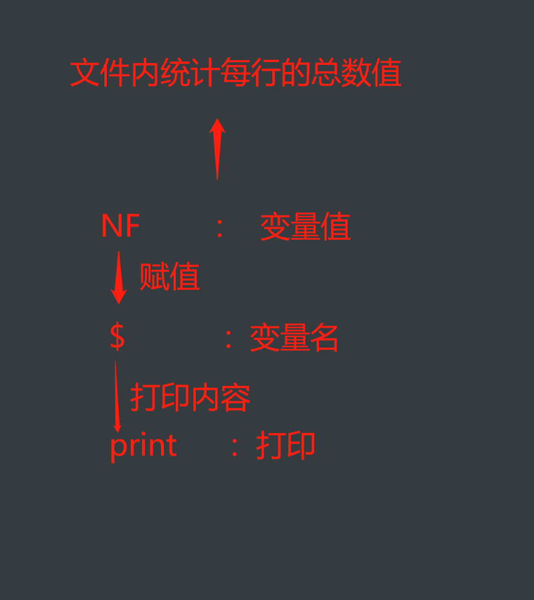
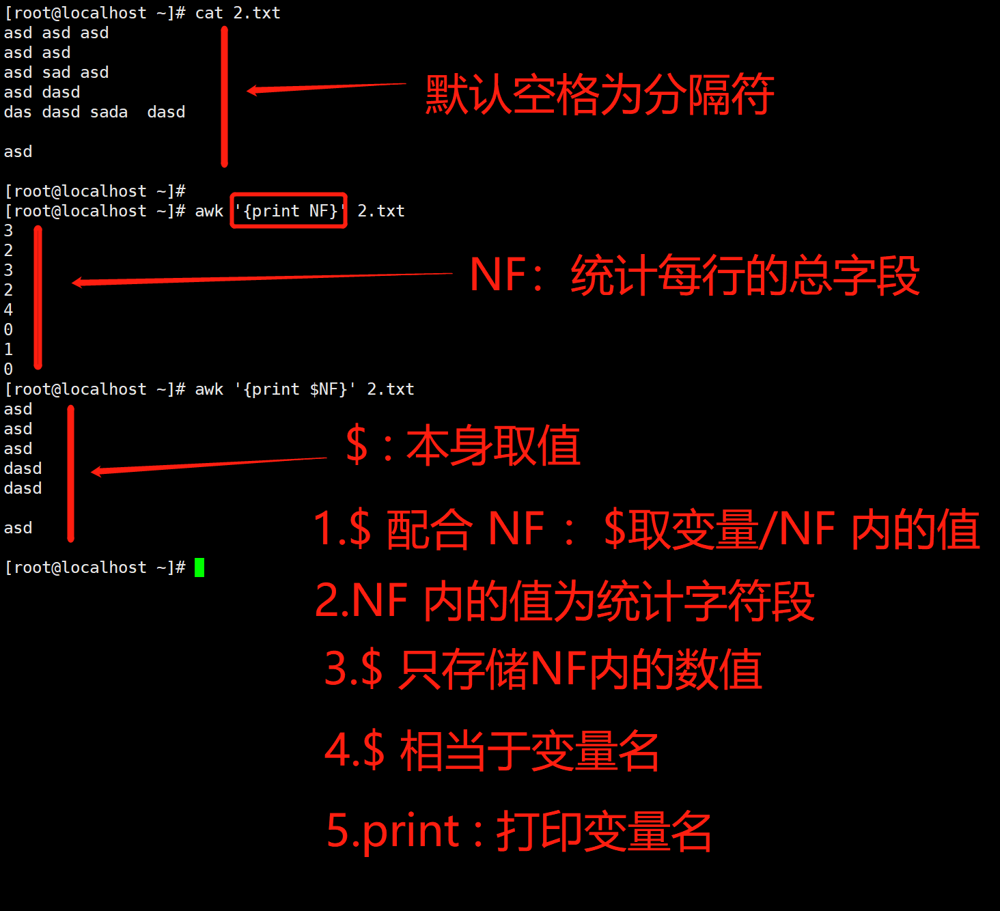

# linux中awk命令详解

###### 1.awk命令简介

```bash
AWK 是一种处理文本文件的语言，是一个强大的文本分析工具。
之所以叫 AWK 是因为其取了三位创始人 Alfred Aho，Peter Weinberger, 和 Brian Kernighan 的 Family Name 的首字符
linux中有三剑客之称：
三剑客之首就是 AWK
三剑客功能:
grep ： 过滤文本
sed  :  修改文本
awk  :  处理文本
```

###### 2.awk作用

```bash
awk主要是用来格式化
```

###### 3.awk的语法格式

```bash
	awk [参数] [处理内容] [操作对象]
```

###### 4.解析awk使用方法

```bash
print	: 打印
NF		: 统计总字段数
$		: 取值
结合作用:
	$ 配合NF使用 : NF内存储统计文件内每行的总字段，$存储NF内的值
	NF	：相当于 变量值	$	：相当于 变量名
	print相当于打印 $ 内的内容
```





###### 5.参数

```bash
	-F : 指定文本分隔符 (本身默认是以空格作为分隔符)
实战案例:
awd	-F'f' '{print $NF}' 1.txt
 解析:
-F'f'	: 指定f为分隔符
 
```

###### 6.awk的生命周期

<<<<<<< HEAD
```txt
=======
```bash
>>>>>>> deee526 (更新)
grep，sed和awk都是读一行处理一行，直到处理完成。
接收一行作为输入  
把刚刚读入进来得到文本进行分解 
使用处理规则处理文本  
<<<<<<< HEAD
输入一行，赋值给$0，直至处理完
=======
输入一行，赋值给$0，直至处理完成
>>>>>>> deee526 (更新)
把处理完成之后的所有数据交给END{}来再次处理
```

#### 二：awk中的预定义变量

```bash
$0	: 代表当前行(相当于匹配所有)
	awk -F: '{print $0, "---"}' /etc/passwd
==========================================================================
$n	: 代表第n列
案例1:(以:为分隔符) 
awk -F: '{print $1}' /etc/passwd
==========================================================================
案例2:(默认空格为分隔符) 
awk '{print $1}' /etc/passwd
==========================================================================
NF	: 记录当前统计总字段数 
案例1:(以:为分隔符 统计文件内每行内的行数) 
awk -F: '{print NF}' /etc/passwd
========================================================================== 
案例2:(以:为分隔符 统计文件内每行总字段 并打印每行统计行数)
awk -F: '{print $NF}' /etc/passwd
NR	: 用来记录行号
========================================================================== 
案例1:
awk -F: '{print NR}' /etc/passwd
==========================================================================
FS	: 指定文本内容分隔符(默认是空格) 
案例1:
awk 'BEGIN{FS=":"}{print $NF, $1}' /etc/passwd
 
解析: 
BEGIN{FS=":"}	: 相当于指定以 : 为分隔符 
$NF			: 存储以 : 分隔符的最后一列 
$1			: 存储以 : 分隔符的第一列 
print		: 打印 
OFS	: 指定打印分隔符(默认空格)
==========================================================================
案例1:(输出的意思 分隔符会打印出来) 
awk -F: 'BEGIN{OFS=" >>> "}{print $NF, $1}' /etc/passwd 
FS	的优先级要高于 -F	 
解析: 
BEGIN{OFS=" >>> "} : 指定打印分隔符 
$NF			  : 存储以 >>> 分隔符的最后一列 
$1			  : 存储以 >>> 分隔符的第一列 
print		  : 打印
========================================================================== 
```

#### 三：awk运行处理规则的执行流程

```bash
BEGIN{}	: 最开始执行
//		: 正则
{}		: 循环体
END{}	: 最后执行
这里面最少有一个，最多有四个！
 
```

#### 四：awk中的函数

```bash
	print	: 打印
	printf	: 格式化打印
	%s		: 字符串
	%d		: 数字
	-		: 左对齐
	+		: 右对齐
	15		: 至少占用15字符 
========================================================================== 
awk中函数(格式化打印) 
案例1: 
awk -F: 'BEGIN{OFS=" | "}{printf "|%+15s|%-15s|\n", $NF, $1}' /etc/passwd
解析: 
|		: 以 | 为分隔符 
|%+15s|	 : 以 | 为分隔符 %s 配合 printf 使用 代替当前字符串 右对齐 占用15字符 
|%-15s|	 : 以 | 为分隔符 %s 配合 printf 使用 代替当前字符串 左对齐 占用15字符 
\n		 : 换行符 
$NF		 : 存储以 | 为分隔符的最后一列 
$1		 : 存储以 | 为分隔符的第一列
========================================================================== 
```

#### 五：awk中的定位

```bash
1.正则表达式
==========================================================================
案例1:(awk中匹配有root内容的行)
	awk -F: '/root/{print $0}' /etc/passwd
解析:
	/root/{print $0}: awk中先执行正则 在执行循环 匹配文件内有root的每一行。
	       $0			:代表所有
==========================================================================
案例2:(awk中匹配root开头的行)
	awk -F: '/^root/{print $0}' /etc/passwd
```

#### 六：比较表达式(匹配文本之内的内容)

```bash
	>		: 小于
	<		: 大于
	>=		: 小于等于
	<=		: 大于等于
	~		: 正则匹配(包含)
	!~		: 正则匹配(不包含) 
========================================================================== 
案例1： 
要求打印属组ID大于属主ID的行 
awk -F: '$4 > $3{print $0}' /etc/passwd 
解析: 
$4	: 代表属组所在列 
$3	: 代表属主所在列 
$0	: 所有行
==========================================================================  
案例2： 
打印结尾包含bash 
awk -F: '$NF ~ /bash/{print $0}' /etc/passwd 
解析: 
$NF ~ /bash/	：尾部最后一列 包含 bash 的行 
~		   : 包含 
========================================================================== 
案例3：
打印结尾不包含bash 
awk -F: '$NF !~ /bash/{print $0}' /etc/passwd
解析: 
!~	: 不包含 (将打印其他内容)
========================================================================== 
```

#### 七：条件表达式(文本之外的内容)

```bash
	==	
	>
	<
	>=
	<=
========================================================================== 	
要求打印第三行 
案例1： 
awk -F: 'NR == 3{print $0}' /etc/passwd
解析: 
NR  : 行号 
NR == 3  : 行号等于3
==========================================================================  
###注意:###
$1	   : 是列 
NR == 3  : 是行
  
```

#### 八：逻辑表达式

```bash
	&&		: 逻辑与
	||		: 逻辑或
	！     : 逻辑非
==========================================================================  
案例1:(与(两者条件必须都成立)) 
awk -F: '$3 + $4 > 2000 && $3 * $4 > 2000{print $0}' /etc/passwd
==========================================================================  
案例2:(或(两者条件一个成立即可)) 
awk -F: '$3 + $4 > 2000 || $3 * $4 > 2000{print $0}' /etc/passwd 
========================================================================== 
案例3:(非(条件取反)) 
awk -F: '!($3 + $4 > 2000){print $0}' /etc/passwd
========================================================================== 
```

#### 九：算数表达式

```bash
	+	:加
	-	：减
	*	：乘
	/	：除
	%	：求余 
========================================================================== 
1.要求匹配打印出属组 + 属主的ID 大于 2000 的
案例1： 
awk -F: '$3 + $4 > 2000{print $0}' /etc/passwd
==========================================================================   
2.要求属组 * 属主的ID 大于 2000 
案例2： 
awk -F: '$3 * $4 > 2000{print $0}' /etc/passwd
==========================================================================  
3.要求打印偶数行
案例3： 
awk -F: 'NR % 2 == 0{print $0}' /etc/passwd 
解析:
NR  ：全部行号 	除以 2 == 零的	 零等于余数 
偶数 : 2 4 6...
========================================================================== 
4.要求打印奇数行 
案例4: 
awk -F: 'NR % 2 == 1{print $0}' /etc/passwd
NR  ：全部行号 除以 2 == 1的 零等于奇数
NR  ：全部行号 除以 2 == 1的 零等于奇数
奇数: 1 3 5...
==========================================================================  
```

#### 十：流程控制

```bash
简介:
	流程控制只存在循环之中
if：
awk -F: '{if($3>$4){print "大于"}else{print "小于或等于"}}' /etc/passwd
解析:
判断文件 第三列大于第四列的话打印(大于)，不大于 else
========================================================================== 
if 使用格式:
if(){}		   : 单分支
-------------------------------------------------------------------------
if(){}else{} 		   : 双分支
------------------------------------------------------------------------- 
if(){}else{}
if(){}else{}     : 多分支
========================================================================== 
for每一行打印10次 
for 使用格式 
awk -F: '{for(i=10;i>0;i--){print $0}}' /etc/passwd 
解析: 
i-- 相当于python中的 i-=1   : i=i-1 
减到条件不成立为止 
格式: 
fro(i="初始值":条件判断：游标){}
==========================================================================   
while每一行打印10次 
while 使用格式 
awk -F: '{i=1; while(i<10){print $0, i++}}' /etc/passwd 
解析: 
i++ 相当于python中的 i+=1 
加到条件不成立为止 
格式: 
while(条件判断){}
==========================================================================  
```

#### 十一：实战案例(if判断打印隔五一行线)

```bash
1.使用if判断
每隔5行，打印一行横线
awk -F: '{if(NR%5==0){print "----------"}print $0}' /etc/passwd
解析:
	1. NR	: 每一行的行号
	2. 行号 除以 5 ==0
	3. 打印一行
	以此类推 4%5=0.8

```