你从一个成天安装软件，改配置文件，改参数，启动，看日志，报错的运维

到今天，角色转变了，开始写代码了，什么服务也不用装，就是拿一个编辑器，刷刷写代码了。


# 学习shell编程前言

学编程，那么太多的理论了，纯逻辑

咱们学习路线基本是

1. 学语法

2. 看语法，看教程
3. 出题，你去思考，这个题如何做，语法怎么写，逻辑对不对
4. 学shell编程阶段，是完全的大量逻辑的，写代码，我不会讲太多，主要看你代码能写的如何。

> 比如 ，探测当前网段，有多少机器存活。
>
> 考虑哪些知识点？
>
> - 用什么命令，ping命令，ping 
> - 要理解网段的概念，ping哪一个网段的机器，172.16.1.7  172.16.1.8  ，如果说你要批量的去探测，那么你得理解网段的ip范围，是多少？  从哪到哪的ip，是客户端可用的？也就是你要思考，探测的ip范围是哪到哪？数量是多少？
>   - ip的范围子网划以24来说，255.255.255.0，可用的ip范围就是 0~255，255一般是保留地址，0也是， 可用的需要你去探测的ip基本是 172.16.1.1  ~ 172.16.1.254
>   - 
> - 因此，学shell编程，就是如此，拿到需求，先去思考，用什么命令解决，以及这个需求，有什么限制条件
> - 最后再通过shell的语法，如for循环，去循环的执行命令，最终解决需求
> - 大致听懂扣6666

新人初学编程
1. 多看，多学，学习其他人的脚本，其他人的思路，学习如系统自带的shell脚本，优质的脚本，语法，用法；
2. 动手练，可以完全照抄别人的思路，大量抄，目的是为了先熟练记忆编程语言的语法、要求。
3. 在熟练记忆语法之后，逐渐转化为自己的思路，产生自己的理解，遇见一个需求之后，能主动思考，有了想法之后，转变为代码，解决问题。


总之，想学好编程，更多的动手敲，比学来的更重要。

来自于www.yuchaoit.cn的分享。

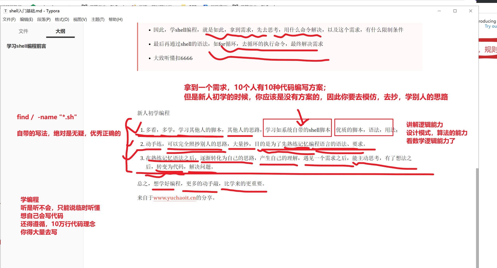


# shell入门基础


# 什么是shell编程语言，以及编程的目的


```

计算机的发明，是为了用机器取代/解放人力

让你去探测某网端内的机器是否存活
ping  172.16.1.xx


而编程的目的则是将人类的思想流程按照某种能够被计算机识别的表达方式传递给计算机，从而达到让计算机能够像人脑/电脑一样自动执行的效果。

利用for循环的在 1 ~ 254的ip之间
让计算机自动去执行ping命令，完成这个需求，也就几秒钟时间即可知道结果。


具体的以某种编程语言的语法，去写一个普通文件，如
*.sh
如*.py

这些编程语言写好的代码文件，能够通过编译后，成为计算机可识别的二进制命令，计算机底层指令。


```

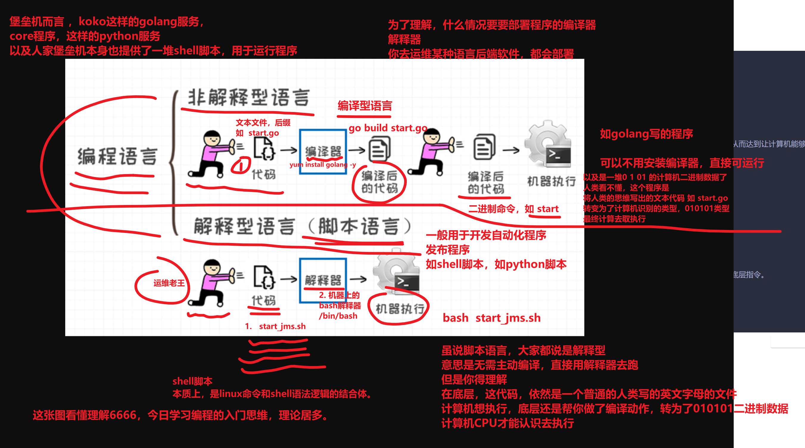

编程语言(programming language)，是用来定义计算机程序的形式语言。

它是一种被标准化的交流技巧，用来向计算机发出指令。
一种计算机语言让程序员能够准确地定义计算机所需要使用的数据，并精确地定义在不同情况下所应当采取的行动。

小时候我们跟着父母学说话，通过长时间的熏陶，以及自我学习，我们在不知不觉中学会了说话，也能够理解他人说话的意思；就好比（以前没钱吃肯德基、现在没钱吃肯德基）这句话我们随着被社会毒打后，也理解其含义。


我们可以通过固定的语法格式，让他人为我们做事：
1. 张三，你去帮我打盆水，给本大爷洗洗脚。

张三可能会帮你去打水，也可能打一盆水，倒在你头上。。。


而计算机，我们也可以通过语言让它为我们做事，并且计算机会对你言听计从，完成你的任务，除非你的”语言“出了问题，让计算机理解错了（写了一堆bug）

因此这就是编程语言，每一种语言都有固定的语法格式，只有学习后才会使用。（英语，法语，汉语，不都是这样么）


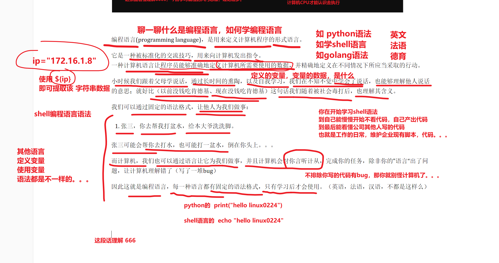

## 代码文件，只有在运行后才有实际意义

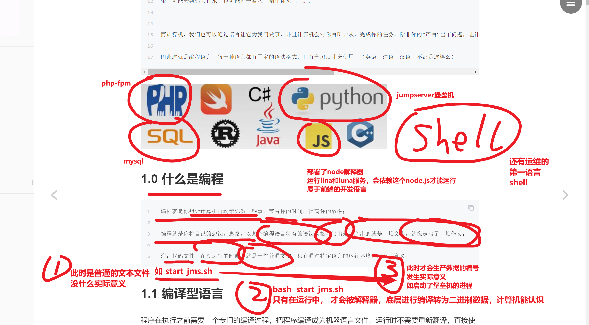


## 再次演示不同语言的运行方式

对运行环境的要求。

```
就拿堡垒机的源代码来举例，看看它提供了哪些脚本

```

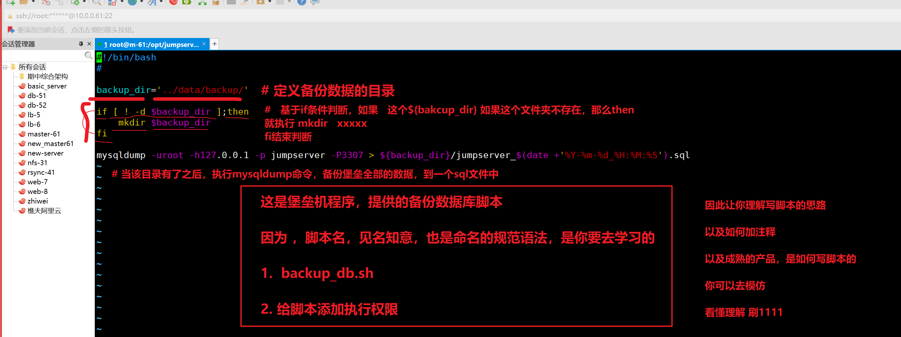

```
当你看到这么一个脚本之后，你得

1. 先看人家的代码，加注释，让自己去理解这个代码功能

2. 部署代码运行环境，判断这是什么语言的，是否要装编译器？解释器？

[root@m-61 /opt/jumpserver-v2.12.0/utils]#bash backup_db.sh


如果是python脚本呢？如何运行
如何运行？
以解释型代码为主，基本都是

解释器+代码文件

python    start_celery_beat.py


# 以编译型代码举例如golang

第一种，直接解释运行

go  run   hello.go

第二种编译型运行

go build hello.go


```

### 三种语言，练习代码运行方式

- 解释型语言角度
  - shell
  - python
- 编译型语言角度
  - golang
- 掌握如今的两大类编程语言，运行方式，运行要求


### shell脚本的多种运行方式

也就是你可能在，linux的脚本源码，或者其他开源软件的shell发布脚本，都会见到这些用法，到时候就看懂了。

字体下午我个调下。


```
# 1.第一步都是开发，纯文本类型的的代码。这种代码， 在运行后，才有实际意义，才转为了计算机的数据。
# 学名叫做 shebang #!的意思。

cat > shell.sh <<'EOF'
#!/bin/bash
echo "开始学编程了，好刺激！！"
EOF

# 运行

两种，
1. 不强制用哪种解释器，但是你得 1. 加执行权限  2.代码中进行解释器声明。
添加执行权限，直接运行脚本路径
chmod u+x shell.sh

[root@m-61 ~/part3-shell]#./shell.sh 
开始学编程了，好刺激！！


2. 无须执行权限，以解释器强制性去运行，明确指定了，用什么解释器去执行，也有多种方式，请看

bash运行
[root@m-61 ~/part3-shell]#bash shell.sh 
开始学编程了，好刺激！！
[root@m-61 ~/part3-shell]#
[root@m-61 ~/part3-shell]#
[root@m-61 ~/part3-shell]#which sh
/usr/bin/sh
[root@m-61 ~/part3-shell]#ll /usr/bin/sh
lrwxrwxrwx 1 root root 4 Jun 15 18:23 /usr/bin/sh -> bash


sh运行
[root@m-61 ~/part3-shell]#sh shell.sh 
开始学编程了，好刺激！！


点运行. 但是，要求，脚本第一行，必须有解释器生命
[root@m-61 ~/part3-shell]#. shell.sh 
开始学编程了，好刺激！！


source运行
[root@m-61 ~/part3-shell]#source shell.sh 
开始学编程了，好刺激！！
[root@m-61 ~/part3-shell]#
[root@m-61 ~/part3-shell]#


# 注意第一行，必须有解释器具体，为什么待会解释

[root@m-61 ~/part3-shell]#cat shell.sh 
#!/bin/bash
echo "开始学编程了，好刺激！！"


到这里，shell的代码编写，以及运行方式，运行要求，看懂刷一波666


```

### python和golang的运行语法

这俩学习的目的是为了理解，部署运行环境的意义。

以及java运行，比较恶心，代码的内容，和文件名还必须得一直。。。真是难受。


```bash

# python的运行方式如下
#必须是如下写法，才不会加载特殊变量，识别为普通文本 'EOF'
# 第一行意思是，在当前的系统env环境变量中，找到一个python的解释器
# 在当前的env环境变量中，找到PATH变量，找到python解释器

#写法等同于
#!/usr/bin/python
# 这里是否理解，懂了 333，看不懂  444

# 代码如下
cat > hello.py <<'EOF'
#!/usr/bin/env python
#coding:utf-8
print "python运行中文，条件限制有点多，但是你在学编程了，这些语法，都得记住。因为你会用到"
EOF


# 运行方式，前提是机器上有python


依然是两种方式

1. 添加执行权限，直接运行，前提是代码中有第一行的解释器声明，否则会报错。
默认权限不足，这些细节，都是你以后去写复杂的部署脚本，要考虑到的点。

[root@m-61 ~/part3-shell]#./hello.py
-bash: ./hello.py: Permission denied

添加执行权限

[root@m-61 ~/part3-shell]#chmod +x hello.py 
[root@m-61 ~/part3-shell]#
[root@m-61 ~/part3-shell]#
[root@m-61 ~/part3-shell]#
[root@m-61 ~/part3-shell]#./hello.py 
python运行中文，条件限制有点多，但是你在学编程了，这些语法，都得记住。因为你会用到


有一个坑，就是你忘记添加第一行的代码声明，看看是什么意思
[root@m-61 ~/part3-shell]## 公布答案，因为，你现在是基于linux的bash环境，如果代码没声明用什么语言去执行，系统默认用bash幸运星
[root@m-61 ~/part3-shell]#
[root@m-61 ~/part3-shell]#
[root@m-61 ~/part3-shell]#
[root@m-61 ~/part3-shell]## 公布答案，因为，你现在是基于linux的bash环境，如果代码没声明用什么语言去执行，系统默认用bash运行
[root@m-61 ~/part3-shell]#
[root@m-61 ~/part3-shell]#
[root@m-61 ~/part3-shell]#
[root@m-61 ~/part3-shell]#print
-bash: print: command not found
[root@m-61 ~/part3-shell]#
[root@m-61 ~/part3-shell]#
[root@m-61 ~/part3-shell]## 答案就是，巴适
[root@m-61 ~/part3-shell]## 答案就是，bash不认识print，这就是你不指定解释器声明的坑
[root@m-61 ~/part3-shell]#
[root@m-61 ~/part3-shell]#vim hello.py 
[root@m-61 ~/part3-shell]#
[root@m-61 ~/part3-shell]#
[root@m-61 ~/part3-shell]#
[root@m-61 ~/part3-shell]#./hello.py 
python运行中文，条件限制有点多，但是你在学编程了，这些语法，都得记住。因为你会用到
[root@m-61 ~/part3-shell]#
[root@m-61 ~/part3-shell]#
[root@m-61 ~/part3-shell]## 到这里，理解刷一波666
[root@m-61 ~/part3-shell]#
[root@m-61 ~/part3-shell]## 其他解释型语言，亦是如此。但是坑还很多
[root@m-61 ~/part3-shell]#


2. 直接指定解释器去运行，必然正确
[root@m-61 ~/part3-shell]#
[root@m-61 ~/part3-shell]#python hello.py 
python运行中文，条件限制有点多，但是你在学编程了，这些语法，都得记住。因为你会用到


3. 你想，当你同时，在代码中有了声明，又强制用解释器去跑，谁优先？猜一猜？发弹幕


# 结论是，在外部的解释器，执行优先级更高

[root@m-61 ~/part3-shell]#cat hello.py 
#!/usr/bin/python
#coding:utf-8
print "python运行中文，条件限制有点多，但是你在学编程了，这些语法，都得记住。因为你会用到"
[root@m-61 ~/part3-shell]#
[root@m-61 ~/part3-shell]#
[root@m-61 ~/part3-shell]#
[root@m-61 ~/part3-shell]#
[root@m-61 ~/part3-shell]#bash hello.py 
hello.py: line 3: print: command not found


看懂 刷1111


```

### 关于golang代码的执行，体验一波，编译型语言的运行流程

```

# 编译型语言的特点，
yum install epel-release golang -y

查看golang编译器的版本
[root@m-61 ~/part3-shell]#go version
go version go1.17.7 linux/amd64


# 2.编写golang的纯文本类型的代码
# 编译型语言，安全性够高，但是语法比较多，限制比较多，因此小白适合从解释型语言学起
# 编译型语言，如golang如c，c++，定义一个变量，都要限制该变量的数据类型，是数字类型，还是字符串类型。。
# 明天学shell变量即可理解。。很多的数据类型规则限制。。

# 不同的语言，有不同的语法规则，如英语，法语，需要你去学一学的。。。


cat > jiayou.go <<'EOF'
package main

import "fmt"

func main() {
    fmt.Println("每天都有太阳，每天都可以学习，体验新知识，掌握新技能的快感，非常nice！！")
}
EOF


# 直接运行（先解释，再编译，底层理念）
[root@m-61 ~/part3-shell]## golang 不支持该代码声明的写法，限制较多，只能用 go run这个命令去运行，要根据 不同语言的规则去做更多的学习
[root@m-61 ~/part3-shell]#
[root@m-61 ~/part3-shell]#
[root@m-61 ~/part3-shell]#vim jiayou.go 
[root@m-61 ~/part3-shell]#
[root@m-61 ~/part3-shell]#
[root@m-61 ~/part3-shell]#
[root@m-61 ~/part3-shell]#
[root@m-61 ~/part3-shell]#go run jiayou.go 
每天都有太阳，每天都可以学习，体验新知识，掌握新技能的快感，非常nice！！
[root@m-61 ~/part3-shell]#
[root@m-61 ~/part3-shell]#
[root@m-61 ~/part3-shell]## 看懂这种，需要安装go编译器，然后go run强制运行的方式，看懂333
[root@m-61 ~/part3-shell]#

# 上面这种方式，限制在于必须安装go环境，请看web7 机器


# 直接编译（直接生成二进制，一次编译，任意运行，这种部署理念，用在了我们后面要学的docker容器里，非常nb）
# 比如jumpserver大家觉得部署很麻烦吧。。启动一堆组件，安装python3，安装虚拟环境，安装前端nodejs
安装myqsl，redis。。什么玩意。。累都类似了。。

m-61机器上部署
100台机器上去部署，你会怎么做？请发弹幕。。
以你目前所学，你会怎么做？ 肯定是写ansible+shell的综合部署脚本，即可搞定。

还有一个更nb的技术，叫做docker容器，简单到不能再简单，但是底层的理念，你要学一学之后，才能体会到它的强大。

比如于超老师讲自己的堡垒机环境，导出为一个镜像文件
发给大家，大家只需要
1. 安装docker
2. 导入该镜像
3. docker run 命令，一键启动，2分钟之后，大家也看到刚哥秀了一波操作。

4. 浏览器可以去访问堡垒机了，不用关心任何的环境问题，不用担心，路基不对，代码不对。。
非常好用。
docker的部署理念，就如同编译型代码，的一次编译，任意运行的理念，docker就是golang语言开发的一个软件。

这个部署理念大致理解刷333


话说回来，继续看golang代码的运行,想在web7机器上，【不做任何的环境修改，即可运行该代码程序】


在master-61机器上，对代码进行编译，编译为centos64位可通用运行的二进制命令


[root@web-7 /opt]## 此时web7 可以不做任何修改，只需要拿到这个程序，直接就运行
[root@web-7 /opt]#
[root@web-7 /opt]#cd /tmp/
[root@web-7 /tmp]#
[root@web-7 /tmp]#ll
total 1728
-rwxr-xr-x 1 root root 1766214 Jun 21 11:13 jiayou-linux0224
[root@web-7 /tmp]#
[root@web-7 /tmp]#
[root@web-7 /tmp]#
[root@web-7 /tmp]#./jiayou-linux0224 
每天都有太阳，每天都可以学习，体验新知识，掌握新技能的快感，非常nice！！
[root@web-7 /tmp]#
[root@web-7 /tmp]#
[root@web-7 /tmp]## 在同架构的系统中，拿到这个二进制命令，该操作系统是可识别，可运行的，体验编译型语言的强大，无须安装环 境了
[root@web-7 /tmp]#
[root@web-7 /tmp]#


```


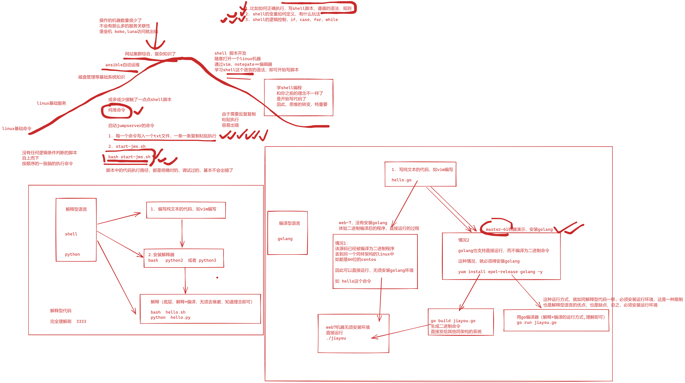


---

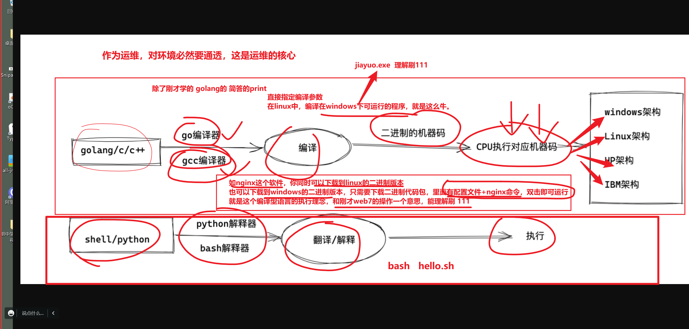


---

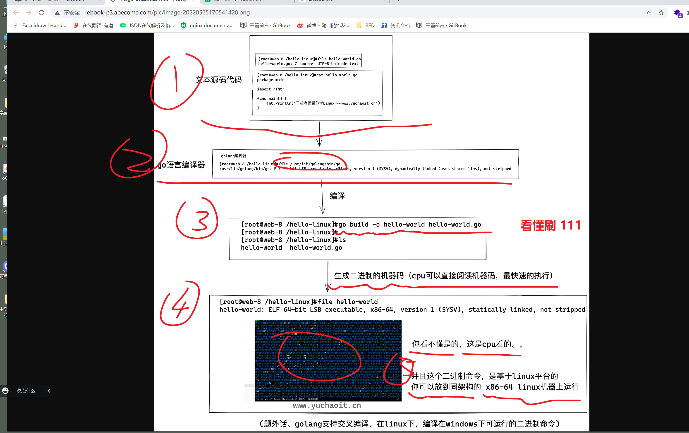


# 具体的，解释型，编译型语言的区别


1.4 编译、解释语言区别
编译型
二进制执行速度快
依赖平台架构
保护源代码
底层工具开发，操作系统，超大型应用，高并发型应用，都是编译型语言开发。

解释型
跨平台性能好
执行过程较慢（相对计算机而言，其实人类感受不到的。。）而且你块那几秒对你有啥用？
源码暴露在外，不安全
适合开发各种脚本，完成自动化工作
对速度要求不是太高的应用开发，如网站开发。


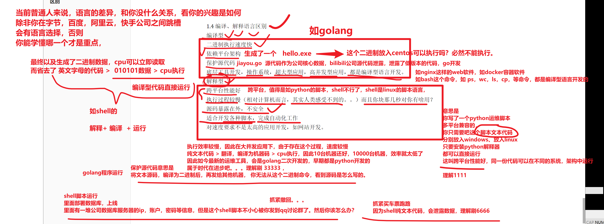


# 关于shell开发的规范详解

1. shell的语法理解，shell的作用
2. shell和运维的关系


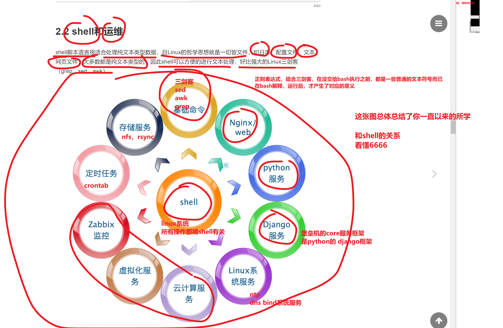


---

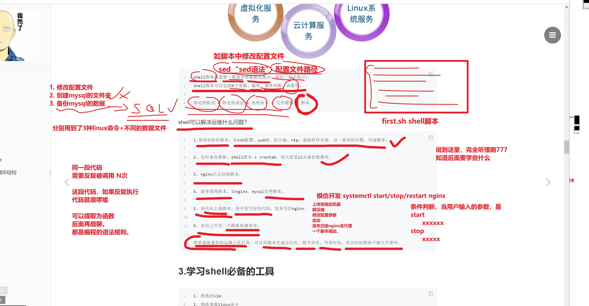

---

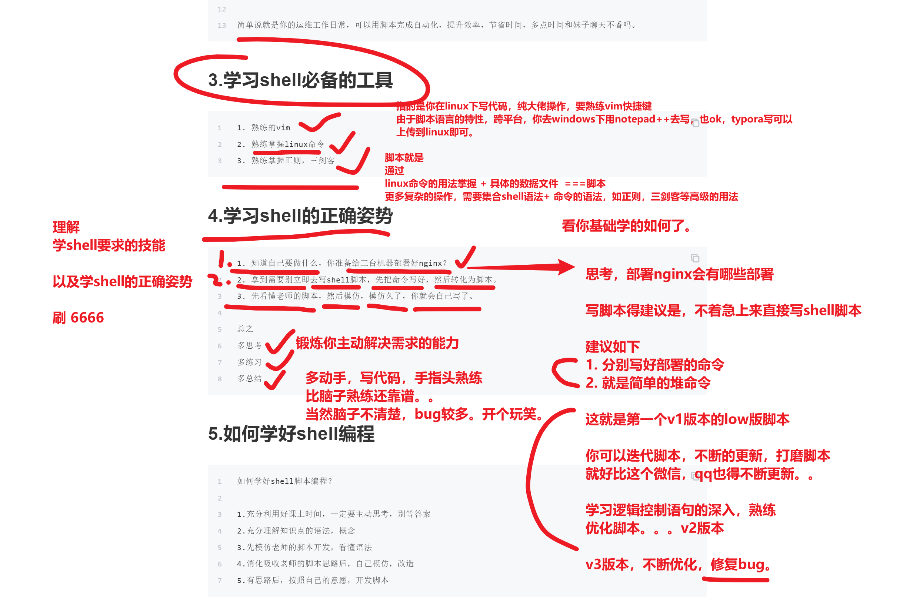

## 如何学好shell编程

```
如何学好shell脚本编程？

1.充分利用好课上时间，一定要主动思考，别等答案
2.充分理解知识点的语法，概念
3.先模仿老师的脚本开发，看懂语法
4.消化吸收老师的脚本思路后，自己模仿，改造
5.有思路后，按照自己的意愿，开发脚本


```

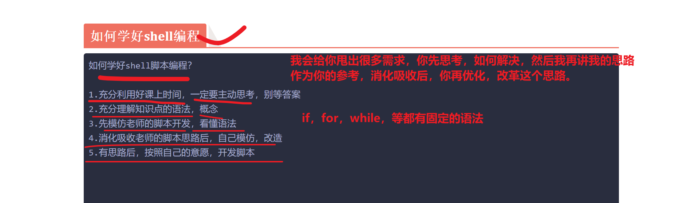


# 学编程，写代码的套路分享

```
无论你以后学shell，还是python，学编程语言的套路都是一样的；

你学过英语吧？
1. 学单词-------shell的关键字
2. 学语法规则--------shell的语法要求
3. 写作文--------用shell写的脚本文件

到这你估计有点眉目了，但是为什么还有的人觉得学shell很难呢？

1.在于超老师带python、linux的学员时，总会发现有同学学不会，或者说代码写不出来，他也会问我，说超哥，，为什么上课我听着那么明白，自己写，感觉就呆住了，不知道咋开始啊。

2. 于超老师：“这不废话么？人家在那敲代码，一个需求用三种shell脚本思路实现，你天天搁那玩游戏，看电视剧，能学明白还有天理吗？”

3. 我就说你当初学英语，学汉语吧！你不会去琢磨，用哪个字，还是哪个说法，才能表达出你的意思。

你是随口就叭叭叭说了一堆优雅的中国话，对把？
为什么你代码写不出来，因为你没有烂熟于心。。。。你写代码，发现，关键字没记住，语法是啥来着？以及我到底怎么表达才是合适的！也就是你的代码逻辑如何写，你是不熟练的！
这就跟你去思考，我是用胳膊走路，还是腿走路，这不还是因为你路走少了么。

所以，狠下心来，你没有狠下心，早上5点到夜里3点的学代码，写代码，重点是写代码，不断的写，就像当年郭靖学降龙十八掌，洪七公让他对着树打两巴掌，这傻大个打了1000掌，为啥？说难听点，大家都是屌丝，你要没有郭靖这意志力，就别想着咸鱼翻身，做武林顶级高手了。


结尾，于超老师送给你，也送给自己一句话，学无止境，成功没有捷径，想爬得更高，没有上万行代码的洗礼，没有一千个日夜的拼命学习，想翻身？不存在的。
```

这碗鸡汤我放了三代味精。


# shell脚本编写语法规范

规范几个准则

```
1. shell脚本要做到见名知意，正式的脚本，别瞎写a.sh  b.sh 容易被打。。

2. 虽然脚本是文本类型，但是建议以.sh结尾。vim也能提供颜色支持。

3. 给脚本加上注释（英文最好，中文写在你的笔记里），包括了脚本的创建时间，作者，作用等信息；

4. 创建好可以管理你脚本的目录。

5. 创建统一管理脚本的目录，别乱放，回头找不到。
```

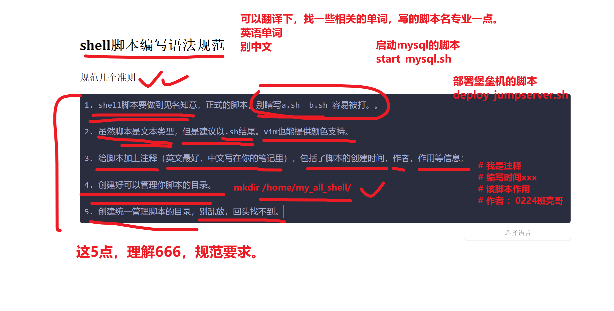

一个规范的脚本示例

learn_shell_first.sh

vim插件，自动生成这些内容。

```
#!/bin/bash     #! 这个符号在计算机中读作shebang，表示指定用什么解释器运行脚本，只能在第一行，注释从第二行开始写
# Author: www.yuchaoit.cn  877348180@qq.com
# Create Time:  2022/05/25  
# Script Description: this is my first shell script.
# ？？？？？？？理解刷 111，尽量用英文。否则可能导致脚本显示乱码。


```


vim hello_world.sh

## vim脚本开发插件.

这个脚本作用是，vim自动判断，

*.sh

*.php

*.py

分别提供该语言的语法高亮支持，一些功能支持。


```bash
1. 打开vim配置文件，写入你自己的插件语法
[root@m-61 ~]#vim ~/.vimrc


2. 复制粘贴语法即可

syntax on
set nocompatible
"set number
"filetype on
"set history=1000
"set background=dark
""set autoindent
"set smartindent
"set tabstop=4
"set shiftwidth=4
"set showmatch
"set guioptions-=T
"set ruler
"set nohls
"set incsearch
""set fileencodings=utf-8

if &term=="xterm"
    set t_Co=8
    set t_Sb=^[[4%dm
    set t_Sf=^[[3%dm
endif
function AddFileInformation_php()
      let infor = "<?php\n"
      \." ***************************************************************************\n"
      \." * \n"
      \." * Copyright (c) 2014 \n"
      \." *  \n"
      \." **************************************************************************/ \n"
      \." \n"
      \." \n"
      \." \n"
      \."/** \n"
      \." * @file:".expand("%")." \n"
      \." * @author your name(www.yuchaoit.cn) \n"
      \." * @date ".strftime("%Y-%m-%d %H:%M")." \n"
      \." * @version 1.0  \n"
      \." **/ \n"
      \." \n"
      \." \n"
      \." \n"
      \." \n"
      \." \n"
      \." \n"
      \."?>"
      silent  put! =infor
endfunction
autocmd BufNewFile *.php call AddFileInformation_php()

function AddFileInformation_sh()
      let infor = "#!/bin/bash\n"
      \."\n"
      \."# ***************************************************************************\n"
      \."# * \n"
      \."# * @file:".expand("%")." \n"
      \."# * @author:www.yuchaoit.cn \n"
      \."# * @date:".strftime("%Y-%m-%d %H:%M")." \n"
      \."# * @version 1.0  \n"
      \."# * @description: Shell script \n"
      \."# * @Copyright (c)  all right reserved \n"
      \."#* \n"
      \."#**************************************************************************/ \n"
      \."\n"
      \."\n"
      \."\n"
      \."\n"
      \."exit 0"
      silent  put! =infor
endfunction
autocmd BufNewFile *.sh call AddFileInformation_sh()

function AddFileInformation_py()
      let infor = "#!/usr/bin/env python\n"
      \."# -*- coding: utf-8 -*-\n"
      \."# ************************************************************************ \n"
      \."# * \n"
      \."# * @file:".expand("%")." \n"
      \."# * @author:www.yuchaoit.cn \n"
      \."# * @date:".strftime("%Y-%m-%d %H:%M")." \n"
      \."# * @version 1.0  \n"
      \."# * @description: Python Script \n"
      \."# * @Copyright (c)  all right reserved \n"
      \."# * \n"
      \."#************************************************************************* \n"
      \."\n"
      \."import os,sys"
      \."\n"
      \."print u'''中文'''\n"
      \."\n"
      \."exit()"
      silent  put! =infor
endfunction
autocmd BufNewFile *.py call AddFileInformation_py()
```

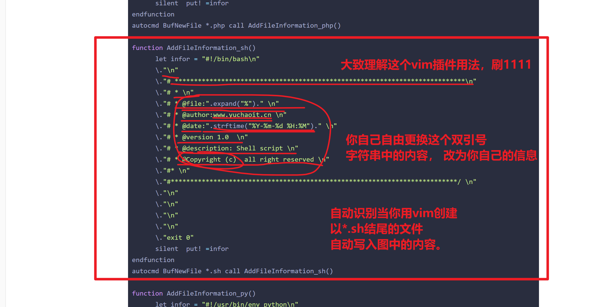


```
```


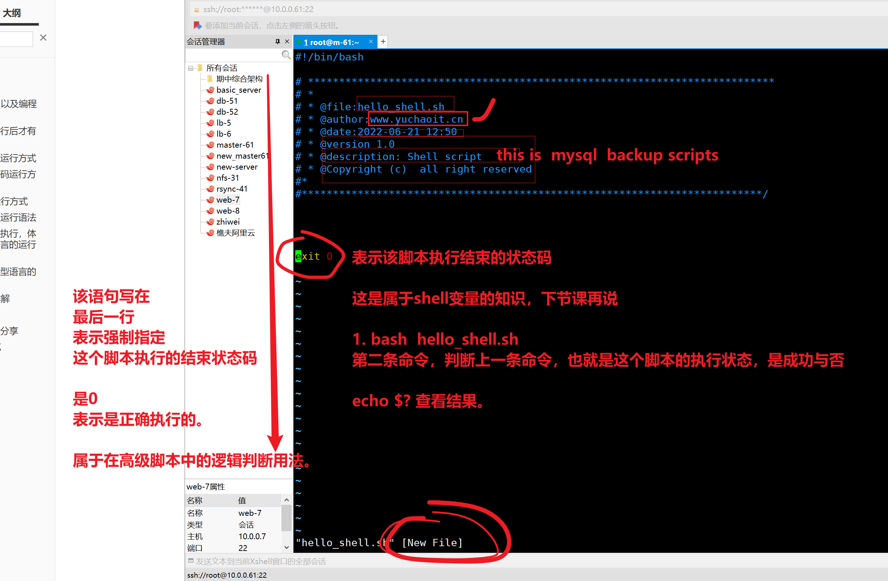


简单互动一波，看懂vim插件的实际用法，刷 3333

```
[root@m-61 ~]#cat hello_shell.sh 
#!/bin/bash

# ***************************************************************************
# * 
# * @file:hello_shell.sh 
# * @author:www.yuchaoit.cn 
# * @date:2022-06-21 12:50 
# * @version 1.0  
# * @description: Shell script 
# * @Copyright (c)  all right reserved 
#* 
#**************************************************************************/ 

echo "加油，永远的0224班，各位未来运维大佬。yyds"


exit 0

[root@m-61 ~]#
[root@m-61 ~]#
[root@m-61 ~]#
[root@m-61 ~]#bash hello_shell.sh 
加油，永远的0224班，各位未来运维大佬。yyds
[root@m-61 ~]#
[root@m-61 ~]#

```


## 执行shell的方式

```
1. 解释器强制运行

2. 代码文件首行，声明具体解释器


```

## 关于shell和python和运维的关系

```
shell脚本的优势在于，最贴切linux底层，直接使用linux原生命令，效率很高，适合处理偏向操作系统底层的脚本。

对于一些常见的系统脚本，用shell去开发会更简单，更快速，例如一键部署nginx集群，系统内核参数优化，服务启动脚本，日志分析解析三剑客的提取脚本等。

虽然其他语言，如python也能实现这个效果，但是考虑到学习成本，开发效率，以及如果通过python管理操作系统的模块去写脚本，这个python语言对操作系统的效率，远不如linux命令来的强大。

因此对于基本的系统维护需求，用shell脚本会更符合易用、快速、高效的原则。


python是最近几年运维自动化非常流行的语言，随着运维人员开发能力的提升，以及运维对编程的需求加大，像知乎网、豆瓣网、国外的INS网都是python开发的，虽说后来有更新。

因此python很适合web开发，实现网站的后端功能，这个是shell完成不了的，shell仅仅是维护linux系统的脚本语言。

python除了可以开发网站的web服务，以及运维的开源工具，如ansible，saltstack，openstack虚拟化平台，都是python开发而来。

因此运维的第二语言以python为主，适合开发更复杂，更强大的运维软件，运维系统，而不是简单的运维脚本了。


```

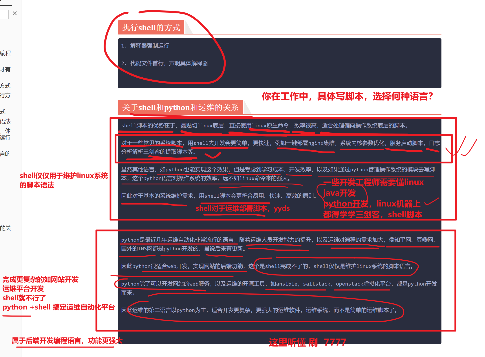


## 代码调试运行方式

```
1. 你以后再写完脚本后，如果直接运行，只能看到每一条命令的执行结果，看不到具体过程

2.  bash  -x  脚本 ，查看脚本执行过程细节。

```

例如如下代码

无bug的版本，今天作业，你动手敲一敲，课堂上所讲的代码，体验一波shell的语法有多恶心。。。。限制很多。


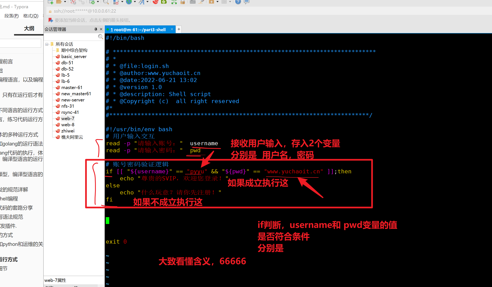

### 语法正确版本


```
#!/usr/bin/env bash
# 用户输入交互
read -p "请输入账号："  username
read -p "请输入密码："  pwd

# 账号密码验证逻辑
if [[ "${username}" == "pyyu" && "${pwd}" == "www.yuchaoit.cn" ]];then
    echo "尊贵的SVIP，欢迎您登录！"
else
    echo "什么玩意？请你先注册！"
fi

# 

```


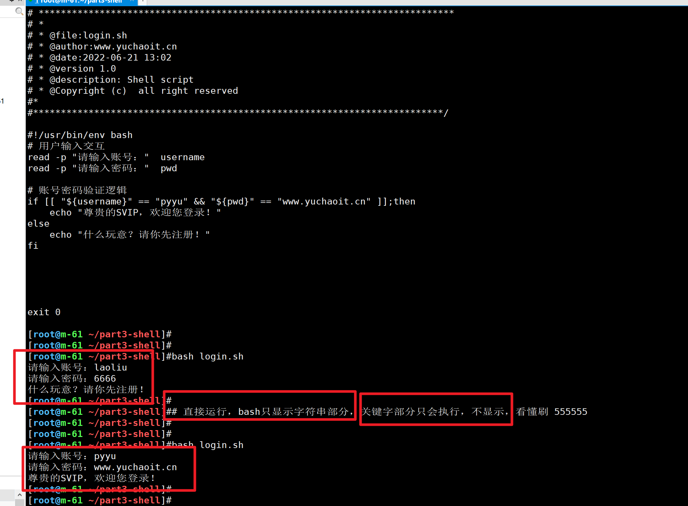


### 语法错误版本

```
#!/usr/bin/env bash
# 用户输入交互
read -p "请输入账号："  username
read -p "请输入密码："  pwd

# 账号密码验证逻辑
if [[ "${username}" == "pyyu" && "${pwd}" == "www.yuchaoit.cn" ]];then
    echo "尊贵的SVIP，欢迎您登录！"
else
    echo "什么玩意？请你先注册！"


```

#### 添加bash -x参数查看脚本执行细节过程

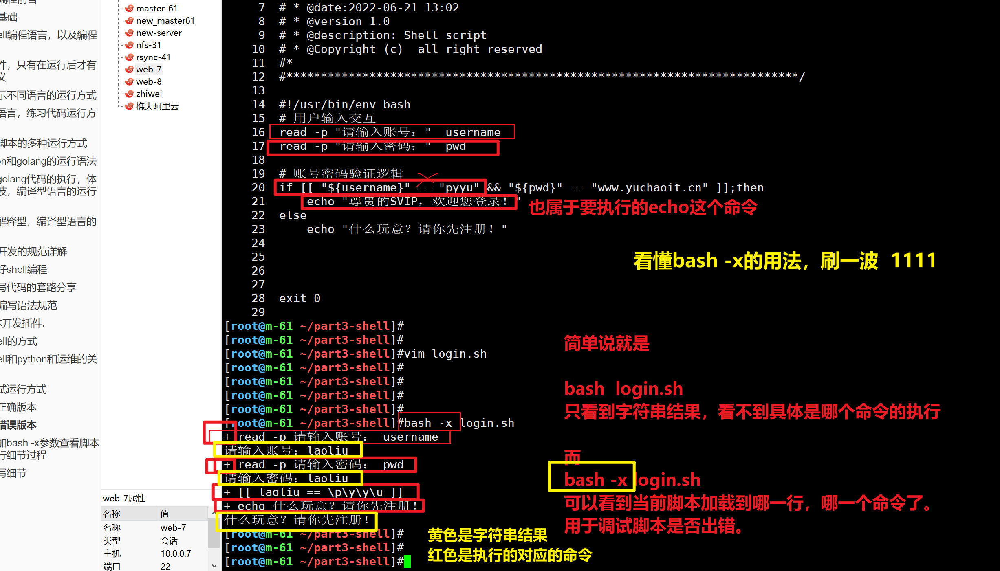


## 代码编写细节(后面知识点再细聊)

更多其他shell的语法规则，咱们往后遇见了再一个个去介绍。

1. 如括号，都是要成对出现的

```
如下符号，一次性，首尾都给写好。

例如大括号{}
中括号[]
小括号()
单引号' '
双引号" "
反引号` `
```

2. shell语法要求，如条件判断的括号，前后必须有空格，学if的时候再细说。

3. shell默认不强制要空格缩进，以换行区分每一行新代码，但是写缩进，看着更美观。

这3个准则，大致理解，刷一波6666


# 今日作业

今天带你快速入门编程，学一学编程脚本开发的的一些语法要求，轻松一点，理解下学习内容的转变。

明天开始就火力全开，写代码了。

你可以预习下明天的博客。

> 自己做好笔记总结，

- 编程目的
- 编译型语言、解释性语言解释性语言的python和shell
- 什么是shell
- shell和运维的联系
- 学会shell的正确姿势
- shell登录脚本光速入门。
- 执行shell脚本的不同方式，细节。
- 调试shell的技巧。
- 写shell脚本的细节。

- 以及今天课上讲解的解释型、编译型语言的运行方式，自己跟着操作下。


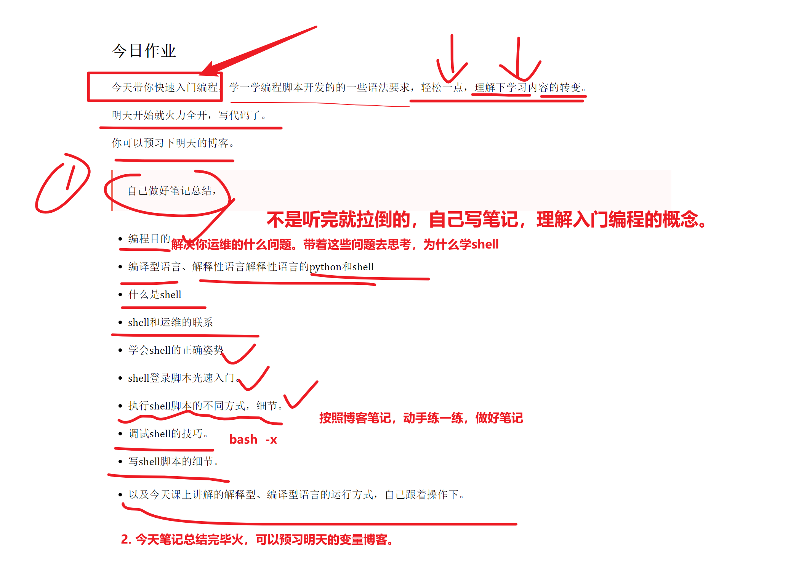


