# 变量和内存的对应关系


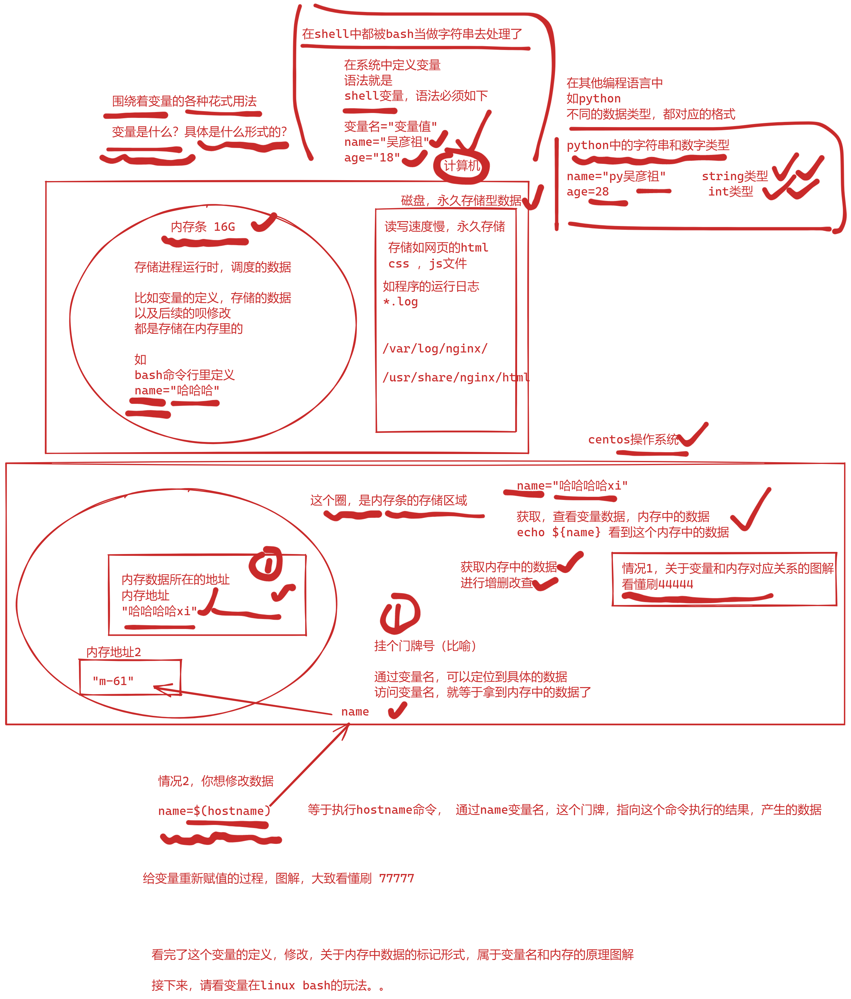

# 1.什么是变量

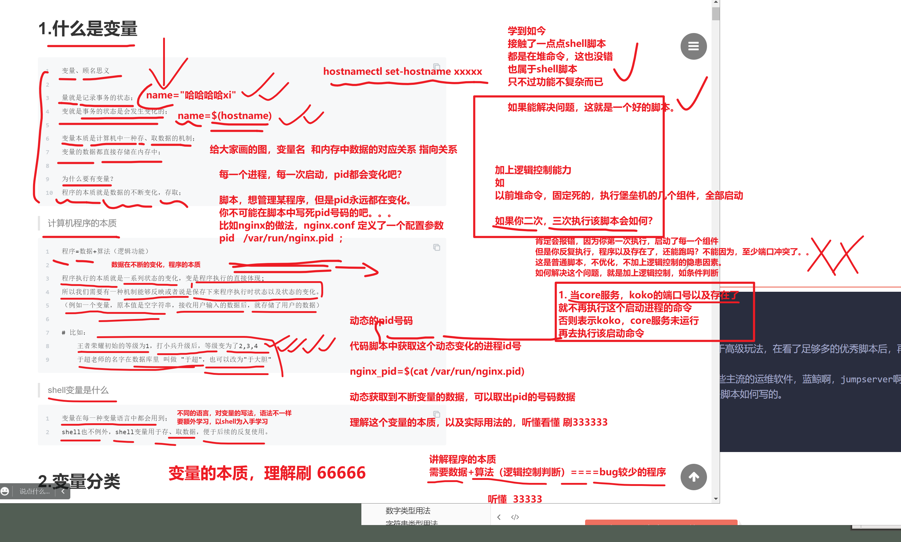


# 2.变量分类

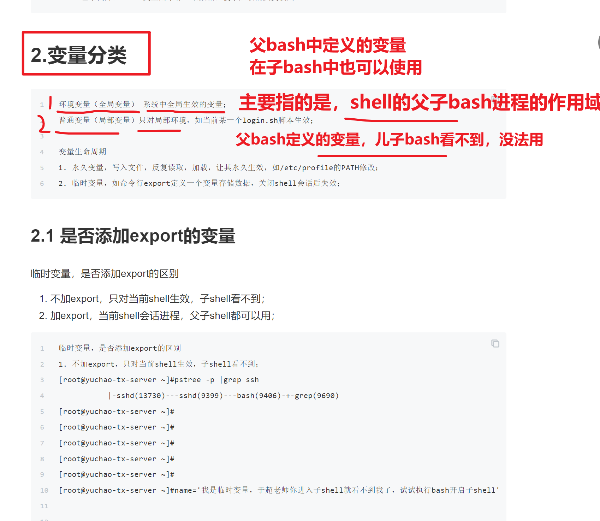


## 全局变量、局部变量和父子bash的关系

## 什么是父子bash

```
1. 先知道一个概念，只要你ssh连接上一个linux，登录之后，自动加载 /bin/bash作为解释器，解释你所有输入的linux命令

每一个人的机器都不一样，你得看懂pid和ppid的关系即可。

第一，你的机器，得运行sshd守护进,962，等待用户的连接, ps命令可以看到结果
root        962      1  0 08:54 ?        00:00:00 /usr/sbin/sshd -D

第二，这是你ssh连接进来的会话,当前这个会话的pid是 1225，
root       1225    962  0 08:54 ?        00:00:00 sshd: root@pts/0

第三，你现在所有的操作，是基于这个1225进程id的会话操作的
登录了linux之后，自动加载一个父bash进程，你所有的操作，交给这个bash去解释执行。
# 当前第一个父bash 进程id号是 1227
root       1227   1225  0 08:54 pts/0    00:00:00 -bash

第四，后续的命令，都作为儿子进程，由父bash创建出的进程，如ps命令
root       1705   1227  0 10:00 pts/0    00:00:00 ps -ef


```

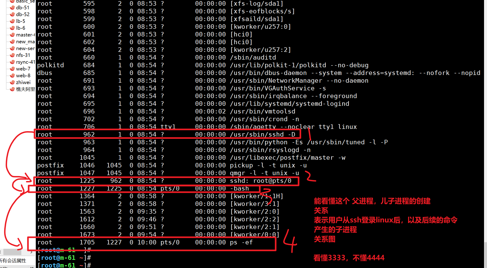

### 演示创建，父，子bash

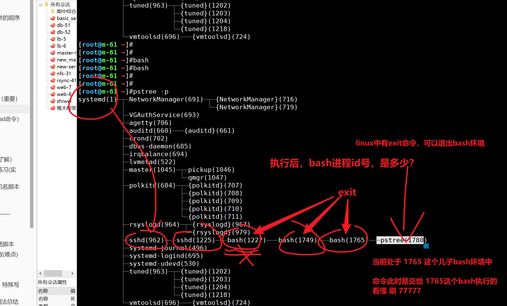

```
总结

1. 执行一次bash，就单独开辟一个子bash环境

2. 执行一次exit就退出一个bash环境

3. linux中提供了多种运行脚本的方式，区别在于，父子shell的创建


```

### 开启子bash的执行方式

```

#明确当前的第一个，父亲bash 是 1813
# 打印当前的进程id号玩法

echo "当前脚本执行的进程id是 $$"

exit 0

[root@m-61 ~]#
[root@m-61 ~]#
[root@m-61 ~]## 用bash运行脚本，和source运行不一样，一个会正常结束，一个会会话断开。为什么？
[root@m-61 ~]#
[root@m-61 ~]#
[root@m-61 ~]## 用bash运行脚本，和source运行不一样，一个会正常结束，一个会会话断开。为什么？ 是因为创建父子shell的 不同
[root@m-61 ~]#
[root@m-61 ~]#
[root@m-61 ~]## 直接使用bash命令运行脚本，会额外创建一个子bash去运行脚本
[root@m-61 ~]#
[root@m-61 ~]#bash test-bash-pid.sh 
当前脚本执行的进程id是 1857
[root@m-61 ~]#
[root@m-61 ~]#ps -ef|grep 1857
root       1863   1813  0 10:15 pts/0    00:00:00 grep --color=auto 1857
[root@m-61 ~]#
[root@m-61 ~]#
[root@m-61 ~]#
[root@m-61 ~]## 总结，bash运行脚本，额外开启了一个子shell，进程id是 1857，运行程序，运行结束后，exit，无所谓。
[root@m-61 ~]#
[root@m-61 ~]## 学会了刷 7777
[root@m-61 ~]#

```

### 不开启子bash的运行方式

```
source命令
oot@m-61 ~]#
[root@m-61 ~]#
[root@m-61 ~]#
[root@m-61 ~]#source test-bash-pid.sh 
当前脚本执行的进程id是 1813
[root@m-61 ~]#
[root@m-61 ~]#. test-bash-pid.sh 
当前脚本执行的进程id是 1813
[root@m-61 ~]#
[root@m-61 ~]#
[root@m-61 ~]## source 和 . 都是在当前的环境中执行脚本，
[root@m-61 ~]#
[root@m-61 ~]#vim test-bash-pid.sh 
[root@m-61 ~]#
[root@m-61 ~]#
[root@m-61 ~]#
[root@m-61 ~]#
[root@m-61 ~]#source test-bash-pid.sh 
当前脚本执行的进程id是 1813
Connection closing...Socket close.

Connection closed by foreign host.

Disconnected from remote host(master-61) at 10:18:43.

Type `help' to learn how to use Xshell prompt.
[C:\~]$ 

Connecting to 10.0.0.61:22...
Connection established.
To escape to local shell, press 'Ctrl+Alt+]'.

WARNING! The remote SSH server rejected X11 forwarding request.
Last login: Wed Jun 22 10:11:45 2022 from 10.0.0.1
[root@m-61 ~]#


```


### 总结source和.点的运行，都是不开启子bash，直接在当前bash中运行程序


## 2.1 export命令

```
昨天大伙踩的坑，

关于vim插件结尾的exit命令？
需要你去理解
shell会创建父子bash的玩法即可。


建议，先别去用exit命令，属于高级玩法，在看了足够多的优秀脚本后，再去琢磨exit如何用

如去github代码仓库，下载一些主流的运维软件，蓝鲸啊，jumpserver啊，夜莺监控啊等，或者各种其他源码，参考人家的shell部署脚本如何写的。


```

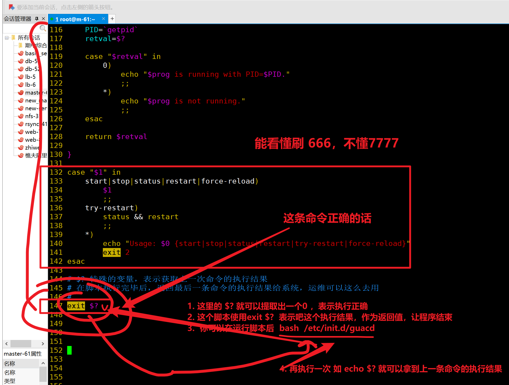

```
暂时，这里的表达，意思是，你先别去用exit命令就行了。bash变量玩明白了之后，学高级了之后再去用。

```


### 关于export命令的用法

继续讲解，关于变量的知识了，以及关于全局变量，和局部变量的作用


```
临时变量，是否添加export的区别

总结是
定义变量，是否添加export的区别

1. 不加export，只对当前shell生效，子shell看不到；
name="不加export，儿子bash看不到这个变量，属于shell变量的细节坑"

加export，当前shell会话进程，父子shell都可以用；
[root@m-61 ~]#export name="休息一会，待会继续，先消化父子bash的作用于关系，和变量的关系"

进入子bash
[root@m-61 ~]#
[root@m-61 ~]#echo ${name}
休息一会，待会继续，先消化父子bash的作用于关系，和变量的关系
[root@m-61 ~]#
[root@m-61 ~]#
[root@m-61 ~]## 看懂，理解是否添加export 和父子bash的作用域的关系，刷11111
[root@m-61 ~]#
[root@m-61 ~]#


```


## 2.2 加载环境变量文件的顺序

## 2.3 变量规范写法

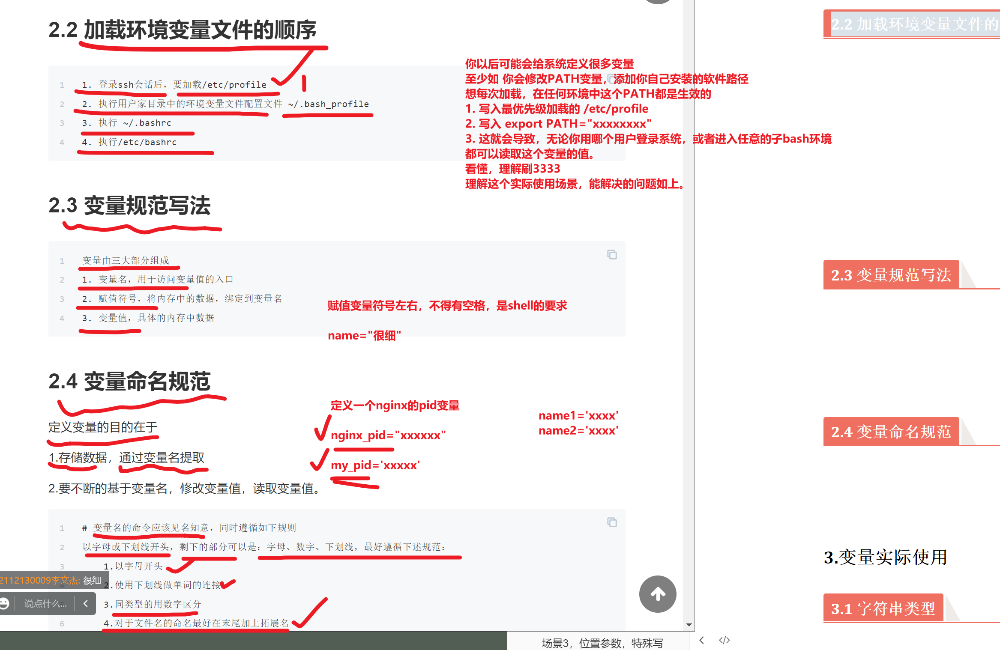


---

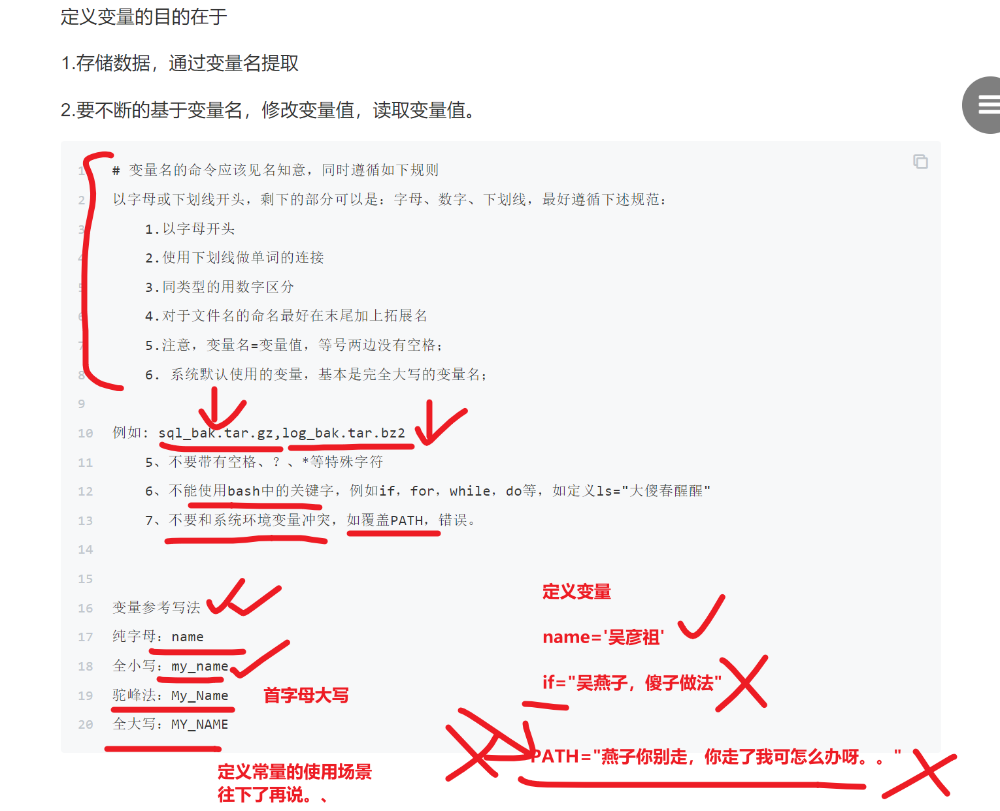


## 2.4 变量命名规范


# 3.变量实际使用

到底会不会用，就看你基本功咋样，对原理理解的是否透彻。


## 3.1 字符串类型

shell的变量的值，都会被当做字符串去处理，但是你在写的时候，可以用不同的写法

底层都是作为字符串去处理了。

写法可以不同，纯字符串的值形式

关于定义字符串的细节

- 单引号，所见即所得
- 双引号，识别特殊符号，
- 反引号，用于执行linux命令时，用这个写法
- 不加引号（不建议这么用，用于写连续的字符串时，才可以这么写）

这三个写法，完全看懂666，不懂777

```
[root@m-61 ~]#my_url=http://www.yuchaoit.cn
[root@m-61 ~]#
[root@m-61 ~]#
[root@m-61 ~]#echo $my_url
http://www.yuchaoit.cn
[root@m-61 ~]#


[root@m-61 ~]#my_url2='http:// www.yuchaoit.cn'
[root@m-61 ~]#
[root@m-61 ~]#
[root@m-61 ~]#echo $my_url2
http:// www.yuchaoit.cn

[root@m-61 ~]#my_domain=www.yuchaoit.cn
[root@m-61 ~]#
[root@m-61 ~]#
[root@m-61 ~]#
[root@m-61 ~]#my_url="http://${my_domain}"
[root@m-61 ~]#
[root@m-61 ~]#
[root@m-61 ~]#
[root@m-61 ~]#echo  ${my_url}
http://www.yuchaoit.cn
[root@m-61 ~]#


[root@m-61 ~]#time_now=`date +%F-%T`
[root@m-61 ~]#
[root@m-61 ~]#
[root@m-61 ~]#
[root@m-61 ~]#echo "当前时间是：${time_now}"
当前时间是：2022-06-22-10:57:26


[root@m-61 ~]#
[root@m-61 ~]#time_now=`date +%F-%T`
[root@m-61 ~]#
[root@m-61 ~]#
[root@m-61 ~]#
[root@m-61 ~]#echo "当前时间是：${time_now}"
当前时间是：2022-06-22-10:57:26
[root@m-61 ~]#
[root@m-61 ~]#
[root@m-61 ~]#
[root@m-61 ~]#
[root@m-61 ~]#
[root@m-61 ~]#today="今天的日期是：$(date +%F)"
[root@m-61 ~]#
[root@m-61 ~]#
[root@m-61 ~]#
[root@m-61 ~]#
[root@m-61 ~]#
[root@m-61 ~]#echo ${today}
今天的日期是：2022-06-22
[root@m-61 ~]#
[root@m-61 ~]## 如果要在字符串中，获取命令的执行结果，可以用 反引号，  $(命令)  ，这2个用法
[root@m-61 ~]#
[root@m-61 ~]## 看懂变量定义字符串形式的用法，刷6666
[root@m-61 ~]#


```


## 3.2 命令定义变量

> 用变量存储linux命令的执行结果。
>
> 主要学习，用什么语法可以让命令执行，且获取值。
>
> 建议获取命令执行结果，用`$()  ，因为太多的引号，眼花`

```
[root@m-61 ~]#echo "当前时间是：${time_now}"
当前时间是：2022-06-22-10:57:26
[root@m-61 ~]#
[root@m-61 ~]#
[root@m-61 ~]#
[root@m-61 ~]#
[root@m-61 ~]#
[root@m-61 ~]#today="今天的日期是：$(date +%F)"
[root@m-61 ~]#
[root@m-61 ~]#


获取主机名，获取ip

[root@m-61 ~]#
[root@m-61 ~]#echo ${today}
今天的日期是：2022-06-22
[root@m-61 ~]#
[root@m-61 ~]## 如果要在字符串中，获取命令的执行结果，可以用 反引号，  $(命令)  ，这2个用法
[root@m-61 ~]#
[root@m-61 ~]## 看懂变量定义字符串形式的用法，刷6666
[root@m-61 ~]#
[root@m-61 ~]#
[root@m-61 ~]#
[root@m-61 ~]#
[root@m-61 ~]#my_hostname="当前主机名是：$(hostname)"
[root@m-61 ~]#
[root@m-61 ~]#
[root@m-61 ~]#
[root@m-61 ~]#my_ip="当前主机的IP是：$(hostname -I)"
[root@m-61 ~]#
[root@m-61 ~]#
[root@m-61 ~]## echo -e 参数可以识别字符串中的特殊符号，如换行符玩法
[root@m-61 ~]#
[root@m-61 ~]#
[root@m-61 ~]#echo -e "主机名：${my_hostname}\n主机ip：${my_ip}"
主机名：当前主机名是：m-61
主机ip：当前主机的IP是：10.0.0.61 172.16.1.61 
[root@m-61 ~]#
[root@m-61 ~]#
[root@m-61 ~]#
[root@m-61 ~]#
[root@m-61 ~]#看懂这个写法，刷一波11111
bash: 看懂这个写法，刷一波11111: command not found
[root@m-61 ~]#
[root@m-61 ~]#

```


## 3.3 提取变量值语法

> 需要注意如下写法的区别，以及坑。
>
> 总结，建议用完整的写法，绝对不会出错
>
> `${变量名}，省事写法，但是可能出错  $变量名`
>
> 如果你不熟练的话，建议写全了，不多废话。

```
写法1，完整写法，包括简写

[root@m-61 ~]#name="吴彦祖"
[root@m-61 ~]#
[root@m-61 ~]#
[root@m-61 ~]#echo "我叫：${name}"
我叫：吴彦祖
[root@m-61 ~]#
[root@m-61 ~]#
[root@m-61 ~]#echo "我叫：$name"
我叫：吴彦祖


写法2，如果有坑的话，如下

[root@m-61 ~]#
[root@m-61 ~]#name2="超哥"
[root@m-61 ~]#
[root@m-61 ~]#
[root@m-61 ~]#echo "$name2 6666"
超哥 6666
[root@m-61 ~]#
[root@m-61 ~]#
[root@m-61 ~]#echo "$name26666"

[root@m-61 ~]#
[root@m-61 ~]## 丢失了字符串的边界，导致bash识别错误
[root@m-61 ~]#
[root@m-61 ~]## 丢失了字符串的边界，导致bash识别错误 ，建议完整写法，加上边界
[root@m-61 ~]#
[root@m-61 ~]#
[root@m-61 ~]#echo "${name2}6666"
超哥6666
[root@m-61 ~]#
[root@m-61 ~]#
[root@m-61 ~]## 看懂 刷 1111
[root@m-61 ~]#


```


## 3.4 修改、删除变量

```
1. 修
[root@m-61 ~]#name2="亮哥"
[root@m-61 ~]#
[root@m-61 ~]#
[root@m-61 ~]#echo "${name2}_666666"
亮哥_666666


2. 删除，unset命令，删除变量

在当前shell环境变量中，找到变量名


[root@m-61 ~]#
[root@m-61 ~]#set |grep "^name"
name=吴彦祖
name2=亮哥
name3=刚哥
[root@m-61 ~]#
[root@m-61 ~]## 学会找到当前shell环境中的变量名的玩法，看懂 66666
[root@m-61 ~]#
[root@m-61 ~]#
[root@m-61 ~]#
[root@m-61 ~]## 删除变量玩法
[root@m-61 ~]#
[root@m-61 ~]#unset name2 name3
[root@m-61 ~]#
[root@m-61 ~]#
[root@m-61 ~]#set |grep "^name"
name=吴彦祖
[root@m-61 ~]#
[root@m-61 ~]#
[root@m-61 ~]#name="东兴乌鸦"
[root@m-61 ~]#
[root@m-61 ~]#
[root@m-61 ~]#echo ${name}
东兴乌鸦
[root@m-61 ~]#
[root@m-61 ~]#
[root@m-61 ~]## 看懂变量的删除，修改，刷111
[root@m-61 ~]#
[root@m-61 ~]#


```

### 显示的是数字类型值的变量（字符串）

```
[root@m-61 ~]#
[root@m-61 ~]#age=18
[root@m-61 ~]#
[root@m-61 ~]#phone_num=1521000000
[root@m-61 ~]#
[root@m-61 ~]#
[root@m-61 ~]#age="18"
[root@m-61 ~]#
[root@m-61 ~]#
[root@m-61 ~]#phone_num="15200000"
[root@m-61 ~]#
[root@m-61 ~]#
[root@m-61 ~]## 在shell中，都是当做字符串去处理的，其他编程语言有明确的数据类型区别，看懂 111
[root@m-61 ~]#

```


# 4.变量传递，参数传递（重要）

变量除了在命令行直接调用、存、取值。

还经常用在脚本传递的参数中，但是脚本接收的参数，这个特殊变量，是shell内置固定的语法规则。

打开/etc/init.d/network 看看就知道了。

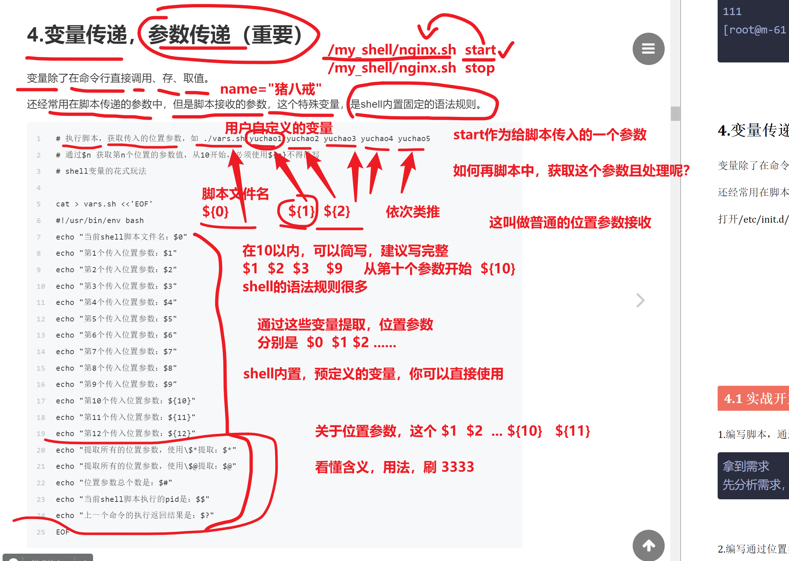

看一看，系统内置的脚本，是否用到了位置参数？

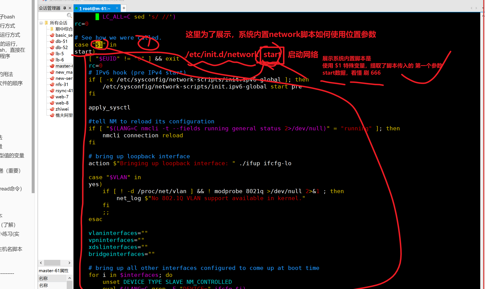


```
具体的用法
这个位置参数特殊变量，你会发现，需要结合如 if，  case条件判断语句，再去玩，
今天先看懂这些变量。


#!/usr/bin/env bash
echo "当前shell脚本文件名：$0"
echo "第1个传入位置参数：$1"
echo "第2个传入位置参数：$2"
echo "第3个传入位置参数：$3"
echo "第4个传入位置参数：$4"
echo "第5个传入位置参数：$5"
echo "第6个传入位置参数：$6"
echo "第7个传入位置参数：$7"
echo "第8个传入位置参数：$8"
echo "第9个传入位置参数：$9"
echo "第10个传入位置参数：${10}"
echo "第11个传入位置参数：${11}"
echo "第12个传入位置参数：${12}"
echo "提取所有的位置参数，使用\$*提取：$*"
echo "提取所有的位置参数，使用\$@提取：$@"
echo "位置参数总个数是：$#"
echo "当前shell脚本执行的pid是：$$"
echo "上一个命令的执行返回结果是：$?"


```


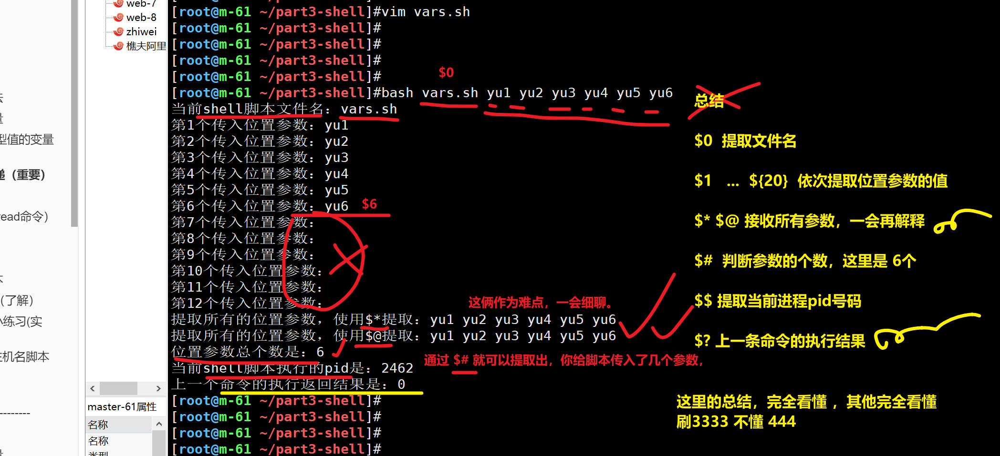


### 特殊变量的 $? 提取上一次命令执行结果

```
[root@m-61 ~/part3-shell]#
[root@m-61 ~/part3-shell]#
[root@m-61 ~/part3-shell]#
[root@m-61 ~/part3-shell]#bash vars.sh  yu1 yu2 yu3 yu4
当前shell脚本文件名：vars.sh
第1个传入位置参数：yu1
第2个传入位置参数：yu2
第3个传入位置参数：yu3
第4个传入位置参数：yu4
第5个传入位置参数：
第6个传入位置参数：
第7个传入位置参数：
第8个传入位置参数：
第9个传入位置参数：
第10个传入位置参数：
第11个传入位置参数：
第12个传入位置参数：
提取所有的位置参数，使用$*提取：yu1 yu2 yu3 yu4
提取所有的位置参数，使用$@提取：yu1 yu2 yu3 yu4
位置参数总个数是：4
当前shell脚本执行的pid是：2493
vars.sh: line 35: llllllllllllllllllllllllllllllllll: command not found
上一个命令的执行返回结果是：127
[root@m-61 ~/part3-shell]#


```


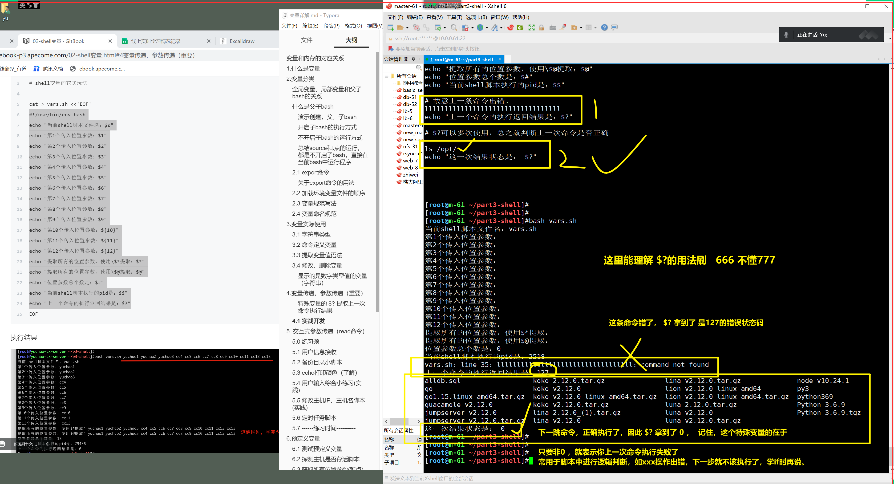


## 4.1 实战开发

```
开发脚本三部曲。

1. 你会拿到一个需求

2. 拿到需求先去分析，先别着急写

3. 精准分析之后，脑子有了思路，一步步产出为代码。。


这个题目，要求是什么写法，用到了什么命令，用什么形式的参数？

```


1.编写脚本

- 通过`位置参数`形式
- 免交互的创建linux用户与密码。

```
拿到需求

先分析需求，看清楚要求，再开始写代码。

user.sh   $1  $2 $3 

拆解，分析需求，然后考虑用什么命令去做。

1.接收位置参数，传来的账户，密码

2.在系统中，创建对应的useradd用户，密码（echo "密码" | passwd --stdin username）

需求分析到这，就结束了下一步，产出代码，你也会这么去需求分析理解  66666


# 产出代码

[root@m-61 ~/part3-shell]#
[root@m-61 ~/part3-shell]#cat user_pwd.sh 
#!/bin/bash

# ***************************************************************************
# * 
# * @file:user_pwd.sh 
# * @author:www.yuchaoit.cn 
# * @date:2022-06-22 11:53 
# * @version 1.0  
# * @description: Shell script 
# * @Copyright (c)  all right reserved 
#* 
#**************************************************************************/ 


# 好习惯，脚本中给自己添加注释，以后回头看，代码可能一眼看不懂，但是注释在，中文很好懂

# 1. 接收位置参数的数据


# bash user_pwd.sh  yuyu01   yuyu666
username="${1}"
pwd="${2}"


# 2. 数据已经被写入变量， 可以调用变量，创建对应用户信息了

#useradd ${1}

useradd "${username}"

# 这俩一个意思，看懂刷111，都是调用useradd命令，创建用户名


# 创建密码
echo "${pwd}" | passwd --stdin "${username}"


[root@m-61 ~/part3-shell]#

[root@m-61 ~/part3-shell]#bash user_pwd.sh "laoliu01" "laoliu666"
Changing password for user laoliu01.
passwd: all authentication tokens updated successfully.

```

看懂刷1111，脚本结合位置参数的基本用法。


2.编写通过位置参数，自动修改主机名的脚本。

```
[root@m-61 ~/part3-shell]#cat change_hostname.sh 
#!/bin/bash

# ***************************************************************************
# * 
# * @file:change_hostname.sh 
# * @author:www.yuchaoit.cn 
# * @date:2022-06-22 11:59 
# * @version 1.0  
# * @description: Shell script 
# * @Copyright (c)  all right reserved 
#* 
#**************************************************************************/ 


# 接收新的主机名

new_hostname=$1


# 设置修改主机名

hostnamectl set-hostname ${new_hostname}

# 查看新的主机名
# 写在 $() 里面的，就是linux的命令了，而不是普通的字符串。

echo "当前新的主机名是 ：$(hostname)"


# 这个脚本看懂 刷 1111


# 执行测试
[root@m-61 ~/part3-shell]#
[root@m-61 ~/part3-shell]#./change_hostname.sh "new-master-61"  xixi haha hehe
当前新的主机名是 ：new-master-61
[root@m-61 ~/part3-shell]#
[root@m-61 ~/part3-shell]#
[root@m-61 ~/part3-shell]## 这个脚本要更严谨的话，需要对参数格式进行判断，基于 特殊变量 $# 去判断参数个数
[root@m-61 ~/part3-shell]#
[root@m-61 ~/part3-shell]#
[root@m-61 ~/part3-shell]#/etc/init.d/network 123 456
Usage: /etc/init.d/network {start|stop|status|restart|reload|force-reload}
[root@m-61 ~/part3-shell]#
[root@m-61 ~/part3-shell]#
[root@m-61 ~/part3-shell]## 可以基于 $# 判断，如果参数个数不是一个，就提示，你只能输入一个参数，而不执行后面的代码 了
[root@m-61 ~/part3-shell]#
[root@m-61 ~/part3-shell]##这个伪代码，逻辑的讲解，听懂理解刷3333
[root@m-61 ~/part3-shell]#
[root@m-61 ~/part3-shell]#


```


# 5. 交互式参数传递（read命令）

```
利用read命令，接收用户输入，从键盘读取标准输入。


语法
read -p "提示信息" 变量名


```


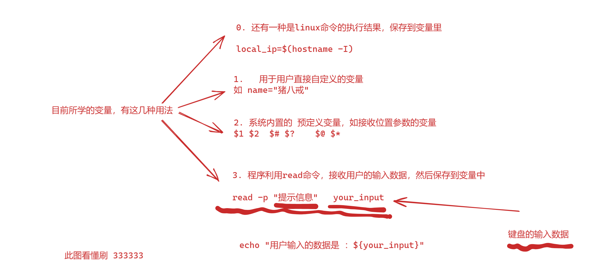


## 5.1 用户信息接收

```bash
需求是

1. 程序和用户进行交互，需要用户输入，账户，密码2个数据
2. 程序简单的打印用数据，练习read的用法

[root@m-61 ~/part3-shell]#cat user_info_input.sh 
#!/bin/bash

# ***************************************************************************
# * 
# * @file:user_info_input.sh 
# * @author:www.yuchaoit.cn 
# * @date:2022-06-22 12:12 
# * @version 1.0  
# * @description: Shell script 
# * @Copyright (c)  all right reserved 
#* 
#**************************************************************************/ 


# 接收账号数据

read -p "请输入你的账户："  user


# 接收密码数据，密码，建议隐藏显示，更安全
# -s 将密码和终端颜色保持一致，导致你看不到。
# pwd这么用，对 扣 1不对 扣2

#pwd 属于覆盖系统内置命令，必然不合适。变量命名不规范了！！！


read -s -p "please input your password："   my_pwd


# 打印输入的结果

echo "您的账户是：$user"

echo "您的密码是：$my_pwd"
[root@m-61 ~/part3-shell]#

# 执行测试

[root@m-61 ~/part3-shell]## 这个属于强迫症，让结果显示的好看些，没什么难点知识点
[root@m-61 ~/part3-shell]#
[root@m-61 ~/part3-shell]#bash user_info_input.sh 
请输入你的账户：yuyu01
请输入您的密码：
您的账户是：yuyu01
您的密码是：yuyu66
[root@m-61 ~/part3-shell]#
[root@m-61 ~/part3-shell]## 看懂read命令用法，刷一波 111
[root@m-61 ~/part3-shell]#


```


## 5.2 备份目录小脚本

read命令实际案例

```bash
# 1. 让用户输入要备份的目录 路径
# 2. 程序自动创建备份目录，且复制数据，实现备份

[root@m-61 ~/part3-shell]#cat read-backup.sh 
#!/bin/bash
# ***************************************************************************
# * 
# * @file:read-backup.sh 
# * @author:www.yuchaoit.cn 
# * @date:2022-06-22 12:20 
# * @version 1.0  
# * @description: Shell script 
# * @Copyright (c)  all right reserved 
#* 
#**************************************************************************/ 

# 1. 让用户输入要备份的目录 路径
read -p "请输入要备份的目录绝对路径：" src_dir
# 2. 程序自动创建备份目录，且复制数据，实现备份
read -p "请输入要备份的目的地绝对路径："  dest_dir

# 3.创建备份目录，且把数据拷贝过来，实现备份
# 问，这个命令二次执行会报错吗？ 会扣1 不会扣2
# 以咱们目前这个写法
# 解答一波，你要看你自己怎么写。 因为加上 -p参数，因此反复执行，不会导致目录创建报错
# 看懂刷33333
# 在学了 if 条件之后，要在这里判断
# 正确的逻辑应该是，如果目录不存在，则创建
# 存在， 则跳过mkdir的动作
# 理解刷 44444
mkdir -p ${dest_dir}  &&  cp -a ${src_dir}  ${dest_dir}
# 4. 脚本查看备份的数据目录信息
echo -e "备份的数据如下：\n$(ls ${dest_dir})"

# 看30s脚本，看懂刷 666
# 先看懂，中午自己练练

[root@m-61 ~/part3-shell]#
[root@m-61 ~/part3-shell]#bash read-backup.sh 
请输入要备份的目录绝对路径：/var/log
请输入要备份的目的地绝对路径：/tmp/log/
备份的数据如下：
log


```

这个脚本，你可以根据更多的需求，比如最后查看数据再详细写，tree，改造，优化脚本


## 5.3 echo打印颜色（了解）

程序员也是有美感的，可以让你的程序显示更美观，echo命令的玩法。

没什么实际作用，用于美化程序，了解即可。


```bash
# 其中43的位置代表背景色, 30的位置是代表字体颜色
echo -e "\033[43;30m 跟着于超老师学linux，没毛病！！ \033[0m"
echo -e "\033[31m www.yuchaoit.cn红色字 \033[0m"
echo -e "\033[33m www.yuchaoit.cn黄色字 \033[0m"
echo -e "\033[41;33m www.yuchaoit.cn红底黄字 \033[0m"
echo -e "\033[41;37m www.yuchaoit.cn红底白字 \033[0m"
```

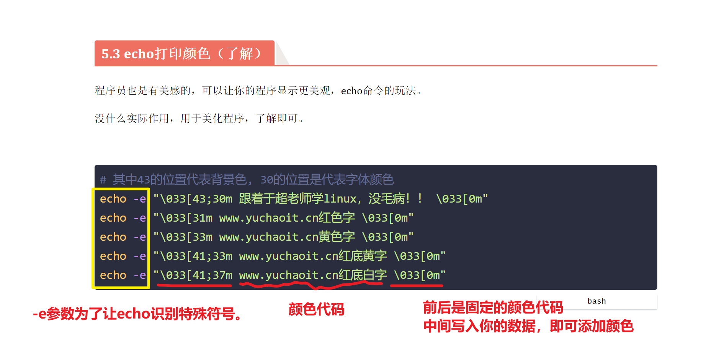


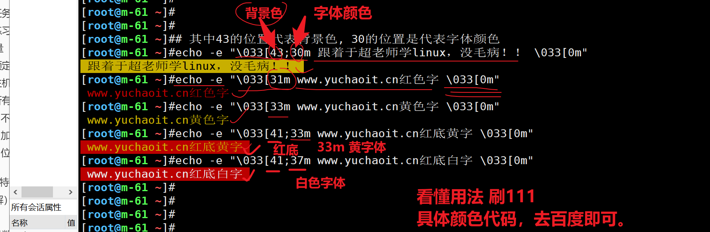


## 5.4 用户输入综合小练习(实践)

> 脚本练习题，建议大家都先自己写，随便你用什么写法，只要完成结果。
>
> 一百个人，写出100种风格也没问题。
>
> 

需求

`接收用户输入  read `的数据，创建系统用户；（账户，密码）

且将用户输入保存到文件`/tmp/user_info.log`，保存格式为`username:pwd 键值对形式`

风格1，交互式让用户输入数据


```bash
# 接收账户
read -p "please input your account："  your_user

# 接收密码
read -p "please input your password："  your_password

# 用数据， 创建系统用户且设置密码
useradd ${your_user}
echo "${your_password}" | passwd --stdin ${your_user} > /dev/null 2>&1


# 打印数据，写入到文件里
echo "${your_user}:${your_password}" >> /tmp/user_info.log


```

运行且验证，该需求的写法

- 分析需求
- 写伪代码，写中文注释，捋清楚题目要求，题目细节
- 输出为shell的代码
- 测试执行
- 看懂刷66666

```bash
1. 查看题目要求的文件
cat /tmp/user_info.log

2. 用该用户登录

ssh cc01@172.16.1.61

3.再次添加一个新用户，查看结果
[root@m-61 ~/part3-shell]#bash read_user.sh 
please input your account：lubenwei01
please input your password：lubenwei666
[root@m-61 ~/part3-shell]#
[root@m-61 ~/part3-shell]#
[root@m-61 ~/part3-shell]#
[root@m-61 ~/part3-shell]#cat /tmp/user_info.log 
cc01:cc666
lubenwei01:lubenwei666


```


风格2，接收位置参数的数据 `$1 $2`，完成上述操作，完毕后，微信群发你的代码即可。

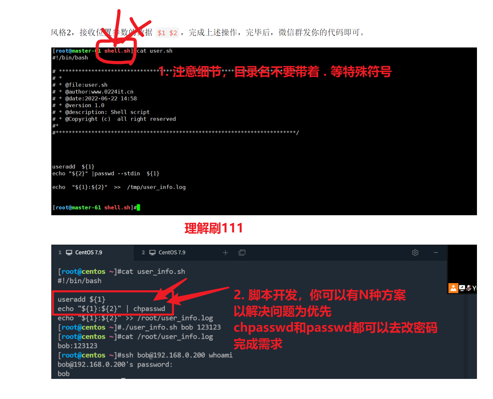


## 5.5 修改主机IP、主机名脚本(实践)

- 交互式脚本修改，read接收用户输入的ip和主机名
- 非交互式脚本修改（位置参数）给脚本直接传入 ip和主机名，但是要注意参数顺序了。

```bash
#!/bin/bash
# 代码是自上而下加载的。

read -p "请输入新的主机名："  new_hostname
# 立即修改
hostnamectl set-hostname ${new_hostname}


# 替换ip
read -p "请输入新的ip地址："  new_ip
sed -i "/IPADDR=/c IPADDR=${new_ip}" /etc/sysconfig/network-scripts/ifcfg-eth0

# 显示替换结果
echo -e "当前主机名是：\n$(hostname)"
echo -e "当前的网卡配置文件是：\n$(cat /etc/sysconfig/network-scripts/ifcfg-eth0 )"

# 重启network服务
echo "重启网络服务中。。。。"
systemctl restart network


# 统一的修改
# 修改配置文件，重启network服务
# 方案1，直接用 sed的c命令，整行替换数据
# 方案2，用sed的s命令，替换整个ip
# 方案3，用sed的s命令，只替换ip最后一个的主机位地址。
# 这3个方案，听懂 刷3333
# 方案有很多，随着你代码写的多了，写熟练了，心中自然也就有了很多的解决方案了。

```

这个脚本的开发思路，与实践，看懂 11111

思路来的更为重要，今天作业就会有，需要你用其他方案，甚至2,3个方案去完成脚本开发。


## 5.6 定时任务脚本

```
用read命令去让用户输入数据

利用位置参数的特殊变量，直接非交互式传入数据。

```


> 需求：
>
> 通过交互式脚本，创建新的定时任务规则，要求
>
> 每十分钟和阿里云时间服务器同步。
>
> 条条大路通过罗马，都可以解决问题。

```bash
# 通过交互式脚本，创建新的定时任务规则，要求
# crontab -e 这种是交互式输入，脚本,思考，
# 定时任务具体是写入到了什么文件里？

# 方案1：写法简单粗暴的，直接输入完整的语句
read -p "请输入您要插入的新定时任务完整规则："  new_crontab

echo "${new_crontab}" >> /var/spool/cron/root

echo "当前的计划任务规则列表是："
echo "$(crontab -l)"


# 每十分钟和阿里云时间服务器同步。  */10 * * * * ntpdate -u ntp.aliyun.com


```

纠正一下，read命令，是吧用户所有的输入，当做了一个大字符串，去对待，具体如下效果

```
# 执行脚本流程如下

[root@master-61 ~]#bash new_crontab.sh 
请输入您要插入的新定时任务完整规则：*/10 * * * * ntpdate -u ntp.aliyun.com
当前的计划任务规则列表是：
*/10 * * * * ntpdate -u ntp.aliyun.com
[root@master-61 ~]#
[root@master-61 ~]#
[root@master-61 ~]#
[root@master-61 ~]#crontab -l
*/10 * * * * ntpdate -u ntp.aliyun.com


# 看懂刷 1111


```

### 方案2，规则和命令分开写

```bash
#!/bin/bash
read -p "请输入crontab的时间频率：" cron_time
read -p "请输入crontab的具体命令：" cron_job

# 让用户输入生效
echo "#crontab by yuchao at $(date +%F)" >> /var/spool/cron/root
echo "$cron_time $cron_job" >> /var/spool/cron/root

echo -e "当前最新的计划任务是：\n$(crontab -l)"


```

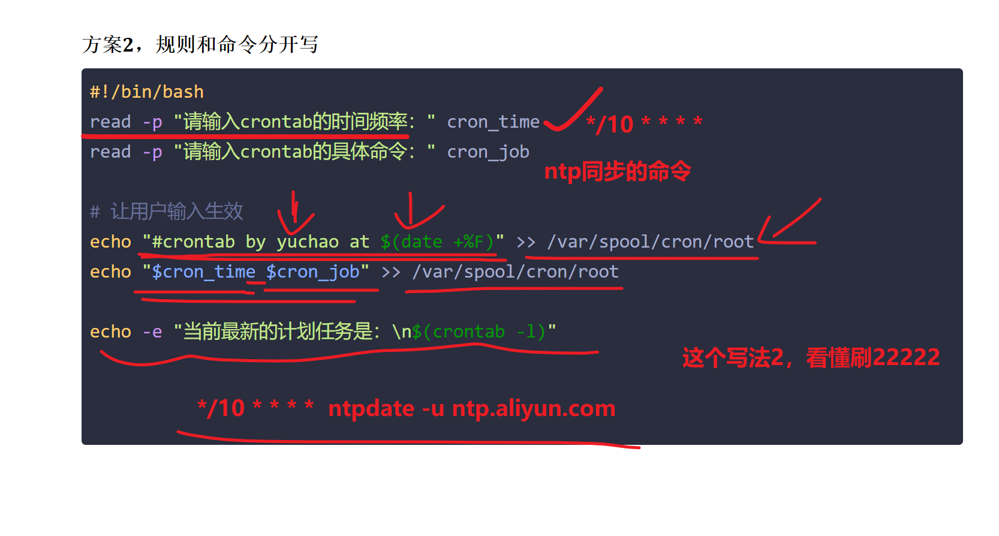

执行结果如下，注意，命令要用绝对路径来的靠谱。

```bash
[root@master-61 ~]#
[root@master-61 ~]#bash new2_cron.sh 
请输入crontab的时间频率：*/5 * * * *
请输入crontab的具体命令：/usr/sbin/ntpdate  -u ntp.aliyun.com
当前最新的计划任务是：
*/10 * * * * /usr/sbin/ntpdate  -u ntp.aliyun.com
#crontab by yuchao at 2022-06-22
*/5 * * * * /usr/sbin/ntpdate  -u ntp.aliyun.com

```


## 5.7 ------练习时间----------

```
要求：分别以交互式、非交互式两种开发脚本。


1. 创建3个用户，设置密码（限定11位密码，且隐藏显示），且记录到文件中/tmp/user_info.log，为如下格式
username:pwd
username:wpd
username:pwd


2. 编写修改主机名和IP的脚本，且立即生效

3. 编写设置定时任务的脚本，每五分钟和阿里云时间服务器同步，且不提示任何日志。

4. 写一个探测主机存活的脚本（提示用$?预定义变量）

```


# 6.预定义变量(脚本的位置参数，位置变量)

```
刚才的练习，基本是围绕着，交互式数据操作

利用read命令，实现让用户输入数据，传入变量
针对变量进行后续操作。


非交互式变量传入 ，位置参数
$1 $2 $3


```

## 位置参数，以空格分割每一个元素，作为参数

```
# read命令，是你所有的输入，被当做了一个大字符串传入给了 变量


# 位置变量的玩法，不一样。
# bash vars.sh cc01 bob01  yu01    jack 01
```

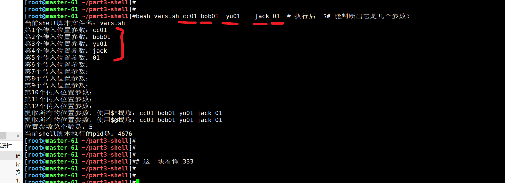


刚才超哥演示了几个特殊变量，用于提取位置参数，这里再详细的看看用法。

《难点》

```
几个特殊的位置参数变量

$* 接收所有位置参数

$@ 接收所有位置参数

$# 参数个数

$$ 获取当前进程的PID

$? 上一个命令的返回值，0是正确，其他都错误（指的是你脚本上，查看$?的上一条命令）


```

## 6.1 测试预定义变量

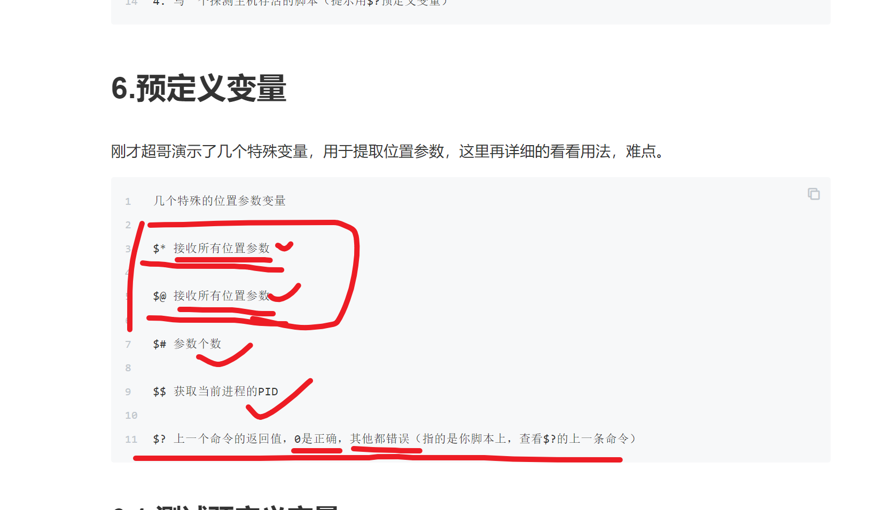


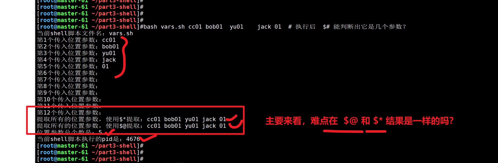


## 6.2 探测主机是否存活脚本（练习$?的玩法）

```
$? 用于判断上一次的命令执行结果，实际用法，如下题目
```


- 交互式，`read命令完成`

- 非交互式，`位置变量完成`


> 这里就简单的，实现探测单个ip就行了。
>
> 如果你要批量的探测，就得结合循环知识了。

```bash
# 分析需求
# 判断主机是否存活，常见做法是，发送icmp的数据包，也就是执行ping命令


# 尝试用命令去完成需求

# 1. ping

# 2.查看 echo $?


# 条件判断，机器是否挂了

# 基于if语法
# 中括号，是条件判断的专有语法，以及shell编程中，遇见括号，就得闭合，左右都得有空格。
# 中括号，是条件判断的专有语法，以及shell编程中，遇见括号，就得闭合，左右都得有空格。
# 中括号，是条件判断的专有语法，以及shell编程中，遇见括号，就得闭合，左右都得有空格。
[root@master-61 ~/part3-shell]## 特殊变量 ，完成写法如下，${#}  ${*}  ${?}  看懂 66666666，和普通变量一样


# 完成脚本开发
#!/bin/bash

# 传入位置参数的玩法
ping -c 1 ${1} &>/dev/null  2>&1

if  [ "$?" == "0" ];then
	echo "该机器 ${1} 正在运行中！！！"
else
	echo "该机器 ${1} 挂掉了！！！！"
fi


```

执行结果

```
[root@master-61 ~/part3-shell]#
[root@master-61 ~/part3-shell]#cat check_host.sh 
#!/bin/bash

# ***************************************************************************
# * 
# * @file:check_host.sh 
# * @author:www.yuchaoit.cn 
# * @date:2022-06-22 16:19 
# * @version 1.0  
# * @description: Shell script 
# * @Copyright (c)  all right reserved 
#* 
#**************************************************************************/ 


#!/bin/bash

# 传入位置参数的玩法
ping -c 1 ${1} &>/dev/null  2>&1

if  [ "$?" == "0" ];then
	echo "该机器 ${1} 正在运行中！！！"
else
	echo "该机器 ${1} 挂掉了！！！！"
fi

[root@master-61 ~/part3-shell]#
[root@master-61 ~/part3-shell]#
[root@master-61 ~/part3-shell]#
[root@master-61 ~/part3-shell]#
[root@master-61 ~/part3-shell]#bash check_host.sh 172.16.1.88
该机器 172.16.1.88 挂掉了！！！！
[root@master-61 ~/part3-shell]#
[root@master-61 ~/part3-shell]#
[root@master-61 ~/part3-shell]#bash check_host.sh 172.16.1.7
该机器 172.16.1.7 正在运行中！！！
[root@master-61 ~/part3-shell]#
[root@master-61 ~/part3-shell]#
[root@master-61 ~/part3-shell]## 该脚本的开发思路、流程、执行结果，看懂刷 11111
You have new mail in /var/spool/mail/root
[root@master-61 ~/part3-shell]#

```


## 6.3 获取所有位置参数(难点，是练习$@ 和$*的玩法)

```
当我们想从脚本运行，传入的参数中获取具体的参数，可以用${n}

但是如果用户传入的参数不固定，你知道到底用 ${数字写多少合适?}

因此这时候，$* 和 $@ 的威力就来了，可以获取所有的位置参数（除了$0）

但是这俩变量虽说都是提取所有参数，但是提取之后的数据构造不一样，具体是什么，看于超老师给你演示一波。。


```

### 场景1，不加引号

> 1.当用户传入多个参数，都是以空格作为分隔符，获取每一个元素，此时$*和$@无区别。
>
> 2.注意此时，`$*和$@ 这俩特殊变量，都没添加引号`

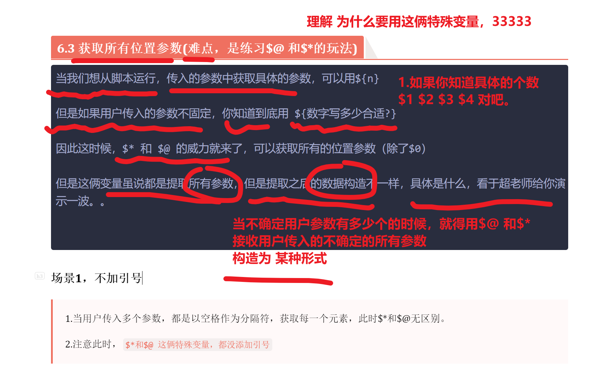

> 这一块的知识点，只能结合for循环讲解，语法不难，看一看即可，后面for再详细学学就更清晰了。

### 注意细节，关于$@和$*是否添加引号的区别

> 先来看linux系统中是如何使用的这俩特殊变量


### ----------重点（记住如下用法即可）-------------------

```
1. $@ 和$* 都用于接收不定长的用户参数

2. 在脚本中使用这俩特殊变量，必须加上双引号！！！才能发挥其作用！


3. 一般都是结合for循环去，找出这俩特殊变量存储的所有元素


```

测试脚本如下

```bash

echo "----------------测试\$*，给变量添加了引号用法--------------"
for v in "$*"
do
echo "传入的位置参数，分别是${v}"
done

echo "----------------测试\$@，添加了引号用法--------------"
for v in "$@"
do
echo "传入的位置参数，分别是${v}"
done


```

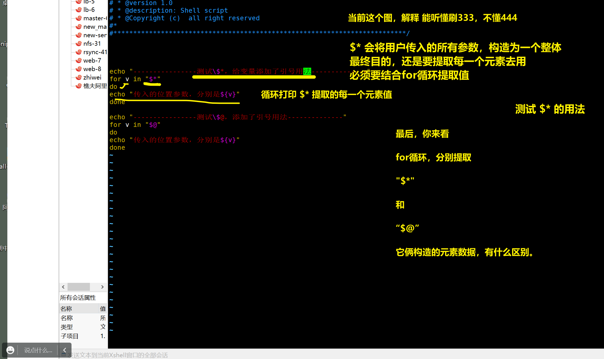

执行结果，传入多个元素，注意写法，传入如下特殊语法来，明确，参数的用法。

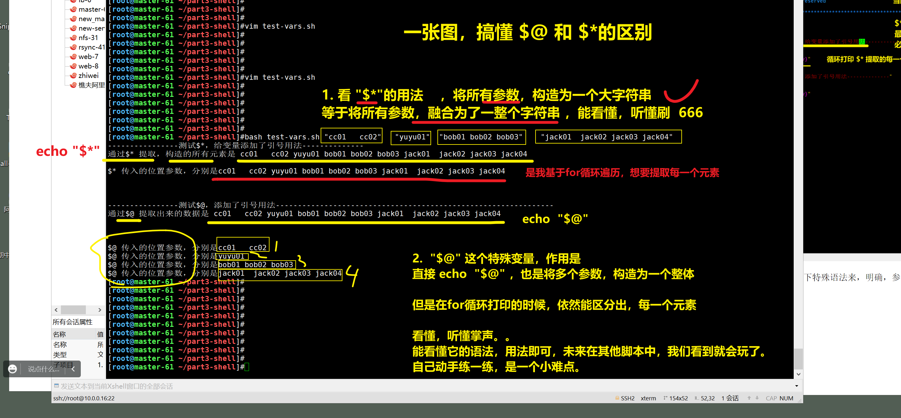


# 7.常量（了解）

```
明天再说

readonly命令，自己试一试

```


# 8. 数据类型（内容较多，留到明天继续）

> 用于练习，变量计算的


今天好好消化消化、

1. 做笔记
2. 完成题目，试试完成需求，脚本开发


## 8.1 什么是数据类型

```
数据就是指如变量的值，如web_site="www.yuchaoit.cn"， 后面这个引号里的，就是数据，值。

变量是用来反应、保持数据的状态，以及变化的，并且生活里，除了文字，还有整数，小数，等丰富的数据类型，需要我们通过计算机程序去表示。


```

## 8.2 shell语言的数据类型介绍


## 8.3 基本数据类型（shell中都以字符串对待）


### 数字类型用法


### 字符串类型用法


# 9. 变量运算

## 9.1 变量运算语法


## 9.2 支持shell变量运算的命令

```
expr 				# 只支持整数运算
$(( )) 			# 双括号运算，只支持整数运算，效率更高
$[]					# 整数运算，语法简洁
bc					# 支持整数，小数点运算
awk					# 支持整数，小数点运算
%						# 取余运算
```


### expr

不定义变量，定义变量、两种形式用法。


### $(( ))


### $[]


### let


### bc


### awk运算

```
语法细节更多，要注意引号的用法，暂时作为了解该用法即可。

```

## 9.3 变量计算练习题（至少3个写法）

根据系统时间打印出，今天、明天的时间；至少3种写法


根据系统当前时间，今年还剩下多少个星期


3.写一个计算机程序

要求如下形式

```
请输入数值1：
请输入运算符：
请输入数值2：
计算结果是：

```

# 10.今日作业（尽量写，写不完明天给时间继续练习）

学编程这一块，学好的诀窍；

- 思考、思考、思考
- 动手、动手、动手

1.写笔记

2.写代码，做练习

```
1. 你理解的shell脚本是什么，作用，使用场景有哪些；
2. shell脚本书写规范；
3. shell定义变量的方式；
4. shell如何引用变量；
5. shell脚本的预定义变量的含义（面试经常问，笔试题常见）
$0
$1
$2
$*
$@
$#
$$
$?

6. 变量的运算方式有哪些。
7. 今日课堂练习讲解动手练，做笔记；
练习题

8. 写脚本，提取当前机器的静态属性，包括如下，写入文件/tmp/server_info.log
系统版本
内核版本
主机名
eth0网卡ip
eth1网卡ip
当前主机的公网ip
内存使用率
磁盘使用率
CPU使用率


9.开发计算器脚本，支持加减乘除即可。
看看谁的计算器更牛
不怕写的简单，能实现 加减乘除功能就行！！

```

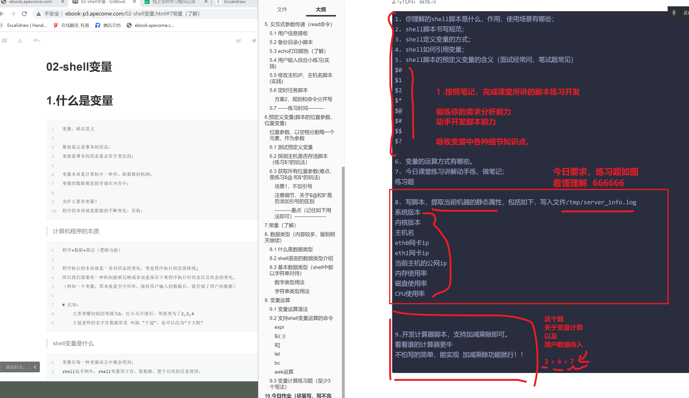

散会，辛苦了朋友们，明天见。


笔记视频，一会发群里。886

休息吧。


